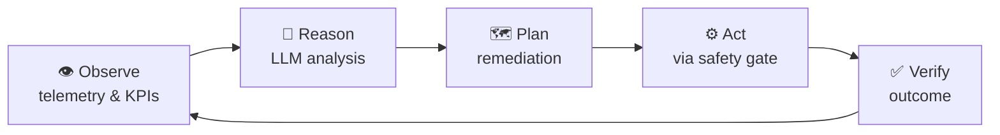

<div align="center">

# 🛰️ Agent5G

### Agentic AI Service Enablement Platform for 5G Advanced (Release 20)

An autonomous, closed-loop multi-agent system that **observes** a simulated 5G core network, **reasons** over telemetry with an LLM, and **safely acts** to self-heal and optimize — all from a real-time operations dashboard.

[](https://agentic5g.up.railway.app)
[](https://github.com/codehashira23/Agentic-5g)

<br/>


</div>

---

## 🤔 What is this?

Agent5G is a **digital twin of a 5G core** (AMF, SMF, UPF, NRF, NWDAF, gNB, and more) paired with an **agentic AI control loop**. The agent continuously watches network KPIs, uses LLM reasoning to plan remediation, and executes actions through a **safety policy engine** that blocks anything unsafe — no human in the loop required.

## 🔄 The agent loop



## ✨ Features

- 🤖 **Multi-agent orchestration** — full observe → reason → plan → act → verify cycle coordinated with LangGraph.
- 🛰️ **5G digital twin** — 9 simulated core network functions with KPIs, faults, events, and topology.
- 🛡️ **Safety-first autonomy** — a policy engine validates every action against hard & soft constraints before execution.
- 🎯 **Deterministic & offline** — seeded RNG + an LLM replay layer make demos and tests reproducible at **$0 cost**.
- 🌐 **11 REST routers + live WebSocket** — health, topology, twin, workflows, simulation, analytics, logs, services, policies, models, settings.
- 📊 **13-page operations console** — Agent Console, Topology, Digital Twin, Analytics, Simulation, Logs, Service Registry, Model Manager, Knowledge Graph, Memory, Workflow Builder, Settings, Dashboard.

## 🧱 Tech stack

| Layer | Technologies |
|-------|-------------|
| **Backend** | Python 3.11 · FastAPI · Pydantic v2 · SQLAlchemy 2.0 (async) · LangGraph · WebSockets · Groq / Llama 3.1 |
| **Frontend** | Next.js 16 · React 19 · TypeScript · TailwindCSS v4 · React Flow · Recharts · Zustand · TanStack Query |
| **Quality** | pytest (575 tests) · ruff · mypy · import-linter · Vitest · Playwright |
| **Architecture** | Clean/hexagonal (`domain → application → infrastructure → api`) with enforced layer boundaries |
| **DevOps** | Deployed on Railway (nixpacks) · auto-generated OpenAPI types shared with the frontend |

## ⚡ Quick start

> **Prerequisites:** Python 3.11+ and Node.js 20+. The default LLM mode is `replay` — fully offline, no API key, **$0**.

```powershell
# 1. One-time setup (venv, deps, .env files)
.\scripts\setup.ps1

# 2. Start the backend        (Terminal 1)
.\scripts\run-backend.ps1

# 3. Start the frontend       (Terminal 2)
.\scripts\run-frontend.ps1
```

Then open **http://localhost:3000** — API docs live at **http://localhost:8000/docs**.

## 📂 Project structure

```
Agentic-5g/
├── backend/     # FastAPI + LangGraph agent (clean architecture)
│   └── app/     # domain · application · infrastructure · api
├── frontend/    # Next.js 16 operations dashboard
├── data/        # simulation scenarios
├── scripts/     # setup & run helpers (PowerShell)
└── learning/    # research notes & system docs
```

## 🎬 Demo scenarios

1. **Proactive model deployment** — the agent pushes an ML model to an edge node ahead of predicted demand.
2. **Autonomous congestion mitigation** — detects a KPI breach and executes a mitigation plan end-to-end.
3. **NRF fault detection & self-healing** — spots a service-registry failure and recovers the network automatically.

## 📊 By the numbers

`575` tests · `13` dashboard pages · `11` API routers + WebSocket · `9` 5G network functions · `3` live autonomous scenarios · `4` LLM modes (replay / live / record / fake)

## 🔗 Links

- 🚀 **Live platform:** https://agentic5g.up.railway.app
- 💻 **GitHub:** https://github.com/codehashira23/Agentic-5g

<br/>
<sub>Built as a summer research project on autonomous network operations for 5G Advanced / 6G.</sub>
</div>
