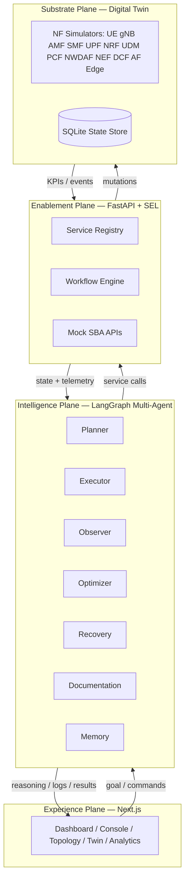
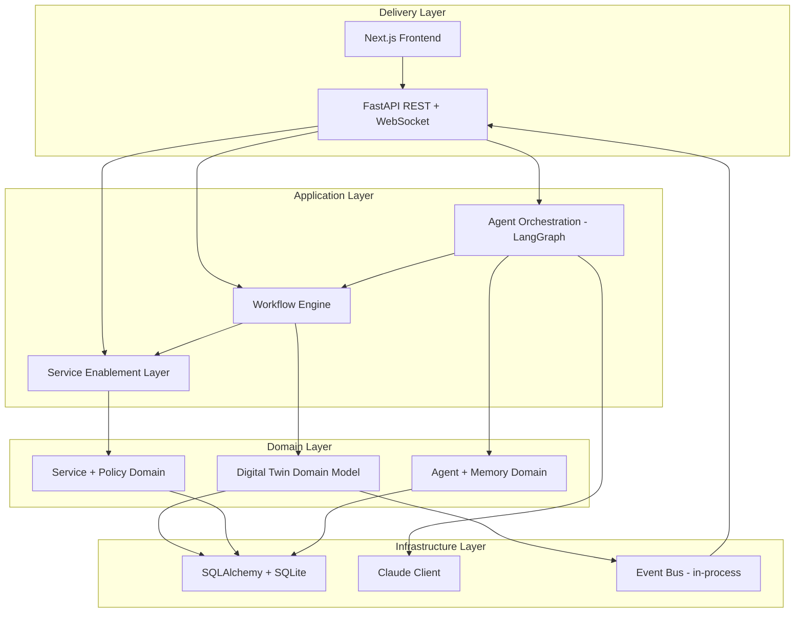
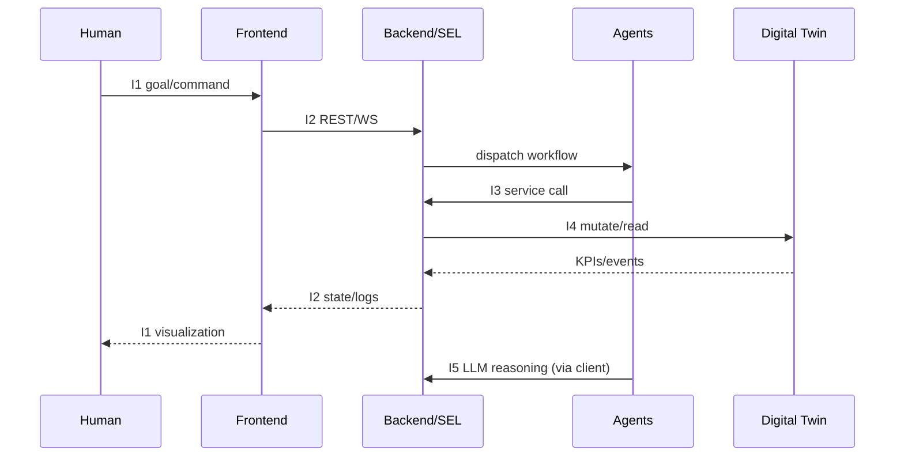
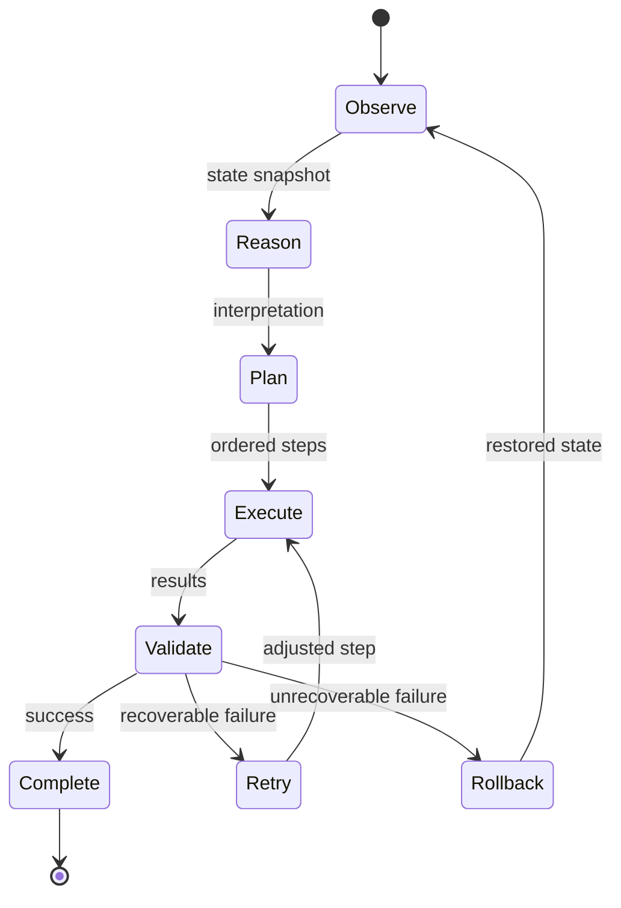

# 01 — System Overview

> **Document ID:** `01-system.md`
> **Project:** Agent5G — Agentic AI Service Enablement Platform for 5G Advanced Release 20
> **Document Type:** System-level foundation (root context for all subsequent documents)
> **Status:** Authoritative — every other document in `docs/` inherits terminology, boundaries, and principles from this file.
> **Audience:** Researchers, telecom students, professors, 5G engineers, AI researchers, network engineers.

---

## Table of Contents

1. [Purpose](#1-purpose)
2. [Overview](#2-overview)
3. [Problem Statement and Motivation](#3-problem-statement-and-motivation)
4. [System Scope and Non-Goals](#4-system-scope-and-non-goals)
5. [High-Level Architecture](#5-high-level-architecture)
6. [System Responsibilities](#6-system-responsibilities)
7. [Core Concepts and Domain Vocabulary](#7-core-concepts-and-domain-vocabulary)
8. [Design Decisions](#8-design-decisions)
9. [Technology Stack Rationale](#9-technology-stack-rationale)
10. [Folder References (Repository Layout)](#10-folder-references-repository-layout)
11. [System Interfaces](#11-system-interfaces)
12. [Data and Control Flow](#12-data-and-control-flow)
13. [Example Scenarios](#13-example-scenarios)
14. [Future Extensibility](#14-future-extensibility)
15. [Engineering Notes](#15-engineering-notes)
16. [Implementation Notes](#16-implementation-notes)
17. [Research Notes](#17-research-notes)
18. [Kiro Build Guidance](#18-kiro-build-guidance)
19. [Acceptance Criteria](#19-acceptance-criteria)
20. [Glossary](#20-glossary)

---

## 1. Purpose

Agent5G is a **research prototype** that demonstrates how **Agentic AI** can operate as the intelligence layer above a **Service Enablement Layer (SEL)** for future **AI-native 5G Advanced (Release 20)** networks. The purpose of this document is to establish the single, authoritative system-level description of the platform so that every subsequent document — architecture, agents, digital twin, network core, services, API, backend, frontend, database, workflow engine, prompts, testing, deployment, demo, presentation, and future work — can be written and implemented without ambiguity.

The specific purposes of the platform are:

- **Demonstrate autonomy.** Show that a set of cooperating AI agents can observe network state, reason about it, plan a sequence of actions, execute those actions against network functions, validate the outcome, and recover from failures — with minimal human involvement.
- **Demonstrate service enablement.** Show that network capabilities (analytics, data collection, model deployment, policy control, exposure) can be described, discovered, and invoked as *services*, mirroring the 3GPP **Service Based Architecture (SBA)** and the emerging **AIMLE (AI/ML Enablement)** and **DCCF/DCF (Data Collection Coordination Function)** concepts.
- **Demonstrate architectural correctness.** Even though nothing here is a real telecom core, every simulated network function must behave in a way that is *architecturally faithful* to 3GPP definitions, so the prototype has genuine research and educational value.
- **Be implementation-ready.** The documentation is written so that a competent engineer — or the Kiro agent itself — can implement the entire system from `docs/` alone, without asking clarifying questions.

This document does **not** describe implementation code. It describes *what the system is*, *why it exists*, *how its major parts relate*, and *the rules every other document must obey*.

---

## 2. Overview

Agent5G is composed of four cooperating planes, layered from the human user at the top down to the simulated network substrate at the bottom.

1. **Experience Plane (Frontend).** A Next.js application that presents the Dashboard, Agent Console, Topology, Digital Twin, Workflow Builder, Service Registry, Knowledge Graph, Memory Viewer, Logs, Simulation, Analytics, Model Manager, and Settings.
2. **Intelligence Plane (Agentic AI).** A LangGraph-based multi-agent system (Planner, Executor, Observer, Optimizer, Recovery, Documentation, Memory) that reasons over network state and drives autonomous operations.
3. **Enablement Plane (Service Enablement Layer + Backend).** A FastAPI backend exposing a Service Registry, a Workflow Engine, and mock 3GPP SBA APIs (NEF, NRF, NWDAF, DCF, AF, and the control-plane functions AMF/SMF/UDM/PCF, plus the user-plane UPF).
4. **Substrate Plane (Digital Twin).** A deterministic, event-driven simulation of the 5G network — UE, gNB, AMF, SMF, UPF, NRF, UDM, PCF, NWDAF, NEF, DCF, AF, and Edge Nodes — producing KPIs, traffic, latency, QoS, and failure events, and persisting state to SQLite.

The central loop of the system is the **Observe → Reason → Plan → Execute → Validate → Retry → Rollback → Complete** cycle. A natural-language goal enters at the top, an agent workflow is produced in the middle, mock APIs mutate the Digital Twin at the bottom, and the resulting state changes flow back up through logs, reasoning traces, and dashboards.



*Figure 2.1 — Four-plane system overview and the top-down/bottom-up flow.*

---

## 3. Problem Statement and Motivation

3GPP has progressively embedded intelligence into the mobile core. Release 15 introduced NWDAF (Network Data Analytics Function). Releases 16–17 expanded analytics, added the Data Collection Coordination Function (DCCF), Analytics Data Repository Function (ADRF), and Messaging Framework Adaptor Function (MFAF). Release 18 (5G-Advanced) matured NWDAF into a distributed analytics ecosystem and formalized AI/ML model transfer. Release 19 and the emerging Release 20 push toward **AI-native networks**, where AI/ML is not a bolt-on analytics function but a first-class architectural citizen with a dedicated **AI/ML Enablement (AIMLE)** capability and richer **data collection frameworks (DCF)**.

Two problems motivate Agent5G:

1. **Operational complexity.** As networks add more analytics, more model lifecycle steps, and more closed-loop automation, the number of coordinated actions required to accomplish even a simple intent (e.g., "detect congestion at an edge site and mitigate it") explodes. Humans cannot manually orchestrate these steps at scale.
2. **The intent gap.** Operators think in *intents* ("keep latency under 20 ms in Delhi during peak hours"), but network functions expose *low-level service operations*. Something must translate intent into a validated, ordered sequence of service invocations and adapt when reality diverges from the plan.

Agent5G's thesis is that **Agentic AI** — LLM-driven agents with tools, memory, and a shared workflow — is the natural mechanism to close the intent gap and manage operational complexity, *provided* the network exposes its capabilities as discoverable services (the Service Enablement Layer). The prototype exists to test, demonstrate, and communicate this thesis in a fully local, reproducible environment.

---

## 4. System Scope and Non-Goals

### 4.1 In Scope

- A faithful **simulation** (Digital Twin) of the 5G SBA network functions and the user/edge topology.
- A **Service Enablement Layer** that registers, discovers, and exposes network capabilities as services.
- A **multi-agent system** that performs closed-loop, autonomous operations driven by natural language.
- A **workflow engine** implementing the eight-stage lifecycle (Observe → … → Complete).
- A **full-featured web UI** for observation, control, and explanation.
- A **local, single-machine** deployment on Windows 11.
- **Documentation-first** delivery: all of `docs/` before any production code.
- **Zero-cost delivery.** The entire project — build, run, demo — must incur **no monetary cost**: free tooling, free/local runtime, and **free-tier-only** LLM APIs (or fully offline replay). See §4.3.
- **Two-day build window.** The implementation is scoped to be completable in **~2 days** by the Kiro agent (Claude 4.8) plus an operator. See the Two-Day Delivery Plan in `15-kiro-rules.md`.

### 4.2 Explicit Non-Goals

- **Not a real 5G Core.** No RAN, no real radio, no real packet forwarding, no SIM/USIM, no real NAS/RRC signaling.
- **No Docker, no Kubernetes, no Linux, no cloud.** Everything runs locally on Windows 11.
- **No paid services of any kind.** No paid cloud, no paid database, no paid LLM tier, no paid CI. If a capability cannot be had for free (free tier or local/offline), it is out of scope for the base build.
- **No production security hardening** beyond sensible local defaults (this is a research prototype; auth is minimal and clearly flagged).
- **No real UE hardware or real gNB.** All radio behavior is statistically modeled.
- **No guaranteed standards compliance certification.** The system is *architecturally faithful*, not *conformance-tested*.

### 4.3 Cost, Timeline, and Model Constraints (binding)

- **CST-1 — Zero monetary cost.** Everything uses free tooling (Python, Node, SQLite, all listed OSS libraries), runs locally (no paid hosting/DB), and any LLM usage is **free-tier only** or fully offline (`record/replay`, `10`/`14`/`16`). Deployment, if ever hosted, must stay on **free tiers** (`17`/`20`).
- **CST-2 — Claude 4.8 builds the project (free within Kiro).** The *development* agent is **Claude 4.8** operating inside the Kiro IDE — it writes the code at no API cost to the user. This is distinct from the *runtime* agent LLM below.
- **CST-3 — Runtime LLM = free tier or replay.** The platform's seven runtime agents call the model through the pluggable `LLMClient` (`10` §8.4). Default is **`replay`** (offline, deterministic, $0). For live reasoning, use a **free-tier provider** (e.g., a free-tier hosted model, or Claude via free/initial credits) configured behind the same port — the architecture is provider-agnostic (DD-6). Demos and tests run in `replay` so they never cost anything.
- **CST-4 — Two-day scope.** Feature scope is bounded so a working, demoable Slice A/B/C (`18`) is achievable in ~2 days; breadth beyond that is explicitly deferred to `20-future-work.md`. The hour-by-hour plan lives in `15-kiro-rules.md`.
- **CST-5 — Planning artifacts are gitignored.** Throwaway planning/scratch material lives in a `planning/` (and `scratch/`, `notes/`) folder that is **git-ignored** (see the repository `.gitignore`); the authoritative design lives in `docs/`.

> **Security note:** The backend API in this prototype is designed for `localhost` use. Any endpoint that mutates the Digital Twin is unauthenticated by default in the base build. This is acceptable for a local research prototype but must be flagged: if the platform is ever exposed on a network, authentication and authorization must be added first (see `17-deployment.md`).

---

## 5. High-Level Architecture

The system is layered following **Clean Architecture**: dependencies point inward, toward the domain, never outward toward frameworks. The Digital Twin domain model and the Service/Workflow domain model form the stable core; FastAPI, LangGraph, SQLite, and Next.js are replaceable delivery/infrastructure details around that core.



*Figure 5.1 — Clean Architecture layering. Arrows are compile-time dependencies pointing inward toward the domain.*

The architecture is **event-driven** at the substrate: the Digital Twin emits domain events (KPI updates, failures, threshold breaches) onto an in-process event bus. The Observer agent and the WebSocket layer both subscribe to that bus, so the UI and the intelligence plane react to the same ground truth. Full detail is in `03-architecture.md`.

---

## 6. System Responsibilities

| # | Responsibility | Owning Plane | Owning Document |
|---|----------------|-------------|-----------------|
| R1 | Simulate all 5G NFs and topology deterministically | Substrate | `06-digital-twin.md`, `07-network-core.md` |
| R2 | Emit KPIs, traffic, latency, QoS, and failure events | Substrate | `06-digital-twin.md` |
| R3 | Register, discover, and expose capabilities as services | Enablement | `08-services.md` |
| R4 | Orchestrate the 8-stage workflow lifecycle | Enablement | `13-workflow-engine.md` |
| R5 | Expose REST + WebSocket contracts | Enablement | `09-api.md`, `10-backend.md` |
| R6 | Reason over state and drive autonomous operations | Intelligence | `05-agents.md` |
| R7 | Maintain agent memory and knowledge graph | Intelligence | `05-agents.md` |
| R8 | Persist all system state durably | Infrastructure | `12-database.md` |
| R9 | Present, visualize, and explain everything to users | Experience | `04-ui.md`, `11-frontend.md` |
| R10 | Provide prompts, tools, and reasoning templates | Intelligence | `14-prompts.md` |
| R11 | Define build order, rules, and acceptance | Cross-cutting | `15-kiro-rules.md` |
| R12 | Verify behavior via tests | Cross-cutting | `16-testing.md` |

Each responsibility has exactly one owning document that is authoritative for its detail. This document owns only the *system-level* view and the *boundaries* between responsibilities.

---

## 7. Core Concepts and Domain Vocabulary

These terms are used consistently across every document. They are defined once, here.

- **Network Function (NF).** A simulated 5G component (e.g., AMF, SMF, NWDAF). Each NF is a Python domain object with typed state, a lifecycle, and a service interface.
- **Service.** A named, discoverable capability with a typed input/output contract, registered in the **Service Registry** (the SEL). Example: `nwdaf.analytics.congestion.subscribe`.
- **Service Enablement Layer (SEL).** The set of components that make network capabilities *discoverable and invokable* as services. It is the bridge between agents and NFs.
- **Agent.** An autonomous LLM-driven actor with a goal, a prompt, a tool set, memory, and a decision/state machine. There are seven agent roles.
- **Workflow.** A stateful, resumable execution graph implementing the 8-stage lifecycle. A workflow is created for each high-level goal.
- **Digital Twin.** The live, in-memory + persisted simulation of the entire network, including topology, NFs, UEs, edges, KPIs, and events.
- **KPI.** A key performance indicator time series (e.g., latency, throughput, PRB utilization, packet loss) produced by the twin.
- **Event.** A discrete, timestamped domain occurrence (threshold breach, NF failure, registration, model deployed) placed on the event bus and persisted.
- **Memory.** Agent-scoped and system-scoped stores: short-term (working), long-term (episodic + semantic), and a knowledge graph of entities and relations.
- **Policy.** A declarative rule that constrains or triggers agent behavior (e.g., "never de-register the last NRF").
- **Model.** An AI/ML model artifact (metadata only in the prototype) that can be deployed to NWDAF or an Edge node via the AIMLE-style flow.

The full glossary is in [Section 20](#20-glossary).

---

## 8. Design Decisions

Every decision below is recorded with its rationale and the trade-off accepted. These decisions are binding on all subsequent documents.

### DD-1 — Documentation-first delivery
**Decision:** Write all 20 documents plus README before writing production code.
**Rationale:** The project is intended to become a research paper, final-year project, and IEEE demo. A frozen, complete design reduces rework and produces publishable artifacts.
**Trade-off:** Slower time-to-first-code; mitigated by the fact that Kiro can implement rapidly once docs are complete.

### DD-2 — Simulation over emulation
**Decision:** Model NFs statistically and deterministically rather than emulating real protocol stacks (Open5GS/OAI).
**Rationale:** Constraints forbid Docker/Linux/cloud; the research value is in the *agentic intelligence layer*, not the radio stack.
**Trade-off:** No protocol-level fidelity; mitigated by keeping service contracts SBA-faithful so a future swap to Open5GS is feasible (`20-future-work.md`).

### DD-3 — LangGraph as the orchestration substrate
**Decision:** Use LangGraph for multi-agent orchestration and the workflow state machine.
**Rationale:** LangGraph provides durable, inspectable graph state, checkpointing, and human-in-the-loop hooks — a direct match for the 8-stage lifecycle and for explainability.
**Trade-off:** Adds a dependency and a learning curve; justified by built-in state persistence and retry/rollback semantics.

### DD-4 — SQLite as the single datastore
**Decision:** Use SQLite via SQLAlchemy for all persistence.
**Rationale:** Zero-configuration, single-file, cross-platform, no server process — ideal for a local Windows-only prototype.
**Trade-off:** Limited concurrency and no horizontal scale; acceptable for single-machine research use. A repository abstraction keeps a future Postgres migration cheap.

### DD-5 — In-process event bus
**Decision:** Implement the event bus in-process (async pub/sub) rather than with an external broker (Kafka/Redis).
**Rationale:** No external infrastructure allowed; the entire system runs in one Python process plus one Node process.
**Trade-off:** No cross-process durability of the live bus; mitigated by persisting every event to SQLite so history survives restarts.

### DD-6 — Claude 4.8 (build-time) + free-tier/replay (runtime) behind a pluggable LLM port
**Decision:** Use **Claude 4.8 inside Kiro** as the build-time coding agent (free to the user), and drive the platform's runtime agents through a **pluggable `LLMClient`** whose default is offline **`replay`** and whose live mode targets a **free-tier** provider. No paid LLM usage (CST-1/CST-3).
**Rationale:** Strong tool-use and structured-reasoning for planning/validation, at **zero cost** — offline replay for demos/tests, free-tier for occasional live reasoning; the port makes the provider swappable (Claude free credits, or any free-tier hosted model).
**Trade-off:** Free tiers have rate/quota limits; mitigated by making `replay` the default (deterministic, unlimited, offline) and using live calls sparingly to record fixtures (`14`/`16`).

### DD-7 — Strict typing end-to-end
**Decision:** Pydantic on the backend, TypeScript on the frontend, shared schema as the contract.
**Rationale:** Type safety across the API boundary eliminates a large class of integration bugs and makes the contract self-documenting.
**Trade-off:** More upfront schema work; strongly positive for maintainability and research reproducibility.

### DD-8 — Feature-first frontend, layered backend
**Decision:** Organize the frontend by feature (topology, agents, twin) and the backend by Clean Architecture layers.
**Rationale:** Frontend features map to UI pages; backend concerns map to layers. Each side uses the structure that best fits it.
**Trade-off:** Two different organizing principles in one repo; documented explicitly so contributors are never confused.

---

## 9. Technology Stack Rationale

| Layer | Technology | Why chosen |
|-------|-----------|------------|
| Frontend framework | Next.js (latest) + TypeScript | App Router, server components, first-class TS, great DX |
| Styling | TailwindCSS + Shadcn UI | Utility-first speed + accessible, composable components |
| Motion | Framer Motion | Declarative animations for state transitions and topology |
| Graph/flow | React Flow | Native node-edge canvas for topology and workflow builder |
| Charts | Recharts | Simple, composable time-series KPI charts |
| Diagrams | D3, Mermaid | D3 for custom viz; Mermaid for docs + in-app knowledge graph |
| Backend | FastAPI + Python | Async, Pydantic-native, auto OpenAPI, high performance |
| Validation | Pydantic | Single source of truth for schemas and validation |
| ORM/DB | SQLAlchemy + SQLite | Zero-config local persistence with a clean repository seam |
| AI orchestration | LangGraph | Durable graph state, checkpoints, human-in-the-loop (free OSS) |
| Reasoning (build-time) | **Claude 4.8** via Kiro | Codes the project inside the IDE at no API cost (CST-2) |
| Reasoning (runtime) | Pluggable `LLMClient` — **replay** default, **free-tier** live | Offline/deterministic $0 by default; free-tier provider when live (CST-1/CST-3, DD-6) |
| Typing (optional) | PydanticAI | Optional typed-agent ergonomics where it helps |

Every technology above is free/open-source; there are **no paid dependencies** (CST-1). Full frontend detail is in `11-frontend.md`; full backend detail in `10-backend.md`.

---

## 10. Folder References (Repository Layout)

The repository is a monorepo with a clear separation between documentation, backend, and frontend. This is the canonical top-level layout; sub-documents refine the interior of each area.

```text
agent5g/
├── docs/                     # All documentation (this layer)
│   ├── 01-system.md
│   ├── 02-research-background.md
│   ├── 03-architecture.md
│   ├── 04-ui.md
│   ├── 05-agents.md
│   ├── 06-digital-twin.md
│   ├── 07-network-core.md
│   ├── 08-services.md
│   ├── 09-api.md
│   ├── 10-backend.md
│   ├── 11-frontend.md
│   ├── 12-database.md
│   ├── 13-workflow-engine.md
│   ├── 14-prompts.md
│   ├── 15-kiro-rules.md
│   ├── 16-testing.md
│   ├── 17-deployment.md
│   ├── 18-demo.md
│   ├── 19-presentation.md
│   ├── 20-future-work.md
│   └── README.md
├── backend/                  # FastAPI + LangGraph + Digital Twin (see 10-backend.md)
│   ├── app/
│   │   ├── domain/           # Domain Layer: twin, services, agents, policies
│   │   ├── application/      # Application Layer: workflow engine, orchestration, SEL
│   │   ├── infrastructure/   # Infra: SQLAlchemy, event bus, LLM client
│   │   ├── api/              # Delivery: FastAPI routers, schemas, websockets
│   │   └── main.py
│   ├── tests/
│   └── pyproject.toml
├── frontend/                 # Next.js app (see 11-frontend.md)
│   ├── app/                  # App Router pages (feature-first)
│   ├── components/           # Reusable UI (Shadcn-based)
│   ├── features/             # Feature modules: topology, agents, twin, ...
│   ├── lib/                  # API client, hooks, types
│   └── package.json
├── data/                     # SQLite database file + seeds (agent5g.db is gitignored)
├── scripts/                  # Windows-friendly run/build scripts (.ps1 / .bat)
├── planning/                 # scratch planning/notes — GIT-IGNORED (CST-5); not part of the repo
├── .gitignore                # ignores planning/, secrets (.env), data/*.db, node_modules, .venv
└── README.md
```

*Figure 10.1 — Canonical repository layout. Folder ownership per document is defined in [Section 18.4](#184-folder-ownership). The `planning/` (and `scratch/`, `notes/`) folder holds throwaway planning material and is git-ignored per CST-5; the authoritative design is `docs/`.*

---

## 11. System Interfaces

At the system level there are five interface boundaries. Each has a defined contract, owning document, and stability guarantee.

- **I1 — Human ↔ Frontend.** Browser UI over HTTP(S) on `localhost`. Contract: the page/component specs in `04-ui.md`.
- **I2 — Frontend ↔ Backend.** REST (JSON) + WebSocket (JSON events) over `localhost`. Contract: OpenAPI in `09-api.md`; schemas mirrored to TypeScript.
- **I3 — Agents ↔ Services (SEL).** Agents invoke services only through the Service Registry's typed tool interface. Agents never touch NF internals directly. Contract: `08-services.md`.
- **I4 — Services ↔ Digital Twin.** Services mutate/read NF state through the twin's domain interfaces. Contract: `06-digital-twin.md`, `07-network-core.md`.
- **I5 — System ↔ LLM.** A single `LLMClient` abstraction wraps Claude. Contract: `10-backend.md`, `14-prompts.md`.



*Figure 11.1 — The five system interfaces on a single request path.*

The critical invariant: **agents act only through services (I3), never directly on the twin (I4).** This enforces the Service Enablement thesis and keeps the intelligence plane decoupled from the substrate.

---

## 12. Data and Control Flow

The canonical control loop is the 8-stage lifecycle. At the system level it looks like this:



*Figure 12.1 — System-level control loop. Detailed transition semantics live in `13-workflow-engine.md`.*

**Data flow** is bidirectional and event-mediated:

- *Downward (command):* goal → plan → service calls → twin mutations.
- *Upward (telemetry):* twin events → event bus → {Observer agent, WebSocket → UI, persistence}.

Every stage transition, service call, LLM interaction, and twin event is persisted as a row in the appropriate table (`12-database.md`) and surfaced in the Logs and Memory Viewer, giving the platform full **explainability** — a first-class research requirement.

---

## 13. Example Scenarios

### Scenario A — "Deploy congestion detection model to Delhi Edge"
1. **Observe.** Observer reads the current twin snapshot; Delhi Edge node exists and is healthy.
2. **Reason.** Planner interprets intent: this requires an AIMLE-style model deployment to an Edge node, plus an NWDAF analytics subscription for congestion.
3. **Plan.** Ordered steps: (a) discover `model.deploy` service, (b) resolve target Edge via NRF, (c) call `aimle.model.deploy`, (d) call `nwdaf.analytics.congestion.subscribe`.
4. **Execute.** Executor invokes each service through the SEL.
5. **Validate.** Twin now reports model `active` on Delhi Edge and an active analytics subscription.
6. **Complete.** Documentation agent records a summary; UI shows the new model and a live congestion KPI.

### Scenario B — "Latency in Mumbai exceeded threshold"
1. Twin emits a `KPI_THRESHOLD_BREACH` event (latency > 20 ms).
2. Observer catches the event and triggers a workflow autonomously (no human prompt).
3. Optimizer reasons that UPF load balancing or an edge offload is needed.
4. Executor applies a policy-permitted mitigation via services.
5. Validate confirms latency recovered; if not, Recovery rolls back and escalates to the Logs/UI.

### Scenario C — "Simulated NRF failure"
1. Twin marks NRF `FAILED`; discovery calls begin to fail.
2. Recovery agent detects failed service discovery, checks policy ("never leave zero NRF"), and either promotes a standby NRF simulation or halts risky operations.
3. All reasoning is logged; the Topology page renders NRF in a failed state and then recovered.

These scenarios recur in `18-demo.md` as the scripted demonstration flows.

---

## 14. Future Extensibility

The system is explicitly designed so that today's simulation can be replaced by tomorrow's reality without redesign:

- **Open5GS integration.** Because services are SBA-faithful, the twin's mock NFs can be swapped for Open5GS NFs behind the same service contracts (`20-future-work.md`).
- **OAI integration.** RAN/UE behavior currently modeled statistically can be fed from OpenAirInterface telemetry.
- **Kubernetes.** The single-process backend can be decomposed into deployable services; the repository seam at the infrastructure layer makes this incremental.
- **MCP.** The agent tool layer maps cleanly onto Model Context Protocol servers, letting external tools/agents interoperate.
- **Real Network APIs (CAMARA/NEF).** The NEF mock can be promoted to a real northbound exposure gateway.
- **Datastore.** SQLite → Postgres via the repository abstraction with no domain changes.

Each extension point is documented as a stable seam so that research contributions can be layered incrementally.

---

## 15. Engineering Notes

- **Determinism.** The twin uses a seeded RNG so simulations are reproducible — essential for demos and for research repeatability. The seed is configurable in Settings.
- **Single source of truth for schemas.** Pydantic models are authored once and exported to TypeScript types; the frontend never redefines a shape by hand.
- **No hidden side effects.** Every mutation of the twin flows through a service, is validated, emits an event, and is persisted. There are no back-channel writes.
- **Windows-first tooling.** All scripts are provided as PowerShell (`.ps1`) and/or batch (`.bat`). No bash-only assumptions. Path handling uses `pathlib`.
- **Concurrency model.** Backend is async (FastAPI/asyncio). The twin's simulation tick runs as a background task. SQLite writes are serialized through a single writer to avoid `database is locked` errors.
- **Long-running processes** (Next.js dev server, FastAPI with reload, twin tick loop) must be started manually by the user in their own terminals — never blocked inside a one-shot command.

---

## 16. Implementation Notes

- **Build order is fixed** and defined in `15-kiro-rules.md`; at the system level the order is: domain models → persistence → services/SEL → workflow engine → agents → API → frontend → tests → demo.
- **Contract-first.** The OpenAPI/schema layer (`09-api.md`) is implemented before the frontend consumes it, so both sides compile against the same contract.
- **Vertical slice validation.** After the SEL and one NF are ready, implement a single end-to-end slice (Scenario A) before broadening — this de-risks integration early.
- **Mockable LLM.** The `LLMClient` supports a `record/replay` mode so demos and tests run offline with deterministic agent output.
- **Environment.** Python 3.11+ and Node 20+ on Windows 11. Secrets (Claude API key) live in a local `.env` that is never committed.

---

## 17. Research Notes

- Agent5G is positioned against the 3GPP trajectory from NWDAF (R15/16/17) → 5G-Advanced AI/ML enablement (R18) → AI-native networks (R19/R20). The contribution is the **agentic orchestration layer** above the SEL, which the standards do not yet prescribe.
- The platform is a testbed for research questions such as: *How reliably can LLM agents translate intents into correct, policy-compliant service sequences? How should memory and knowledge graphs be structured for network operations? What explainability artifacts convince a network engineer to trust autonomous action?*
- Reproducibility is built in via seeded simulation and record/replay LLM, enabling controlled experiments and figures for a paper.
- Related concepts to cite in `02-research-background.md`: SBA, NWDAF, DCCF/DCF, ADRF, MFAF, AIMLE, intent-based networking, closed-loop automation, network digital twins, and multi-agent LLM systems.

---

## 18. Kiro Build Guidance

This section makes the document actionable for the Kiro agent (and human contributors). It is intentionally prescriptive.

### 18.1 Implementation Order (system level)
1. Finalize all `docs/` (documentation-first; do not start code until docs approved).
2. Scaffold `backend/` domain layer (twin + service + agent domain models).
3. Implement infrastructure (SQLAlchemy models, SQLite, event bus, `LLMClient`).
4. Implement the Service Enablement Layer + Service Registry.
5. Implement the Workflow Engine (8-stage state machine on LangGraph).
6. Implement the seven agents.
7. Implement the FastAPI API (REST + WebSocket) against the schemas.
8. Scaffold `frontend/`, generate TS types from schemas, build pages feature-by-feature.
9. Wire end-to-end vertical slice (Scenario A), then broaden.
10. Tests, demo scripts, presentation assets.

### 18.2 Coding Rules
- Python: PEP 8, full type hints, Pydantic for all boundary data, no bare `except`, `ruff` + `mypy` clean.
- TypeScript: `strict` mode, no `any`, ESLint + Prettier clean, components typed with explicit props.
- One module = one responsibility. No cross-layer imports that violate Clean Architecture (enforced by import-linting).
- Every service call and twin mutation must emit an event and a persisted log row.

### 18.3 Naming Convention
- Python modules/files: `snake_case`. Classes: `PascalCase`. Functions/vars: `snake_case`.
- TypeScript files: `kebab-case.tsx` for components, `camelCase` for functions/vars, `PascalCase` for components/types.
- Services named `{nf}.{domain}.{action}` (e.g., `nwdaf.analytics.congestion.subscribe`).
- Events named `SCREAMING_SNAKE_CASE` (e.g., `KPI_THRESHOLD_BREACH`).
- DB tables: plural `snake_case` (e.g., `workflows`, `kpis`).

### 18.4 Folder Ownership
- `docs/` — owned by this documentation set (Documentation agent / author).
- `backend/app/domain/` — owned by `06`, `07`, `08` (twin, core, services).
- `backend/app/application/` — owned by `13` (workflow) and `05` (agents orchestration).
- `backend/app/infrastructure/` — owned by `10`, `12`.
- `backend/app/api/` — owned by `09`, `10`.
- `frontend/` — owned by `04`, `11`.
- `data/`, `scripts/` — owned by `17` (deployment).

### 18.5 Prompt Suggestions (for driving Kiro)
- "Implement the Digital Twin domain models exactly as specified in `06-digital-twin.md`, with seeded determinism and event emission."
- "Generate the FastAPI routers and Pydantic schemas from the contracts in `09-api.md`; do not invent endpoints."
- "Build the Topology page per `04-ui.md` using React Flow, consuming live twin events over WebSocket."
- "Wire the Scenario A vertical slice end-to-end and prove each of the 8 lifecycle stages emits a persisted log row."

### 18.6 Acceptance Criteria (for this build guidance)
- Kiro can locate the owning document for any component in one hop from this table.
- No code is generated before the documentation phase is approved.

---

## 19. Acceptance Criteria

This document is considered **complete and correct** when all of the following hold:

- [ ] **AC-1.** The four planes (Experience, Intelligence, Enablement, Substrate) are defined with clear responsibilities and boundaries.
- [ ] **AC-2.** The 8-stage lifecycle (Observe → Reason → Plan → Execute → Validate → Retry → Rollback → Complete) is stated and diagrammed at system level.
- [ ] **AC-3.** All twelve simulated NF/entity types (UE, gNB, AMF, SMF, UPF, NRF, UDM, PCF, NWDAF, NEF, DCF, AF, Edge) are named and attributed to the Substrate plane.
- [ ] **AC-4.** The invariant "agents act only through services, never directly on the twin" is stated explicitly.
- [ ] **AC-5.** Scope and non-goals (no Docker/K8s/Linux/cloud; not a real core; local Windows 11 only) are explicit.
- [ ] **AC-6.** At least eight design decisions are recorded with rationale and trade-off.
- [ ] **AC-7.** The canonical repository layout is given and every top-level folder has an owning document.
- [ ] **AC-8.** The five system interfaces (I1–I5) are defined with contracts and owning documents.
- [ ] **AC-9.** At least three example scenarios are described end-to-end across the lifecycle.
- [ ] **AC-10.** Future extensibility seams (Open5GS, OAI, Kubernetes, MCP, Network APIs, Postgres) are documented.
- [ ] **AC-11.** Kiro build guidance includes implementation order, coding rules, naming, folder ownership, prompt suggestions, and acceptance criteria.
- [ ] **AC-12.** Every mandated section (Purpose, Overview, Architecture, Responsibilities, Design decisions, Mermaid diagrams, Folder references, Interfaces, Future extensibility, Engineering notes, Implementation notes, Research notes, Example scenarios, Acceptance criteria) is present.

---

## 20. Glossary

| Term | Definition |
|------|-----------|
| **SBA** | Service Based Architecture — 3GPP 5G core design where NFs expose services over a common bus. |
| **NF** | Network Function — a logical 5G component (AMF, SMF, etc.). |
| **SEL** | Service Enablement Layer — makes capabilities discoverable/invokable as services. |
| **NWDAF** | Network Data Analytics Function — produces analytics/predictions. |
| **DCF / DCCF** | Data Collection (Coordination) Function — coordinates telemetry collection. |
| **AIMLE** | AI/ML Enablement — emerging capability for model lifecycle in the core. |
| **NEF** | Network Exposure Function — northbound API exposure to external apps. |
| **NRF** | Network Repository Function — NF registration and discovery. |
| **AMF** | Access and Mobility Management Function. |
| **SMF** | Session Management Function. |
| **UPF** | User Plane Function — packet forwarding. |
| **UDM** | Unified Data Management. |
| **PCF** | Policy Control Function. |
| **AF** | Application Function. |
| **UE** | User Equipment. |
| **gNB** | 5G base station (Next Generation NodeB). |
| **Edge** | Edge computing node hosting models/apps close to users. |
| **Digital Twin** | Live simulation mirroring the network's state and behavior. |
| **Agent** | Autonomous LLM-driven actor with tools, memory, and a state machine. |
| **Workflow** | Stateful graph implementing the 8-stage lifecycle. |
| **KPI** | Key Performance Indicator time series. |
| **Event** | Timestamped domain occurrence on the event bus. |
| **Policy** | Declarative constraint/trigger governing agent behavior. |
| **LangGraph** | Framework for durable, inspectable multi-agent/state-machine orchestration. |
| **MCP** | Model Context Protocol — standard for exposing tools/context to agents. |

---

**NEXT FILE**
