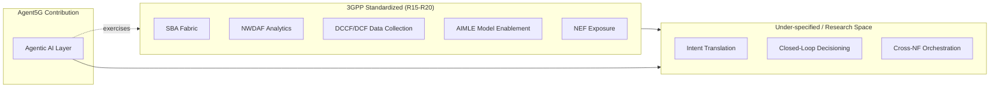
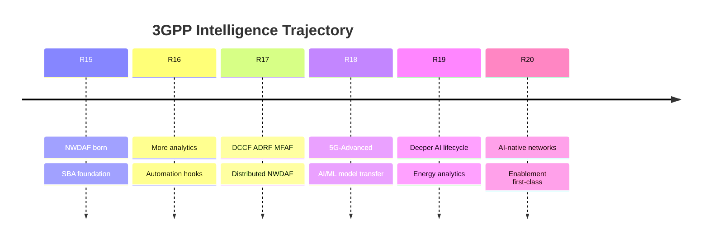
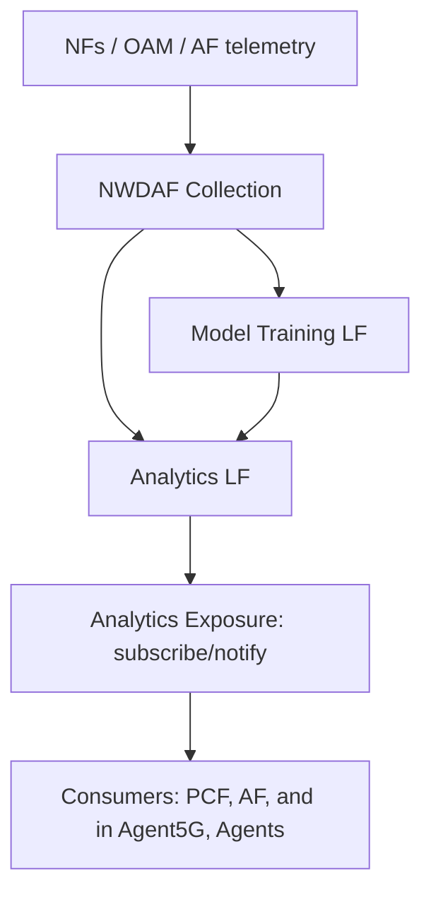
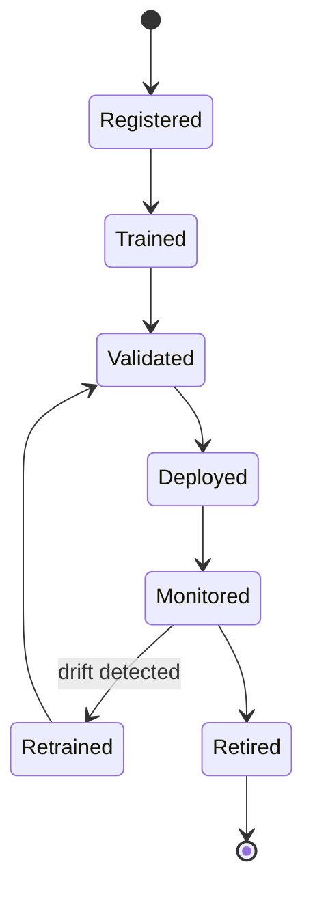
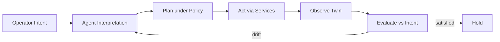
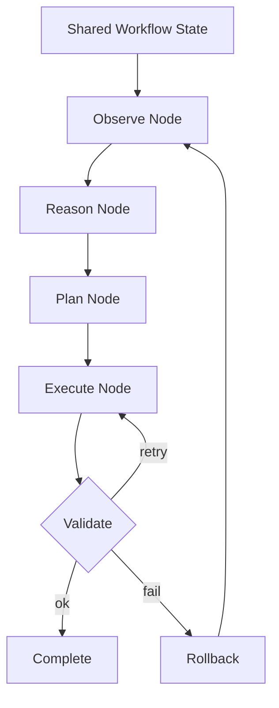

# 02 — Research Background

> **Document ID:** `02-research-background.md`
> **Project:** Agent5G — Agentic AI Service Enablement Platform for 5G Advanced Release 20
> **Document Type:** Research foundation and literature context
> **Status:** Authoritative for terminology, standards lineage, and the scientific framing that motivates every design choice.
> **Depends on:** `01-system.md` (system definitions, vocabulary, invariants).
> **Audience:** Researchers, professors, telecom students, AI researchers, network engineers preparing a paper, thesis, or IEEE demo.

---

## Table of Contents

1. [Purpose](#1-purpose)
2. [Overview](#2-overview)
3. [The 3GPP Intelligence Trajectory (R15 → R20)](#3-the-3gpp-intelligence-trajectory-r15--r20)
4. [Service Based Architecture as the Substrate for Enablement](#4-service-based-architecture-as-the-substrate-for-enablement)
5. [NWDAF and the Analytics Ecosystem](#5-nwdaf-and-the-analytics-ecosystem)
6. [Data Collection: DCCF, DCF, ADRF, MFAF](#6-data-collection-dccf-dcf-adrf-mfaf)
7. [AI/ML Enablement (AIMLE) and Model Lifecycle](#7-aiml-enablement-aimle-and-model-lifecycle)
8. [Network Exposure and Northbound APIs (NEF, CAMARA)](#8-network-exposure-and-northbound-apis-nef-camara)
9. [Network Digital Twins](#9-network-digital-twins)
10. [Intent-Based Networking and Closed-Loop Automation](#10-intent-based-networking-and-closed-loop-automation)
11. [Agentic AI and Multi-Agent LLM Systems](#11-agentic-ai-and-multi-agent-llm-systems)
12. [Orchestration Frameworks: LangGraph and MCP](#12-orchestration-frameworks-langgraph-and-mcp)
13. [Research Gap and Thesis](#13-research-gap-and-thesis)
14. [Positioning Against Related Work](#14-positioning-against-related-work)
15. [Research Questions and Hypotheses](#15-research-questions-and-hypotheses)
16. [Evaluation Methodology](#16-evaluation-methodology)
17. [Design Decisions Traceable to Research](#17-design-decisions-traceable-to-research)
18. [Engineering Notes](#18-engineering-notes)
19. [Implementation Notes](#19-implementation-notes)
20. [Research Notes and Citation Guidance](#20-research-notes-and-citation-guidance)
21. [Example Scenarios (Research Framing)](#21-example-scenarios-research-framing)
22. [Future Extensibility](#22-future-extensibility)
23. [Kiro Build Guidance](#23-kiro-build-guidance)
24. [Acceptance Criteria](#24-acceptance-criteria)

---

## 1. Purpose

This document establishes the **scientific and standards context** for Agent5G. Its purpose is threefold:

1. **Ground the prototype in real standards.** Every simulated component in Agent5G traces to a concrete 3GPP concept. This document explains those concepts so that the simulation in `06-digital-twin.md` and `07-network-core.md` is *architecturally faithful* rather than arbitrary.
2. **Articulate the research gap.** It positions the project against the current state of AI in mobile networks and defines precisely what is novel about placing an *agentic* intelligence layer above a Service Enablement Layer.
3. **Provide citation-ready framing.** Because the project is intended to become a research paper, thesis, and IEEE conference demo, this document supplies the literature scaffolding, research questions, hypotheses, and evaluation methodology that a paper would require.

This document does not prescribe code. It supplies the *why* that justifies the *what* and *how* in the rest of `docs/`.

> **Sourcing note.** The standards descriptions below summarize widely documented 3GPP architecture concepts (SBA, NWDAF, DCCF, ADRF, MFAF, NEF, AIMLE) at a conceptual level. Where a paper is produced from this project, authors must cite the specific 3GPP Technical Specifications and Reports (notably the TS 23.501, TS 23.288, TS 23.700-series study reports) and any academic sources directly. Content here is paraphrased and framed for engineering use, not reproduced from any single source.

---

## 2. Overview

Mobile networks have been on a two-decade march from static, manually configured systems toward **self-organizing** and, most recently, **AI-native** systems. The 5G core introduced Service Based Architecture, decomposing the monolithic core into network functions that expose services over a shared communication fabric. Onto this fabric, 3GPP grafted analytics (NWDAF), data collection coordination (DCCF), analytics repositories (ADRF), and, in 5G-Advanced, explicit AI/ML enablement.

Yet the standards stop short of specifying **who decides what to do** with all this intelligence. Analytics produce predictions; data collection produces telemetry; enablement produces deployable models. But the closed loop — turning an operator *intent* into a correct, ordered, policy-compliant sequence of service invocations, then adapting when the network deviates — remains largely a manual or narrowly scripted activity.

Agent5G proposes that **agentic AI** fills this gap. The following diagram situates the project in the standards landscape:

*Figure 2.1 — Agent5G targets the under-specified decisioning/orchestration space above standardized enablement.*

---

## 3. The 3GPP Intelligence Trajectory (R15 → R20)

Understanding Agent5G requires understanding how intelligence entered the 3GPP core release by release. The following is a conceptual summary of the trajectory; specific TS/TR numbers should be cited in any published paper.

- **Release 15 (2018) — Foundational 5G core + first NWDAF.** SBA is introduced. NWDAF appears as a network-internal analytics function, initially focused on slice load analytics.
- **Release 16 (2020) — Analytics expansion + automation hooks.** NWDAF gains more analytics types (e.g., service experience, NF load, mobility). The groundwork for closed-loop automation and data-driven policy is laid.
- **Release 17 (2022) — Distributed analytics + data plumbing.** NWDAF is split into logical parts (analytics logical function and model training logical function). DCCF, ADRF, and MFAF are introduced to coordinate data collection, store analytics/data, and adapt messaging.
- **Release 18 (2024) — 5G-Advanced + AI/ML.** Explicit AI/ML support: model transfer, federated/distributed learning considerations, and richer analytics. Intelligence becomes a headline theme rather than an add-on.
- **Release 19 (in progress) — Toward AI-native.** Deeper AI/ML lifecycle, energy efficiency analytics, and study items exploring AI as an architectural principle rather than a feature.
- **Release 20 (emerging, the project's target) — AI-native networks.** The vision where AI/ML enablement, data frameworks, and analytics are first-class citizens, and where higher-order automation (the space Agent5G occupies) becomes strategically important.

*Figure 3.1 — Release-by-release maturation of network intelligence.*

Agent5G targets **Release 20 framing** because that is where the *service enablement* of AI/ML — the assumption that capabilities are discoverable, invokable services — is strongest, making an agentic orchestration layer both plausible and valuable.

---

## 4. Service Based Architecture as the Substrate for Enablement

SBA is the architectural precondition that makes Agent5G possible. In SBA, NFs are **producers** and **consumers** of services communicating over a service-based interface, with the NRF providing registration and discovery. This has three properties Agent5G depends on:

1. **Discoverability.** Consumers find producers via the NRF rather than through hardcoded topology. Agent5G's Service Registry (`08-services.md`) is the SEL analog of this.
2. **Loose coupling.** Services are contracts, not implementations. This is exactly why the twin's mock NFs can later be swapped for Open5GS behind the same contracts.
3. **Composability.** Complex behavior emerges from composing service calls. The Workflow Engine (`13-workflow-engine.md`) composes services into the 8-stage lifecycle.

Agent5G elevates SBA's *machine-to-machine* service model into an *agent-to-service* model: the agent is simply a very sophisticated service consumer whose "logic" is LLM reasoning rather than fixed code. This is the conceptual bridge between telecom architecture and agentic AI.

---

## 5. NWDAF and the Analytics Ecosystem

NWDAF is the analytics brain of the 5G core. Conceptually it:

- **Collects** data from NFs, OAM, and AFs.
- **Trains** models (via a model-training logical function).
- **Infers/analyzes** to produce statistics and predictions (via an analytics logical function).
- **Exposes** analytics to consumers through subscribe/notify and request/response patterns.

Common analytics categories include NF load, network performance, service experience, abnormal behavior, mobility/location, and QoS sustainability. In Agent5G, the simulated NWDAF (`07-network-core.md`) produces these categories as KPI streams and predictions, and exposes them as services such as `nwdaf.analytics.congestion.subscribe` and `nwdaf.analytics.qos.predict`.

The key research relevance: NWDAF *produces* intelligence but does not *act* on it autonomously across NFs. Agent5G's Observer and Optimizer agents consume NWDAF-style analytics and translate them into action — demonstrating the closed loop NWDAF alone does not close.

*Figure 5.1 — NWDAF conceptual pipeline as modeled in the twin.*

---

## 6. Data Collection: DCCF, DCF, ADRF, MFAF

R17 introduced a data-plumbing layer so that many analytics consumers do not each hammer the same data producers:

- **DCCF (Data Collection Coordination Function).** Coordinates and deduplicates data collection requests across consumers, so a producer is queried once and results are fanned out. In this project we use **DCF** as the umbrella term (per the project brief) for this data-collection coordination role.
- **ADRF (Analytics Data Repository Function).** Stores historical data and analytics for later retrieval and model training.
- **MFAF (Messaging Framework Adaptor Function).** Adapts between the data-collection framework and various messaging systems, handling formatting and delivery.

In Agent5G, DCF is a first-class simulated NF: it registers `dcf.data.subscribe` and `dcf.data.collect` services, deduplicates collection, and writes historical series to the SQLite-backed ADRF-like repository. This gives the Digital Twin a realistic telemetry backbone and gives agents a single, coherent place to request data.

The research relevance: efficient, coordinated data collection is a prerequisite for trustworthy AI decisions. Agent5G demonstrates that the agentic layer benefits directly from DCF's deduplication and historical repository when reasoning about trends rather than instantaneous values.

---

## 7. AI/ML Enablement (AIMLE) and Model Lifecycle

5G-Advanced formalizes moving AI/ML *models* around the network — training in one place, deploying inference elsewhere (e.g., at an edge). Conceptually the lifecycle is:

*Figure 7.1 — AIMLE-style model lifecycle simulated in Agent5G (metadata only).*

Agent5G models this lifecycle at the **metadata** level (no real training). A `Model` entity (`12-database.md`) carries state, target NF/Edge, metrics, and version. Services such as `aimle.model.deploy`, `aimle.model.status`, and `aimle.model.retire` let agents drive the lifecycle. Scenario A ("Deploy congestion detection model to Delhi Edge") from `01-system.md` is precisely an AIMLE deployment flow.

The research relevance: model *movement and lifecycle management* is itself an orchestration problem with ordering constraints and validation gates — an ideal task for a planning agent, and a clean demonstration that agentic reasoning maps onto standardized enablement primitives.

---

## 8. Network Exposure and Northbound APIs (NEF, CAMARA)

NEF exposes selected network capabilities *northbound* to external applications (AFs) through secure, abstracted APIs — for example, QoS-on-demand, location, or device status. The industry initiative **CAMARA** standardizes such network APIs for developers.

In Agent5G, NEF is simulated as the northbound gateway exposing services like `nef.qos.request` and `nef.event.subscribe`. This matters for two reasons:

1. It lets the prototype demonstrate an **AF-driven** scenario (an external application requesting QoS), closing the loop from application intent down to UPF/PCF behavior in the twin.
2. It defines the **future integration seam** for real Network APIs: the NEF mock can be promoted to a real CAMARA-style exposure layer without changing the agent or workflow logic (`20-future-work.md`).

---

## 9. Network Digital Twins

A **network digital twin** is a live, data-driven virtual replica of a physical network used for monitoring, what-if analysis, and closed-loop control. Digital twins are attractive for research because they enable *safe experimentation*: agents can act on the twin without risking a production network.

Agent5G's Digital Twin (`06-digital-twin.md`) provides:

- **State fidelity.** Each NF has typed state matching its 3GPP role.
- **Behavioral fidelity.** Traffic, latency, QoS, and failures evolve via seeded stochastic models, so the twin behaves plausibly and reproducibly.
- **Observability.** Every state change emits an event, giving agents and the UI a faithful, real-time picture.

The research relevance: the twin is the *controlled environment* that makes rigorous, repeatable evaluation of agent behavior possible — a requirement for any credible paper. Determinism (seeded RNG) means an experiment can be re-run to produce identical figures.

---

## 10. Intent-Based Networking and Closed-Loop Automation

**Intent-Based Networking (IBN)** expresses operator goals declaratively ("keep p95 latency under 20 ms in Delhi during peak") and delegates the *how* to the system. **Closed-loop automation** continuously observes, decides, and acts to keep the network within intent.

Traditional IBN implementations rely on rule engines and predefined playbooks. Their limitation is brittleness: they handle anticipated situations but degrade when reality deviates from the script. Agent5G's hypothesis is that **LLM-driven agents generalize better** across unanticipated situations because they reason over state rather than matching fixed rules — while **policies** (`08-services.md`, `12-database.md`) provide guardrails so reasoning cannot violate hard constraints.

*Figure 10.1 — Closed loop with an agentic interpreter, guarded by policy.*

---

## 11. Agentic AI and Multi-Agent LLM Systems

**Agentic AI** refers to LLM-driven systems that pursue goals autonomously using tools, memory, and iterative reasoning, rather than producing a single response. Key patterns Agent5G builds on:

- **Tool use.** Agents call typed services (the SEL) as tools; the LLM chooses which tool and with what arguments.
- **Planning and decomposition.** A Planner decomposes a goal into ordered steps (the ReAct/plan-execute family of patterns).
- **Reflection and validation.** A Validator/Recovery step checks outcomes and revises, giving robustness.
- **Memory.** Short-term working memory, long-term episodic/semantic memory, and a knowledge graph provide continuity across steps and workflows.
- **Multi-agent specialization.** Distinct roles (Planner, Executor, Observer, Optimizer, Recovery, Documentation, Memory) cooperate, each with a focused prompt and toolset — mirroring how specialized microservices outperform a monolith.

The seven-agent design (`05-agents.md`) is a deliberate application of separation of concerns to cognition: each agent has a narrow responsibility, a bounded prompt, and clear hand-offs, which improves reliability and explainability compared with a single omni-agent.

---

## 12. Orchestration Frameworks: LangGraph and MCP

**LangGraph** models agentic systems as **stateful graphs**: nodes are computation/agent steps, edges encode control flow, and a shared, checkpointed state object flows through the graph. This is a precise fit for Agent5G because:

- The 8-stage lifecycle maps directly onto a graph with conditional edges (Validate → Retry / Rollback / Complete).
- Checkpointing gives durable, resumable workflows and time-travel debugging — invaluable for research reproducibility and for the Memory Viewer UI.
- Human-in-the-loop interrupts let a researcher pause and inspect reasoning mid-workflow.

**MCP (Model Context Protocol)** standardizes how tools and context are exposed to LLM agents. Agent5G's SEL tool layer is intentionally shaped so it can later be published as MCP servers, letting external agents (or other MCP clients) invoke Agent5G's network services — a concrete future-integration seam (`20-future-work.md`).

*Figure 12.1 — The lifecycle as a LangGraph state graph.*

---

## 13. Research Gap and Thesis

**The gap.** 3GPP standardizes the *production* of intelligence (NWDAF), the *plumbing* of data (DCF/ADRF/MFAF), the *lifecycle* of models (AIMLE), and the *exposure* of capabilities (NEF). It does **not** standardize the *autonomous decision-making agent* that consumes all of these to translate operator intent into correct, adaptive, policy-compliant action across NFs.

**The thesis.** *An agentic AI layer, sitting above a Service Enablement Layer, can autonomously translate natural-language network intents into ordered, validated, policy-compliant service invocations, and can adapt through retry/rollback when the network deviates — with full explainability.* Agent5G is the constructive proof: a working, local, reproducible system that demonstrates the thesis end-to-end.

**Why it is novel.** Prior art typically either (a) adds analytics without autonomous action, (b) automates via brittle rule engines/playbooks, or (c) explores single LLM agents for narrow tasks. Agent5G combines a *standards-faithful service substrate*, a *multi-agent* cognitive layer, a *digital twin* for safe/repeatable experimentation, and *explainability artifacts* (logs, reasoning traces, knowledge graph, memory viewer) in one coherent research platform.

---

## 14. Positioning Against Related Work

| Category | Representative approach | Limitation | Agent5G's advance |
|----------|------------------------|-----------|-------------------|
| Analytics-only | NWDAF analytics deployments | Produces predictions, does not act | Adds autonomous action loop |
| Rule-based automation | Intent engines / playbooks | Brittle outside anticipated cases | LLM reasoning generalizes; policy guards |
| Single-agent LLM ops | One agent + tools | Poor separation of concerns, weak reliability | Seven specialized agents with hand-offs |
| Digital twin research | Twins for monitoring/what-if | Often lack an autonomous controller | Twin + agentic controller + SEL |
| MLOps for networks | External model pipelines | Detached from SBA service model | AIMLE-style lifecycle via SBA services |

*Table 14.1 — Where Agent5G sits relative to adjacent work. (Cite concrete papers/specs per category when publishing.)*

---

## 15. Research Questions and Hypotheses

- **RQ1.** How reliably can multi-agent LLMs translate natural-language network intents into correct, ordered service sequences?
  - **H1.** With a specialized Planner and typed service tools, success rate on defined scenarios exceeds a single-agent baseline.
- **RQ2.** Do policy guardrails prevent unsafe actions without materially reducing task success?
  - **H2.** Policy checks block unsafe plans (e.g., de-registering the last NRF) while success on safe tasks is unaffected.
- **RQ3.** Does retry/rollback improve robustness under injected failures?
  - **H3.** With Recovery enabled, completion rate under injected NF failures is significantly higher than without.
- **RQ4.** What explainability artifacts increase engineer trust in autonomous action?
  - **H4.** Reasoning traces + knowledge-graph views + per-stage logs increase measured trust vs. outcome-only reporting.
- **RQ5.** Does memory (episodic/semantic + knowledge graph) improve performance on repeated or related intents?
  - **H5.** Warm-memory runs complete related intents in fewer steps than cold-memory runs.

---

## 16. Evaluation Methodology

Because the twin is deterministic (seeded), experiments are repeatable. Proposed metrics and protocol:

- **Task success rate.** Fraction of scenarios completing the correct end state (validated by twin assertions).
- **Plan correctness.** Ordered-step match against a reference plan (precision/recall on steps).
- **Steps-to-completion.** Count of service calls / lifecycle iterations.
- **Recovery rate.** Success under injected failures (NF failure, threshold breach) with Recovery on vs. off.
- **Policy compliance.** Count of blocked-unsafe vs. leaked-unsafe actions.
- **Latency/cost.** Wall-clock and LLM token cost per workflow.
- **Explainability.** Structured survey / expert rubric on reasoning artifacts.

**Protocol.** Fix a seed set; run each scenario N times per configuration (single-agent baseline vs. full multi-agent; memory on/off; recovery on/off; policy on/off). Use record/replay LLM mode for a deterministic subset to isolate orchestration effects from LLM stochasticity. Report mean ± std and significance where applicable. Figures are generated from the SQLite logs directly, guaranteeing traceability.

---

## 17. Design Decisions Traceable to Research

| ID | Decision (from `01-system.md`) | Research justification |
|----|-------------------------------|------------------------|
| DD-2 | Simulation over emulation | Twin enables safe, repeatable evaluation; radio fidelity is out of scope for the intelligence contribution. |
| DD-3 | LangGraph orchestration | Checkpointed graph state directly supports the lifecycle, reproducibility, and explainability. |
| DD-5 | In-process event bus + persisted events | Preserves the observe-loop and gives durable histories for analytics/figures. |
| DD-6 | Claude + pluggable client + record/replay | Enables offline, deterministic experiment subsets to isolate orchestration effects. |
| DD-7 | Strict typing / shared schema | Typed service tools improve agent tool-use reliability (supports H1). |
| — | Seven-agent specialization | Separation of concerns hypothesized to improve reliability/explainability (RQ1, RQ4). |
| — | Policy layer | Guardrails enable the safety hypotheses (H2). |

Every research claim is thus tied to a concrete architectural choice, and vice versa — a property reviewers value.

---

## 18. Engineering Notes

- **Faithfulness checklist.** For each simulated NF, record which real 3GPP service operations it approximates; keep this mapping in `07-network-core.md` so reviewers can audit fidelity.
- **Determinism discipline.** All randomness routes through one seeded RNG service. No `random()` calls scattered across modules, or reproducibility breaks.
- **Separation of stochasticity.** Keep LLM stochasticity (agents) separable from twin stochasticity (simulation) so experiments can hold one fixed while varying the other.
- **Metrics from the source of truth.** Compute all evaluation metrics from persisted SQLite rows, never from ad-hoc in-memory counters, so any figure is reproducible from the database alone.

---

## 19. Implementation Notes

- The research framing here drives concrete artifacts elsewhere: the metrics in Section 16 become queries/exports defined in `12-database.md`; the scenarios become the demo scripts in `18-demo.md`; the explainability artifacts become UI pages in `04-ui.md` (Logs, Memory Viewer, Knowledge Graph, reasoning traces in the Agent Console).
- The record/replay LLM mode required for deterministic experiments is specified in `16-testing.md`.
- The standards-to-service mapping (which real operation each mock service imitates) must be filled in `08-services.md` and `07-network-core.md` before evaluation, so fidelity claims are auditable.

---

## 20. Research Notes and Citation Guidance

When producing the paper/thesis/IEEE demo from this project:

- Cite the specific 3GPP documents rather than this summary: SBA and core architecture (TS 23.501), NWDAF/analytics (TS 23.288), and the relevant R17/R18/R19 study reports (TR 23.700-series) for DCCF/ADRF/MFAF and AI/ML enablement. Verify exact numbers/clauses against the current release at time of writing.
- Cite CAMARA for northbound network APIs.
- Cite the LLM-agent literature for ReAct-style reasoning, plan-and-execute, reflection, and multi-agent collaboration; cite LangGraph and MCP documentation for the orchestration substrate.
- Cite digital-twin and intent-based-networking surveys for the closed-loop framing.
- **Compliance:** paraphrase all sources; do not reproduce long verbatim passages. Attribute figures/tables that are adapted from a source. Content in this document was rephrased for licensing compliance and should be re-verified against primary sources before publication.

A dedicated `References` section should be maintained in the eventual paper; `20-future-work.md` and `19-presentation.md` will reference this framing.

---

## 21. Example Scenarios (Research Framing)

The same scenarios from `01-system.md` are recast here as *experiments*:

- **Experiment A — Model deployment (Scenario A).** Measures plan correctness and steps-to-completion for an AIMLE deployment intent. Baseline: single-agent. Treatment: multi-agent. Hypothesis: H1.
- **Experiment B — Autonomous mitigation (Scenario B).** Threshold breach triggers a workflow with no human prompt. Measures recovery rate and policy compliance under Optimizer action. Hypotheses: H2, H3.
- **Experiment C — Failure injection (Scenario C).** NRF failure disrupts discovery. Measures Recovery agent effectiveness (recovery rate) and explainability of the produced trace. Hypotheses: H3, H4.
- **Experiment D — Memory transfer.** Run a family of related intents cold vs. warm memory. Measures steps-to-completion. Hypothesis: H5.

Each experiment maps to demo flows in `18-demo.md` and to metric queries in `12-database.md`.

---

## 22. Future Extensibility

- **Standards tracking.** As R19/R20 finalize, update the NF/service mappings; the SBA-faithful contracts insulate agents/workflows from these changes.
- **Real substrate.** Swap the twin for Open5GS/OAI to move from *simulated fidelity* to *emulated fidelity*, enabling stronger claims (`20-future-work.md`).
- **MCP publication.** Expose the SEL as MCP servers to study cross-platform agent interoperability.
- **Federated analytics.** Extend NWDAF simulation toward federated/distributed learning to study privacy-preserving agentic operations.
- **Benchmark suite.** Package the scenarios + metrics as a reusable benchmark for agentic network operations — a potential standalone research contribution.

---

## 23. Kiro Build Guidance

### 23.1 Implementation Order (research-driven)
1. Ensure `07-network-core.md` and `08-services.md` include the standards-to-service fidelity mapping before any evaluation code.
2. Implement persisted events/logs (`12-database.md`) early — all metrics derive from them.
3. Implement record/replay LLM mode (`16-testing.md`) before running experiments.
4. Build the four experiments (Section 21) as scripted demo flows (`18-demo.md`).

### 23.2 Coding Rules
- Route all randomness through a single seeded RNG service; forbid direct `random`/`numpy.random` calls elsewhere (enforced by lint rule).
- Every evaluation metric must be expressible as a SQL query over persisted tables; no metric may depend on volatile in-memory state.

### 23.3 Naming Convention
- Experiments named `EXP-{A|B|C|D}`; metrics named `metric_{name}` in exports; seeds named `SEED_{purpose}`.
- Standards mapping fields: `spec_ref`, `approximates_operation` on each service definition.

### 23.4 Folder Ownership
- This document is authoritative for research framing; the artifacts it mandates are owned by `07`, `08`, `12`, `16`, `18`.

### 23.5 Prompt Suggestions
- "Add a `spec_ref` and `approximates_operation` field to every service in `08-services.md` mapping it to the real 3GPP operation it imitates."
- "Implement metric queries for task success, recovery rate, and policy compliance directly against the events and workflows tables."
- "Create scripted experiment runners EXP-A..D using record/replay LLM mode with a fixed seed set."

### 23.6 Acceptance Criteria
- Every simulated service has a documented standards mapping.
- All five research questions map to at least one experiment and one metric query.

---

## 24. Acceptance Criteria

This document is **complete and correct** when:

- [ ] **AC-1.** The R15 → R20 intelligence trajectory is described with a diagram and Release-20 targeting is justified.
- [ ] **AC-2.** SBA is explained as the enablement substrate, including discoverability, loose coupling, composability.
- [ ] **AC-3.** NWDAF, DCF/DCCF, ADRF, MFAF, AIMLE, and NEF are each explained and tied to a simulated component/service.
- [ ] **AC-4.** Network digital twins and their role in safe, repeatable evaluation are explained.
- [ ] **AC-5.** Intent-based networking and closed-loop automation are contrasted with the agentic approach.
- [ ] **AC-6.** Agentic AI patterns (tool use, planning, reflection, memory, multi-agent) are described and mapped to the seven agents.
- [ ] **AC-7.** LangGraph and MCP are justified as orchestration/interoperability substrates.
- [ ] **AC-8.** The research gap and thesis are stated explicitly and distinctly.
- [ ] **AC-9.** A related-work positioning table is provided.
- [ ] **AC-10.** At least five research questions with paired hypotheses are defined.
- [ ] **AC-11.** An evaluation methodology with metrics and protocol is defined, computable from persisted data.
- [ ] **AC-12.** Design decisions are traced to research justifications.
- [ ] **AC-13.** Citation guidance and licensing-compliance notes are included.
- [ ] **AC-14.** All mandated sections (Purpose, Overview, Architecture context, Responsibilities via mappings, Design decisions, Mermaid diagrams, Folder references, Interfaces via seams, Future extensibility, Engineering/Implementation/Research notes, Example scenarios, Acceptance criteria) are present.

---

**NEXT FILE**
