# 03 — Architecture

> **Document ID:** `03-architecture.md`
> **Project:** Agent5G — Agentic AI Service Enablement Platform for 5G Advanced Release 20
> **Document Type:** Master architecture specification (the technical backbone of the platform)
> **Status:** Authoritative for layering, module boundaries, dependency rules, data/control flow, concurrency, and cross-cutting concerns. All implementation documents (`06`–`13`) conform to this document.
> **Depends on:** `01-system.md` (planes, invariants, lifecycle), `02-research-background.md` (standards framing).
> **Audience:** Software architects, backend/frontend engineers, AI engineers, reviewers auditing structural correctness.

---

## Table of Contents

1. [Purpose](#1-purpose)
2. [Overview](#2-overview)
3. [Architectural Principles](#3-architectural-principles)
4. [The Four Planes in Detail](#4-the-four-planes-in-detail)
5. [Clean Architecture Layering](#5-clean-architecture-layering)
6. [Module Decomposition and Boundaries](#6-module-decomposition-and-boundaries)
7. [Dependency Rules and Enforcement](#7-dependency-rules-and-enforcement)
8. [The Event-Driven Core](#8-the-event-driven-core)
9. [Control Flow: The 8-Stage Lifecycle Wiring](#9-control-flow-the-8-stage-lifecycle-wiring)
10. [Data Flow and Persistence Strategy](#10-data-flow-and-persistence-strategy)
11. [Concurrency and Runtime Model](#11-concurrency-and-runtime-model)
12. [Service Enablement Layer Architecture](#12-service-enablement-layer-architecture)
13. [Agent Runtime Architecture](#13-agent-runtime-architecture)
14. [Digital Twin Architecture](#14-digital-twin-architecture)
15. [Frontend Architecture](#15-frontend-architecture)
16. [Cross-Cutting Concerns](#16-cross-cutting-concerns)
17. [Interfaces and Contracts](#17-interfaces-and-contracts)
18. [Deployment Topology (Local)](#18-deployment-topology-local)
19. [Architectural Design Decisions (ADRs)](#19-architectural-design-decisions-adrs)
20. [Example Scenario Walkthrough (Architectural)](#20-example-scenario-walkthrough-architectural)
21. [Folder References](#21-folder-references)
22. [Future Extensibility](#22-future-extensibility)
23. [Engineering Notes](#23-engineering-notes)
24. [Implementation Notes](#24-implementation-notes)
25. [Research Notes](#25-research-notes)
26. [Kiro Build Guidance](#26-kiro-build-guidance)
27. [Acceptance Criteria](#27-acceptance-criteria)

---

## 1. Purpose

This document is the **master architecture specification** for Agent5G. Where `01-system.md` described *what the system is* at a bird's-eye level, this document describes *how the system is structured internally* with enough precision that an engineer can lay out every module, understand every dependency, and know exactly where each responsibility lives before writing a single line of code.

Specifically, this document:

- Defines the **layering** (Clean Architecture) and the **dependency rules** that keep the domain independent of frameworks.
- Decomposes the system into **modules** with explicit boundaries and ownership.
- Specifies the **event-driven core** that connects the Digital Twin, the agents, and the UI.
- Wires the **8-stage lifecycle** onto concrete runtime components (LangGraph nodes, services, twin).
- Specifies the **concurrency and runtime model** for a single Windows 11 machine.
- Records **architectural decisions (ADRs)** with rationale and consequences.

Every downstream document inherits these structures. If a downstream document appears to conflict with this one, this document wins until amended.

---

## 2. Overview

Agent5G runs as **two OS processes** on one machine:

1. A **Python backend process** (FastAPI) that hosts the API, the Service Enablement Layer, the Workflow Engine, the LangGraph agent runtime, the Digital Twin simulation loop, the in-process event bus, and the SQLAlchemy/SQLite persistence.
2. A **Node process** (Next.js) that hosts the frontend, talking to the backend over REST + WebSocket on `localhost`.

Inside the backend, the code is organized by **Clean Architecture layers** (delivery → application → domain → infrastructure), while the frontend is organized **feature-first**. The unifying runtime idea is an **event-driven closed loop**: the twin emits events, the Observer and the WebSocket layer subscribe, agents reason and act through services, services mutate the twin, and the cycle continues — all persisted for explainability.

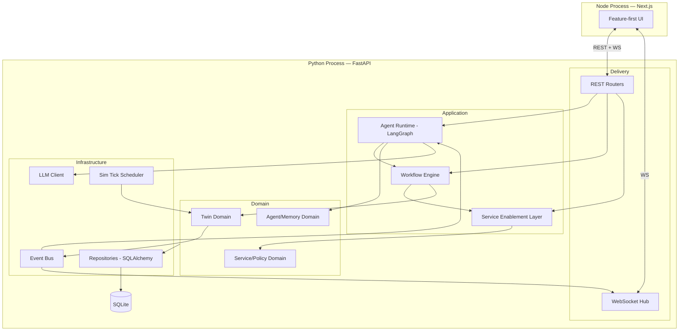

*Figure 2.1 — Two-process runtime with Clean Architecture layers inside the backend.*

---

## 3. Architectural Principles

These principles are binding and testable.

- **P1 — Dependencies point inward.** Delivery depends on Application, Application on Domain; Infrastructure implements Domain-defined interfaces. Domain depends on nothing external. (Clean Architecture / Dependency Inversion.)
- **P2 — Agents act only through services.** No agent code imports the twin directly. The only path from intelligence to substrate is the SEL. (The system's central invariant.)
- **P3 — Every mutation is an event.** Any change to twin state emits a domain event and persists a log row. There are no silent writes. (Event sourcing lite / auditability.)
- **P4 — One responsibility per module.** Modules are cohesive and small; cross-cutting concerns are factored into dedicated modules (logging, events, RNG).
- **P5 — Contracts before consumers.** Pydantic schemas and the OpenAPI contract exist before the frontend or agents consume them; TS types are generated, never hand-authored.
- **P6 — Determinism by construction.** All randomness flows through one seeded RNG service (SOLID's single source of truth applied to entropy).
- **P7 — Replaceable infrastructure.** SQLite, Claude, and the in-process bus sit behind interfaces so they can be swapped (Postgres, another LLM, Redis) without touching the domain.
- **P8 — Explainability is a feature, not a log.** Reasoning traces, plans, validations, and memory are first-class persisted entities surfaced in the UI.

---

## 4. The Four Planes in Detail

The planes from `01-system.md` map onto concrete architecture as follows.

### 4.1 Experience Plane
Next.js App Router application. Feature modules render pages; a typed API client and a WebSocket hook stream live state. No business logic lives here beyond presentation and light view-state. Detail: `04-ui.md`, `11-frontend.md`.

### 4.2 Intelligence Plane
The LangGraph agent runtime plus the seven agents and the memory subsystem. It is an **Application-layer** concern: it orchestrates domain operations but contains no persistence or framework specifics beyond LangGraph. Detail: `05-agents.md`, `14-prompts.md`.

### 4.3 Enablement Plane
The Service Enablement Layer (Service Registry + typed service invocation) and the Workflow Engine. Also Application-layer. This is the *only* bridge between intelligence and substrate. Detail: `08-services.md`, `13-workflow-engine.md`.

### 4.4 Substrate Plane
The Digital Twin: NF domain models, the topology graph, the KPI/traffic/failure simulation, and the event emission. Primarily **Domain-layer** state with an Infrastructure-layer tick scheduler driving time. Detail: `06-digital-twin.md`, `07-network-core.md`.

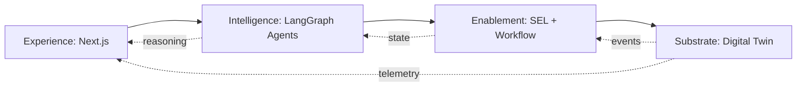

*Figure 4.1 — Planes as a command-down / telemetry-up pipeline.*

---

## 5. Clean Architecture Layering

The backend has four concentric layers. The dependency arrow always points toward the center (Domain).

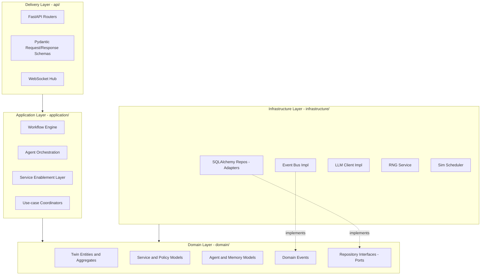

*Figure 5.1 — Concentric layers. Infrastructure implements ports defined in the Domain (Dependency Inversion).*

**Layer responsibilities:**

| Layer | Contains | Never contains |
|-------|----------|----------------|
| Delivery (`api/`) | HTTP routing, WS hub, request/response schemas, serialization | Business rules, DB access |
| Application (`application/`) | Workflow engine, agent orchestration, SEL, use-case coordinators | SQL, HTTP framework details |
| Domain (`domain/`) | Entities, aggregates, value objects, domain events, port interfaces | Any framework import (no FastAPI, no SQLAlchemy, no LangGraph) |
| Infrastructure (`infrastructure/`) | Repository adapters, event bus, LLM client, RNG, scheduler | Business rules |

The Domain layer is **pure Python + Pydantic** only. This is what makes the system portable to Open5GS or Postgres later.

---

## 6. Module Decomposition and Boundaries

The backend package tree (refining `01-system.md` §10):

```text
backend/app/
├── domain/
│   ├── twin/            # NF entities, topology, KPI, traffic models, events
│   │   ├── entities.py      # UE, gNB, AMF, SMF, UPF, NRF, UDM, PCF, NWDAF, NEF, DCF, AF, Edge
│   │   ├── topology.py      # graph of nodes/links
│   │   ├── kpi.py           # KPI value objects + series
│   │   ├── events.py        # domain event types (KPI_THRESHOLD_BREACH, NF_FAILED, ...)
│   │   └── ports.py         # TwinRepository interface
│   ├── services/        # service model, registry contract, policy
│   │   ├── models.py        # ServiceDescriptor, ServiceCall, ServiceResult
│   │   ├── policy.py        # Policy, PolicyDecision
│   │   └── ports.py         # ServiceRegistry, PolicyStore interfaces
│   └── agents/          # agent + memory + workflow domain
│       ├── models.py        # AgentSpec, AgentRole, Workflow, WorkflowStage, Step
│       ├── memory.py        # MemoryRecord, KnowledgeNode/Edge
│       └── ports.py         # MemoryStore, WorkflowRepository interfaces
├── application/
│   ├── workflow/        # 8-stage engine on LangGraph
│   │   ├── engine.py        # graph construction + run
│   │   ├── nodes.py         # observe/reason/plan/execute/validate/retry/rollback/complete
│   │   └── state.py         # WorkflowState (LangGraph state object)
│   ├── sel/             # Service Enablement Layer
│   │   ├── registry.py      # in-memory + persisted registry
│   │   ├── invoker.py       # typed service invocation + policy check
│   │   └── tools.py         # exposes services as agent tools
│   ├── agents/          # agent implementations + orchestration
│   │   ├── planner.py executor.py observer.py optimizer.py
│   │   ├── recovery.py documentation.py memory_agent.py
│   │   └── orchestrator.py  # wires agents to workflow nodes
│   └── twin_service/    # use-cases mutating/reading the twin via ports
├── infrastructure/
│   ├── db/              # SQLAlchemy models, session, migrations, repo adapters
│   ├── bus/             # async pub/sub event bus
│   ├── llm/             # Claude client + record/replay
│   ├── rng/             # seeded RNG service
│   └── sim/             # simulation tick scheduler
├── api/
│   ├── routers/         # one router per resource (workflows, twin, services, agents, ...)
│   ├── schemas/         # Pydantic request/response DTOs
│   ├── ws/              # websocket hub + event serialization
│   └── deps.py          # dependency-injection wiring
└── main.py              # app factory, lifespan, DI container
```

**Boundary rule:** a module may import only from its own layer or from an *inner* layer's port interfaces. Concrete infrastructure is injected at composition time in `main.py`/`deps.py` (the Composition Root).

---

## 7. Dependency Rules and Enforcement

Principle P1 is enforced mechanically, not by convention alone.

- **Import-linter contracts.** A configuration declares forbidden imports (e.g., `domain` may not import `sqlalchemy`, `fastapi`, or `langgraph`; `application` may not import `api`). CI/`ruff`/`import-linter` fails the build on violation.
- **Ports and adapters.** The Domain declares `Repository`, `EventBus`, `LLMClient`, `MemoryStore`, `PolicyStore`, and `Rng` as abstract interfaces (ports). Infrastructure provides adapters. Application depends on ports, never adapters.
- **Composition Root.** All wiring (which adapter satisfies which port) happens once in `main.py`/`api/deps.py`. Nothing else constructs infrastructure objects directly.

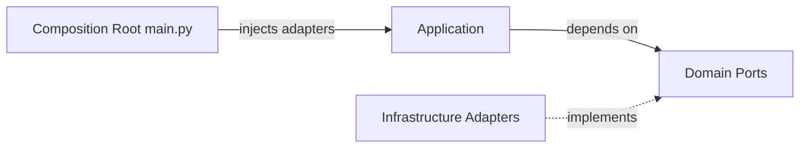

*Figure 7.1 — Ports-and-adapters with a single composition root.*

The payoff: swapping SQLite→Postgres, Claude→another LLM, or the in-process bus→Redis touches only `infrastructure/` and one line of wiring.

---

## 8. The Event-Driven Core

The event bus is the spine of the runtime. It is an **async in-process publish/subscribe** system defined by the Domain port `EventBus` and implemented in `infrastructure/bus/`.

**Event taxonomy** (defined in `domain/twin/events.py` and extended by services/agents):

| Event | Emitted by | Consumed by |
|-------|-----------|-------------|
| `SIM_TICK` | Sim scheduler | Twin (advance state) |
| `KPI_UPDATED` | Twin | WS hub, persistence |
| `KPI_THRESHOLD_BREACH` | Twin | Observer agent, WS hub, persistence |
| `NF_REGISTERED` / `NF_DEREGISTERED` | Twin/NRF | WS hub, persistence |
| `NF_FAILED` / `NF_RECOVERED` | Twin | Recovery agent, WS hub, persistence |
| `SERVICE_CALLED` / `SERVICE_RESULT` | SEL invoker | persistence, WS hub |
| `WORKFLOW_STAGE_CHANGED` | Workflow engine | WS hub, persistence, Memory |
| `MODEL_DEPLOYED` / `MODEL_RETIRED` | Twin (AIMLE) | WS hub, persistence |
| `POLICY_BLOCKED` | Policy check | persistence, WS hub, Recovery |

**Guarantees.** Every published event is (1) persisted to the `events` table synchronously in the emitting transaction boundary where possible, then (2) fanned out to async subscribers. Persistence-first ensures the audit trail survives even if a subscriber throws.

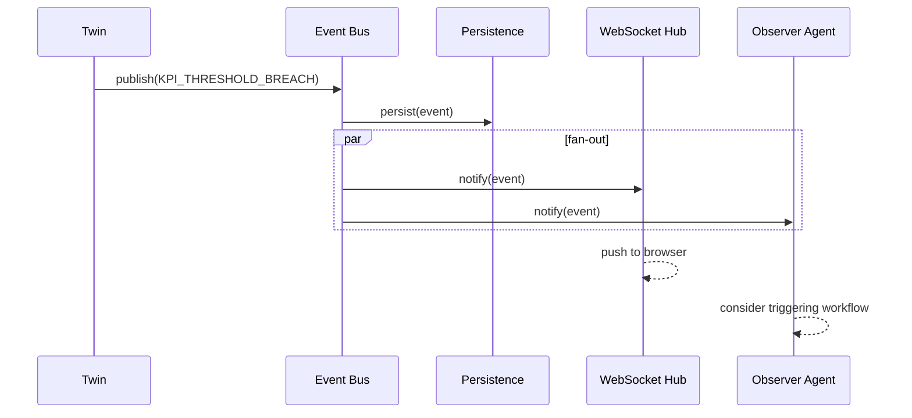

*Figure 8.1 — Persist-first, then fan-out event delivery.*

**Backpressure.** Subscribers are non-blocking; slow subscribers get a bounded queue and drop-oldest policy for high-frequency `KPI_UPDATED` (never for `*_BREACH`/`*_FAILED`, which are lossless).

---

## 9. Control Flow: The 8-Stage Lifecycle Wiring

The lifecycle from `01-system.md` is realized as a **LangGraph state graph** in `application/workflow/`. Each stage is a node; conditional edges implement retry/rollback.

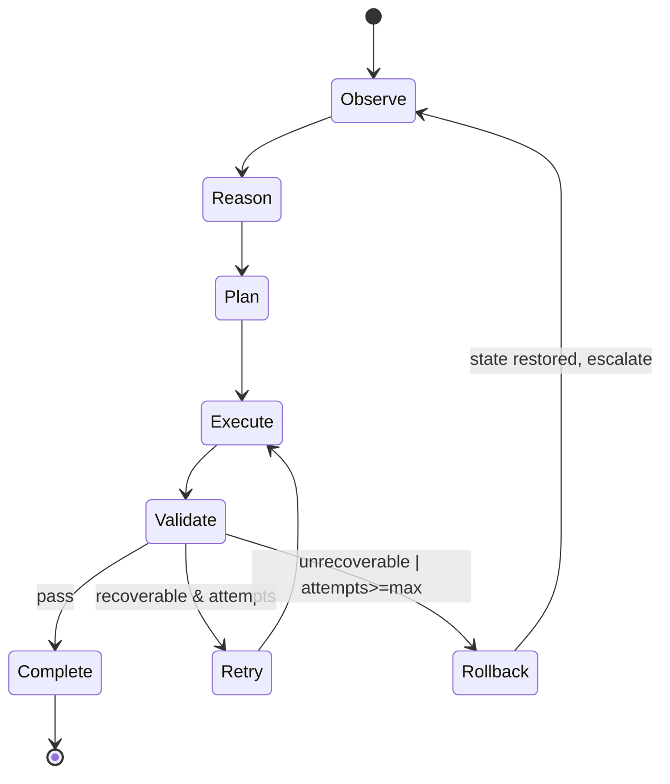

*Figure 9.1 — Lifecycle graph with guard conditions on the Validate transitions.*

**Node-to-agent mapping:**

| Stage/Node | Driving agent(s) | Reads | Writes |
|------------|------------------|-------|--------|
| Observe | Observer | twin snapshot, events | `WorkflowState.observation` |
| Reason | Planner | observation, memory | `interpretation` |
| Plan | Planner | interpretation, service catalog | ordered `steps` |
| Execute | Executor | steps, SEL tools | `results`, twin mutations |
| Validate | Observer/Optimizer | results, twin | `validation`, decision |
| Retry | Executor | failed step, validation | adjusted step |
| Rollback | Recovery | compensation log | restored twin |
| Complete | Documentation | full trace | summary, memory write |

**WorkflowState** (the LangGraph shared state object) carries: `goal`, `observation`, `interpretation`, `steps[]`, `cursor`, `results[]`, `validation`, `attempts`, `compensations[]`, `status`, and `trace[]`. It is checkpointed by LangGraph after every node so workflows are resumable and inspectable. Full semantics: `13-workflow-engine.md`.

---

## 10. Data Flow and Persistence Strategy

Two directions of data movement, both persisted:

- **Command path (downward):** UI → REST → Orchestrator → Workflow → SEL invoker → twin use-case → NF entity mutation. Each hop that changes state writes to the DB and emits an event.
- **Telemetry path (upward):** Sim tick → twin state change → event → {persistence, WS → UI, Observer}.

**Persistence strategy:**

- **System of record:** SQLite via SQLAlchemy. Tables (detailed in `12-database.md`): `users`, `agents`, `services`, `events`, `kpis`, `workflows`, `workflow_steps`, `logs`, `memory`, `knowledge_edges`, `policies`, `models`, `simulation`, `topology_nodes`, `topology_links`.
- **Live state vs. persisted state:** The twin keeps hot state in memory for fast tick simulation; it **write-behind** persists KPI samples in batches (bounded interval) and **write-through** persists discrete events immediately. This balances simulation throughput against durability.
- **Single writer:** All SQLite writes funnel through one async writer task/queue to avoid `database is locked` under concurrency (Windows + SQLite).
- **Read models:** The API composes read-optimized DTOs from repositories; heavy aggregate reads (analytics) use dedicated query methods, not ORM object graphs.

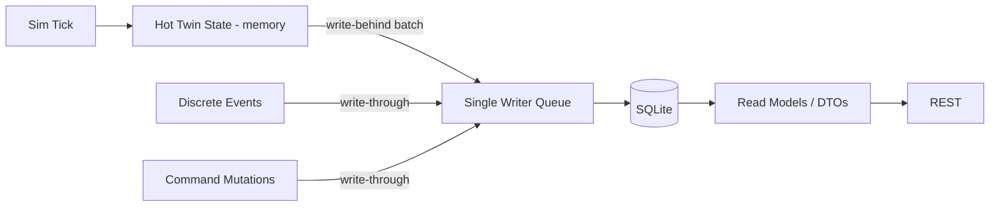

*Figure 10.1 — Mixed write-behind (KPIs) / write-through (events, commands) via a single writer.*

---

## 11. Concurrency and Runtime Model

Everything runs in **one asyncio event loop** in the Python process, using cooperative concurrency plus a small set of background tasks.

**Background tasks (created in the FastAPI lifespan):**

1. **Sim scheduler** — fires `SIM_TICK` at a configurable interval (e.g., 1 s). Advances twin state and emits KPI/failure events.
2. **DB writer** — drains the single-writer queue and commits batches.
3. **Event dispatcher** — the bus fan-out loop.
4. **Workflow runners** — each active workflow runs as an asyncio task via LangGraph's async execution; multiple workflows can run concurrently.

**Rules:**

- No CPU-bound blocking on the event loop. LLM calls are `await`ed (I/O bound). Any heavier computation (e.g., a synthetic model "training" delay) is simulated with async sleeps, not real CPU work.
- SQLite access is serialized through the writer; reads use short-lived sessions.
- The twin's hot state is mutated only from twin use-cases invoked within the event loop; no shared-memory threads. This eliminates most race conditions by design.
- Long-running dev servers (Next.js, uvicorn --reload) are started **manually by the user** in their own terminals (Windows constraint from `01-system.md`).

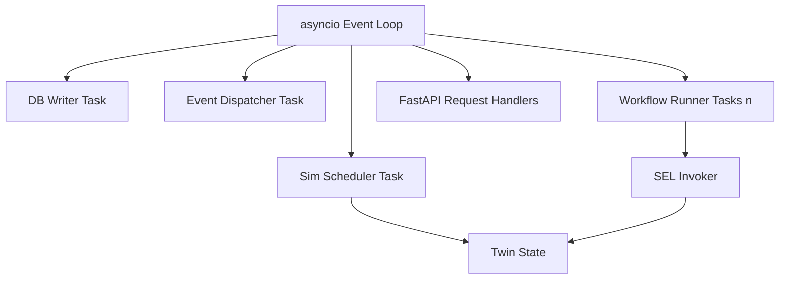

*Figure 11.1 — Single event loop with cooperative background tasks.*

---

## 12. Service Enablement Layer Architecture

The SEL is the architectural embodiment of the project's thesis. It has three parts:

1. **Service Registry** (`application/sel/registry.py`). Holds `ServiceDescriptor`s: name (`{nf}.{domain}.{action}`), typed input/output schema (Pydantic), owning NF, policy tags, and the standards mapping fields (`spec_ref`, `approximates_operation`) from `02-research-background.md`. Backed by the `services` table so registrations survive restarts. Mirrors NRF discovery semantics.
2. **Service Invoker** (`application/sel/invoker.py`). The single choke point for executing a service: validate input → **policy check** → dispatch to the owning twin use-case → capture result → emit `SERVICE_CALLED`/`SERVICE_RESULT` → persist. Enforces invariant P2 (agents cannot bypass it).
3. **Tool Adapter** (`application/sel/tools.py`). Wraps each registered service as a LangGraph/agent tool with a JSON schema derived from the Pydantic model, so agents can call services by name with validated arguments. This is also the MCP publication seam.

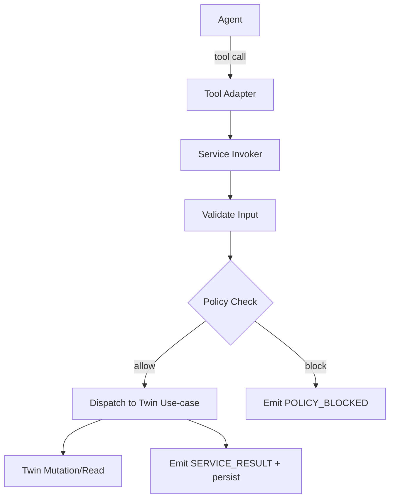

*Figure 12.1 — The SEL invocation pipeline, the sole bridge intelligence→substrate.*

Full service catalog and contracts: `08-services.md`.

---

## 13. Agent Runtime Architecture

The seven agents are Application-layer objects orchestrated by LangGraph. Each agent is a thin, testable wrapper around: a **role prompt** (`14-prompts.md`), a **bound tool set** (subset of SEL tools + memory tools), and a **structured output schema**.

- **Orchestrator** (`application/agents/orchestrator.py`) binds agents to workflow nodes: Observer→Observe/Validate, Planner→Reason/Plan, Executor→Execute/Retry, Recovery→Rollback, Documentation→Complete, Optimizer→participates in Validate/optimization workflows, Memory→reads/writes memory across stages.
- **Memory subsystem** (`domain/agents/memory.py` + adapter): short-term (in `WorkflowState`), long-term episodic/semantic (`memory` table), and a knowledge graph (`knowledge_edges`). The Memory agent curates writes; other agents read.
- **LLM boundary:** all model calls go through the `LLMClient` port; record/replay makes agent behavior deterministic for tests/demos.

```mermaid
graph LR
    subgraph AGENTS
        OB[Observer] PL[Planner] EX[Executor]
        OP[Optimizer] RC[Recovery] DOC[Documentation] MEM[Memory]
    end
    ORCH[Orchestrator] --> AGENTS
    AGENTS --> LLMP[LLMClient Port]
    AGENTS --> TOOLS[SEL Tool Adapter]
    MEM --> MSTORE[MemoryStore Port]
```

*Figure 13.1 — Agent runtime: prompts + tools + structured output behind ports.* Full detail: `05-agents.md`.

---

## 14. Digital Twin Architecture

The twin is a domain-centric simulation with an infrastructure-driven clock.

- **Entities & aggregates** (`domain/twin/entities.py`): each NF is an aggregate with typed state and invariants (e.g., an AMF tracks registered UEs; a UPF tracks sessions and load). The topology aggregate holds nodes and links.
- **Simulation models** (`domain/twin/kpi.py`, traffic models): seeded stochastic processes evolve KPIs (latency, throughput, PRB utilization, packet loss) per tick and inject failures per configured probabilities.
- **Clock** (`infrastructure/sim/`): emits `SIM_TICK`; the twin service advances state and emits derived events (`KPI_UPDATED`, `KPI_THRESHOLD_BREACH`, `NF_FAILED`).
- **Repository** (`TwinRepository` port): snapshots and persistence.

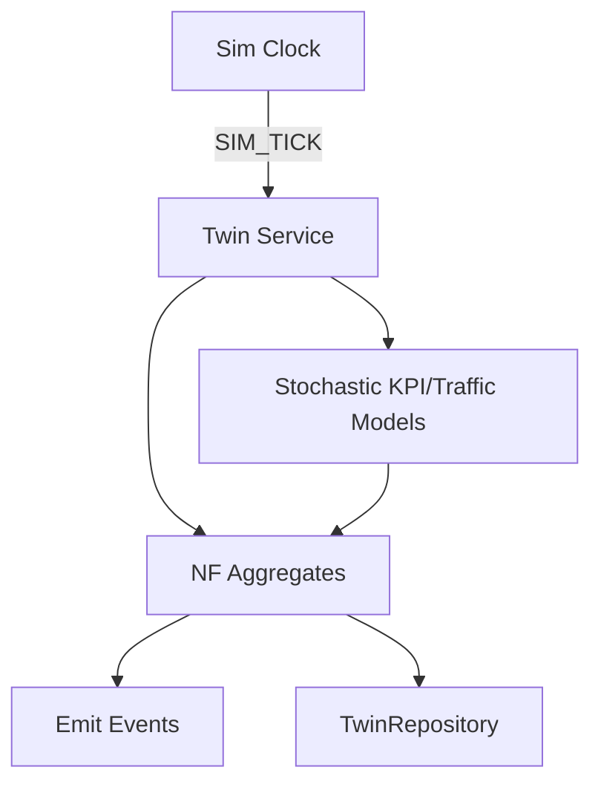

*Figure 14.1 — Twin: clock-driven, seeded, event-emitting.* Full detail: `06-digital-twin.md`, `07-network-core.md`.

---

## 15. Frontend Architecture

Next.js App Router, **feature-first** (contrasting the layered backend, per DD-8).

```text
frontend/
├── app/                 # routes: /dashboard /agents /topology /twin /workflows ...
├── features/            # dashboard/ agents/ topology/ twin/ workflows/ services/
│                        #   knowledge/ memory/ logs/ simulation/ analytics/ models/ settings/
│   └── <feature>/       # components, hooks, api, types local to the feature
├── components/          # shared Shadcn-based primitives
├── lib/
│   ├── api-client.ts    # typed fetch wrapper (generated types)
│   ├── ws.ts            # WebSocket hook -> event stream
│   └── types.ts         # generated from backend Pydantic schemas
└── styles/
```

- **State:** server components for initial data; a lightweight client store (e.g., Zustand) + React Query for live/cached data; the WS hook pushes events into the store so all views update together.
- **Visualization:** React Flow (topology, workflow builder), Recharts (KPI charts), D3/Mermaid (knowledge graph, diagrams), Framer Motion (transitions).
- **Contract sync:** `lib/types.ts` is generated from the backend schema (P5); no hand-authored duplicate types. Full detail: `04-ui.md`, `11-frontend.md`.

---

## 16. Cross-Cutting Concerns

| Concern | Approach | Location |
|---------|----------|----------|
| Logging | Structured JSON logs + persisted `logs` rows; correlation id per workflow | `infrastructure/`, all layers via a logger port |
| Correlation | Every request/workflow gets a `correlation_id` propagated through events/logs | Delivery → Application |
| Configuration | `.env` + typed settings (Pydantic Settings); seed, tick interval, LLM key/mode | `infrastructure/config` |
| Error handling | Domain raises typed exceptions; Delivery maps to HTTP problem+json; no bare excepts | all layers |
| Validation | Pydantic at every boundary (API, service invoker, tools) | Delivery, SEL |
| Security | Localhost-only; auth minimal and flagged; input validation everywhere; no secrets in code | Delivery, config |
| Observability | Events + logs + WS give live + historical views | bus + persistence |
| Determinism | Single seeded RNG service (P6) | `infrastructure/rng` |
| Time | Simulated clock via `SIM_TICK`; wall-clock only for real timestamps | `infrastructure/sim` |

> **Security note (reiterated):** mutating endpoints are unauthenticated in the base local build. If exposed beyond `localhost`, add auth/authz first (`17-deployment.md`). This is deliberately flagged, not silently omitted.

---

## 17. Interfaces and Contracts

Realizing the five system interfaces (I1–I5) from `01-system.md`:

- **I2 (Frontend↔Backend):** REST resources (`/api/v1/...`) + a WebSocket at `/ws` streaming serialized domain events. OpenAPI is the contract; TS types generated from it. Detail: `09-api.md`.
- **I3 (Agents↔Services):** the Tool Adapter's JSON-schema tools; the *only* agent→system action path. Detail: `08-services.md`.
- **I4 (Services↔Twin):** twin use-case methods behind `TwinRepository`/twin-service interfaces. Detail: `06-digital-twin.md`.
- **I5 (System↔LLM):** the `LLMClient` port with `complete`, `tool_call`, and `record/replay`. Detail: `10-backend.md`, `14-prompts.md`.

All contracts are **versioned** (`/api/v1`, schema version fields) so the frontend and agents fail loudly on mismatch rather than silently misbehaving.

---

## 18. Deployment Topology (Local)

Single Windows 11 machine, two processes, one SQLite file. No containers.

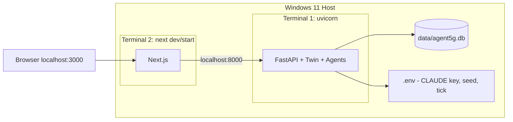

*Figure 18.1 — Local two-process deployment.* Startup scripts (`.ps1`/`.bat`) live in `scripts/`; full procedure in `17-deployment.md`.

---

## 19. Architectural Design Decisions (ADRs)

Each ADR: decision, rationale, consequences.

- **ADR-1 — Monorepo, two processes.** *Decision:* one repo, separate backend/frontend processes. *Rationale:* simple local dev, shared docs, clear contract seam. *Consequences:* must generate TS types from Python schemas; documented in P5.
- **ADR-2 — Clean Architecture (backend) + feature-first (frontend).** *Rationale:* each side's natural structure (DD-8). *Consequences:* two organizing principles; explicitly documented to avoid confusion.
- **ADR-3 — LangGraph for both agents and the workflow state machine.** *Rationale:* one durable, checkpointed graph model for orchestration and lifecycle. *Consequences:* lifecycle nodes and agent steps share `WorkflowState`; resumability and inspectability come free.
- **ADR-4 — In-process async event bus, persist-first.** *Rationale:* no external broker allowed; auditability required. *Consequences:* live bus not cross-process durable, but every event is persisted (§8).
- **ADR-5 — Single-writer SQLite.** *Rationale:* avoid `database is locked` on Windows; keep write ordering deterministic. *Consequences:* write throughput bounded; acceptable for a research prototype; Postgres seam preserved.
- **ADR-6 — Ports & adapters with one composition root.** *Rationale:* replaceable infrastructure (P7). *Consequences:* slightly more boilerplate; huge payoff for future integrations.
- **ADR-7 — Hot in-memory twin + write-behind KPIs.** *Rationale:* simulation throughput. *Consequences:* small window of unpersisted KPI samples on crash; discrete events are write-through so no critical loss.
- **ADR-8 — SEL as sole intelligence→substrate bridge.** *Rationale:* enforces the research thesis and testability. *Consequences:* every capability must be a registered service; no shortcuts.

---

## 20. Example Scenario Walkthrough (Architectural)

**Scenario A — "Deploy congestion detection model to Delhi Edge"** traced through the architecture:

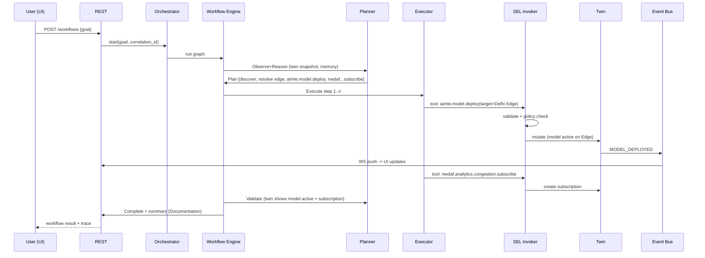

*Figure 20.1 — End-to-end architectural trace of Scenario A, showing every layer and the persist/push side effects.*

Each arrow that mutates state also persists a row and emits an event (P3), so the UI's Logs, Topology, Twin, and Analytics pages all reflect the change in real time, and the Documentation agent can reconstruct the full narrative.

---

## 21. Folder References

- Backend layers: `backend/app/{domain,application,infrastructure,api}/` — this document is authoritative for their boundaries.
- Frontend: `frontend/{app,features,components,lib}/` — §15.
- Data + scripts: `data/`, `scripts/` — §18.
- Owning documents per module: see `01-system.md` §18.4 and each specialized doc.

---

## 22. Future Extensibility

- **Postgres/Redis:** replace adapters behind `Repository`/`EventBus` ports (ADR-6); domain untouched.
- **Open5GS/OAI:** replace twin use-cases behind `TwinRepository`/twin-service with real NF clients; SEL contracts stay identical (DD-2).
- **MCP servers:** promote the Tool Adapter (§12) to MCP endpoints; external agents gain access.
- **Horizontal decomposition:** the two-process monolith can split into services (twin service, agent service, API gateway) if scale demands; the layer boundaries pre-mark the seams.
- **Multi-tenant/RBAC:** add auth middleware in Delivery + `users`/roles in the domain; flagged as required before any non-local exposure.

---

## 23. Engineering Notes

- Keep the Domain layer import-clean; a single stray `import sqlalchemy` in `domain/` breaks the architecture — enforce with import-linter in CI.
- The Composition Root is the only place allowed to construct adapters; review PRs for violations.
- Emit events from within the same logical operation that mutates state; never let UI-visible state and persisted state diverge.
- Use correlation ids everywhere so a single workflow can be traced across events, logs, and memory in one query.
- Prefer small, pure domain methods; push all I/O to adapters so the domain is unit-testable without a DB or LLM.

---

## 24. Implementation Notes

- **Build order:** domain models → ports → infrastructure adapters (DB, bus, rng, llm mock) → SEL → workflow engine → agents → API → frontend (per `15-kiro-rules.md`).
- **First vertical slice:** implement Scenario A end-to-end with a mocked LLM before adding more services/agents — proves the whole spine (§20).
- **DI wiring:** implement `api/deps.py` early so tests can inject fakes for every port.
- **WebSocket serialization:** define one canonical event envelope `{type, correlation_id, ts, payload}` shared by bus and WS.

---

## 25. Research Notes

- The persist-first event core (§8) is what makes every metric in `02-research-background.md` §16 computable from the DB alone — architecture directly enables reproducible evaluation.
- The SEL choke point (§12) is where policy-compliance and plan-correctness are measured; instrument it thoroughly.
- Checkpointed `WorkflowState` (ADR-3) provides the reasoning traces that answer RQ4 (explainability) and enables time-travel debugging for demos.

---

## 26. Kiro Build Guidance

### 26.1 Implementation Order
1. `domain/` entities, events, ports (no frameworks).
2. `infrastructure/` adapters: SQLAlchemy repos, event bus, RNG, LLM mock, sim scheduler.
3. `application/sel/` registry + invoker + tools.
4. `application/workflow/` LangGraph engine + nodes + state.
5. `application/agents/` seven agents + orchestrator.
6. `api/` routers, schemas, WS hub, `deps.py`, `main.py` lifespan.
7. Frontend scaffold + generated types + feature pages.

### 26.2 Coding Rules
- Enforce import-linter contracts (P1). Domain imports no framework.
- All infra behind ports; construct adapters only in the Composition Root (ADR-6).
- Every state mutation: validate → mutate → persist → emit event (P3).
- All randomness via the RNG service (P6). No stray `random`.

### 26.3 Naming Convention
- Layers as folders: `domain/`, `application/`, `infrastructure/`, `api/`.
- Ports suffixed with role interface names (`TwinRepository`, `EventBus`, `LLMClient`).
- Events `SCREAMING_SNAKE_CASE`; services `{nf}.{domain}.{action}`; correlation ids `wf_{uuid}`.

### 26.4 Folder Ownership
- `domain/twin` → `06`,`07`; `application/sel` + `domain/services` → `08`; `application/workflow` → `13`; `application/agents` + `domain/agents` → `05`,`14`; `infrastructure/db` → `12`; `api` → `09`,`10`; `frontend` → `04`,`11`.

### 26.5 Prompt Suggestions
- "Generate `domain/` for the twin with pure Pydantic entities and domain events; no framework imports."
- "Implement the ports-and-adapters composition root in `api/deps.py` with injectable fakes for tests."
- "Build the LangGraph workflow engine with nodes observe..complete and checkpointed WorkflowState."
- "Implement the SEL invoker enforcing validate→policy→dispatch→emit, and expose services as agent tools."

### 26.6 Acceptance Criteria
- Import-linter passes (no inward-rule violations).
- Scenario A runs end-to-end with a mocked LLM, persisting an event + log row at every mutation.

---

## 27. Acceptance Criteria

This document is **complete and correct** when:

- [ ] **AC-1.** Clean Architecture layers are defined with a dependency-direction diagram and a per-layer contains/never-contains table.
- [ ] **AC-2.** The backend module tree is specified down to key files with boundary rules.
- [ ] **AC-3.** Dependency enforcement (ports/adapters, composition root, import-linter) is specified.
- [ ] **AC-4.** The event-driven core is specified with an event taxonomy, delivery guarantees, and backpressure policy.
- [ ] **AC-5.** The 8-stage lifecycle is wired to LangGraph nodes with a node→agent mapping and the `WorkflowState` shape.
- [ ] **AC-6.** The persistence strategy (write-through events/commands, write-behind KPIs, single writer) is specified.
- [ ] **AC-7.** The concurrency/runtime model (single event loop, background tasks) is specified.
- [ ] **AC-8.** SEL, agent runtime, twin, and frontend architectures each have a diagram and boundary description.
- [ ] **AC-9.** Cross-cutting concerns are tabulated with locations, security flagged.
- [ ] **AC-10.** Interfaces I2–I5 are mapped to concrete contracts; versioning stated.
- [ ] **AC-11.** Local deployment topology (two processes, one SQLite, no containers) is diagrammed.
- [ ] **AC-12.** At least eight ADRs with rationale and consequences are recorded.
- [ ] **AC-13.** A full architectural walkthrough of Scenario A is provided.
- [ ] **AC-14.** All mandated sections are present (Purpose, Overview, Architecture, Responsibilities, Design decisions, Mermaid diagrams, Folder references, Interfaces, Future extensibility, Engineering/Implementation/Research notes, Example scenarios, Acceptance criteria) plus Kiro guidance.

---

**NEXT FILE**
