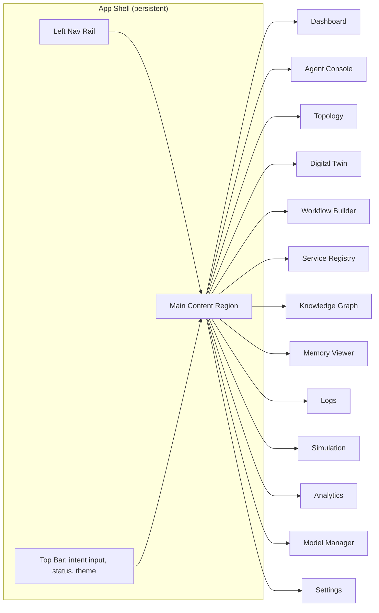
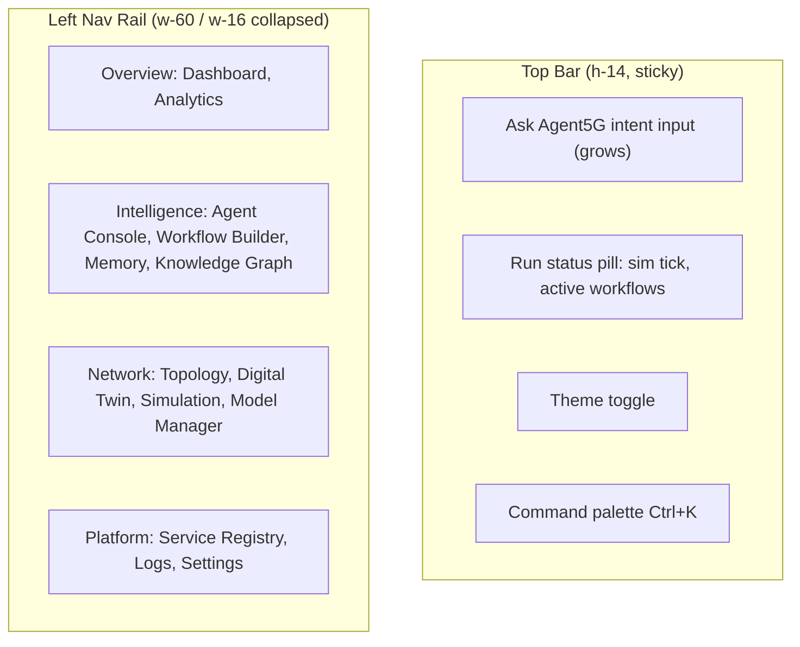
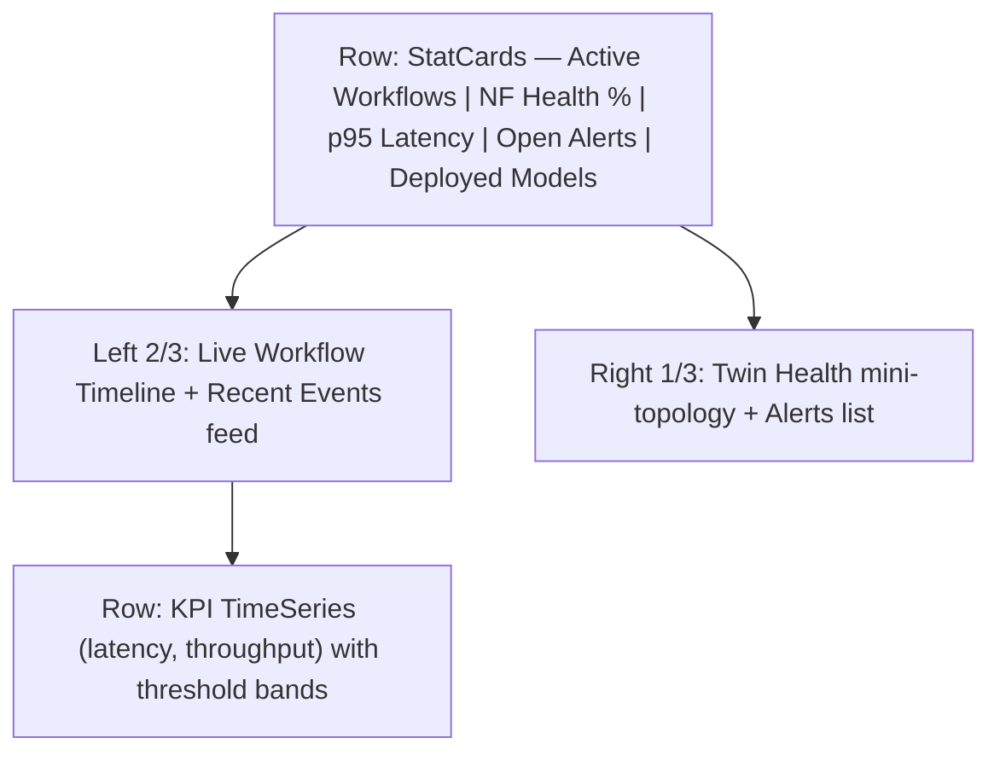
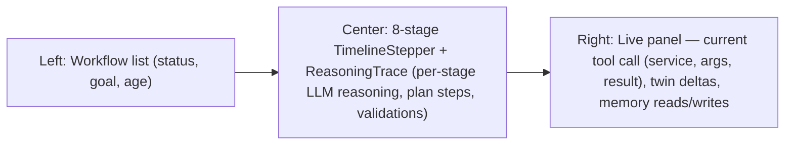
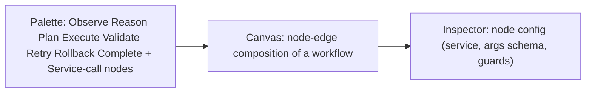

# 04 — UI / UX Design Specification

> **Document ID:** `04-ui.md`
> **Project:** Agent5G — Agentic AI Service Enablement Platform for 5G Advanced Release 20
> **Document Type:** User interface and experience specification (design authority for the frontend)
> **Status:** Authoritative for page inventory, navigation, layout, components, theming, motion, and interaction contracts. Implementation of these designs is specified in `11-frontend.md`; the data they consume is specified in `09-api.md`.
> **Depends on:** `01-system.md` (planes, pages list), `03-architecture.md` (frontend architecture, event envelope).
> **Audience:** Frontend engineers, UX designers, product-minded researchers, demo presenters.

---

## Table of Contents

1. [Purpose](#1-purpose)
2. [Overview](#2-overview)
3. [Design Principles](#3-design-principles)
4. [Design Language and Theme](#4-design-language-and-theme)
5. [Design Tokens](#5-design-tokens)
6. [Global Layout and Navigation](#6-global-layout-and-navigation)
7. [Shared Component Library](#7-shared-component-library)
8. [Real-Time Data and Motion Model](#8-real-time-data-and-motion-model)
9. [Page Specifications](#9-page-specifications)
   - [9.1 Dashboard](#91-dashboard)
   - [9.2 Agent Console](#92-agent-console)
   - [9.3 Topology](#93-topology)
   - [9.4 Digital Twin](#94-digital-twin)
   - [9.5 Workflow Builder](#95-workflow-builder)
   - [9.6 Service Registry](#96-service-registry)
   - [9.7 Knowledge Graph](#97-knowledge-graph)
   - [9.8 Memory Viewer](#98-memory-viewer)
   - [9.9 Logs](#99-logs)
   - [9.10 Simulation](#910-simulation)
   - [9.11 Analytics](#911-analytics)
   - [9.12 Model Manager](#912-model-manager)
   - [9.13 Settings](#913-settings)
10. [Responsive Layout Strategy](#10-responsive-layout-strategy)
11. [Accessibility](#11-accessibility)
12. [Interaction and State Contracts](#12-interaction-and-state-contracts)
13. [Folder References](#13-folder-references)
14. [Design Decisions](#14-design-decisions)
15. [Future Extensibility](#15-future-extensibility)
16. [Engineering / Implementation / Research Notes](#16-engineering--implementation--research-notes)
17. [Example Scenarios (UI Walkthroughs)](#17-example-scenarios-ui-walkthroughs)
18. [Kiro Build Guidance](#18-kiro-build-guidance)
19. [Acceptance Criteria](#19-acceptance-criteria)

---

## 1. Purpose

This document is the **single design authority** for the Agent5G web experience. It defines every page, the global navigation and layout, the shared component library, the dark-theme design system, the motion language, and the real-time behavior — with enough precision that a frontend engineer can build the UI, and a presenter can rely on consistent behavior during an IEEE demo.

The UI has three jobs, in priority order:

1. **Explain.** Make the autonomous behavior of the agents legible. Every plan, reasoning step, service call, and state change must be observable. Explainability is the product's differentiator (RQ4 in `02-research-background.md`).
2. **Observe.** Present the live Digital Twin — topology, KPIs, events, failures — as a truthful, real-time mirror of the substrate.
3. **Control.** Let a user issue an intent, launch/inspect/interrupt workflows, manage services and models, and tune the simulation.

This document does not contain React code; it contains design specifications, wireframe diagrams, and interaction contracts. Code-level structure is in `11-frontend.md`.

---

## 2. Overview

The application is a **single-page, dashboard-style console** with a persistent left navigation rail, a top command bar, and a main content region that swaps per route. Thirteen pages cover the full platform surface. A **global command palette** (Ctrl+K) and a **global "Ask Agent5G" intent bar** are available on every page, so a user can issue a natural-language goal from anywhere.



*Figure 2.1 — App shell and page inventory.*

Every page consumes the same **live event stream** (WebSocket) so the whole console updates coherently: launch a workflow on the Dashboard and watch the Topology, Twin, and Logs react simultaneously.

---

## 3. Design Principles

- **UP1 — Explainability first.** Nothing the agents do is hidden. Reasoning, plans, and validations are always one click away.
- **UP2 — Truthful real-time.** The UI reflects backend ground truth via events; it never fabricates or optimistically diverges from persisted state for substrate data.
- **UP3 — Calm, dense, professional.** High information density with visual calm — this is a research/engineering tool, not a consumer app. No gratuitous animation.
- **UP4 — Consistency over novelty.** One card style, one chart style, one table style, reused everywhere. Shadcn primitives are the vocabulary.
- **UP5 — Motion communicates state.** Animation is reserved for conveying change (a node failing, a workflow advancing), never decoration.
- **UP6 — Keyboard-first.** Command palette, intent bar, and navigation are fully keyboard-operable.
- **UP7 — Dark-theme native.** Designed dark-first for long observation sessions and demo projectors; a light theme is a secondary token set.
- **UP8 — Responsive but desktop-optimized.** Primary target is a wide desktop/projector; graceful degradation to tablet. Phones get read-only essentials.

---

## 4. Design Language and Theme

**Aesthetic:** a modern network-operations console — dark slate canvas, subtle elevation, restrained neon accents that map to network semantics (healthy = emerald, warning = amber, critical = red, info/AI = violet/indigo). Typography is clean and technical.

- **Surface hierarchy:** base canvas → panel → card → inset. Each step raises luminance slightly and adds a hairline border, giving depth without heavy shadows.
- **Semantic color mapping** (used consistently across topology, KPIs, logs, badges):
  - Healthy / success → emerald
  - Warning / degraded → amber
  - Critical / failed → red
  - AI / agent activity → violet
  - Info / neutral → slate/blue-gray
- **Iconography:** Lucide (ships with Shadcn) for a consistent line-icon set.
- **Density:** compact by default with a comfortable-mode toggle in Settings.

---

## 5. Design Tokens

Tokens are the contract between design and implementation (Tailwind theme + CSS variables). Values are indicative; final palette lives in `11-frontend.md` Tailwind config.

| Token group | Token | Dark value (indicative) | Usage |
|-------------|-------|------------------------|-------|
| Canvas | `--bg-base` | `#0B0F14` | app background |
| Surface | `--bg-panel` | `#111827` | nav, side panels |
| Surface | `--bg-card` | `#151B23` | cards |
| Border | `--border-hairline` | `#1F2937` | dividers, card borders |
| Text | `--text-primary` | `#E5E7EB` | body |
| Text | `--text-muted` | `#9CA3AF` | secondary |
| Accent | `--accent-ai` | `#8B5CF6` | agent/AI |
| Status | `--ok` / `--warn` / `--crit` | emerald / amber / red | semantic states |
| Radius | `--radius` | `0.75rem` | cards/buttons |
| Spacing | 4px base grid | 4/8/12/16/24 | layout rhythm |
| Font | `--font-sans` | Inter / Geist | UI text |
| Font | `--font-mono` | JetBrains Mono | logs, code, ids |
| Motion | `--dur-fast/base/slow` | 120 / 200 / 320 ms | transitions |
| Elevation | `--shadow-1/2` | subtle | popovers/dialogs |

Charts inherit a shared palette so KPI colors are identical everywhere. Light theme swaps the canvas/surface/text groups only; accents and status colors are shared.

---

## 6. Global Layout and Navigation

**App shell** = fixed left nav rail (icon + label, collapsible to icons), a top bar, and the routed main region.



*Figure 6.1 — App shell regions and grouped navigation.*

**Navigation grouping** (order and grouping are fixed for muscle memory):

1. **Overview** — Dashboard, Analytics
2. **Intelligence** — Agent Console, Workflow Builder, Memory Viewer, Knowledge Graph
3. **Network** — Topology, Digital Twin, Simulation, Model Manager
4. **Platform** — Service Registry, Logs, Settings

**Top bar** always shows: the intent input (submits a goal → starts a workflow → routes to Agent Console), a run-status pill (current sim tick, count of active workflows, connection indicator for the WebSocket), theme toggle, and the command-palette trigger. A **global toast/notification** system surfaces `*_BREACH`, `*_FAILED`, `WORKFLOW_STAGE_CHANGED` (complete/failed), and `POLICY_BLOCKED` events regardless of the current page.

---

## 7. Shared Component Library

All pages compose from this fixed catalog (Shadcn-based). Reuse is mandatory (UP4).

| Component | Purpose | Key props / behavior |
|-----------|---------|---------------------|
| `StatCard` | KPI headline (value, delta, sparkline) | value, unit, trend, status color |
| `Panel` | Titled surface with header actions | title, actions slot, loading/empty states |
| `DataTable` | Sortable, filterable, paginated table | columns, rows, row-click, virtualized |
| `StatusBadge` | Semantic state pill | status enum → color/label |
| `TimeSeriesChart` | Recharts line/area KPI chart | series[], threshold band, live-append |
| `EventFeed` | Scrolling live event list | filter, level, auto-scroll toggle |
| `FlowCanvas` | React Flow wrapper | nodes, edges, layout, node renderers |
| `ReasoningTrace` | Step-by-step agent reasoning viewer | stages[], expand/collapse, tokens |
| `JsonViewer` | Collapsible JSON (payloads, state) | data, depth, copy |
| `TimelineStepper` | 8-stage lifecycle progress | stage, status per stage |
| `CommandPalette` | Global Ctrl+K actions/nav | actions, fuzzy search |
| `IntentBar` | Natural-language goal input | submit → POST /workflows |
| `ConfirmDialog` | Guard for risky actions | title, danger flag |
| `EmptyState` / `Skeleton` / `ErrorState` | Loading/empty/error patterns | consistent messaging |
| `MermaidView` | Renders Mermaid diagrams (docs, KG) | source |

Each component has defined loading, empty, and error states so no page ships a blank or broken region.

---

## 8. Real-Time Data and Motion Model

**Data flow to the UI:** a single WebSocket hook (`lib/ws.ts`) receives the canonical event envelope `{type, correlation_id, ts, payload}` (from `03-architecture.md` §24) and dispatches into a client store. React Query handles REST reads and cache; the WS updates invalidate/patch the relevant caches so views stay live. This gives every page a coherent, low-latency picture without polling.

**Motion language (Framer Motion), reserved for state change:**

- **Node state transition** (topology/twin): color cross-fade + brief pulse on `NF_FAILED`/`NF_RECOVERED` (200–320 ms).
- **Workflow advance:** the `TimelineStepper` animates the active stage with a moving highlight; completed stages check in.
- **New event:** `EventFeed` rows slide-in from top (fast, 120 ms) with a subtle highlight that decays.
- **Value change:** `StatCard` numbers roll/tween on update; sparkline appends smoothly.
- **Route change:** content region cross-fades (base duration) — no slide gimmicks.

Motion respects `prefers-reduced-motion`: all non-essential animation is disabled, state changes fall back to instant color/label swaps.

---

## 9. Page Specifications

Each page below specifies: purpose, layout, primary components, data sources (endpoints/events), interactions, and empty/error handling. Endpoints are named per `09-api.md`.

### 9.1 Dashboard

**Purpose.** The at-a-glance operational overview and the primary intent entry point.

**Layout.** Top row of `StatCard`s; a two-thirds/one-third split below: left = live activity, right = health.



*Figure 9.1 — Dashboard layout.*

- **Components:** `StatCard`×5, `TimelineStepper` (active workflows), `EventFeed`, mini `FlowCanvas` (read-only topology health), `TimeSeriesChart`×2, `IntentBar` (prominent).
- **Data:** `GET /dashboard/summary`; live via events `KPI_UPDATED`, `WORKFLOW_STAGE_CHANGED`, `*_BREACH`, `NF_FAILED`.
- **Interactions:** submit intent → create workflow → navigate to Agent Console; click a workflow → Agent Console detail; click an alert → Logs filtered.
- **Empty/error:** `EmptyState` "No activity yet — try an intent"; degraded WS shows an amber connection pill.

### 9.2 Agent Console

**Purpose.** The heart of explainability: watch a workflow's agents observe, reason, plan, execute, validate, retry, rollback, complete — live.

**Layout.** Left = workflow list; center = the selected workflow's `TimelineStepper` + `ReasoningTrace`; right = live context (current step, tool calls, twin deltas).



*Figure 9.2 — Agent Console layout.*

- **Components:** `DataTable`/list, `TimelineStepper`, `ReasoningTrace`, `JsonViewer` (tool args/results, WorkflowState), `StatusBadge`, controls (Pause, Resume, Interrupt, Retry step).
- **Data:** `GET /workflows`, `GET /workflows/{id}`, `GET /workflows/{id}/trace`; live via `WORKFLOW_STAGE_CHANGED`, `SERVICE_CALLED`, `SERVICE_RESULT`, `POLICY_BLOCKED`.
- **Interactions:** select workflow; expand any stage to read reasoning; inspect each tool call's request/response; **Interrupt** (human-in-the-loop) posts a control action; step through checkpoints (time-travel via LangGraph checkpoints).
- **Empty/error:** if a workflow errored, show `ErrorState` with the failing stage and the Recovery agent's rollback trace.

### 9.3 Topology

**Purpose.** Visualize the network graph — NFs, UEs, gNBs, edges, and links — with live health and traffic.

**Layout.** Full-bleed `FlowCanvas`; floating left mini-panel for filters/legend; right slide-over inspector on node select.

- **Node types:** UE, gNB, AMF, SMF, UPF, NRF, UDM, PCF, NWDAF, NEF, DCF, AF, Edge — each with a distinct icon and the semantic status color.
- **Edges:** links annotated with live throughput/latency; animated flow direction on active links (subtle dashed motion).
- **Components:** `FlowCanvas` with custom node renderers, `StatusBadge`, legend, layout switch (force/hierarchical/geographic-by-region), search-to-focus.
- **Data:** `GET /topology`; live via `NF_REGISTERED/DEREGISTERED`, `NF_FAILED/RECOVERED`, `KPI_UPDATED` (link metrics).
- **Interactions:** click node → inspector (state, KPIs, hosted services/models, recent events, quick actions like "subscribe analytics"); hover edge → metrics tooltip; failed nodes pulse red; region grouping (Delhi, Mumbai, …) via bounding groups.
- **Empty/error:** if twin not started, `EmptyState` "Start the simulation to populate topology" with a shortcut to Simulation.

### 9.4 Digital Twin

**Purpose.** A deeper, per-NF operational view of the substrate — the twin's internal state, not just the graph.

**Layout.** Left NF selector tree (grouped by plane: RAN, control, user, analytics/data, exposure, edge); center detail with tabs (Overview, KPIs, Sessions/State, Events, Services); right live KPI charts.

- **Components:** tree/selector, `StatCard`s, `TimeSeriesChart`s, `DataTable` (sessions, subscriptions), `EventFeed` (scoped to NF), `JsonViewer` (raw entity state).
- **Data:** `GET /twin/nf/{id}`, `GET /twin/nf/{id}/kpis`; live scoped events.
- **Interactions:** select NF; toggle KPI series; inject a manual fault (guarded by `ConfirmDialog`, dev/demo affordance) that calls a twin control endpoint; view which services the NF produces.
- **Empty/error:** per-NF empty states; failed NF shows a prominent red banner and last-known state.

### 9.5 Workflow Builder

**Purpose.** Compose, inspect, and (for authored/demo flows) template the 8-stage workflows and view them as graphs.

**Layout.** `FlowCanvas` builder with a node palette (stages + service-call nodes) on the left; a properties inspector on the right; a run bar on top.



*Figure 9.5 — Workflow Builder layout.*

- **Components:** `FlowCanvas`, node palette, schema-driven property forms (from service Pydantic schemas), `TimelineStepper` preview, run/simulate controls.
- **Data:** `GET /services` (available service nodes), `GET /workflows/templates`, `POST /workflows` (run authored), `POST /workflows/templates`.
- **Interactions:** drag nodes, connect, configure via generated forms; validate graph (missing args highlighted); run → routes to Agent Console; save as template. Primarily used to visualize and template; live agentic runs are typically generated by the Planner, and the Builder can render those too (read/replay mode).
- **Empty/error:** invalid connections blocked with inline messaging; unknown service → error node styling.

### 9.6 Service Registry

**Purpose.** Browse the Service Enablement Layer — every registered service, its contract, owning NF, policy tags, and standards mapping.

**Layout.** `DataTable` master list with filters (NF, domain, action, policy); detail slide-over with the full contract.

- **Detail shows:** service name `{nf}.{domain}.{action}`, input/output JSON schema (`JsonViewer`), owning NF, policy tags, `spec_ref` + `approximates_operation` (the 3GPP mapping from `02`), call count, last-called, avg latency.
- **Components:** `DataTable`, `StatusBadge`, `JsonViewer`, "Try it" panel (invokes the service with a validated form — guarded).
- **Data:** `GET /services`, `GET /services/{name}`, `POST /services/{name}/invoke` (guarded try-it).
- **Interactions:** filter/search; open detail; try-it (shows request/response + resulting events); jump to owning NF in Topology/Twin.
- **Empty/error:** if registry empty, `EmptyState` with seed hint.

### 9.7 Knowledge Graph

**Purpose.** Visualize the agents' semantic memory — entities (NFs, models, incidents, intents) and their relations — accumulated across workflows.

**Layout.** Full-canvas D3 force graph (or React Flow), with a filter sidebar (entity type, time window) and a detail panel.

- **Components:** D3/`FlowCanvas` graph, `MermaidView` (alternate static view), entity detail panel, `DataTable` (relations).
- **Data:** `GET /knowledge/graph`, `GET /knowledge/node/{id}`; live via `WORKFLOW_STAGE_CHANGED` (new knowledge writes).
- **Interactions:** zoom/pan, click node → related edges + provenance (which workflow wrote it), filter by type/time, highlight paths (e.g., incident → cause → mitigation).
- **Empty/error:** cold-start empty graph with explanation of how knowledge accrues.

### 9.8 Memory Viewer

**Purpose.** Inspect agent memory — short-term (working), long-term episodic, and semantic — and how memory influenced decisions.

**Layout.** Tabs: Working (current/selected workflow state), Episodic (past workflow summaries), Semantic (facts/preferences). Each is a searchable list + detail.

- **Components:** tabbed `DataTable`s, `JsonViewer` (WorkflowState), `ReasoningTrace` links back to Agent Console, provenance chips.
- **Data:** `GET /memory?scope=working|episodic|semantic`, `GET /memory/{id}`.
- **Interactions:** search memories; see which workflow created/used a memory; pin/curate (Memory agent affordance); jump to originating trace.
- **Empty/error:** per-tab empty states; note that warm vs. cold memory affects behavior (ties to Experiment D).

### 9.9 Logs

**Purpose.** The complete, filterable audit trail — every event, service call, LLM interaction, and state mutation, correlated by workflow.

**Layout.** Full-width virtualized `DataTable`/`EventFeed` with a powerful filter bar (level, type, NF, correlation_id, time range) and a detail drawer.

- **Components:** `EventFeed`/virtualized `DataTable`, filter bar, `JsonViewer` detail, correlation-id follow (one click filters to a whole workflow), export (CSV/JSON).
- **Data:** `GET /logs` (paged, filterable), `GET /events` ; live append via all events.
- **Interactions:** filter/search; "follow correlation_id" to reconstruct a workflow narrative; export for a paper's appendix; live tail toggle.
- **Empty/error:** empty until activity; error rows styled with red level badge.

### 9.10 Simulation

**Purpose.** Control the Digital Twin's clock and scenario — start/stop/step the tick loop, set the seed, inject faults, load scenario presets.

**Layout.** Control panel (top) + scenario library (left) + live sim status/telemetry (center/right).

- **Components:** transport controls (Start/Pause/Step/Reset), seed input, tick-rate slider, `DataTable` of scenario presets, `TimeSeriesChart` (aggregate KPIs), fault-injection panel (choose NF + failure type).
- **Data:** `GET /simulation/status`, `POST /simulation/{start|pause|step|reset}`, `POST /simulation/seed`, `POST /simulation/fault`, `GET /simulation/scenarios`.
- **Interactions:** set seed for reproducibility; adjust tick rate; load a scenario (e.g., "Mumbai congestion"); inject a fault to trigger autonomous workflows (Scenario B/C). All destructive actions (Reset) via `ConfirmDialog`.
- **Empty/error:** clear "Stopped/Running/Paused" status; reset confirms data implications.

### 9.11 Analytics

**Purpose.** Research-grade analytics over historical KPIs, workflow outcomes, and agent performance — the source of paper figures.

**Layout.** Filter/query header + a grid of chart panels + an exports section.

- **Components:** `TimeSeriesChart`, bar/area charts (Recharts), `StatCard` summaries, `DataTable` (per-workflow metrics), export buttons (PNG/CSV).
- **Data:** `GET /analytics/kpis`, `GET /analytics/workflows`, `GET /analytics/agents` (success rate, steps-to-completion, recovery rate, policy compliance — the metrics from `02` §16).
- **Interactions:** choose time range/scenario/configuration (single vs multi-agent, memory on/off); compare runs; export figures directly for publication.
- **Empty/error:** guidance to run scenarios first; charts show `Skeleton` while loading.

### 9.12 Model Manager

**Purpose.** Manage the AIMLE-style model lifecycle — registered/trained/validated/deployed/monitored/retired models and their targets.

**Layout.** `DataTable` of models (name, version, state, target NF/Edge, metrics) + detail drawer with lifecycle `TimelineStepper` and deploy controls.

- **Components:** `DataTable`, lifecycle `TimelineStepper`, `StatusBadge`, deploy/retire actions (guarded), metrics charts.
- **Data:** `GET /models`, `GET /models/{id}`, `POST /models`, `POST /models/{id}/deploy`, `POST /models/{id}/retire`.
- **Interactions:** register a model (metadata), deploy to an NWDAF/Edge (invokes `aimle.model.deploy` via SEL), watch lifecycle advance, retire; deploy target picker resolves via topology.
- **Empty/error:** empty registry hint; deploy validates target exists and is healthy.

### 9.13 Settings

**Purpose.** Configure platform behavior — LLM mode, seed defaults, theme/density, thresholds, policies, and connection info.

**Layout.** Left settings nav (General, Appearance, Simulation, LLM, Policies, Thresholds, About) + right form panels.

- **Components:** schema-driven forms, toggles, `ConfirmDialog` for policy edits, `JsonViewer` (effective config), theme/density controls.
- **Data:** `GET /settings`, `PUT /settings`, `GET /policies`, `PUT /policies/{id}`.
- **Interactions:** switch LLM between live/record/replay (ties to deterministic demos); set default seed; edit KPI thresholds that drive `*_BREACH`; manage policies (guardrails). Sensitive values (API key) shown as masked, referenced by name, never echoed.
- **Empty/error:** validation inline; a "restart required" banner where applicable.

---

## 10. Responsive Layout Strategy

Breakpoints (Tailwind): `sm 640` / `md 768` / `lg 1024` / `xl 1280` / `2xl 1536`. Primary target is `xl`+ (desktop/projector).

| Range | Nav | Multi-column pages | Canvas pages (Topology/KG/Builder) |
|-------|-----|--------------------|-----------------------------------|
| `2xl`/`xl` | expanded rail | full multi-column | full canvas + side panels |
| `lg` | collapsible rail | columns stack to 2 | canvas + collapsible panels |
| `md` (tablet) | icon rail | columns stack to 1, panels become tabs | canvas full, inspectors as sheets |
| `sm` (phone) | drawer nav | single column, read-mostly | simplified/read-only canvas |

Phones receive Dashboard, Logs, and read-only Topology/Twin; authoring pages (Workflow Builder) show a "best on desktop" notice. No horizontal scrolling of primary content at any breakpoint.

---

## 11. Accessibility

Target: WCAG 2.1 AA as a design goal.

- **Color:** never encode state by color alone — always pair with icon/label (StatusBadge does both). Verify contrast ≥ 4.5:1 for text against surfaces.
- **Keyboard:** full operability; visible focus rings; command palette and intent bar reachable via shortcuts; canvas nodes focusable/selectable via keyboard.
- **Screen readers:** semantic landmarks (nav/main/complementary), ARIA labels on icon buttons, live regions for toasts and the event feed (polite), chart data available as an accessible table alternative.
- **Motion:** honor `prefers-reduced-motion` (§8).
- **Text:** support browser zoom to 200% without loss of function.

> Full WCAG conformance requires manual testing with assistive technologies and expert review; this document sets design intent, not a certification.

---

## 12. Interaction and State Contracts

- **Intent submission:** `IntentBar`/top bar → `POST /workflows {goal}` → optimistic "creating…" state → on 201, route to Agent Console with the new `correlation_id`. Substrate state is never faked (UP2); only this transient UI affordance is optimistic.
- **Live coherence:** all pages subscribe to the same WS store; a single event updates every relevant view. No page polls.
- **Guarded actions:** Reset simulation, retire model, edit policy, inject fault, de-register NF → `ConfirmDialog` with a danger flag and a plain-language description of consequences.
- **Error surfaces:** REST errors render as `ErrorState`/toast with the problem+json detail; WS disconnect flips the status pill amber and auto-reconnects with backoff.
- **Loading:** every data region uses `Skeleton`; never a blank flash.
- **Empty:** every list/graph has a purposeful `EmptyState` guiding the next action.

---

## 13. Folder References

```text
frontend/
├── app/                     # route per page (see 11-frontend.md)
├── features/
│   ├── dashboard/ agents/ topology/ twin/ workflows/ services/
│   ├── knowledge/ memory/ logs/ simulation/ analytics/ models/ settings/
├── components/              # StatCard, Panel, DataTable, StatusBadge, TimeSeriesChart,
│                            # EventFeed, FlowCanvas, ReasoningTrace, TimelineStepper, ...
├── lib/ (api-client, ws, types, theme)
└── styles/ (tokens, tailwind theme)
```

This document owns the *design* of these; `11-frontend.md` owns their *implementation*.

---

## 14. Design Decisions

- **UD-1 — Console shell over marketing layout.** Persistent rail + top bar suits an ops tool and demos. Trade-off: less "landing page" polish; irrelevant for the audience.
- **UD-2 — Dark-first.** Long observation sessions and projector demos favor dark. Trade-off: light theme is secondary and less tuned.
- **UD-3 — Shadcn + Tailwind + tokens.** Accessible, composable, fast to build, consistent. Trade-off: bespoke visuals require custom work atop primitives.
- **UD-4 — React Flow for all node-edge surfaces.** One canvas engine for Topology, Workflow Builder, and optionally KG. Trade-off: KG force layout may prefer D3; both are allowed with a shared node style.
- **UD-5 — Event-driven UI, no polling.** One WS stream keeps the whole console coherent and cheap. Trade-off: requires robust reconnect handling.
- **UD-6 — Explainability as dedicated pages** (Agent Console, Memory, Knowledge Graph, Logs). Trade-off: more surface to build; it is the core value (UP1).
- **UD-7 — Generated types.** UI types come from backend schema (P5). Trade-off: build step; eliminates contract drift.

---

## 15. Future Extensibility

- **Multi-user + RBAC:** the shell has room for an account menu; role-gated actions and views can be added when auth arrives (required before non-local exposure).
- **Theming:** token architecture supports additional themes (high-contrast, colorblind-safe palettes).
- **Pluggable panels:** the Dashboard grid and Analytics grid are panel-based, enabling user-customizable layouts later.
- **MCP tool surfacing:** when the SEL is exposed via MCP, the Service Registry page can show external tool consumers.
- **Real-network views:** when Open5GS/OAI are integrated, Topology/Twin gain a "live vs. simulated" toggle without redesign.
- **Localization:** all copy externalized to enable future i18n.

---

## 16. Engineering / Implementation / Research Notes

**Engineering.**
- Build the shared component library first; pages are compositions of it (UP4).
- Centralize the WS store and React Query config so live coherence is a platform behavior, not per-page code.
- Custom React Flow node renderers should read status/color from the same semantic tokens used by badges/charts.

**Implementation.**
- Order: tokens/theme → shell + nav → shared components → Dashboard → Agent Console → Topology/Twin → remaining pages. Wire to the mocked backend first (see `16-testing.md` fixtures).
- Every page must implement loading/empty/error states before "happy path" is considered done.
- Charts share one palette module; never hardcode chart colors per page.

**Research.**
- The Agent Console, Memory Viewer, Knowledge Graph, and Logs are the empirical instruments for RQ4 (explainability). Their trace fidelity is a research deliverable, not cosmetic.
- The Analytics page must be able to export publication-ready figures (PNG) and the underlying CSV so paper figures are reproducible from the DB (ties to `02` §16 and `12-database.md`).

---

## 17. Example Scenarios (UI Walkthroughs)

**Scenario A — Deploy congestion model to Delhi Edge (UI path).**
1. User types the intent in the top bar → `POST /workflows`.
2. Auto-routed to Agent Console; `TimelineStepper` shows Observe→Reason.
3. Plan appears in `ReasoningTrace` with ordered steps; right panel shows the first `SERVICE_CALLED` (`aimle.model.deploy`).
4. Toast + Topology: Delhi Edge node pulses violet then settles emerald with a model badge (`MODEL_DEPLOYED`).
5. Validate stage checks the twin; Complete shows a Documentation summary. Model Manager now lists the model as Deployed.

**Scenario B — Autonomous congestion mitigation (UI path).**
1. On Simulation, load "Mumbai congestion" and inject load.
2. A `KPI_THRESHOLD_BREACH` toast fires; Dashboard alert count increments.
3. Agent Console shows a *new workflow that no human started* (Observer-triggered) — a powerful demo moment.
4. Optimizer's reasoning and mitigation service calls stream in; latency chart recovers below the threshold band; workflow Completes.

**Scenario C — NRF failure and recovery (UI path).**
1. Inject NRF fault on Simulation/Twin.
2. Topology shows NRF pulsing red; discovery-dependent service calls show failures in Logs.
3. Recovery agent workflow appears; Rollback/compensation steps stream; policy note "never zero NRF" shows in the trace; NRF returns emerald.

Each walkthrough doubles as a scripted demo in `18-demo.md`.

---

## 18. Kiro Build Guidance

### 18.1 Implementation Order
1. Tailwind theme + design tokens + light/dark.
2. App shell (rail, top bar, intent bar, command palette, toast system).
3. Shared component library with loading/empty/error states.
4. WS store + React Query provider (live coherence).
5. Dashboard → Agent Console → Topology → Digital Twin → remaining pages.

### 18.2 Coding Rules
- No page defines its own colors/spacing outside tokens.
- No page polls; all live data via the WS store.
- Every data region ships `Skeleton`, `EmptyState`, `ErrorState`.
- Icon-only buttons require `aria-label`; state never color-only.
- Types imported from `lib/types.ts` (generated); no hand-authored API shapes.

### 18.3 Naming Convention
- Route folders match page names (`app/agent-console/`, `app/topology/`, …).
- Components `PascalCase`; files `kebab-case.tsx`; hooks `useX` in `features/<x>/hooks`.
- Event handling keyed by the canonical `type` enum from the event envelope.

### 18.4 Folder Ownership
- `04-ui.md` owns design; `11-frontend.md` owns code structure; `09-api.md` owns the data contracts these pages consume.

### 18.5 Prompt Suggestions
- "Build the app shell with a grouped left rail, top intent bar, command palette, and global toasts, using the tokens in `04-ui.md`."
- "Implement the Agent Console with a TimelineStepper and ReasoningTrace that render live `WORKFLOW_STAGE_CHANGED`/`SERVICE_CALLED` events."
- "Implement Topology with React Flow custom NF nodes colored by semantic status, reacting to `NF_FAILED/RECOVERED`."
- "Wire a single WebSocket store that all pages subscribe to; no page may poll."

### 18.6 Acceptance Criteria
- All 13 pages route from the grouped nav and render with mocked data.
- Submitting an intent creates a workflow and drives the Agent Console live.
- A single injected fault updates Topology, Dashboard, and Logs simultaneously via one WS stream.

---

## 19. Acceptance Criteria

This document is **complete and correct** when:

- [ ] **AC-1.** All 13 pages are specified with purpose, layout, components, data sources, interactions, and empty/error handling.
- [ ] **AC-2.** Global shell, grouped navigation, top bar, intent bar, and command palette are defined.
- [ ] **AC-3.** A shared component library catalog is defined and reuse is mandated.
- [ ] **AC-4.** The dark-first theme, semantic color mapping, and a design-token table are provided.
- [ ] **AC-5.** The real-time data model (single WS store, no polling) and the motion language are specified.
- [ ] **AC-6.** Responsive strategy with breakpoints and per-page degradation is defined.
- [ ] **AC-7.** Accessibility intent (WCAG 2.1 AA goal, color-not-alone, keyboard, SR, reduced motion) is specified, with the manual-testing caveat.
- [ ] **AC-8.** Interaction/state contracts (intent submission, guarded actions, error/loading/empty) are defined.
- [ ] **AC-9.** At least three UI walkthrough scenarios are provided and linked to demos.
- [ ] **AC-10.** Design decisions with trade-offs and future extensibility are recorded.
- [ ] **AC-11.** Mermaid diagrams illustrate the shell and representative page layouts.
- [ ] **AC-12.** All mandated sections plus Kiro build guidance are present.

---

**NEXT FILE**
