# 05 — Agents (Agentic AI Layer)

> **Document ID:** `05-agents.md`
> **Project:** Agent5G — Agentic AI Service Enablement Platform for 5G Advanced Release 20
> **Document Type:** Multi-agent system specification (the intelligence plane)
> **Status:** Authoritative for agent roles, responsibilities, prompts, tools, memory, decision flows, and state machines. The orchestration graph that runs these agents is specified in `13-workflow-engine.md`; the prompt engineering detail is expanded in `14-prompts.md`.
> **Depends on:** `01-system.md` (invariant: agents act only through services), `03-architecture.md` (agent runtime, ports, WorkflowState), `08-services.md` (the tools agents may call).
> **Audience:** AI engineers, backend engineers, researchers designing experiments on agent behavior.

---

## Table of Contents

1. [Purpose](#1-purpose)
2. [Overview](#2-overview)
3. [Design Principles for the Agent Layer](#3-design-principles-for-the-agent-layer)
4. [Agent Roster and Responsibility Map](#4-agent-roster-and-responsibility-map)
5. [Common Agent Anatomy](#5-common-agent-anatomy)
6. [Memory Architecture](#6-memory-architecture)
7. [Tooling Model (SEL as Tools)](#7-tooling-model-sel-as-tools)
8. [Inter-Agent Collaboration](#8-inter-agent-collaboration)
9. [Agent Specifications](#9-agent-specifications)
   - [9.1 Planner Agent](#91-planner-agent)
   - [9.2 Executor Agent](#92-executor-agent)
   - [9.3 Observer Agent](#93-observer-agent)
   - [9.4 Optimizer Agent](#94-optimizer-agent)
   - [9.5 Recovery Agent](#95-recovery-agent)
   - [9.6 Documentation Agent](#96-documentation-agent)
   - [9.7 Memory Agent](#97-memory-agent)
10. [Policy and Guardrails](#10-policy-and-guardrails)
11. [Determinism, Record/Replay, and Evaluation](#11-determinism-recordreplay-and-evaluation)
12. [Interfaces and Contracts](#12-interfaces-and-contracts)
13. [Folder References](#13-folder-references)
14. [Design Decisions](#14-design-decisions)
15. [Future Extensibility](#15-future-extensibility)
16. [Engineering / Implementation / Research Notes](#16-engineering--implementation--research-notes)
17. [Example Scenarios (Multi-Agent Walkthroughs)](#17-example-scenarios-multi-agent-walkthroughs)
18. [Kiro Build Guidance](#18-kiro-build-guidance)
19. [Acceptance Criteria](#19-acceptance-criteria)

---

## 1. Purpose

This document specifies the **seven-agent system** that constitutes the Intelligence Plane of Agent5G. It defines what each agent is for, what it is responsible for, the prompt that shapes its behavior, the tools it may call, the memory it reads and writes, and — critically — its **decision flow** and **state machine**. Together the agents implement the closed-loop, autonomous operation that is the project's central research contribution: translating natural-language network intents into correct, validated, policy-compliant service invocations, and adapting when reality diverges.

The design applies **separation of concerns to cognition**: rather than one monolithic "do-everything" agent, seven specialized agents each own a narrow slice of the reasoning lifecycle, with explicit hand-offs. This mirrors microservice decomposition and, per hypothesis H1/RQ1 in `02-research-background.md`, is expected to improve reliability and — via focused, inspectable reasoning — explainability (RQ4).

This document is prompt-and-behavior focused. The *graph* that sequences agents (the 8-stage lifecycle) lives in `13-workflow-engine.md`; the *full prompt text and templates* live in `14-prompts.md`. This document gives each agent's authoritative behavioral contract.

---

## 2. Overview

The seven agents map onto the 8-stage lifecycle (Observe → Reason → Plan → Execute → Validate → Retry → Rollback → Complete) as follows. Some agents own a stage; some span several.

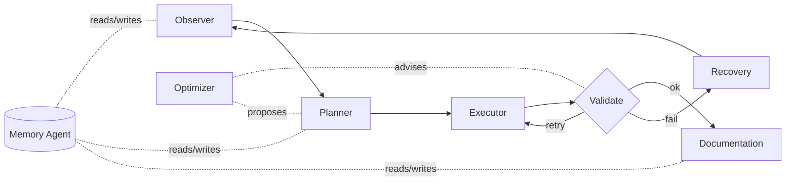

*Figure 2.1 — Agents around the lifecycle. Observer opens the loop, Planner reasons/plans, Executor acts, Validate branches to Documentation (success), Executor (retry), or Recovery (failure); Optimizer advises; Memory is the shared cognitive substrate.*

- **Observer** perceives (Observe, and participates in Validate).
- **Planner** interprets and decomposes (Reason, Plan).
- **Executor** acts through the SEL (Execute, Retry).
- **Optimizer** reasons about efficiency/objectives (advises Plan/Validate; owns optimization workflows).
- **Recovery** compensates and restores (Rollback).
- **Documentation** narrates and records (Complete).
- **Memory** curates short/long-term memory and the knowledge graph (cross-cutting).

All action on the network flows through the Service Enablement Layer tools (invariant P2). No agent touches the Digital Twin directly.

---

## 3. Design Principles for the Agent Layer

- **AP1 — One agent, one concern.** Each agent has a single cognitive responsibility and a minimal tool set scoped to that concern.
- **AP2 — Structured I/O.** Every agent returns a typed, validated (Pydantic) structured object — never free-form prose that downstream code must parse heuristically. This is what makes the multi-agent hand-offs reliable.
- **AP3 — Tools over knowledge.** Agents obtain network facts by calling read services/observing state, not by recalling training data. The network's truth lives in the twin, surfaced via tools.
- **AP4 — Guardrails are external.** Safety is enforced by the SEL policy check (deterministic code), not by trusting the LLM to "remember" constraints. Agents propose; policy disposes.
- **AP5 — Explainable by construction.** Every agent emits a rationale field with its structured output; every step is persisted and surfaced in the Agent Console.
- **AP6 — Bounded autonomy.** Agents operate within a max-attempts budget and within policy; unresolved situations escalate to Recovery and, if needed, to a human via the UI (human-in-the-loop interrupt).
- **AP7 — Deterministic-testable.** Every agent runs behind the `LLMClient` port supporting record/replay, so behavior is reproducible for tests and experiments (`16-testing.md`).

---

## 4. Agent Roster and Responsibility Map

| Agent | Lifecycle stage(s) | Primary output (structured) | Key tools | Writes memory? |
|-------|--------------------|-----------------------------|-----------|----------------|
| **Planner** | Reason, Plan | `Interpretation`, `Plan(steps[])` | read services, service catalog, memory read | via Memory agent |
| **Executor** | Execute, Retry | `StepResult[]` | all invocable SEL tools | no (emits results) |
| **Observer** | Observe, Validate | `Observation`, `Validation` | twin read services, KPI/event reads | no |
| **Optimizer** | advises Plan/Validate; owns optimization flows | `OptimizationProposal` | analytics reads, what-if reads | no |
| **Recovery** | Rollback | `RecoveryPlan`, `CompensationResult[]` | compensating SEL tools | via Memory (incident) |
| **Documentation** | Complete | `WorkflowSummary` | read-only (trace, state) | via Memory (episodic) |
| **Memory** | cross-cutting | `MemoryWrite`, `KnowledgeDelta` | memory store, knowledge graph | yes (owner) |

*Table 4.1 — Responsibility map. "Writes memory" indicates who initiates durable memory writes; the Memory agent is the sole executor of writes (AP1) to keep memory curation consistent.*

---

## 5. Common Agent Anatomy

Every agent is a thin, testable object composed of the same parts (per `03-architecture.md` §13):

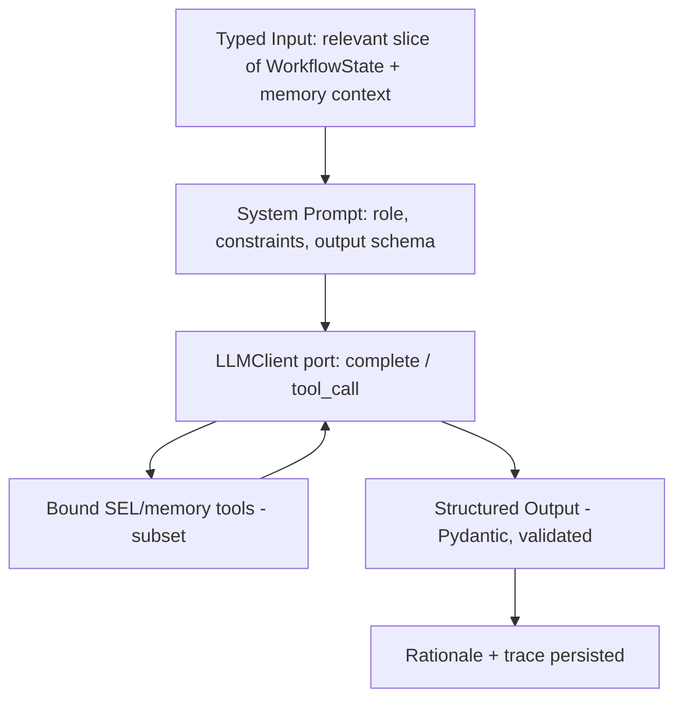

*Figure 5.1 — Common agent anatomy.*

**Components:**

1. **Role/System prompt** — identity, responsibilities, constraints, and the required output schema (full text in `14-prompts.md`).
2. **Bound tools** — a scoped subset of SEL tools + memory tools, exposed as JSON-schema functions by the Tool Adapter.
3. **Typed input** — only the slice of `WorkflowState` and memory the agent needs (not the whole state), keeping prompts focused and cheap.
4. **Structured output** — a Pydantic model the agent must return; validated before the graph proceeds (AP2). Includes a mandatory `rationale` (AP5).
5. **Guards** — max token/step budget; policy is enforced downstream in the SEL, not in the agent.

All agents share a `BaseAgent` abstraction: `async def run(input: TIn, ctx: AgentContext) -> TOut`. `AgentContext` carries the `LLMClient`, bound tools, memory accessor, correlation id, and RNG (for any sampling that must be seeded).

---

## 6. Memory Architecture

Memory is what lets agents improve across steps and workflows and is a research variable (H5/Experiment D). Three tiers plus a knowledge graph.

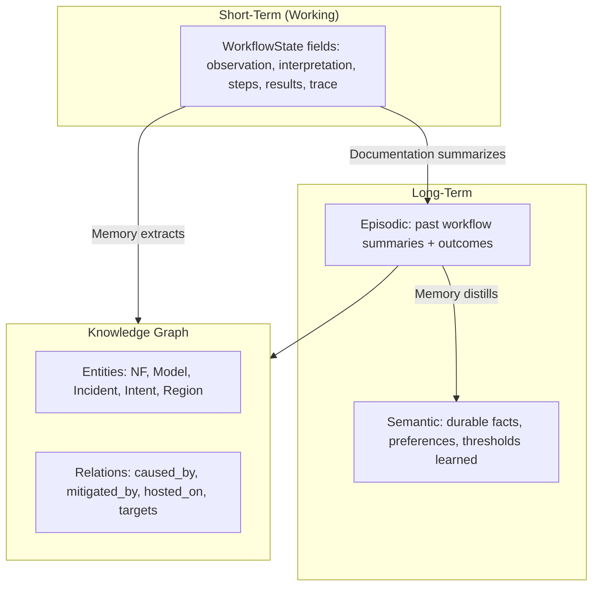

*Figure 6.1 — Memory tiers and the knowledge graph.*

- **Short-term (working):** lives in `WorkflowState`, checkpointed by LangGraph; ephemeral to a workflow but fully inspectable (Memory Viewer → Working tab).
- **Episodic (long-term):** one summarized record per completed/failed workflow (goal, plan, outcome, key events, lessons). Written by the Documentation agent via the Memory agent. Table: `memory` (scope=episodic).
- **Semantic (long-term):** distilled, reusable facts — e.g., "Delhi Edge historically congests at peak," "policy forbids zero-NRF." Written/curated by the Memory agent. Table: `memory` (scope=semantic).
- **Knowledge graph:** entities and typed relations accumulated across workflows (table: `knowledge_edges` + node records). Powers the Knowledge Graph page and enables path queries (incident → cause → mitigation).

**Retrieval:** at Observe/Reason, the Memory agent supplies relevant episodic/semantic memories and KG neighborhoods (retrieval by intent similarity + entity match) into the Planner's input. Cold vs. warm memory is toggleable for experiments (Settings).

---

## 7. Tooling Model (SEL as Tools)

Agents call **services** — never the twin. The Tool Adapter (`application/sel/tools.py`) exposes each registered `ServiceDescriptor` as an LLM tool with a JSON schema derived from its Pydantic input model. Tools are grouped:

- **Read tools** (safe, side-effect-free): `twin.snapshot`, `nwdaf.analytics.*.query`, `dcf.data.query`, `nrf.discover`, `topology.get`. Available to Observer, Planner, Optimizer, Documentation.
- **Action tools** (state-mutating, policy-checked): `aimle.model.deploy/retire`, `nwdaf.analytics.*.subscribe`, `nef.qos.request`, `smf.session.modify`, `upf.loadbalance.apply`, etc. Available to Executor (and Recovery for compensations).
- **Memory tools:** `memory.read`, `memory.write`, `knowledge.upsert`, `knowledge.query`. Reads are broadly available; writes are restricted to the Memory agent (AP1).

Each tool invocation goes through the SEL invoker: **validate → policy check → dispatch → emit `SERVICE_CALLED`/`SERVICE_RESULT` → persist** (`03-architecture.md` §12). Thus every agent action is auditable and guarded regardless of what the LLM "wanted" to do.

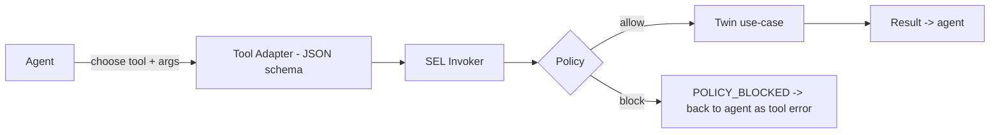

*Figure 7.1 — Agent → tool → SEL → twin, with policy as the gate.*

When policy blocks a call, the agent receives a structured tool error (not a crash); the Planner/Executor must adapt or escalate — exactly the behavior measured in H2 (policy compliance).

---

## 8. Inter-Agent Collaboration

Agents collaborate through the **shared `WorkflowState`** and explicit hand-offs on the LangGraph graph, not by calling each other directly (loose coupling). The orchestrator (`application/agents/orchestrator.py`) binds each graph node to an agent and passes the relevant state slice.

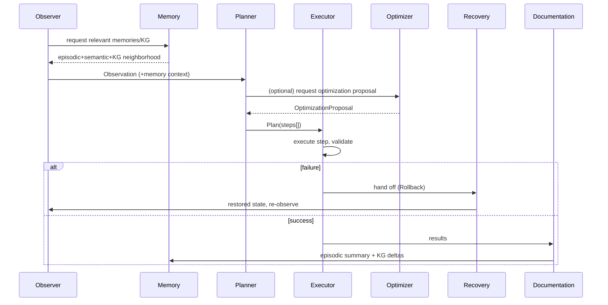

*Figure 8.1 — Collaboration via shared state and hand-offs; no direct agent-to-agent RPC.*

**Hand-off contracts** are typed: Observer→Planner passes `Observation`; Planner→Executor passes `Plan`; Executor→Recovery passes the failure context and compensation log; Documentation→Memory passes the summary and KG deltas. These contracts are the seams that make the system testable agent-by-agent.

---

## 9. Agent Specifications

Each agent below is specified with the eight mandated elements: **Goal, Responsibilities, Prompt (summary), Tools, Memory, Decision Flow, State Machine, Examples.** Full prompt text is in `14-prompts.md`.

---

### 9.1 Planner Agent

**Goal.** Translate a natural-language intent (or an Observer-triggered condition) into a validated, ordered `Plan` of service-call steps that, if executed, satisfy the goal under policy.

**Responsibilities.**
- Interpret the goal into a structured `Interpretation` (objective, targets, constraints, success criteria).
- Retrieve relevant memory/KG (via Memory agent) to inform planning.
- Decompose into ordered steps, each naming a concrete service and its arguments, with per-step success criteria and dependencies.
- Optionally consult the Optimizer for efficiency/objective trade-offs.
- Produce success criteria the Observer will later validate against.

**Prompt (summary).** *"You are the Planner. Given a goal and current network observation, produce a minimal, correct, ordered plan of service calls. Use only services in the provided catalog. For each step specify service, arguments, dependency, and how success is verified. Never invent services. Respect stated constraints and policies. Output must match the `Plan` schema and include a rationale."* (Full text: `14-prompts.md`.)

**Tools.** Read tools (`twin.snapshot`, `nrf.discover`, `nwdaf.analytics.*.query`, `topology.get`), `memory.read`, `knowledge.query`, and the **service catalog** (list/describe registered services). No action tools (Planner plans, Executor acts).

**Memory.** Reads episodic (similar past intents) and semantic (learned facts, thresholds) and KG neighborhoods; requests writes only indirectly (Documentation/Memory persist lessons post-hoc).

**Decision Flow.**
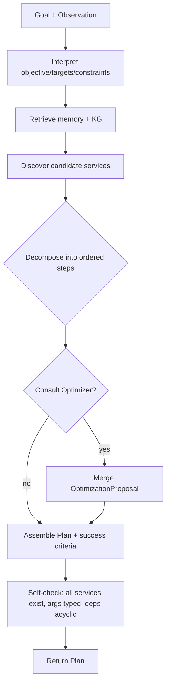

**State Machine.**
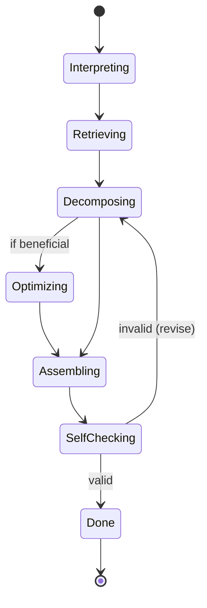

**Examples.**
- *Intent:* "Deploy congestion detection model to Delhi Edge." → *Plan:* [`nrf.discover(edge, region=Delhi)`, `aimle.model.deploy(model=congestion-det, target=DelhiEdge)`, `nwdaf.analytics.congestion.subscribe(region=Delhi)`], success = model active + subscription active.
- *Condition:* latency breach in Mumbai → *Plan:* [`nwdaf.analytics.congestion.query(region=Mumbai)`, `upf.loadbalance.apply(...)` or `nef.qos.request(...)`], success = p95 latency < threshold.

---

### 9.2 Executor Agent

**Goal.** Execute the Planner's steps in order through the SEL, producing a `StepResult` for each, and drive per-step Retry when a step fails recoverably.

**Responsibilities.**
- For each step: resolve arguments (possibly from prior step results), invoke the service tool, capture the typed result.
- Detect step failure vs. success against the step's success criterion.
- On recoverable failure, adjust and retry within the attempts budget; on unrecoverable failure, hand off to Recovery.
- Maintain a **compensation log** (what was done, so Recovery can undo it).

**Prompt (summary).** *"You are the Executor. Execute the current step by calling exactly the specified service with validated arguments. Report the result and whether the step's success criterion is met. If a recoverable error occurs, propose a minimal argument/step adjustment for retry. Do not invent steps or skip validation. Output must match `StepResult`."*

**Tools.** All **action tools** (policy-checked) plus read tools needed to resolve/verify arguments. Emits `SERVICE_CALLED`/`SERVICE_RESULT` via the invoker.

**Memory.** Does not write durable memory; contributes results to `WorkflowState` (working memory) and the compensation log used by Recovery.

**Decision Flow.**
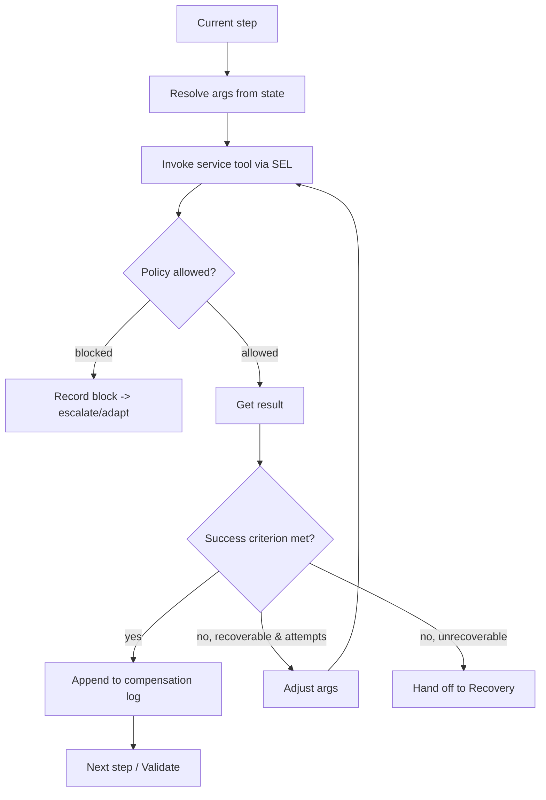

**State Machine.**
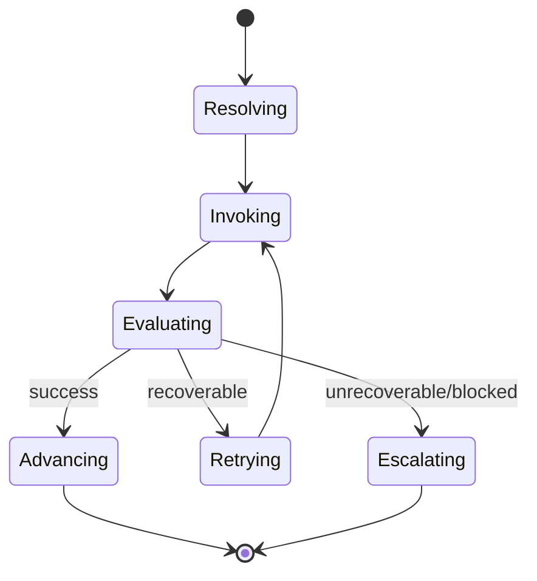

**Examples.**
- Step `aimle.model.deploy(target=DelhiEdge)` returns `active` → success; append compensation `aimle.model.retire(DelhiEdge)`.
- Step `nef.qos.request` blocked by policy → Executor records `POLICY_BLOCKED`, escalates; Planner/Recovery must choose an alternative.

---

### 9.3 Observer Agent

**Goal.** Perceive the network truthfully — produce a structured `Observation` at Observe, and a `Validation` verdict at Validate — and autonomously trigger workflows on significant events.

**Responsibilities.**
- Snapshot relevant twin state and recent events into a concise `Observation`.
- Subscribe (via the event bus) to `KPI_THRESHOLD_BREACH`, `NF_FAILED`, etc., and, when policy permits, **initiate a workflow with no human prompt** (autonomous closed loop).
- At Validate, compare actual twin state against the Plan's success criteria and return pass / retry / fail with evidence.

**Prompt (summary).** *"You are the Observer. Summarize the current, relevant network state and notable recent events into the `Observation` schema — facts only, no speculation. At validation time, compare observed state to the given success criteria and return a verdict (pass/retry/fail) citing concrete evidence."*

**Tools.** Read-only: `twin.snapshot`, `topology.get`, `nwdaf.analytics.*.query`, `dcf.data.query`, event reads. No action tools.

**Memory.** Requests relevant memory/KG from the Memory agent to contextualize observations; does not write.

**Decision Flow (validation).**
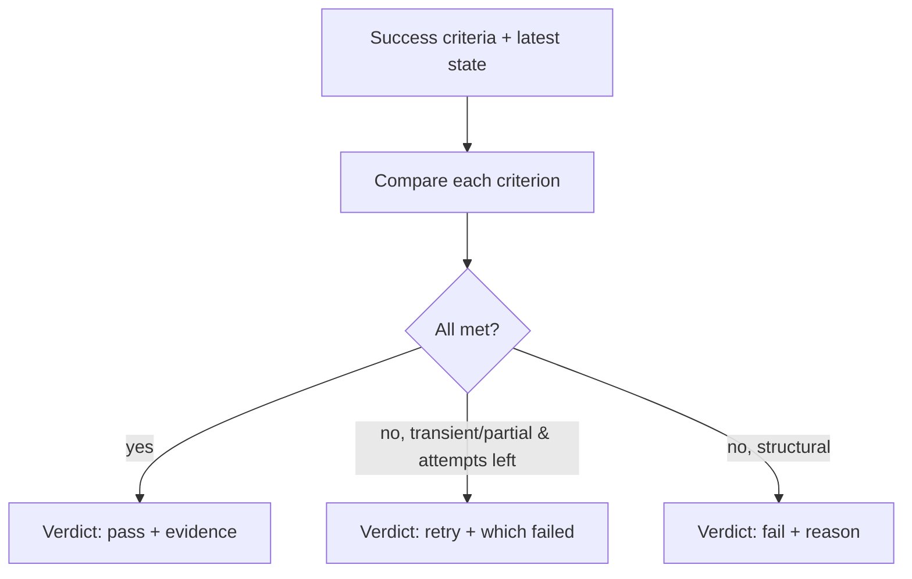

**State Machine.**
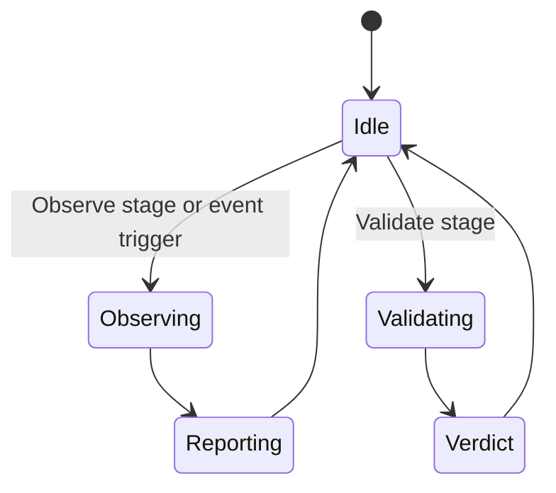

**Examples.**
- Event `KPI_THRESHOLD_BREACH(latency, Mumbai)` → Observer forms `Observation`, and (policy-permitting) triggers a mitigation workflow, becoming the loop's initiator (Scenario B).
- Validation of Scenario A: criteria = {model active on Delhi Edge, subscription active}; observed both → `pass` with the twin fields as evidence.

---

### 9.4 Optimizer Agent

**Goal.** Improve plans and operations against objectives (latency, throughput, energy, cost) — propose better resource allocations or mitigations without violating constraints.

**Responsibilities.**
- On request from the Planner, produce an `OptimizationProposal` (e.g., which UPF to load-balance to, whether to offload to an edge, which analytics to enable).
- Own **optimization workflows** triggered by degradation trends (not just single-breach mitigation) — e.g., proactively rebalance before a breach.
- Provide "what-if" reasoning using read/analytics tools; never mutate directly (proposals go to Executor via the plan).

**Prompt (summary).** *"You are the Optimizer. Given an objective and current analytics, propose the minimal set of service actions that best improves the objective within constraints and policy. Quantify expected impact where possible. Output `OptimizationProposal` with ranked options and rationale."*

**Tools.** Read/analytics tools (`nwdaf.analytics.*.query`, `dcf.data.query`, `topology.get`, `analytics.*`). Optionally a read-only "what-if" twin projection tool (simulated forecast). No action tools.

**Memory.** Reads semantic memory (historical congestion patterns, prior successful mitigations) and KG (what mitigated similar incidents). Its accepted proposals become episodic/semantic lessons via the Memory agent.

**Decision Flow.**
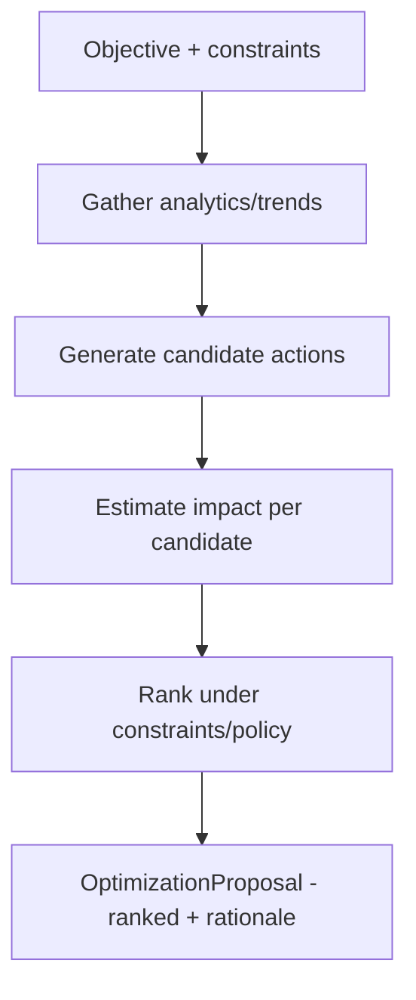

**State Machine.**
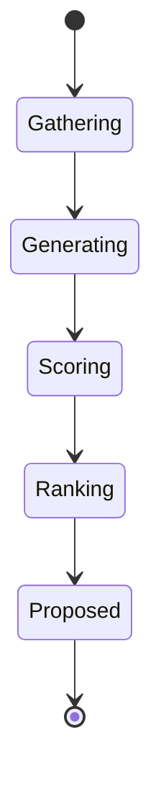

**Examples.**
- Trend: rising PRB utilization in Delhi → proposal ranked: (1) enable edge offload, (2) UPF rebalance, (3) QoS reprioritization — with expected latency deltas.
- Planner asks for the cheapest way to hold p95 latency < 20 ms → Optimizer returns a single-action proposal to minimize disruption.

---

### 9.5 Recovery Agent

**Goal.** Restore the system to a safe, consistent state after unrecoverable failure — execute compensations (rollback), and record the incident.

**Responsibilities.**
- Consume the Executor's compensation log and the failure context.
- Produce a `RecoveryPlan` of compensating service calls (undo deploys, cancel subscriptions, restore prior config) in reverse order.
- Execute compensations through the SEL (policy-checked), producing `CompensationResult[]`.
- Respect safety policies during recovery (e.g., never leave zero NRF); if recovery itself is blocked, escalate to a human via the UI.
- Record the incident (cause, actions, outcome) to memory/KG.

**Prompt (summary).** *"You are the Recovery agent. Given the failure context and the compensation log, produce and execute the minimal set of compensating actions to return the network to a safe, consistent state, in reverse order of the original actions. Respect all safety policies. If you cannot safely recover, escalate with a clear explanation. Output `RecoveryPlan` and `CompensationResult`s."*

**Tools.** Compensating **action tools** (retire model, cancel subscription, revert config), read tools to verify safe state. Policy-checked like all actions.

**Memory.** Writes (via Memory agent) an **incident record** to episodic memory and KG (`Incident -[caused_by]-> ...`, `Incident -[mitigated_by]-> ...`) so future planning learns from failures.

**Decision Flow.**
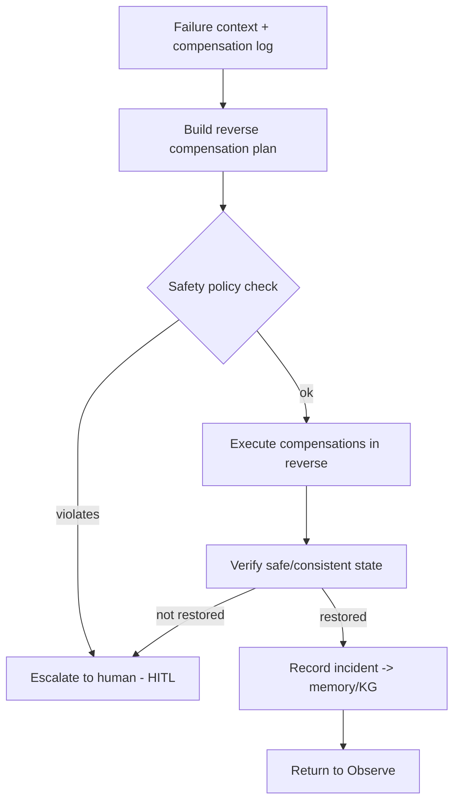

**State Machine.**
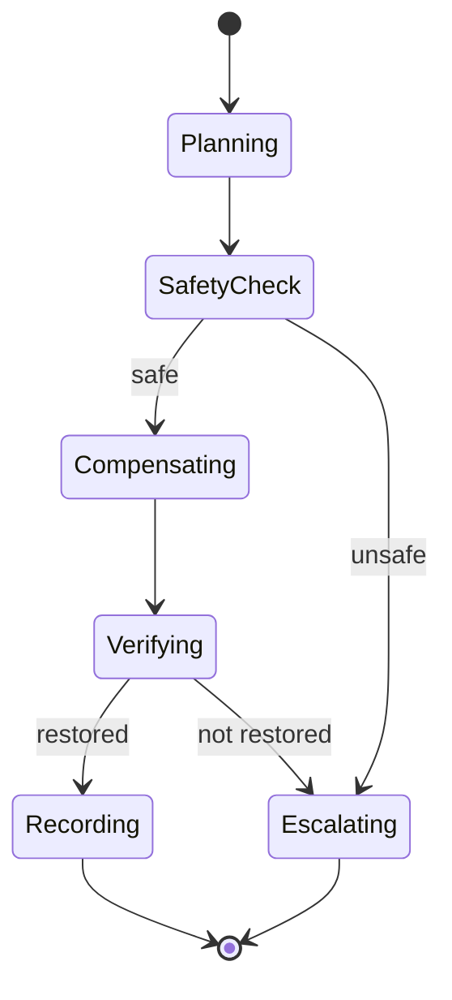

**Examples.**
- Model deploy succeeded but subscription failed unrecoverably → Recovery retires the model (reverse order), verifies clean state, records the incident.
- NRF failure (Scenario C): Recovery checks the "never zero NRF" policy, promotes a standby NRF simulation (or halts risky ops), restores discovery, records cause/mitigation to KG.

---

### 9.6 Documentation Agent

**Goal.** Produce a clear, accurate, human-readable narrative of what the workflow did and why — the primary explainability artifact — and seed episodic memory.

**Responsibilities.**
- At Complete, synthesize the full `WorkflowState` trace into a `WorkflowSummary`: goal, interpretation, plan, actions taken, outcomes, KPIs before/after, any retries/rollbacks, and lessons.
- Hand the summary and knowledge-graph deltas to the Memory agent for durable storage.
- Ensure the summary is faithful to the persisted trace (no hallucinated actions) — it must reconcile against `SERVICE_RESULT` records.

**Prompt (summary).** *"You are the Documentation agent. Using only the recorded trace and results, write a faithful, concise summary of the workflow: goal, what was done, outcomes with evidence, and lessons learned. Do not claim actions that are not in the trace. Output `WorkflowSummary` and proposed KG deltas."*

**Tools.** Read-only access to the trace, results, and before/after KPIs; `knowledge.query` to relate entities. No action tools.

**Memory.** Its output is the source of the **episodic** memory record; proposes **semantic** distillations and **KG** deltas (executed by the Memory agent).

**Decision Flow.**
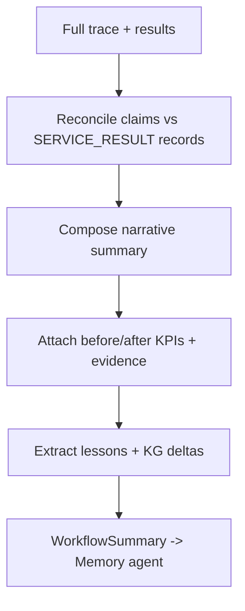

**State Machine.**
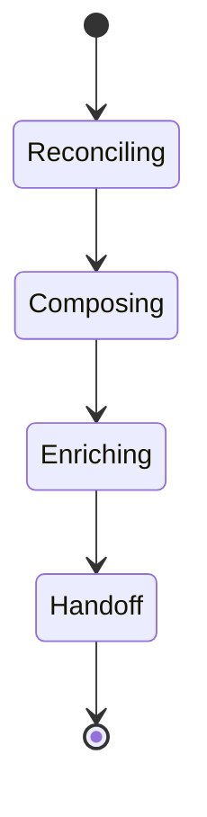

**Examples.**
- Scenario A summary: "Goal: deploy congestion model to Delhi Edge. Discovered edge via NRF, deployed model (active at tick 42), subscribed congestion analytics. Success criteria met. Lesson: Delhi Edge deploy nominal." + KG: `Model(congestion-det) -[hosted_on]-> Edge(Delhi)`.

---

### 9.7 Memory Agent

**Goal.** Be the single, consistent curator of durable memory — write episodic/semantic records and maintain the knowledge graph — and serve relevant memory to other agents on retrieval.

**Responsibilities.**
- Execute all durable memory writes (episodic, semantic) and KG upserts (AP1: sole writer for consistency).
- Distill episodic records into semantic facts when patterns recur (e.g., after N Delhi congestion incidents → semantic fact).
- Serve retrieval: given an intent/observation, return the most relevant episodic memories, semantic facts, and KG neighborhood (similarity + entity match).
- Enforce memory hygiene: dedupe, decay/expire stale semantic facts, cap growth, and record provenance (which workflow wrote each item).

**Prompt (summary).** *"You are the Memory agent. Given proposed writes, normalize and deduplicate them, decide episodic vs. semantic placement, and upsert knowledge-graph entities/relations with provenance. On retrieval, return the most relevant memories and KG neighborhood for the given context. Output `MemoryWrite`/`KnowledgeDelta` or a `RetrievalResult`."*

**Tools.** `memory.read/write`, `knowledge.upsert/query`. It is the only agent granted memory **write** tools.

**Memory.** It *is* the memory subsystem's controller; reads/writes all tiers.

**Decision Flow (write).**
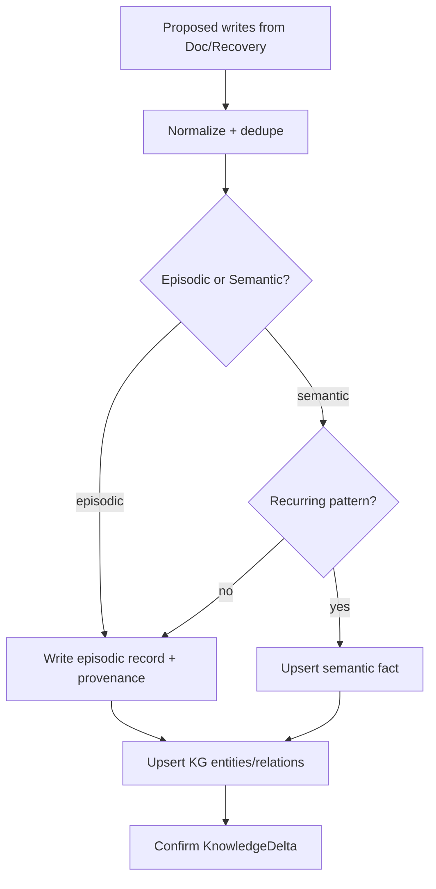

**State Machine.**
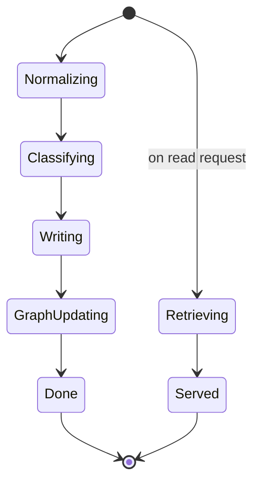

**Examples.**
- After Scenario A: writes episodic summary; upserts `Model -[hosted_on]-> Edge(Delhi)`; no new semantic fact yet.
- After the third Delhi congestion incident: distills semantic fact "Delhi Edge congests at peak (18:00–21:00)"; the Planner then plans proactively next time (H5).

---

## 10. Policy and Guardrails

Guardrails are enforced by **deterministic code in the SEL**, not by trusting the LLM (AP4). Policies (defined in `08-services.md` and stored in the `policies` table) are evaluated at the invoker's policy-check step for every action tool call.

Representative policies:

- **PLC-1 — Never zero NRF.** Block any `nrf.deregister` that would leave no NRF.
- **PLC-2 — Deploy only to healthy targets.** Block `aimle.model.deploy` to a `FAILED` NF/Edge.
- **PLC-3 — Rate limits.** Cap actions per workflow (bounded autonomy, AP6).
- **PLC-4 — Region scoping.** An intent scoped to Delhi may not mutate Mumbai NFs.
- **PLC-5 — Human confirmation for high-impact actions** (e.g., mass de-registration): the invoker returns a `requires_confirmation` result surfaced in the UI (HITL).

When a policy blocks, the agent gets a structured tool error and must adapt or escalate; the `POLICY_BLOCKED` event is persisted and shown in the Agent Console. This is the mechanism measured by H2 (policy compliance without harming safe-task success).

---

## 11. Determinism, Record/Replay, and Evaluation

- **LLMClient port** supports three modes: `live` (calls Claude), `record` (calls + saves request/response), `replay` (serves saved responses). Set in Settings.
- **Deterministic experiments:** run in `replay` with a fixed seed so orchestration effects are isolated from LLM stochasticity (`02-research-background.md` §16). Twin randomness is separately seeded (RNG service).
- **Metrics** (per agent and per workflow) are computed from persisted rows: plan correctness (Planner), step success/retry counts (Executor), validation accuracy (Observer), recovery rate (Recovery), policy compliance (SEL), memory-warm speedup (Memory). All queryable from SQLite (`12-database.md`).
- **A/B configurations:** single-agent baseline vs. full seven-agent; memory on/off; recovery on/off; policy on/off — toggled via Settings/flags for the experiments EXP-A..D.

---

## 12. Interfaces and Contracts

- **BaseAgent:** `async run(input, ctx) -> StructuredOutput` (AP2). Located `application/agents/`.
- **Structured outputs** (Pydantic, in `domain/agents/models.py`): `Interpretation`, `Plan`, `Step`, `StepResult`, `Observation`, `Validation`, `OptimizationProposal`, `RecoveryPlan`, `CompensationResult`, `WorkflowSummary`, `MemoryWrite`, `KnowledgeDelta`, `RetrievalResult`.
- **Tools:** JSON-schema functions from the SEL Tool Adapter (`08-services.md`).
- **Ports used:** `LLMClient`, `MemoryStore`, `EventBus` (read), `ServiceRegistry`/invoker (via tools).
- **Orchestration contract:** the LangGraph node↔agent binding and `WorkflowState` shape (`13-workflow-engine.md`).

---

## 13. Folder References

```text
backend/app/
├── domain/agents/
│   ├── models.py      # structured I/O schemas + AgentSpec/AgentRole
│   ├── memory.py      # MemoryRecord, KnowledgeNode/Edge
│   └── ports.py       # MemoryStore interface
├── application/agents/
│   ├── base.py            # BaseAgent, AgentContext
│   ├── planner.py executor.py observer.py optimizer.py
│   ├── recovery.py documentation.py memory_agent.py
│   └── orchestrator.py    # binds agents to workflow nodes
└── application/sel/tools.py   # services-as-tools (from 08)
```

This document owns agent *behavior*; `13` owns their *sequencing*; `14` owns their *prompts*; `08` owns their *tools*.

---

## 14. Design Decisions

- **AD-1 — Seven specialized agents over one monolith.** Rationale: reliability + explainability + testability (RQ1/RQ4). Trade-off: more hand-off plumbing; mitigated by typed contracts.
- **AD-2 — Single Memory writer.** Rationale: consistent, deduped, provenance-tracked memory. Trade-off: a bottleneck agent; acceptable and simpler than distributed writes.
- **AD-3 — Policy in code, not prompt.** Rationale: guarantees safety independent of LLM behavior (AP4). Trade-off: policies must be authored explicitly; that is desirable.
- **AD-4 — Structured outputs everywhere.** Rationale: robust multi-agent hand-offs. Trade-off: less flexible than free text; the reliability win dominates.
- **AD-5 — Optimizer as advisor, not actor.** Rationale: keep a single action path (Executor) for auditability. Trade-off: an extra hop; preserves the SEL invariant.
- **AD-6 — Record/replay LLM.** Rationale: reproducible research + offline demos. Trade-off: must maintain fixtures; worth it for `18-demo.md`.

---

## 15. Future Extensibility

- **New agent roles** (e.g., a Security agent, an Energy agent) plug in as new nodes with typed contracts.
- **MCP tools:** because tools are JSON-schema functions, agents can consume external MCP tools alongside SEL tools without code changes.
- **Learned planning:** the Planner could be augmented with retrieval-augmented plan libraries or fine-tuned models behind the same `LLMClient` port.
- **Multi-workflow coordination:** a meta-orchestrator could arbitrate between concurrent workflows competing for the same NFs (extends policy PLC-3/PLC-4).
- **Human-in-the-loop richness:** the HITL interrupt can evolve into collaborative planning (approve/edit a Plan before Execute).

---

## 16. Engineering / Implementation / Research Notes

**Engineering.**
- Keep each agent's input to the minimal state slice; passing the whole `WorkflowState` inflates tokens and blurs concerns.
- Validate structured outputs strictly; on schema-validation failure, re-prompt once with the validation error, then fail the stage (bounded, AP6).
- Never let an agent call the twin directly in code review — enforce that only the SEL tool path exists.

**Implementation.**
- Build order: `BaseAgent` + structured schemas → Observer + Planner (read-only, safest) → Executor (needs SEL) → Recovery → Documentation → Memory → Optimizer.
- Implement `LLMClient` with record/replay before wiring real Claude, so tests are deterministic from day one.
- The orchestrator binding lives with the workflow engine (`13`); agents themselves are graph-agnostic and unit-testable in isolation.

**Research.**
- Instrument each agent's structured output with timing and token counts for the cost metric (`02` §16).
- The Planner's plan and the Observer's validation are the two highest-value artifacts for correctness metrics; persist them verbatim.
- Memory warm/cold toggling is a first-class experiment control (H5) — expose it cleanly in Settings and record which mode produced each run.

---

## 17. Example Scenarios (Multi-Agent Walkthroughs)

**Scenario A — Deploy congestion model to Delhi Edge.**
Observer snapshots twin → Memory supplies (empty) context → Planner interprets and plans 3 steps → Executor deploys model + subscribes analytics (compensation log built) → Observer validates (model active + subscription active) → pass → Documentation summarizes → Memory writes episodic + KG (`Model -[hosted_on]-> DelhiEdge`).

**Scenario B — Autonomous mitigation (no human prompt).**
Twin emits `KPI_THRESHOLD_BREACH(latency, Mumbai)` → Observer triggers a workflow → Planner consults Optimizer → Optimizer proposes UPF rebalance → Executor applies it → Observer validates latency < threshold → pass → Documentation/Memory record; if it recurs, Memory distills a semantic fact enabling proactive Optimizer action next time (H5).

**Scenario C — NRF failure and recovery.**
Twin `NF_FAILED(NRF)` → discovery-dependent Executor step fails unrecoverably → hand off to Recovery → Recovery checks PLC-1 (never zero NRF), promotes standby / halts risky ops, restores discovery, verifies safe state → records incident to KG (`Incident -[mitigated_by]-> promote_standby_NRF`) → return to Observe.

These map directly to demo flows in `18-demo.md` and experiments EXP-A..D in `02`.

---

## 18. Kiro Build Guidance

### 18.1 Implementation Order
1. `domain/agents/models.py` structured schemas + `BaseAgent`/`AgentContext`.
2. `LLMClient` with live/record/replay (`infrastructure/llm`).
3. Observer + Planner (read-only) — safest to validate end-to-end.
4. Executor (requires SEL tools) → Recovery → Documentation → Memory → Optimizer.
5. Bind agents to workflow nodes in the orchestrator (with `13`).

### 18.2 Coding Rules
- Every agent returns a validated Pydantic structured output with a `rationale` field (AP2, AP5).
- No agent imports the twin; action only via SEL tools (P2).
- Only the Memory agent holds memory-write tools (AP1).
- Re-prompt at most once on output-validation failure, then fail the stage (AP6).
- All randomness via the RNG/`ctx`; LLM via the `LLMClient` port only (AP7).

### 18.3 Naming Convention
- Files: `planner.py`, `executor.py`, … ; classes `PlannerAgent`, etc.
- Structured outputs `PascalCase` matching this doc; tool names `{nf}.{domain}.{action}`.
- Memory scopes: `working|episodic|semantic`; KG relations `snake_case` verbs.

### 18.4 Folder Ownership
- `application/agents/*` and `domain/agents/*` owned here; sequencing owned by `13`; prompts by `14`; tools by `08`.

### 18.5 Prompt Suggestions
- "Implement `BaseAgent` and the structured output schemas exactly as in `05-agents.md` §12."
- "Implement the Planner to output a validated `Plan` using only services from the catalog; include self-check for missing services and acyclic deps."
- "Implement the Recovery agent to build a reverse compensation plan from the Executor's compensation log, policy-checked, with HITL escalation."
- "Implement the Memory agent as the sole memory writer with dedupe, episodic/semantic classification, and KG upsert with provenance."

### 18.6 Acceptance Criteria
- Each agent runs in isolation against a fake `LLMClient` (replay) and returns a schema-valid output.
- Scenario A completes end-to-end with all seven agents participating and persisted traces.
- A policy-blocked action produces a `POLICY_BLOCKED` event and forces adaptation, not a crash.

---

## 19. Acceptance Criteria

This document is **complete and correct** when:

- [ ] **AC-1.** All seven agents are specified with Goal, Responsibilities, Prompt summary, Tools, Memory, Decision Flow, State Machine, and Examples.
- [ ] **AC-2.** The responsibility map ties each agent to lifecycle stage(s) and structured outputs.
- [ ] **AC-3.** Common agent anatomy and the `BaseAgent` contract are defined.
- [ ] **AC-4.** The three-tier memory architecture + knowledge graph is specified, including retrieval and warm/cold control.
- [ ] **AC-5.** The tooling model (SEL-as-tools, read vs. action vs. memory, policy gate) is specified with the invariant that agents never touch the twin.
- [ ] **AC-6.** Inter-agent collaboration via shared state and typed hand-offs (no direct RPC) is specified.
- [ ] **AC-7.** Policy/guardrails are defined as deterministic SEL-enforced checks with representative policies.
- [ ] **AC-8.** Determinism/record-replay and per-agent evaluation metrics are specified.
- [ ] **AC-9.** Structured-output and port interfaces are enumerated.
- [ ] **AC-10.** Design decisions, future extensibility, and engineering/implementation/research notes are recorded.
- [ ] **AC-11.** At least three multi-agent scenario walkthroughs are provided.
- [ ] **AC-12.** Every agent has at least one Mermaid decision flow and one state-machine diagram.
- [ ] **AC-13.** Kiro build guidance (order, rules, naming, ownership, prompts, acceptance) is present.

---

**NEXT FILE**
