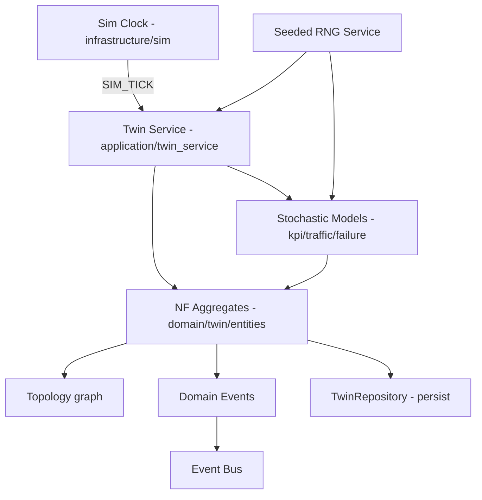
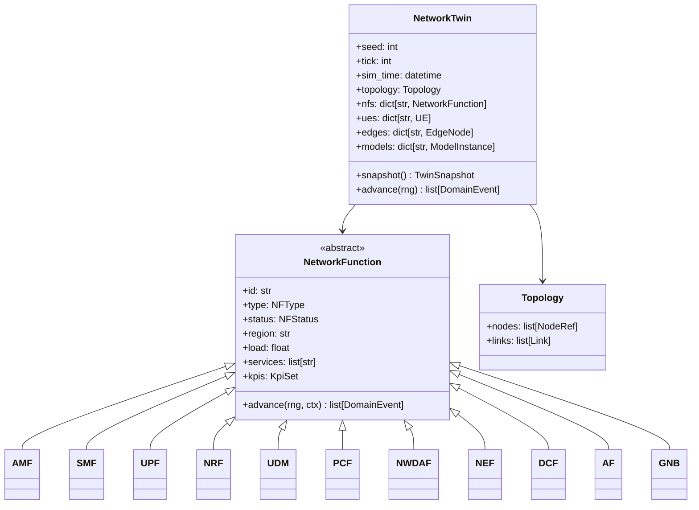
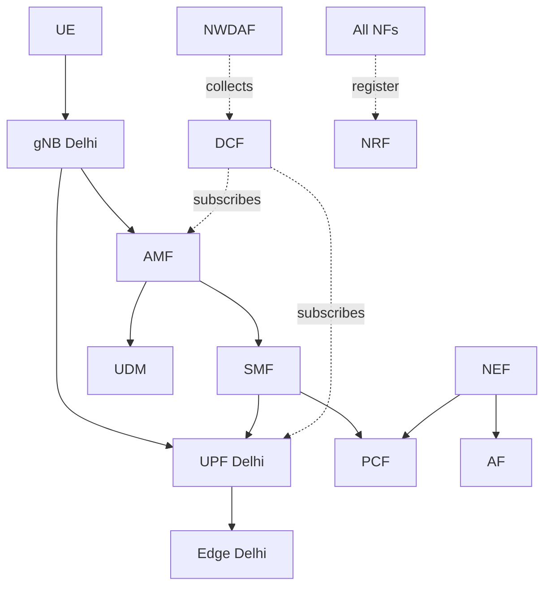
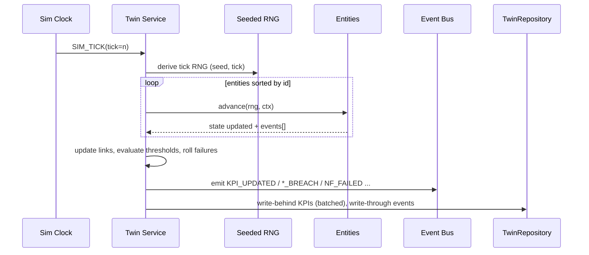
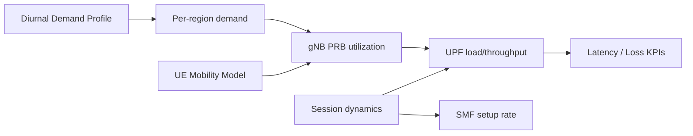
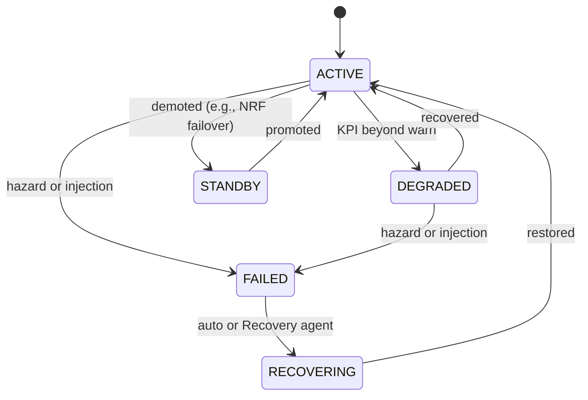
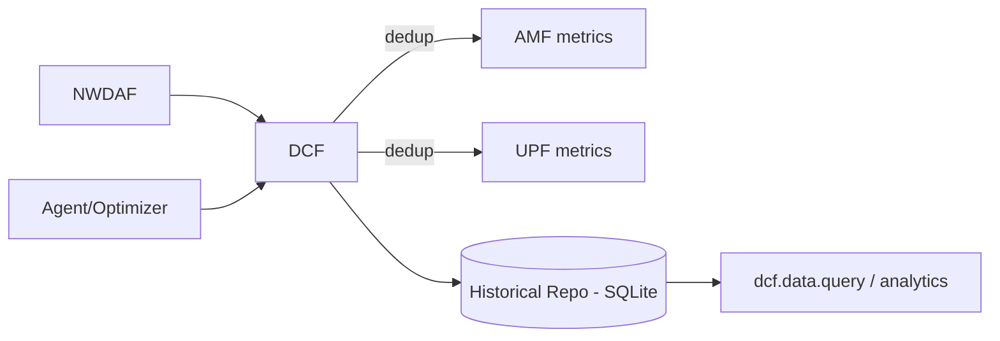

# 06 — Digital Twin

> **Document ID:** `06-digital-twin.md`
> **Project:** Agent5G — Agentic AI Service Enablement Platform for 5G Advanced Release 20
> **Document Type:** Digital Twin simulation specification (the Substrate Plane)
> **Status:** Authoritative for the twin's domain model, simulation engine, KPI/traffic/failure models, determinism, event emission, and persistence. The per-NF behavioral detail (which 3GPP function each entity approximates) is expanded in `07-network-core.md`; the services that mutate/read the twin are in `08-services.md`.
> **Depends on:** `01-system.md` (entities list, invariants), `03-architecture.md` (twin architecture, event core, persistence strategy), `02-research-background.md` (why a twin; determinism for reproducibility).
> **Audience:** Backend engineers, simulation engineers, researchers designing experiments over network state.

---

## Table of Contents

1. [Purpose](#1-purpose)
2. [Overview](#2-overview)
3. [Design Principles](#3-design-principles)
4. [Twin Domain Model](#4-twin-domain-model)
5. [Entities and Aggregates](#5-entities-and-aggregates)
6. [Topology Model](#6-topology-model)
7. [The Simulation Engine (Tick Loop)](#7-the-simulation-engine-tick-loop)
8. [KPI Models](#8-kpi-models)
9. [Traffic and Mobility Models](#9-traffic-and-mobility-models)
10. [Latency and QoS Models](#10-latency-and-qos-models)
11. [Failure and Fault-Injection Models](#11-failure-and-fault-injection-models)
12. [Data Collection (DCF) and AI Models in the Twin](#12-data-collection-dcf-and-ai-models-in-the-twin)
13. [Determinism and Reproducibility](#13-determinism-and-reproducibility)
14. [Event Emission](#14-event-emission)
15. [Persistence and Snapshots](#15-persistence-and-snapshots)
16. [Scenarios and Presets](#16-scenarios-and-presets)
17. [Interfaces and Contracts](#17-interfaces-and-contracts)
18. [Folder References](#18-folder-references)
19. [Design Decisions](#19-design-decisions)
20. [Future Extensibility](#20-future-extensibility)
21. [Engineering / Implementation / Research Notes](#21-engineering--implementation--research-notes)
22. [Example Scenarios](#22-example-scenarios)
23. [Kiro Build Guidance](#23-kiro-build-guidance)
24. [Acceptance Criteria](#24-acceptance-criteria)

---

## 1. Purpose

The Digital Twin is the **Substrate Plane** of Agent5G: a live, deterministic, event-emitting simulation of a 5G-Advanced network that behaves plausibly enough to be architecturally meaningful and reproducibly enough to support rigorous research. Its purpose is to give the agents a *safe, controllable, observable world* to act upon, and to give the UI a *truthful, real-time picture* to render.

This document specifies:

- The **domain model** of the twin — the entities (NFs, UEs, edges), their typed state and invariants, and the topology graph that connects them.
- The **simulation engine** — the seeded, tick-driven loop that advances state and emits events.
- The **behavioral models** — how KPIs, traffic, mobility, latency, QoS, and failures evolve over time.
- **Determinism** — how a single seeded RNG makes every run reproducible (a hard research requirement).
- **Event emission and persistence** — how twin state changes become durable, observable events.

The twin is *simulation, not emulation* (DD-2): it does not run real protocol stacks. It is nonetheless *architecturally faithful* — each entity's state and services map to a real 3GPP function, so a future swap to Open5GS/OAI is feasible behind identical service contracts.

---

## 2. Overview

The twin lives primarily in the **Domain layer** (`domain/twin/`) as pure, framework-free Python + Pydantic, with an **Infrastructure-layer clock** (`infrastructure/sim/`) driving time via `SIM_TICK` events. On each tick, the Twin Service advances entity state using seeded stochastic models, evaluates thresholds and failures, emits domain events, and (per the persistence strategy in `03-architecture.md` §10) write-behind persists KPI samples and write-through persists discrete events.



*Figure 2.1 — Twin runtime: clock ticks → service advances entities via seeded models → events + persistence.*

The twin is a **read-mostly world for agents**: agents *read* via safe services (`twin.snapshot`, `nwdaf.analytics.*.query`) and *act* via policy-checked action services (`aimle.model.deploy`, `upf.loadbalance.apply`, …). The twin never lets an agent bypass the SEL (invariant P2).

---

## 3. Design Principles

- **TP1 — Architecturally faithful, not protocol-accurate.** Each entity mirrors a real 3GPP NF's *role and state*, not its wire protocol. Fidelity is measured by state/service correctness (mapping audited in `07`).
- **TP2 — Deterministic by construction.** All randomness flows through one seeded RNG service. Given the same seed + scenario + inputs, every run is bit-for-bit reproducible.
- **TP3 — Everything observable.** Every state change emits an event and is persisted (P3). There is no hidden state the UI or agents cannot see.
- **TP4 — Domain purity.** The twin domain imports no framework (no SQLAlchemy/FastAPI/LangGraph). Time and persistence arrive via ports.
- **TP5 — Bounded, plausible dynamics.** KPIs move within realistic bounds via smoothed stochastic processes, not wild random jumps — so charts look like a real NOC and thresholds are meaningful.
- **TP6 — Mutation only through services.** External mutation (agent or UI) enters via the SEL/twin use-cases; the tick loop is the only internal mutator. No back-channel writes.
- **TP7 — Cheap ticks.** A tick must be computationally light (no real CPU-heavy work) so the loop runs smoothly on a single Windows machine; "training"/heavy operations are simulated with modeled delays.

---

## 4. Twin Domain Model

The twin is organized as a set of **aggregates** (in the DDD sense) with a root `NetworkTwin` aggregate that owns the topology and provides consistent snapshots.



*Figure 4.1 — Core twin class model. `NetworkFunction` is the abstract base; each NF subclass adds role-specific state (detailed in `07`).*

**Value objects:** `KpiSet` (named KPI series with current value, EMA, min/max, threshold), `Link` (src, dst, throughput, latency, utilization), `NFStatus` enum (`ACTIVE`, `DEGRADED`, `FAILED`, `RECOVERING`, `STANDBY`), `NFType` enum (the twelve types), `Region` (e.g., Delhi, Mumbai, Bengaluru).

**Invariants (enforced in the aggregate):** e.g., a UE is attached to exactly one AMF; a PDU session references a valid SMF+UPF; a model instance references an existing target NF/Edge; deregistering the last NRF is forbidden at the domain level too (defense in depth alongside policy PLC-1).

---

## 5. Entities and Aggregates

The twin simulates twelve NF/entity types plus UE and Edge. Summary of each entity's key simulated state (full behavior in `07-network-core.md`):

| Entity | Role (approximates) | Key simulated state | Emits |
|--------|---------------------|---------------------|-------|
| **UE** | User Equipment | region, attached AMF, session, mobility, traffic demand, signal quality | attach/detach, mobility |
| **gNB** | Radio base station | connected UEs, PRB utilization, cell load, coverage region | PRB/coverage KPIs |
| **AMF** | Access & Mobility Mgmt | registered UEs, registration load | registration events |
| **SMF** | Session Mgmt | active PDU sessions, session setup rate | session events |
| **UPF** | User Plane | throughput, packet loss, buffer/queue, load, served sessions | throughput/loss KPIs |
| **NRF** | Repository/discovery | registered NF set, discovery request rate | register/deregister |
| **UDM** | Data Mgmt | subscriber profiles count, query load | query KPIs |
| **PCF** | Policy Control | active policies, QoS rules applied | policy events |
| **NWDAF** | Analytics | analytics subscriptions, model instances, predictions | analytics/predictions |
| **NEF** | Exposure | northbound subscriptions, QoS requests | exposure events |
| **DCF** | Data Collection Coord. | active collection subscriptions, dedup registry, historical repo pointers | data-collected events |
| **AF** | Application Function | app sessions, QoS/analytics demands | app requests |
| **Edge** | Edge compute node | hosted models, compute load, region, latency-to-users | model deploy/run |

Each entity implements `advance(rng, ctx)` which updates its state for one tick and returns any domain events. The `NetworkTwin.advance()` iterates entities in a deterministic order (sorted by id) so RNG draws are reproducible (TP2).

---

## 6. Topology Model

The topology is a graph: nodes are entities (with a region and coordinates for layout), edges are links carrying live metrics.



*Figure 6.1 — Representative topology (one region shown). Control-plane, user-plane, analytics/data, and exposure relationships.*

- **Nodes** carry `region`, `type`, layout coordinates, and a reference to the entity.
- **Links** carry `throughput`, `latency`, `utilization`, updated each tick from the endpoints' state.
- **Regions** (Delhi, Mumbai, Bengaluru, …) group nodes for the Topology page's regional layout and for region-scoped policies (PLC-4).
- The topology is seeded from a **scenario preset** (§16); the base preset instantiates a small multi-region network (configurable counts of UEs/gNBs/edges).

Persisted in `topology_nodes` and `topology_links` (`12-database.md`); served by `topology.get` / `GET /topology`.

---

## 7. The Simulation Engine (Tick Loop)

The engine advances simulated time in discrete **ticks**. The clock (`infrastructure/sim/scheduler.py`) fires `SIM_TICK` at a configurable interval (default 1000 ms; adjustable via Settings/Simulation). The Twin Service handles each tick.



*Figure 7.1 — One simulation tick.*

**Tick algorithm (deterministic):**
1. Derive a **per-tick RNG stream** from `(seed, tick)` so each tick's randomness is independent yet reproducible (TP2).
2. Advance entities in sorted id order; each draws only from the per-tick stream.
3. Recompute link metrics from endpoint states.
4. Evaluate KPI thresholds → emit `KPI_THRESHOLD_BREACH` where crossed (edge-triggered, with hysteresis to avoid flapping).
5. Roll failure/recovery processes → emit `NF_FAILED`/`NF_RECOVERED`.
6. Emit `KPI_UPDATED` (batched/downsampled for the bus to control volume).
7. Persist: write-behind KPI samples, write-through events; increment tick and `sim_time`.

**Controls** (via `simulation.*` services / `POST /simulation/*`): start, pause, step (single tick), reset (re-seed + rebuild scenario), set tick rate, set seed, load scenario, inject fault. Pausing halts the clock but preserves state.

The tick is intentionally **light** (TP7): all "work" is arithmetic on modeled quantities; no real ML training or packet processing occurs.

---

## 8. KPI Models

KPIs are the observable time series that agents reason over and the UI charts. Each KPI is modeled as a **bounded, smoothed stochastic process** so it looks realistic (TP5).

**Core KPIs per entity type:**

| KPI | Applies to | Units | Typical driver |
|-----|-----------|-------|----------------|
| `latency_ms` | UPF, Edge, links | ms | load, queue, distance-to-edge |
| `throughput_mbps` | UPF, gNB, links | Mbps | active sessions, traffic demand |
| `prb_utilization` | gNB | % | connected UEs, traffic |
| `packet_loss` | UPF, links | % | congestion, buffer overflow |
| `registration_load` | AMF | req/s | UE attach rate |
| `session_setup_rate` | SMF | /s | new sessions |
| `discovery_rate` | NRF | req/s | NF churn, consumer demand |
| `analytics_accuracy` | NWDAF | % | model quality (simulated) |
| `compute_load` | Edge | % | hosted models + demand |
| `energy_index` | NF/Edge | rel. | load-proportional (for energy objective) |

**Process model (per KPI).** Each KPI value evolves as a mean-reverting process with load coupling and bounded noise:

- A **baseline** (per scenario, per region, possibly time-of-day shaped).
- A **load term** coupling the KPI to the entity's `load` / neighbors (e.g., latency rises super-linearly as UPF load → 1.0).
- A **noise term** drawn from the seeded per-tick RNG (bounded, smoothed via EMA so successive samples are correlated).
- **Clamping** to physical bounds (e.g., utilization ∈ [0,1], latency ≥ floor).

Each `KpiSet` tracks `current`, an EMA (`smoothed`), rolling `min/max`, and a `threshold` (from Settings/`policies`) used for breach detection with **hysteresis** (breach when above `high`, clear when below `low`) to prevent event storms.

---

## 9. Traffic and Mobility Models

Traffic demand and UE mobility drive most downstream KPIs.

- **Traffic demand.** Aggregate demand per region follows a **diurnal profile** (configurable peak windows, e.g., 18:00–21:00 for a "busy hour") plus seeded noise and optional scenario spikes. Demand is distributed to gNBs/UEs, raising PRB utilization, UPF throughput/load, and thus latency/loss.
- **UE mobility.** UEs move between gNBs/regions via a seeded transition model (stay/move probabilities). Movement changes gNB association, can trigger handovers (attach/detach events), and shifts load between cells — enabling mobility-related analytics and congestion migration.
- **Session dynamics.** PDU sessions are created/torn down at seeded rates coupled to demand, driving SMF `session_setup_rate` and UPF served-session counts.



*Figure 9.1 — Traffic/mobility drive load, which drives latency/loss KPIs.*

These couplings are what make scenarios like "Mumbai congestion at peak" emerge naturally rather than being hard-coded — a demand spike + mobility concentration raises PRB/UPF load, which raises latency past threshold, which triggers a breach event and an autonomous workflow (Scenario B).

---

## 10. Latency and QoS Models

- **Latency** at a UPF/Edge/link is `base_latency + f(load) + queue_delay + noise`, where `f(load)` grows steeply near saturation (an M/M/1-style congestion curve, approximated). Edge-served traffic has lower `base_latency` (proximity), which is why offloading to an edge is an effective mitigation the Optimizer can propose.
- **QoS** is modeled via **QoS Flows / 5QI-like classes**: sessions carry a QoS class with target latency/throughput. The PCF applies policies that map flows to priorities; under congestion, higher-priority flows retain QoS while best-effort degrades first. A `qos_satisfaction` KPI per class measures the fraction of flows meeting their target.
- **QoS actions** available to agents (via services): `nef.qos.request` (raise a flow's class), `pcf.policy.apply` (change prioritization), `upf.loadbalance.apply` (shift load), `aimle.model.deploy` to an edge (reduce base latency). Each changes the QoS/latency computation on subsequent ticks — a clean, observable cause→effect the agents and UI can demonstrate.

QoS satisfaction and latency-vs-threshold are primary validation criteria for mitigation workflows and primary figures for the Analytics page.

---

## 11. Failure and Fault-Injection Models

Failures create the conditions that exercise the Recovery agent and demonstrate resilience.

**Two failure sources:**

1. **Stochastic failures.** Each NF has a seeded per-tick failure hazard (configurable, usually tiny) that can transition it `ACTIVE → FAILED`. A failed NF stops producing its services (discovery calls to a failed NRF fail; a failed UPF drops throughput/raises loss). Recovery follows a modeled `FAILED → RECOVERING → ACTIVE` process (auto or agent-driven).
2. **Injected faults.** Via `simulation.fault` / `POST /simulation/fault`, a user/demo can force a specific NF into `FAILED` (or degrade a KPI) at will — the basis for scripted demos (Scenario C).



*Figure 11.1 — NF status lifecycle including failure, recovery, and standby/failover.*

**Effects of failure** propagate through the models: a failed UPF removes a user-plane path (latency/loss spike, sessions must migrate); a failed NRF breaks discovery (Executor steps needing discovery fail → Recovery, respecting PLC-1); a failed NWDAF stops analytics (Observer loses a data source). These propagations are deterministic given the seed, so failure experiments are repeatable.

---

## 12. Data Collection (DCF) and AI Models in the Twin

**DCF (Data Collection Coordination).** The DCF entity models the R17 data-plumbing role: consumers (NWDAF, agents) subscribe to data via `dcf.data.subscribe`; DCF **deduplicates** overlapping collection (one producer query fanned out), and writes historical series to an **ADRF-like repository** (persisted KPI history in SQLite). This gives agents a single coherent place to request current and historical data, and lets the Optimizer reason over trends, not just instantaneous values.



*Figure 12.1 — DCF deduplicates collection and persists history (ADRF-like).*

**AI models in the twin (AIMLE, metadata-level).** A `ModelInstance` has `id`, `name`, `version`, `state` (Registered→Trained→Validated→Deployed→Monitored→Retired), `target` (NWDAF or Edge id), and simulated `metrics` (e.g., `analytics_accuracy`). Deploying a model to an Edge/NWDAF changes twin behavior in modeled ways — e.g., a "congestion detection" model on NWDAF improves prediction lead time; a model on the Delhi Edge enables local inference reducing latency. No real training occurs; "training"/"deployment" complete after a modeled delay (TP7), emitting `MODEL_DEPLOYED`. This is what makes Scenario A observable end-to-end.

---

## 13. Determinism and Reproducibility

Determinism is a **hard research requirement** (reproducible figures, controlled experiments) and is achieved by construction:

- **Single RNG service** (`infrastructure/rng`) is the *only* entropy source. No module calls `random`/`numpy.random` directly (enforced by lint, per `03` §26.2).
- **Seeded, tick-derived streams.** The global `seed` (Settings) plus the `tick` index derive a per-tick RNG (e.g., via a counter-based/`PCG`-style generator or hashing `seed||tick`), so entity advance order and per-tick draws are reproducible and independent across ticks.
- **Deterministic iteration order.** Entities/links iterate in sorted-id order every tick.
- **Separated stochasticity.** Twin randomness (seed) is independent of LLM randomness (record/replay), so experiments can hold one fixed while varying the other (`02` §16).
- **Reproducible reset.** `reset` rebuilds the scenario from `(seed, scenario)`; two resets with the same inputs produce identical trajectories.

Given `(seed, scenario, external actions)`, the entire KPI/event trajectory is reproducible — enabling A/B experiments (agent configs) on an identical world.

---

## 14. Event Emission

The twin is the primary event producer. Events (defined in `domain/twin/events.py`) use the canonical envelope `{type, correlation_id, ts, payload}` (`03` §24). Twin-origin events carry the sim `tick` and entity id in the payload.

| Event | When | Payload highlights |
|-------|------|--------------------|
| `SIM_TICK` | each tick (from clock) | tick, sim_time |
| `KPI_UPDATED` | per tick (batched/downsampled) | entity_id, kpi, value |
| `KPI_THRESHOLD_BREACH` | KPI crosses `high` (hysteresis) | entity_id, kpi, value, threshold, region |
| `KPI_THRESHOLD_CLEARED` | KPI falls below `low` | entity_id, kpi |
| `NF_FAILED` / `NF_RECOVERED` | status transition | entity_id, type, cause |
| `NF_REGISTERED` / `NF_DEREGISTERED` | NRF registry change | entity_id, type |
| `UE_ATTACHED` / `UE_HANDOVER` | mobility | ue_id, from/to gNB |
| `SESSION_CREATED` / `SESSION_RELEASED` | session dynamics | session_id, smf, upf |
| `MODEL_DEPLOYED` / `MODEL_RETIRED` | model lifecycle | model_id, target |
| `DATA_COLLECTED` | DCF collection cycle | subscription_id, count |

**Volume control:** high-frequency `KPI_UPDATED` is downsampled/batched to the bus (drop-oldest on backpressure), while breach/failure/lifecycle events are **lossless** (`03` §8). All events are persisted regardless (write-through) so history is complete even if the live bus drops a `KPI_UPDATED`.

Consumers: Observer agent (triggers autonomous workflows on breach/failure), WebSocket hub (live UI), persistence.

---

## 15. Persistence and Snapshots

Per the persistence strategy (`03` §10):

- **Write-through (immediate):** discrete events (`*_BREACH`, `NF_FAILED`, `MODEL_DEPLOYED`, registrations, sessions) → `events` table; command mutations from services.
- **Write-behind (batched):** high-frequency KPI samples → `kpis` table via the single-writer queue at a bounded interval (e.g., every N ticks), keeping the DB write rate manageable.
- **Snapshots:** `NetworkTwin.snapshot()` produces a `TwinSnapshot` DTO (topology + per-entity current state + KPIs) served by `twin.snapshot`/`GET /twin`. Optionally, periodic full snapshots are persisted (`simulation` table) to support fast restart/restore without replaying all ticks.
- **Restart:** on boot, the twin restores from the latest snapshot (if present) plus scenario/seed; otherwise it rebuilds from the scenario preset. Because the run is deterministic, a snapshot + seed fully defines the continuation.

Tables owned/used: `topology_nodes`, `topology_links`, `kpis`, `events`, `models`, `simulation` (defined in `12-database.md`).

---

## 16. Scenarios and Presets

A **scenario** defines the initial world and the forces acting on it. Scenarios are loadable presets (Simulation page) and are the unit of reproducible experiments.

A scenario preset specifies:
- **Topology:** counts and placement of UEs, gNBs, NFs, edges across regions.
- **Demand profile:** diurnal shape, peak windows, per-region multipliers.
- **Failure config:** per-NF hazard rates (often zero for clean demos).
- **Thresholds:** KPI `high`/`low` bounds per class.
- **Scripted injections (optional):** timed faults/spikes (e.g., "at tick 30, spike Mumbai demand").
- **Seed:** default seed for reproducibility.

**Baseline presets:**
- `baseline_healthy` — small multi-region network, no faults, gentle diurnal demand (for Scenario A demos).
- `mumbai_congestion` — a demand spike + mobility concentration in Mumbai at peak (drives Scenario B autonomous mitigation).
- `nrf_failure` — a scripted NRF fault (drives Scenario C recovery).
- `stress_multi` — multiple concurrent stressors for robustness experiments.

Scenarios are versioned files (`data/scenarios/*.json` or Python factories) so a paper can cite the exact scenario + seed used for each figure.

---

## 17. Interfaces and Contracts

- **`TwinRepository` port** (`domain/twin/ports.py`): `load_snapshot`, `save_snapshot`, `append_kpis(batch)`, `persist_event`, `get_kpi_history(entity, kpi, range)`.
- **Twin Service** (`application/twin_service/`): `on_tick(tick)`, `snapshot()`, `apply_command(cmd)` (the entry point services use to mutate the twin), `inject_fault(spec)`, `load_scenario(name, seed)`, `control(start|pause|step|reset)`.
- **Domain events:** `domain/twin/events.py` (the taxonomy in §14).
- **Read services** (SEL): `twin.snapshot`, `topology.get`, `nwdaf.analytics.*.query`, `dcf.data.query`, `dcf.data.subscribe`. **Action services** that mutate the twin: `aimle.model.deploy/retire`, `upf.loadbalance.apply`, `pcf.policy.apply`, `nef.qos.request`, `nrf.register/deregister` — all defined in `08-services.md`.
- **Simulation control services:** `simulation.start/pause/step/reset/seed/fault/scenario` (mapped to `POST /simulation/*` in `09-api.md`).

All external mutation enters through the SEL → `apply_command` (TP6); the tick loop is the only internal mutator.

---

## 18. Folder References

```text
backend/app/
├── domain/twin/
│   ├── entities.py     # NetworkTwin, NetworkFunction + 12 subclasses, UE, EdgeNode, ModelInstance
│   ├── topology.py     # Topology, NodeRef, Link, Region
│   ├── kpi.py          # KpiSet, KPI process definitions
│   ├── models_sim.py   # stochastic model functions (traffic, latency, failure)
│   ├── events.py       # domain event types (§14)
│   └── ports.py        # TwinRepository interface
├── application/twin_service/
│   ├── service.py      # on_tick, snapshot, apply_command, control
│   ├── faults.py       # fault injection
│   └── scenarios.py    # scenario loading/factories
├── infrastructure/sim/
│   └── scheduler.py    # SIM_TICK clock
├── infrastructure/rng/
│   └── rng.py          # seeded RNG service
└── data/scenarios/*.json  # scenario presets
```

This document owns the twin's *simulation model*; `07` owns per-NF *behavioral detail*; `08` owns the *services*; `12` owns the *tables*.

---

## 19. Design Decisions

- **TD-1 — Tick-driven discrete simulation.** Rationale: simple, deterministic, cheap; matches the observe-loop cadence. Trade-off: not continuous-time; adequate for KPI-level fidelity.
- **TD-2 — Mean-reverting, load-coupled KPI processes.** Rationale: realistic, bounded, controllable dynamics (TP5). Trade-off: not packet-accurate; irrelevant to the research goal.
- **TD-3 — Single seeded RNG, tick-derived streams.** Rationale: full reproducibility with independent per-tick randomness. Trade-off: must funnel all entropy through one service (enforced).
- **TD-4 — Hysteresis on thresholds.** Rationale: prevents breach-event flapping/storms. Trade-off: slight detection delay; worth it for clean events.
- **TD-5 — Write-behind KPIs / write-through events.** Rationale: DB write-rate control without losing critical audit data. Trade-off: small window of unpersisted KPI samples on crash (acceptable).
- **TD-6 — Metadata-level AI models.** Rationale: demonstrate AIMLE lifecycle/orchestration without real training (constraints). Trade-off: no real model performance; not the contribution.
- **TD-7 — Scenario presets as the experiment unit.** Rationale: citeable, reproducible experimental conditions. Trade-off: authoring scenarios upfront; enables rigorous evaluation.

---

## 20. Future Extensibility

- **Open5GS/OAI substrate swap.** Replace `apply_command`/`snapshot` and per-NF advance with adapters that talk to real NFs; SEL contracts and agents are unchanged (DD-2, `20-future-work.md`).
- **Higher-fidelity models.** Plug in richer traffic/mobility models (e.g., trace-driven from real datasets) behind the same `models_sim` interface.
- **Geospatial topology.** Add real coordinates/maps for a geographic Topology view; the `Region`/coords fields already anticipate this.
- **Federated/edge learning.** Extend `ModelInstance` toward distributed training simulation for privacy-preserving experiments.
- **Continuous-time option.** A future event-driven (rather than fixed-tick) mode for finer temporal resolution.
- **Postgres history.** Swap the ADRF-like repo to Postgres/TimescaleDB for large-scale historical analytics via the repository port.

---

## 21. Engineering / Implementation / Research Notes

**Engineering.**
- Keep `domain/twin` framework-free; time and persistence arrive via ports (TP4). A stray `import sqlalchemy` here breaks the architecture.
- Make `advance()` pure w.r.t. its RNG argument — no hidden global state — so unit tests can assert exact trajectories.
- Downsample `KPI_UPDATED` to the bus but persist at the modeled resolution; UI charts read history via REST, live via WS.

**Implementation.**
- Build order: entities + topology + KpiSet → RNG service → stochastic models → Twin Service `on_tick` → events + persistence → scenarios → fault injection → simulation control.
- Write a golden-trajectory test: fixed seed + scenario + N ticks → assert a hash of the KPI/event stream. This guards determinism (TP2) forever.
- Expose tick rate and seed in Settings early; demos depend on them.

**Research.**
- Every figure must be traceable to `(scenario, seed, config)`; store these on each run in the DB.
- The DCF historical repo is what enables trend-based Optimizer decisions and time-series figures — implement it before the optimization experiments.
- Fault-injection reproducibility (scripted, seeded) is what makes recovery-rate experiments (H3) credible.

---

## 22. Example Scenarios

**Scenario A (twin view).** `baseline_healthy` loaded (seed S). Agent deploys a congestion model to Delhi Edge via `aimle.model.deploy`; after a modeled delay the `ModelInstance` → `Deployed`, `MODEL_DEPLOYED` emitted, Delhi Edge `base_latency` drops in the latency model; `nwdaf.analytics.congestion.subscribe` creates a subscription; twin snapshot now shows model active + subscription active (validation passes).

**Scenario B (twin view).** `mumbai_congestion` at peak: demand spike + UE concentration raise Mumbai gNB PRB and UPF load; latency process crosses `high` → `KPI_THRESHOLD_BREACH(latency, Mumbai)` (hysteresis-gated). Observer triggers a workflow; a `upf.loadbalance.apply`/edge-offload action lowers modeled load; latency reverts below `low` → `KPI_THRESHOLD_CLEARED`. Entire trajectory reproducible from (seed, scenario).

**Scenario C (twin view).** `nrf_failure` scripts `NF_FAILED(NRF)` at tick T; discovery-dependent operations fail deterministically; Recovery promotes a `STANDBY` NRF (`STANDBY → ACTIVE`), restoring discovery; `NF_RECOVERED` emitted; incident persisted.

---

## 23. Kiro Build Guidance

### 23.1 Implementation Order
1. `domain/twin/`: entities, topology, `KpiSet`, events, `TwinRepository` port (framework-free).
2. `infrastructure/rng`: seeded, tick-derived RNG service.
3. `domain/twin/models_sim.py`: KPI/traffic/latency/failure processes (pure functions of state + rng).
4. `application/twin_service/service.py`: `on_tick`, `snapshot`, `apply_command`, `control`.
5. Event emission + persistence (write-behind KPIs, write-through events) via `TwinRepository`.
6. `scenarios.py` + presets; `faults.py`; `infrastructure/sim/scheduler.py` clock.
7. Golden-trajectory determinism test.

### 23.2 Coding Rules
- Only the RNG service produces randomness (P6/TP2); lint-forbid direct `random`/`numpy.random`.
- Twin domain imports no framework (TP4).
- Every state change emits an event + persists (P3/TP3).
- External mutation only via `apply_command` behind the SEL (TP6); tick loop is the sole internal mutator.
- KPIs clamped to physical bounds; thresholds use hysteresis (TD-4).

### 23.3 Naming Convention
- Entities `PascalCase` (`NetworkFunction`, `EdgeNode`); NF types in `NFType` enum; statuses in `NFStatus` enum.
- KPIs `snake_case` (`latency_ms`, `prb_utilization`); events `SCREAMING_SNAKE_CASE`.
- Scenarios `snake_case` filenames (`mumbai_congestion.json`); seeds `SEED_*`.

### 23.4 Folder Ownership
- `domain/twin/*`, `application/twin_service/*`, `infrastructure/sim/*`, `data/scenarios/*` owned here; per-NF behavior detail in `07`; services in `08`; tables in `12`.

### 23.5 Prompt Suggestions
- "Implement the twin domain (`NetworkTwin`, `NetworkFunction` + 12 subclasses, UE, EdgeNode, ModelInstance) as pure Pydantic with `advance(rng, ctx)` returning events."
- "Implement the seeded, tick-derived RNG service and route all model randomness through it."
- "Implement `on_tick` with sorted-id iteration, threshold hysteresis, failure rolls, and batched KPI persistence."
- "Add a golden-trajectory test asserting a stable hash of KPIs+events for a fixed seed and scenario."

### 23.6 Acceptance Criteria
- Two runs with identical (seed, scenario, actions) produce identical KPI/event trajectories (golden test passes).
- A demand spike scenario produces a hysteresis-gated `KPI_THRESHOLD_BREACH` with no flapping.
- `aimle.model.deploy` produces `MODEL_DEPLOYED` and an observable change in the latency model.

---

## 24. Acceptance Criteria

This document is **complete and correct** when:

- [ ] **AC-1.** The twin domain model (aggregates, entities, value objects, invariants) is specified with a class diagram.
- [ ] **AC-2.** All twelve NF/entity types plus UE and Edge are listed with key simulated state and emitted events.
- [ ] **AC-3.** The topology model (nodes, links, regions) is specified and diagrammed.
- [ ] **AC-4.** The tick-loop simulation engine is specified with a deterministic tick algorithm and control operations.
- [ ] **AC-5.** KPI models (bounded, load-coupled, smoothed) with core KPIs and threshold hysteresis are specified.
- [ ] **AC-6.** Traffic, mobility, latency, and QoS models are specified with their causal couplings.
- [ ] **AC-7.** Failure and fault-injection models (stochastic + injected) with the NF status lifecycle are specified.
- [ ] **AC-8.** DCF data-collection (dedup + ADRF-like history) and metadata-level AI model lifecycle are specified.
- [ ] **AC-9.** Determinism/reproducibility (single seeded RNG, tick-derived streams, separated stochasticity) is specified.
- [ ] **AC-10.** Event emission taxonomy and volume control are specified.
- [ ] **AC-11.** Persistence/snapshot strategy and restart behavior are specified.
- [ ] **AC-12.** Scenario presets as the reproducible experiment unit are specified.
- [ ] **AC-13.** Interfaces (`TwinRepository`, Twin Service, events, SEL read/action services) are enumerated.
- [ ] **AC-14.** Design decisions, extensibility, notes, example scenarios, and Kiro guidance are present, with the invariant that agents never mutate the twin except through the SEL.

---

**NEXT FILE**
