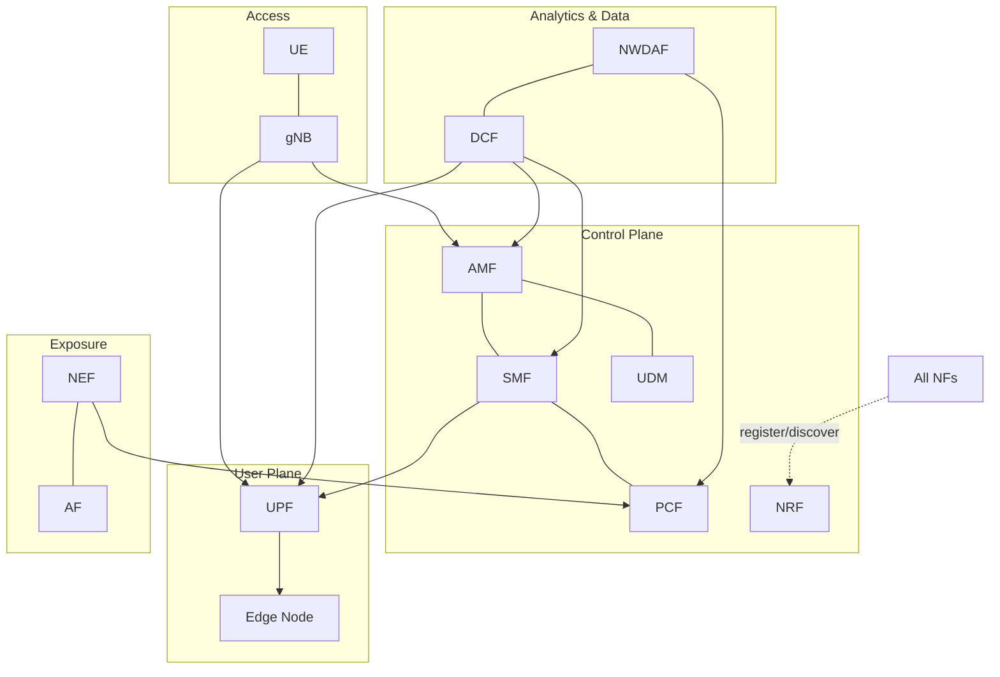
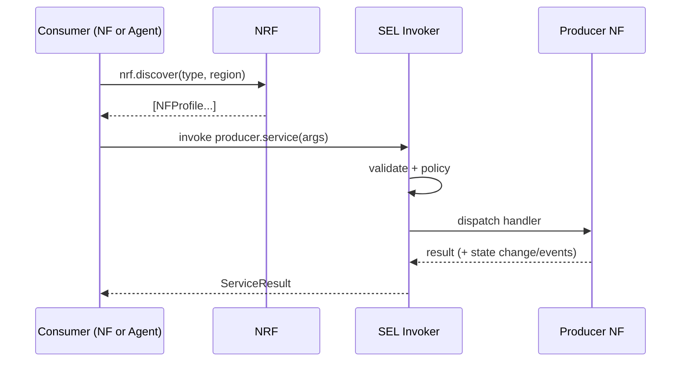
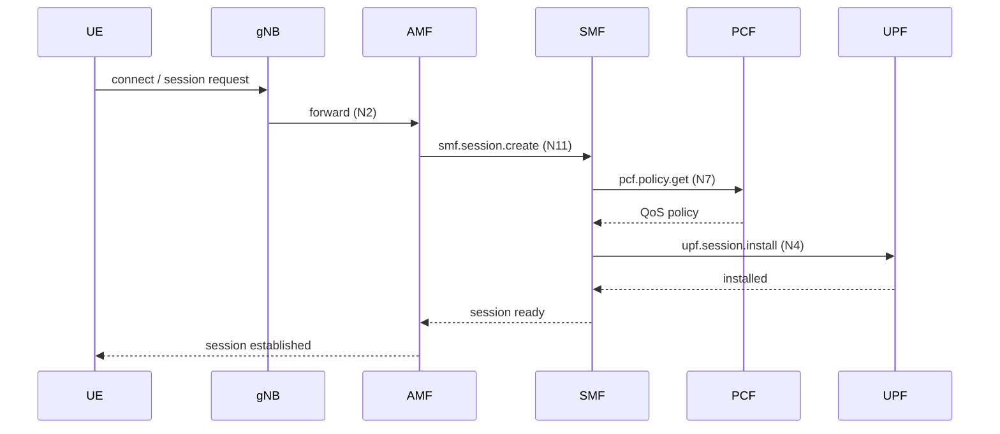

# 07 — Network Core (Simulated 5G SBA)

> **Document ID:** `07-network-core.md`
> **Project:** Agent5G — Agentic AI Service Enablement Platform for 5G Advanced Release 20
> **Document Type:** Per-network-function behavioral specification (the standards-faithful detail of the Substrate Plane)
> **Status:** Authoritative for each simulated NF's role, state, behavior, produced/consumed services, and the 3GPP standards mapping (`spec_ref`, `approximates_operation`). The generic simulation engine that drives these NFs is in `06-digital-twin.md`; the service contracts are in `08-services.md`.
> **Depends on:** `01-system.md` (entity list, invariants), `02-research-background.md` (SBA, NWDAF, DCF, AIMLE, NEF framing + fidelity mapping requirement), `06-digital-twin.md` (aggregates, tick loop, KPI/failure models).
> **Audience:** Telecom engineers, backend engineers, researchers auditing standards fidelity, students learning the 5G core.

---

## Table of Contents

1. [Purpose](#1-purpose)
2. [Overview](#2-overview)
3. [Fidelity Philosophy and the Standards Mapping](#3-fidelity-philosophy-and-the-standards-mapping)
4. [SBA Model in the Twin](#4-sba-model-in-the-twin)
5. [NF Planes and Reference Points](#5-nf-planes-and-reference-points)
6. [Per-NF Specifications](#6-per-nf-specifications)
   - [6.1 UE](#61-ue-user-equipment)
   - [6.2 gNB](#62-gnb-radio-access)
   - [6.3 AMF](#63-amf)
   - [6.4 SMF](#64-smf)
   - [6.5 UPF](#65-upf)
   - [6.6 NRF](#66-nrf)
   - [6.7 UDM](#67-udm)
   - [6.8 PCF](#68-pcf)
   - [6.9 NWDAF](#69-nwdaf)
   - [6.10 NEF](#610-nef)
   - [6.11 DCF](#611-dcf-data-collection-coordination)
   - [6.12 AF](#612-af)
   - [6.13 Edge Node](#613-edge-node)
7. [Cross-NF Procedures](#7-cross-nf-procedures)
8. [Standards Mapping Table (Master)](#8-standards-mapping-table-master)
9. [Interfaces and Contracts](#9-interfaces-and-contracts)
10. [Folder References](#10-folder-references)
11. [Design Decisions](#11-design-decisions)
12. [Future Extensibility](#12-future-extensibility)
13. [Engineering / Implementation / Research Notes](#13-engineering--implementation--research-notes)
14. [Example Scenarios](#14-example-scenarios)
15. [Kiro Build Guidance](#15-kiro-build-guidance)
16. [Acceptance Criteria](#16-acceptance-criteria)

---

## 1. Purpose

Where `06-digital-twin.md` specified the *generic* simulation machinery (aggregates, tick loop, seeded models, events), this document specifies the *specific* behavior of each simulated 5G network function. For every NF it defines:

- **Role** — what real 3GPP function it approximates and why it matters.
- **Simulated state** — the typed fields the twin maintains.
- **Behavior per tick** — how the NF's state evolves and what it produces.
- **Produced / consumed services** — the SBA services it offers and calls (contracts in `08`).
- **Standards mapping** — `spec_ref` (the 3GPP TS/TR clause it approximates) and `approximates_operation` (the real service operation), satisfying the fidelity-audit requirement from `02` §20.
- **Failure behavior** — what breaks when it fails, and how it recovers.

The goal is that a telecom engineer can look at any NF here and confirm the simulation is *architecturally faithful*, and an implementer can build the NF class without ambiguity. This is also the document that makes the "future swap to Open5GS/OAI" claim credible: identical roles + service contracts.

---

## 2. Overview

The simulated core follows 5G **Service Based Architecture**: NFs are producers and consumers of services, registering with and discovered via the **NRF**. The twin groups NFs into the standard planes.



*Figure 2.1 — Simulated SBA planes and principal relationships.*

Each NF is a subclass of `NetworkFunction` (`06` §4) with role-specific state and an `advance(rng, ctx)` implementation. The generic machinery handles ticking, KPIs, events, failure, and persistence; this document defines the *content* of each NF's state and advance behavior.

---

## 3. Fidelity Philosophy and the Standards Mapping

**Faithful, not conformant (TP1).** The twin reproduces each NF's *role, state, and service surface*, not its protocol encoding. A registration is modeled as a state change and an event, not as real NAS/NGAP signaling. This is sufficient for the research contribution (agentic orchestration) and keeps ticks cheap.

**Every service carries a mapping.** Each `ServiceDescriptor` (`08`) and each NF here records:
- `spec_ref` — the 3GPP document/clause it approximates (e.g., "TS 23.502 §4.3 PDU session establishment", "TS 23.288 NWDAF analytics"). *These references must be verified against the exact release at publication time (`02` §20).*
- `approximates_operation` — the real SBA operation (e.g., `Namf_Communication`, `Nsmf_PDUSession_CreateSMContext`, `Nnwdaf_AnalyticsInfo_Request`).

This makes fidelity **auditable**: a reviewer can check each simulated operation against its real counterpart, and it documents exactly what a future Open5GS integration must satisfy.

> **Compliance note.** The `spec_ref` values in this document are indicative approximations for a research prototype and are paraphrased; verify against primary 3GPP specifications before any publication. Content was rephrased for licensing compliance.

---

## 4. SBA Model in the Twin

The twin implements the SBA producer/consumer pattern in a simplified, faithful way:

- **Service registration.** On startup (and on recovery), each NF "registers" its `NFProfile` (id, type, region, service list) with the NRF via `nrf.register`. Registration emits `NF_REGISTERED` and populates the NRF's registry.
- **Service discovery.** A consumer resolves a producer via `nrf.discover(type, region, ...)`, returning matching `NFProfile`s. Agents (Planner) use discovery to resolve targets (e.g., "the Edge in Delhi").
- **Service invocation.** All invocation goes through the SEL invoker (agents) or internal twin calls (NF-to-NF); the invoker validates, policy-checks, dispatches to the producer NF's handler, and emits `SERVICE_CALLED`/`SERVICE_RESULT`.
- **Subscribe/notify vs request/response.** Analytics/data/exposure services support both patterns: request/response (`.query`, `.request`) and subscribe/notify (`.subscribe` → periodic `*_NOTIFY`/`DATA_COLLECTED` events).



*Figure 4.1 — SBA discover-then-invoke, always through the SEL.*

---

## 5. NF Planes and Reference Points

The twin models the following planes and the (simplified) reference points between them:

| Plane | NFs | Simulated reference points |
|-------|-----|----------------------------|
| Access | UE, gNB | radio association (UE↔gNB), N2 (gNB↔AMF), N3 (gNB↔UPF) |
| Control | AMF, SMF, UDM, PCF, NRF | N11 (AMF↔SMF), N7 (SMF↔PCF), N8/N10 (UDM), Nnrf |
| User | UPF, Edge | N4 (SMF↔UPF), N6 (UPF↔Edge/DN), N9 (UPF↔UPF) |
| Analytics & Data | NWDAF, DCF | data collection (DCF↔NFs), analytics exposure |
| Exposure | NEF, AF | N33 (NEF↔AF), Nnef |

Reference points are modeled as **links** in the topology (`06` §6) carrying metrics; the twin does not implement their protocols, only their existence, metrics, and the state changes they mediate.

---

## 6. Per-NF Specifications

Each NF below: **Role · State · Behavior per tick · Produces · Consumes · Failure behavior · Mapping.**

---

### 6.1 UE (User Equipment)

- **Role.** End device generating traffic and mobility; the ultimate source of demand and the beneficiary of QoS.
- **State.** `id`, `region`, `attached_gnb`, `serving_amf`, `sessions[]` (PDU session ids), `mobility_state` (stationary/moving), `signal_quality`, `traffic_demand_mbps`, `qos_class`.
- **Behavior per tick.** Draw traffic demand from the diurnal profile + noise; possibly move (mobility model → handover); create/release sessions per seeded rates; contribute demand to its gNB.
- **Produces.** No SBA service (UE is not an NF producer); it is a demand/mobility source.
- **Consumes.** Connectivity from gNB; QoS via sessions.
- **Failure behavior.** UEs can "drop" (detach) transiently; large-scale UE loss reduces regional demand (useful for what-if).
- **Mapping.** `spec_ref`: TS 23.501 UE concepts; not a service producer. Mobility approximates registration/handover procedures (TS 23.502 §4.2/§4.9) at the state level.

---

### 6.2 gNB (Radio Access)

- **Role.** 5G base station; connects UEs to the core; owns radio resources (PRB).
- **State.** `id`, `region`, `connected_ues[]`, `prb_utilization`, `cell_load`, `coverage_region`, `n2_amf`, `n3_upf`.
- **Behavior per tick.** Aggregate connected-UE demand → compute `prb_utilization` and `cell_load`; handle UE association/handover; forward user traffic toward its N3 UPF (contributes to UPF load).
- **Produces.** RAN-level KPIs (PRB utilization, cell load) consumed by DCF/NWDAF; not a core SBA producer but exposes metrics.
- **Consumes.** AMF (control via N2), UPF (user plane via N3).
- **Failure behavior.** gNB failure disconnects its UEs (they attempt reselection to neighbors); regional coverage/throughput drops.
- **Mapping.** `spec_ref`: TS 38-series (RAN) at role level; N2/N3 (TS 23.501). Radio modeled statistically (`06` §9).

---

### 6.3 AMF

- **Role.** Access and Mobility Management — UE registration, connection, and mobility management; the control anchor for UEs.
- **State.** `registered_ues[]`, `registration_load`, `connections`, `region`.
- **Behavior per tick.** Process UE attach/detach and handovers; update `registration_load` KPI; select an SMF for session requests (delegates to SMF); interact with UDM for subscription data.
- **Produces.** `amf.ue.register`, `amf.ue.deregister`, `amf.ue.context.get` (approx. `Namf_Communication`/`Namf_MT`), `amf.mobility.notify` (subscribe/notify for mobility events consumed by NWDAF/DCF).
- **Consumes.** `udm.subscriber.get` (authn/subscription), `smf.session.create` (session setup), `nrf.discover`.
- **Failure behavior.** AMF failure blocks new registrations/handovers in its region; existing sessions persist on the user plane until affected.
- **Mapping.** `spec_ref`: TS 23.501 §6.2.1, TS 23.502 §4.2; `approximates_operation`: `Namf_Communication`, `Namf_EventExposure`.

---

### 6.4 SMF

- **Role.** Session Management — establishes, modifies, and releases PDU sessions; selects and controls the UPF.
- **State.** `active_sessions[]` (session id, UE, UPF, QoS), `session_setup_rate`, `region`.
- **Behavior per tick.** Create/modify/release sessions per demand; select a UPF (via discovery) for each session; apply PCF policy to session QoS; update `session_setup_rate` KPI.
- **Produces.** `smf.session.create`, `smf.session.modify`, `smf.session.release`, `smf.session.list` (approx. `Nsmf_PDUSession`).
- **Consumes.** `upf.session.install` (N4), `pcf.policy.get` (N7), `udm.subscriber.get`, `nrf.discover`.
- **Failure behavior.** SMF failure blocks new sessions and modifications in its scope; existing user-plane flows continue until they need modification.
- **Mapping.** `spec_ref`: TS 23.501 §6.2.2, TS 23.502 §4.3; `approximates_operation`: `Nsmf_PDUSession_CreateSMContext/UpdateSMContext/ReleaseSMContext`.

---

### 6.5 UPF

- **Role.** User Plane Function — packet forwarding, QoS enforcement, the main determinant of user-experienced latency/throughput/loss.
- **State.** `served_sessions[]`, `throughput_mbps`, `packet_loss`, `latency_ms`, `queue/buffer`, `load`, `n6_edge`, `region`.
- **Behavior per tick.** Aggregate served-session traffic → compute `throughput`, `load`, `latency_ms` (load-coupled M/M/1-style curve, `06` §10), `packet_loss` (rises with congestion); enforce QoS class prioritization under load; route edge-bound traffic via N6.
- **Produces.** `upf.session.install`, `upf.session.remove`, `upf.loadbalance.apply` (action, agent-invocable), `upf.metrics.get`.
- **Consumes.** SMF control (N4); Edge (N6); reports metrics to DCF.
- **Failure behavior.** UPF failure removes a user-plane path → latency/loss spike, sessions must migrate to another UPF (SMF-driven); a prime target for Recovery.
- **Mapping.** `spec_ref`: TS 23.501 §6.2.3, N4 (TS 29.244 PFCP at role level); `approximates_operation`: N4 session management + user-plane forwarding (modeled).

---

### 6.6 NRF

- **Role.** Network Repository Function — the SBA registry; every NF registers here and is discovered here. **Critical** to the whole SBA.
- **State.** `registry` (map id → `NFProfile`), `discovery_rate`, standby flag.
- **Behavior per tick.** Serve registrations/deregistrations and discovery queries; update `discovery_rate` KPI; maintain the authoritative NF set.
- **Produces.** `nrf.register`, `nrf.deregister`, `nrf.discover`, `nrf.list` (approx. `Nnrf_NFManagement`, `Nnrf_NFDiscovery`).
- **Consumes.** None (it is the anchor); all NFs consume it.
- **Failure behavior.** NRF failure breaks discovery for everyone — new invocations that require discovery fail. **Guarded by PLC-1 (never zero NRF)**; the twin supports a `STANDBY` NRF that Recovery can promote (`06` §11). This is Scenario C.
- **Mapping.** `spec_ref`: TS 23.501 §6.2.6, TS 23.502 §5.2.7; `approximates_operation`: `Nnrf_NFManagement_NFRegister/Deregister`, `Nnrf_NFDiscovery_Request`.

---

### 6.7 UDM

- **Role.** Unified Data Management — subscriber profiles, subscription data, authentication support.
- **State.** `subscriber_count`, `query_load`, profile store (counts/metadata only; no real PII — synthetic placeholders per content-safety).
- **Behavior per tick.** Serve subscription/profile queries from AMF/SMF; update `query_load` KPI.
- **Produces.** `udm.subscriber.get`, `udm.subscription.get` (approx. `Nudm_SDM`, `Nudm_UEAuthentication`).
- **Consumes.** None core (data source).
- **Failure behavior.** UDM failure blocks authn/subscription lookups → new registrations/sessions stall.
- **Mapping.** `spec_ref`: TS 23.501 §6.2.7; `approximates_operation`: `Nudm_SDM_Get`, `Nudm_UECM`. Uses only synthetic subscriber data (no real PII).

---

### 6.8 PCF

- **Role.** Policy Control Function — QoS and policy rules; maps flows to priorities; the lever for QoS-based mitigation.
- **State.** `active_policies[]`, `qos_rules[]`, `region`.
- **Behavior per tick.** Provide policy/QoS decisions to SMF for sessions; apply prioritization that the UPF enforces; update policy counts.
- **Produces.** `pcf.policy.get`, `pcf.policy.apply` (action, agent-invocable), `pcf.policy.list` (approx. `Npcf_SMPolicyControl`, `Npcf_PolicyAuthorization`).
- **Consumes.** NWDAF analytics (to inform policy), NEF authorization requests.
- **Failure behavior.** PCF failure → sessions fall back to default QoS; fine-grained prioritization lost.
- **Mapping.** `spec_ref`: TS 23.501 §6.2.4, TS 23.503 (policy framework); `approximates_operation`: `Npcf_SMPolicyControl_Create/Update`, `Npcf_PolicyAuthorization`.

---

### 6.9 NWDAF

- **Role.** Network Data Analytics Function — the analytics brain: collects data (via DCF), trains/hosts models (metadata), produces analytics and predictions, exposes them via subscribe/notify. Central to the AI-native theme.
- **State.** `analytics_subscriptions[]`, `model_instances[]` (deployed AIMLE models), `predictions{}`, `analytics_accuracy`.
- **Behavior per tick.** For each active subscription, compute the analytics value from current+historical data (e.g., congestion likelihood, QoS sustainability, abnormal behavior) and emit notify events; if a congestion-detection model is deployed, improve prediction lead time/accuracy (modeled effect of AIMLE).
- **Produces.** Analytics services, both patterns:
  - `nwdaf.analytics.congestion.subscribe/query`
  - `nwdaf.analytics.qos.predict`
  - `nwdaf.analytics.load.query`
  - `nwdaf.analytics.abnormal.subscribe`
  - `aimle.model.deploy/retire/status` (model lifecycle on NWDAF or Edge)
  (approx. `Nnwdaf_AnalyticsInfo`, `Nnwdaf_AnalyticsSubscription`, `Nnwdaf_MLModelProvision`).
- **Consumes.** DCF data (`dcf.data.subscribe/query`), NF metrics.
- **Failure behavior.** NWDAF failure stops analytics → Observer/Optimizer lose predictive inputs; workflows relying on analytics degrade to reactive-only.
- **Mapping.** `spec_ref`: TS 23.288 (NWDAF, analytics, ML model provisioning); `approximates_operation`: `Nnwdaf_AnalyticsInfo_Request`, `Nnwdaf_AnalyticsSubscription_Subscribe/Notify`, `Nnwdaf_MLModelProvision_Subscribe`.

---

### 6.10 NEF

- **Role.** Network Exposure Function — the northbound gateway exposing selected capabilities to external applications (AFs); the future CAMARA seam.
- **State.** `northbound_subscriptions[]`, `qos_requests[]`, `region`.
- **Behavior per tick.** Serve AF requests (QoS-on-demand, event subscriptions), translating them to internal PCF/analytics actions; update exposure counts.
- **Produces.** `nef.qos.request` (action), `nef.event.subscribe`, `nef.analytics.expose` (approx. `Nnef_*`, CAMARA-style APIs).
- **Consumes.** `pcf.policy.apply` (to fulfill QoS requests), `nwdaf.analytics.*` (to expose analytics northbound).
- **Failure behavior.** NEF failure blocks external/AF-driven flows; internal operations unaffected.
- **Mapping.** `spec_ref`: TS 23.501 §6.2.5, TS 23.502 exposure; `approximates_operation`: `Nnef_EventExposure`, `Nnef_AFsessionWithQoS`; CAMARA QoD/Events analog.

---

### 6.11 DCF (Data Collection Coordination)

- **Role.** Data Collection Coordination (R17 DCCF role, project term "DCF") + ADRF-like historical repository — coordinates and deduplicates telemetry collection and stores history.
- **State.** `collection_subscriptions[]`, `dedup_registry` (which producers are already being polled), `history_pointers` (into the persisted KPI history).
- **Behavior per tick.** For active subscriptions, collect data from producers **once** (dedup) and fan out to consumers; append samples to the historical repo (ADRF-like, persisted in `kpis`); emit `DATA_COLLECTED`.
- **Produces.** `dcf.data.subscribe`, `dcf.data.query`, `dcf.data.history` (approx. DCCF `Ndccf_*` + ADRF `Nadrf_*`).
- **Consumes.** NF metrics (AMF, UPF, SMF, gNB, …); serves NWDAF and agents.
- **Failure behavior.** DCF failure → analytics/agents lose coordinated data (may fall back to direct reads, less efficient).
- **Mapping.** `spec_ref`: TS 23.288 DCCF/ADRF/MFAF; `approximates_operation`: `Ndccf_DataManagement_Subscribe`, `Nadrf_DataManagement_Retrieve` (dedup + history modeled).

---

### 6.12 AF

- **Role.** Application Function — an external/edge application that expresses demands (QoS, analytics) to the network via NEF (or directly for trusted AFs); the origin of some intents.
- **State.** `app_sessions[]`, `qos_demands[]`, `analytics_demands[]`, `region`.
- **Behavior per tick.** Generate application demand (e.g., a video app requesting low latency); issue NEF requests; consume exposed analytics.
- **Produces.** `af.session.report`, `af.demand.raise` (feeds NEF).
- **Consumes.** `nef.qos.request`, `nef.event.subscribe`, exposed analytics.
- **Failure behavior.** AF failure removes an application demand source (benign; useful for what-if).
- **Mapping.** `spec_ref`: TS 23.501 AF concepts, TS 23.502 §4.15 (AF influence); `approximates_operation`: AF interactions via `Nnef_*`/`Npcf_PolicyAuthorization`.

---

### 6.13 Edge Node

- **Role.** Edge compute node hosting AIMLE models and applications close to users; the target of model deployments and a latency-reduction lever.
- **State.** `hosted_models[]`, `compute_load`, `region`, `latency_to_users`, `n6_upf`.
- **Behavior per tick.** Run hosted models (modeled inference load); reduce `base_latency` for edge-served traffic (proximity); update `compute_load`.
- **Produces.** `edge.model.host`, `edge.model.run`, `edge.metrics.get` (edge-side of `aimle.model.deploy`).
- **Consumes.** UPF (N6), NWDAF model provisioning.
- **Failure behavior.** Edge failure → hosted models unavailable, edge-served traffic reverts to core latency (spike); models must redeploy or traffic reroute.
- **Mapping.** `spec_ref`: 5G edge computing (TS 23.548 EDGEAPP concepts) + AIMLE deployment target; `approximates_operation`: local model hosting/inference (modeled), N6 to DN.

---

## 7. Cross-NF Procedures

Two representative end-to-end procedures show how NFs interact (modeled at the state level, not protocol level).

**Procedure P1 — PDU session establishment (simplified).**

*Figure 7.1 — Session establishment across control and user planes (state-level).*

**Procedure P2 — Analytics-driven mitigation (the agentic loop's substrate).**
```mermaid
sequenceDiagram
    participant DCF
    participant NWDAF
    participant OBS as Observer Agent
    participant OPT as Optimizer Agent
    participant EX as Executor Agent
    participant PCF
    participant UPF
    DCF->>NWDAF: coordinated UPF/gNB metrics
    NWDAF->>NWDAF: compute congestion analytics
    NWDAF-->>OBS: KPI_THRESHOLD_BREACH / analytics notify
    OBS->>OPT: request proposal
    OPT-->>EX: proposed action (loadbalance / QoS)
    EX->>UPF: upf.loadbalance.apply
    EX->>PCF: pcf.policy.apply (reprioritize)
    UPF-->>NWDAF: improved metrics next ticks
```
*Figure 7.2 — Data → analytics → agent decision → action, all through the SEL.*

These procedures are what the demo scenarios (`18-demo.md`) and experiments (`02` §16/§21) exercise.

---

## 8. Standards Mapping Table (Master)

The authoritative fidelity map (verify `spec_ref` against the current release before publishing, per `02` §20).

| NF | Approximates (3GPP) | `spec_ref` (indicative) | Key `approximates_operation` |
|----|--------------------|-------------------------|------------------------------|
| UE | User Equipment | TS 23.501 | registration/mobility (state) |
| gNB | NG-RAN | TS 38-series, N2/N3 | radio + N2/N3 (modeled) |
| AMF | Access & Mobility Mgmt | TS 23.501 §6.2.1; TS 23.502 §4.2 | `Namf_Communication`, `Namf_EventExposure` |
| SMF | Session Mgmt | TS 23.501 §6.2.2; TS 23.502 §4.3 | `Nsmf_PDUSession_*` |
| UPF | User Plane | TS 23.501 §6.2.3; N4 | N4 session mgmt + forwarding |
| NRF | Repository/Discovery | TS 23.501 §6.2.6; TS 23.502 §5.2.7 | `Nnrf_NFManagement`, `Nnrf_NFDiscovery` |
| UDM | Data Management | TS 23.501 §6.2.7 | `Nudm_SDM`, `Nudm_UECM` |
| PCF | Policy Control | TS 23.501 §6.2.4; TS 23.503 | `Npcf_SMPolicyControl`, `Npcf_PolicyAuthorization` |
| NWDAF | Analytics + ML | TS 23.288 | `Nnwdaf_AnalyticsInfo/Subscription`, `Nnwdaf_MLModelProvision` |
| NEF | Exposure | TS 23.501 §6.2.5; CAMARA | `Nnef_EventExposure`, `Nnef_AFsessionWithQoS` |
| DCF | DCCF/ADRF/MFAF | TS 23.288 | `Ndccf_DataManagement`, `Nadrf_DataManagement` |
| AF | Application Function | TS 23.501; TS 23.502 §4.15 | AF influence via `Nnef_*`/`Npcf_*` |
| Edge | Edge computing | TS 23.548 (EDGEAPP) | local model hosting (modeled) |

This table is the checklist a future Open5GS/OAI integration must satisfy per NF.

---

## 9. Interfaces and Contracts

- **`NetworkFunction` base** (`domain/twin/entities.py`): `advance(rng, ctx) -> list[DomainEvent]`, `profile() -> NFProfile`, `handle(service_name, args) -> ServiceResult` (invoked by the SEL dispatcher).
- **`NFProfile`**: `id`, `type` (`NFType`), `region`, `services: list[str]`, `status` — the registration payload for NRF.
- **Per-NF service handlers**: each NF implements handlers for the services it produces (contracts in `08`); the SEL invoker dispatches `service_name` → owning NF `handle(...)`.
- **NF-to-NF calls**: modeled as internal `handle` invocations routed through the invoker so they too are validated, policy-checked, evented, and persisted.
- **Standards fields**: `spec_ref`, `approximates_operation` on each `ServiceDescriptor` (`08`) and mirrored per NF here.

---

## 10. Folder References

```text
backend/app/domain/twin/
├── entities.py         # NetworkFunction base + subclasses (this document's detail)
│   # UE, GNB, AMF, SMF, UPF, NRF, UDM, PCF, NWDAF, NEF, DCF, AF, EdgeNode
├── nf/                 # (optional) one module per NF if entities.py grows large
│   ├── amf.py smf.py upf.py nrf.py udm.py pcf.py
│   ├── nwdaf.py nef.py dcf.py af.py edge.py gnb.py ue.py
├── profile.py          # NFProfile, NFType, NFStatus
└── procedures.py       # cross-NF procedures P1/P2 (state-level)
```

This document owns per-NF *behavior + mapping*; `06` owns the *generic engine*; `08` owns the *service contracts*; `12` owns the *tables*.

---

## 11. Design Decisions

- **ND-1 — One class per NF, shared base.** Rationale: cohesion + reuse of generic machinery. Trade-off: many small classes; clear and testable. Split into `nf/*` modules if `entities.py` grows.
- **ND-2 — NF-to-NF calls also go through the SEL invoker.** Rationale: uniform validation/policy/audit for *all* calls, not just agent calls. Trade-off: slight overhead; huge consistency/observability win.
- **ND-3 — State-level procedures, not protocol stacks.** Rationale: faithful + cheap (TP1/TP7). Trade-off: no protocol conformance; out of scope.
- **ND-4 — NRF is special (standby + PLC-1).** Rationale: it is the SBA single point of discovery; its resilience is a headline demo (Scenario C). Trade-off: extra standby logic; justified.
- **ND-5 — Synthetic subscriber data in UDM.** Rationale: content-safety (no real PII). Trade-off: none; correct by policy.
- **ND-6 — Explicit standards mapping on every NF/service.** Rationale: auditable fidelity + Open5GS migration checklist (`02`). Trade-off: documentation effort; core research value.

---

## 12. Future Extensibility

- **Open5GS/OAI per-NF swap.** Each NF's `handle`/`advance` can be replaced by an adapter to a real NF exposing the same `NFProfile`/services; the standards table (§8) is the conformance checklist.
- **More NFs.** Add R18/R19/R20 functions (e.g., additional analytics logical functions, NSACF, or new AI-native functions) as new `NetworkFunction` subclasses with mappings.
- **Richer RAN.** Replace the statistical gNB with OAI-fed metrics for realistic radio behavior.
- **Real NEF/CAMARA.** Promote the NEF mock to a real northbound API gateway (`20-future-work.md`).
- **Slicing.** Add network-slice state (S-NSSAI) across NFs for slice-aware analytics/optimization experiments.

---

## 13. Engineering / Implementation / Research Notes

**Engineering.**
- Keep NF `advance` pure w.r.t. its RNG (determinism, `06` TP2). No direct entropy.
- Route every NF-to-NF interaction through the invoker (ND-2) so the Logs/Analytics see the full call graph.
- Store `spec_ref`/`approximates_operation` as first-class fields so the Service Registry UI (`04` §9.6) can display them.

**Implementation.**
- Build order: `NFProfile`/enums → `NetworkFunction` base + `handle`/`advance` contract → NRF (registration/discovery, needed by all) → AMF/SMF/UPF (session path) → PCF/UDM → NWDAF/DCF (analytics/data) → NEF/AF/Edge → cross-NF procedures.
- Implement NRF first: nothing discovers without it, and its failure/standby is a key demo.
- Verify each NF emits the events listed in `06` §14 and produces the services in `08`.

**Research.**
- The §8 mapping table is a publishable artifact (fidelity documentation) and the migration checklist — keep it accurate.
- Procedure P2 is the substrate of every agentic mitigation experiment; ensure its metrics (latency before/after, QoS satisfaction) are persisted for figures.
- Model the AIMLE effect (deployed model improves NWDAF lead time / reduces edge latency) explicitly so Scenario A shows measurable benefit.

---

## 14. Example Scenarios

**Scenario A (NF view).** Planner discovers the Delhi Edge via `nrf.discover(type=Edge, region=Delhi)`; Executor calls `aimle.model.deploy(target=DelhiEdge)` → Edge `hosted_models` gains the model, `base_latency` for edge-served traffic drops; `nwdaf.analytics.congestion.subscribe(region=Delhi)` creates an NWDAF subscription that now benefits from the model. Validation reads NWDAF subscription + Edge hosted model.

**Scenario B (NF view).** DCF coordinates UPF/gNB metrics → NWDAF computes congestion → breach on Mumbai UPF latency; Executor calls `upf.loadbalance.apply` (shift sessions) and/or `pcf.policy.apply` (reprioritize QoS) → UPF load/latency drop next ticks; NWDAF confirms recovery.

**Scenario C (NF view).** `NF_FAILED(NRF)` → `nrf.discover` calls fail → dependent Executor steps error → Recovery checks PLC-1, promotes the `STANDBY` NRF (`STANDBY→ACTIVE`), re-registers profiles, discovery restored; incident recorded with NRF as root cause.

---

## 15. Kiro Build Guidance

### 15.1 Implementation Order
1. `profile.py` (`NFProfile`, `NFType`, `NFStatus`).
2. `NetworkFunction` base with `advance`, `profile`, `handle`.
3. **NRF** (register/deregister/discover) — required by all others; include standby.
4. AMF → SMF → UPF (session path) → PCF → UDM.
5. NWDAF + DCF (analytics + coordinated data + AIMLE model effect).
6. NEF + AF + Edge.
7. `procedures.py` P1/P2; wire NF-to-NF calls through the SEL invoker.

### 15.2 Coding Rules
- All NF-to-NF and agent-to-NF calls go through the SEL invoker (ND-2, P2).
- Each NF declares its produced services in `profile().services`; handlers must exist for each.
- `spec_ref`/`approximates_operation` required on every service (fidelity audit).
- NF `advance` deterministic w.r.t. RNG (`06` TP2); emit the events in `06` §14.
- UDM uses only synthetic subscriber data (ND-5).

### 15.3 Naming Convention
- NF classes match type (`AMF`, `SMF`, `UPF`, `NRF`, `UDM`, `PCF`, `NWDAF`, `NEF`, `DCF`, `AF`, `GNB`, `EdgeNode`, `UE`).
- Services `{nf}.{domain}.{action}` (e.g., `smf.session.create`, `nwdaf.analytics.congestion.subscribe`).
- Reference-point links labeled by their N-number where modeled.

### 15.4 Folder Ownership
- `domain/twin/entities.py` (or `domain/twin/nf/*`), `profile.py`, `procedures.py` owned here; engine in `06`; contracts in `08`; tables in `12`.

### 15.5 Prompt Suggestions
- "Implement the NRF NF with register/deregister/discover handlers and a STANDBY promotion path guarded by PLC-1."
- "Implement AMF/SMF/UPF and the P1 session-establishment procedure at the state level, routing NF-to-NF calls through the SEL invoker."
- "Implement NWDAF analytics (congestion, qos, load, abnormal) with subscribe/notify, and model the AIMLE effect of a deployed congestion model."
- "Populate `spec_ref` and `approximates_operation` for every NF service per the master mapping table."

### 15.6 Acceptance Criteria
- Every NF registers with NRF and is discoverable; NRF failure + standby promotion works (Scenario C).
- The P1 and P2 procedures run end-to-end at the state level with events + persisted calls.
- Every produced service has a `spec_ref` and `approximates_operation`.

---

## 16. Acceptance Criteria

This document is **complete and correct** when:

- [ ] **AC-1.** All 13 NFs/entities (UE, gNB, AMF, SMF, UPF, NRF, UDM, PCF, NWDAF, NEF, DCF, AF, Edge) have Role, State, Behavior-per-tick, Produces, Consumes, Failure behavior, and Mapping.
- [ ] **AC-2.** The SBA discover-then-invoke model (through the SEL) is specified and diagrammed.
- [ ] **AC-3.** NF planes and (simplified) reference points are tabulated.
- [ ] **AC-4.** A master standards-mapping table with `spec_ref` and `approximates_operation` is provided, with the release-verification caveat.
- [ ] **AC-5.** At least two cross-NF procedures (session establishment; analytics-driven mitigation) are diagrammed.
- [ ] **AC-6.** NRF's special resilience (standby + PLC-1) is specified (Scenario C basis).
- [ ] **AC-7.** The "faithful, not conformant" philosophy is stated and the fidelity is auditable/migration-ready.
- [ ] **AC-8.** Interfaces (`NetworkFunction`, `NFProfile`, per-NF handlers, NF-to-NF via SEL) are specified.
- [ ] **AC-9.** UDM uses only synthetic subscriber data (content-safety) is stated.
- [ ] **AC-10.** Design decisions, extensibility, notes, example scenarios (NF view), and Kiro guidance are present.
- [ ] **AC-11.** Mermaid diagrams illustrate the SBA planes and the two procedures.
- [ ] **AC-12.** Every NF's produced services align with the contracts to be defined in `08-services.md`.

---

**NEXT FILE**
