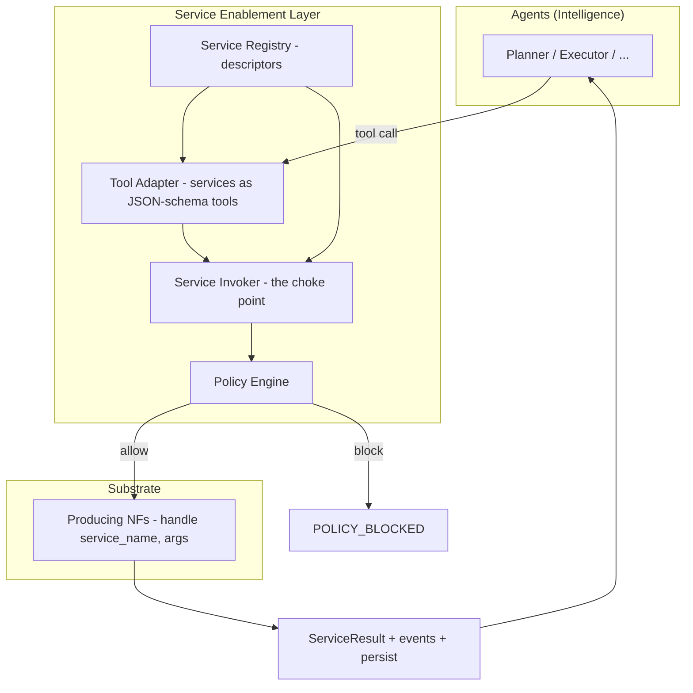
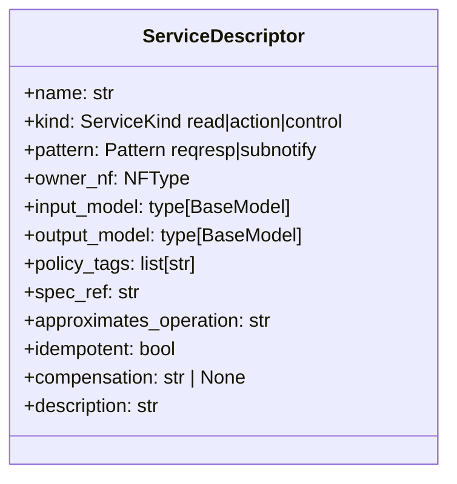
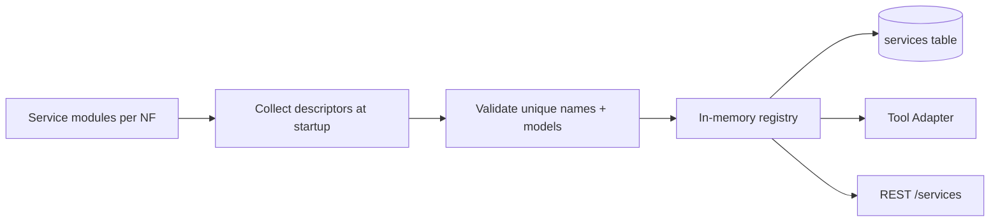
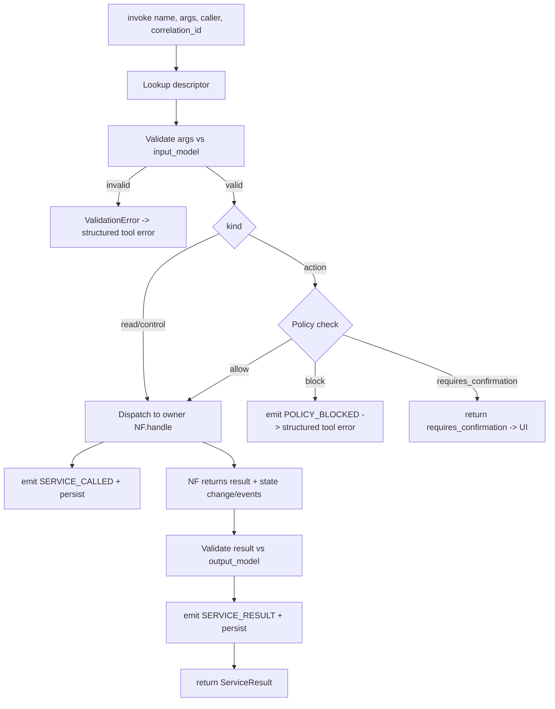
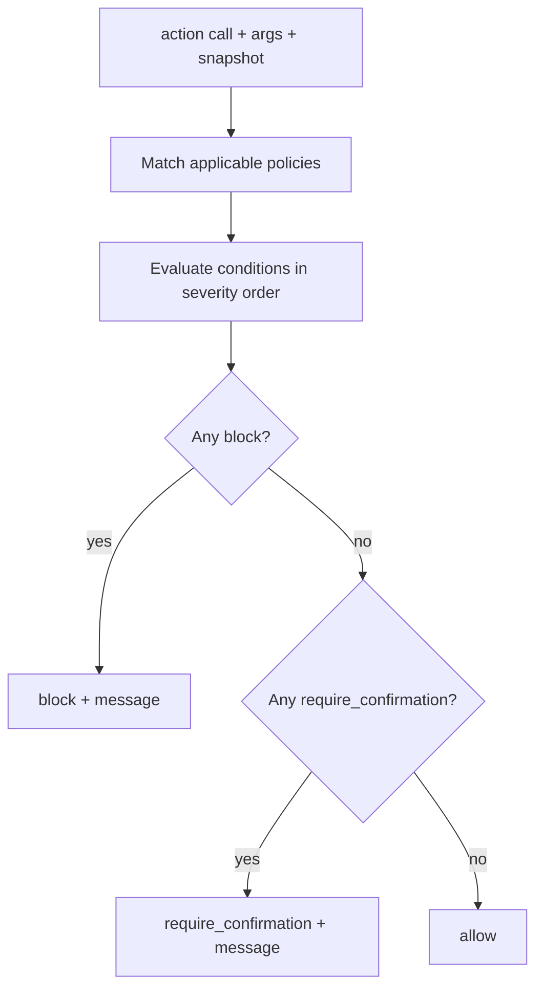
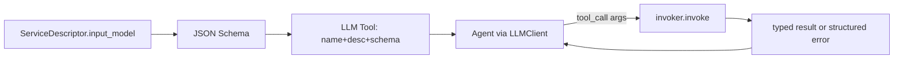

# 08 — Services (Service Enablement Layer)

> **Document ID:** `08-services.md`
> **Project:** Agent5G — Agentic AI Service Enablement Platform for 5G Advanced Release 20
> **Document Type:** Service Enablement Layer specification (the bridge between intelligence and substrate)
> **Status:** Authoritative for the service model, the service catalog and contracts, the policy/guardrail model, the invocation pipeline, and the agent tool adapter. The NFs that own these services are in `07-network-core.md`; the agents that call them are in `05-agents.md`; the REST surface is in `09-api.md`.
> **Depends on:** `01-system.md` (SEL as the sole intelligence→substrate bridge, invariant P2), `03-architecture.md` (SEL architecture §12, event core), `05-agents.md` (tools model), `07-network-core.md` (producing NFs + standards mapping).
> **Audience:** Backend engineers, AI engineers building tools, researchers auditing the capability catalog and policy behavior.

---

## Table of Contents

1. [Purpose](#1-purpose)
2. [Overview](#2-overview)
3. [Design Principles](#3-design-principles)
4. [The Service Model](#4-the-service-model)
5. [Service Descriptor Schema](#5-service-descriptor-schema)
6. [The Service Registry](#6-the-service-registry)
7. [The Invocation Pipeline](#7-the-invocation-pipeline)
8. [The Policy and Guardrail Model](#8-the-policy-and-guardrail-model)
9. [The Tool Adapter (Services as Agent Tools)](#9-the-tool-adapter-services-as-agent-tools)
10. [Service Catalog](#10-service-catalog)
    - [10.1 Discovery & Registry (NRF)](#101-discovery--registry-nrf)
    - [10.2 Read / Observation Services](#102-read--observation-services)
    - [10.3 Analytics Services (NWDAF)](#103-analytics-services-nwdaf)
    - [10.4 Data Collection Services (DCF)](#104-data-collection-services-dcf)
    - [10.5 Model Lifecycle Services (AIMLE)](#105-model-lifecycle-services-aimle)
    - [10.6 Control-Plane Action Services](#106-control-plane-action-services)
    - [10.7 User-Plane & QoS Action Services](#107-user-plane--qos-action-services)
    - [10.8 Exposure Services (NEF)](#108-exposure-services-nef)
    - [10.9 Memory & Knowledge Services](#109-memory--knowledge-services)
    - [10.10 Simulation Control Services](#1010-simulation-control-services)
11. [Interfaces and Contracts](#11-interfaces-and-contracts)
12. [Folder References](#12-folder-references)
13. [Design Decisions](#13-design-decisions)
14. [Future Extensibility](#14-future-extensibility)
15. [Engineering / Implementation / Research Notes](#15-engineering--implementation--research-notes)
16. [Example Scenarios](#16-example-scenarios)
17. [Kiro Build Guidance](#17-kiro-build-guidance)
18. [Acceptance Criteria](#18-acceptance-criteria)

---

## 1. Purpose

The Service Enablement Layer (SEL) is the architectural embodiment of the project's thesis: network capabilities are exposed as **discoverable, typed, invokable services**, and the agentic intelligence layer acts on the network *only* through them (invariant P2). This document specifies:

- The **service model** — what a service is, its typed contract, ownership, and standards mapping.
- The **Service Registry** — how services are registered, discovered, and persisted (the SEL analog of the NRF).
- The **invocation pipeline** — the single choke point (validate → policy → dispatch → emit → persist) through which every service call flows.
- The **policy/guardrail model** — deterministic safety enforced in code, not by the LLM.
- The **tool adapter** — how services become JSON-schema tools that agents (and, later, MCP clients) call.
- The **service catalog** — the complete, authoritative list of services, grouped, each with contract and mapping.

This document is where `05-agents.md` (what calls services), `07-network-core.md` (what owns services), and `09-api.md` (what exposes them over REST) meet. It is the contract everyone else consumes.

---

## 2. Overview

The SEL sits in the **Application layer** (`application/sel/`) and has three collaborating parts, plus the policy store in the Domain.



*Figure 2.1 — SEL: registry describes services, invoker enforces the pipeline, tool adapter exposes them, policy gates actions.*

Every service call — whether from an agent, the UI (try-it / REST), or NF-to-NF — passes through the **Service Invoker**, guaranteeing uniform validation, policy enforcement, eventing, and persistence. There is no other path to mutate or read the twin's capabilities (P2, ND-2 from `07`).

---

## 3. Design Principles

- **SP1 — One choke point.** All invocation flows through the Invoker. No agent or router calls an NF handler directly.
- **SP2 — Typed contracts.** Every service has a Pydantic input and output model; invalid calls fail before dispatch.
- **SP3 — Safe by default.** Read services are side-effect-free and unrestricted; action services are policy-checked. The default for a new action service is "requires a policy decision."
- **SP4 — Discoverable.** Services are registered with metadata (owner, region, tags, standards mapping) and discoverable at runtime, mirroring NRF/SBA.
- **SP5 — Standards-mapped.** Every service records `spec_ref` and `approximates_operation` (`07` §3) — fidelity is auditable and the Service Registry UI displays it.
- **SP6 — Auditable.** Every call emits `SERVICE_CALLED`/`SERVICE_RESULT` (or `POLICY_BLOCKED`) and persists a log row with the correlation id (P3).
- **SP7 — Tool-ready.** Contracts are shaped so the Tool Adapter can derive JSON-schema tools automatically — the same shape MCP will consume.
- **SP8 — Idempotency & compensation aware.** Action services declare whether they are idempotent and name their compensating service (used by the Recovery agent).

---

## 4. The Service Model

A **service** is a named capability with a typed contract, owned by exactly one NF, classified by effect.

- **Name:** `{nf}.{domain}.{action}` (e.g., `nwdaf.analytics.congestion.subscribe`). Lowercase, dot-separated, stable.
- **Kind:** `read` (no side effects), `action` (mutates twin state, policy-checked), or `control` (simulation/platform control).
- **Pattern:** `request_response` or `subscribe_notify` (subscriptions emit periodic notify events).
- **Owner:** the producing NF (`07`), which implements `handle(name, args)`.
- **Contract:** Pydantic `input_model` and `output_model`.
- **Policy tags:** labels the Policy Engine keys on (e.g., `mutates:nrf`, `region-scoped`, `high-impact`).
- **Standards mapping:** `spec_ref`, `approximates_operation`.
- **Compensation:** for actions, the name of the inverse service (e.g., `aimle.model.deploy` ↔ `aimle.model.retire`) and an `idempotent` flag.



*Figure 4.1 — The `ServiceDescriptor`.*

---

## 5. Service Descriptor Schema

The descriptor is the registry's unit and the source for both the tool schema and the REST docs.

| Field | Type | Purpose |
|-------|------|---------|
| `name` | str | unique `{nf}.{domain}.{action}` |
| `kind` | enum | `read` / `action` / `control` |
| `pattern` | enum | `request_response` / `subscribe_notify` |
| `owner_nf` | `NFType` | which NF handles it |
| `input_model` | Pydantic | validated arguments |
| `output_model` | Pydantic | validated result |
| `policy_tags` | list[str] | keys for the Policy Engine |
| `spec_ref` | str | 3GPP clause approximated (`07`) |
| `approximates_operation` | str | real SBA operation |
| `idempotent` | bool | safe to retry as-is? |
| `compensation` | str? | inverse service for rollback |
| `description` | str | human/agent-facing summary |
| `metrics` | derived | call_count, avg_latency, last_called (from `logs`) |

Descriptors are declared in code (one module per NF service group) and registered at startup; they are also persisted to the `services` table so the registry survives restarts and the UI can list them without importing code.

---

## 6. The Service Registry

The registry (`application/sel/registry.py`) is the SEL's discoverable catalog — the SBA/NRF analog for capabilities.

**Responsibilities:**
- **Register** descriptors at startup (from code) and persist to `services`.
- **Discover/list** services by NF, domain, kind, region, or policy tag (`services.list`, `GET /services`).
- **Describe** a single service's full contract (`services.describe`, `GET /services/{name}`).
- **Track metrics** (call count, avg latency, last-called) computed from `logs`.
- **Expose** descriptors to the Tool Adapter and the REST layer.

**Registration flow:**


*Figure 6.1 — Registry population.*

The registry is authoritative at runtime; the DB copy is for persistence/UI. On startup the registry reconciles code descriptors with the DB (adds new, marks removed) so the catalog is never stale.

---

## 7. The Invocation Pipeline

Every call flows through the Invoker (`application/sel/invoker.py`) — the single choke point (SP1).



*Figure 7.1 — The invocation pipeline (validate → policy → dispatch → emit → persist).*

**Guarantees:**
- **Validation first:** malformed calls never reach an NF; the caller (agent) gets a structured error to adapt to (not a crash).
- **Policy for actions:** every `action` is checked; `read`/`control` skip policy (control has its own guards).
- **Persist-first eventing:** `SERVICE_CALLED`/`SERVICE_RESULT`/`POLICY_BLOCKED` are persisted (write-through) and fanned out (`03` §8).
- **Correlation:** the workflow `correlation_id` is threaded through so Logs can reconstruct the full call graph.
- **Result typing:** results are validated against `output_model` before returning — no untyped blobs leak to agents.
- **Compensation logging:** on a successful `action`, the Executor records the `compensation` service for Recovery (`05` §9.2/§9.5).

---

## 8. The Policy and Guardrail Model

Guardrails are **deterministic code**, evaluated by the Policy Engine at the invoker's policy step for every `action` (AP4 from `05`). Policies are stored in the `policies` table and editable in Settings.

**Policy structure:**
- `id`, `name`, `enabled`, `severity`.
- `match`: which services/tags/regions it applies to (e.g., `tag=mutates:nrf`, `service=aimle.model.deploy`).
- `condition`: a predicate over the call args + current twin snapshot (e.g., "would leave zero active NRF", "target NF status == FAILED").
- `decision`: `allow` | `block` | `require_confirmation`.
- `message`: human-readable reason (surfaced in Agent Console + Logs).

**Built-in policies (baseline):**

| ID | Name | Applies to | Condition → Decision |
|----|------|-----------|----------------------|
| PLC-1 | Never zero NRF | `nrf.deregister` | would leave 0 active NRF → **block** |
| PLC-2 | Healthy target only | `aimle.model.deploy` | target NF/Edge status == FAILED → **block** |
| PLC-3 | Action rate limit | all actions | > N actions in current workflow → **block** (bounded autonomy) |
| PLC-4 | Region scoping | region-scoped actions | intent region ≠ target region → **block** |
| PLC-5 | High-impact confirm | `tag=high-impact` (e.g., mass deregister) | always → **require_confirmation** (HITL) |
| PLC-6 | No-op on stable | mitigation actions | KPI already within bounds → **block** (avoid needless churn) |

**Decision handling:**
- `block` → emit `POLICY_BLOCKED`, return a structured tool error; the agent must adapt or escalate (measured by H2).
- `require_confirmation` → return `requires_confirmation` with the reason; the UI prompts a human (HITL); on approval the call is re-issued with a confirmation token.
- `allow` → proceed to dispatch.



*Figure 8.1 — Policy evaluation order (block > confirm > allow).*

Policies are pure functions of `(args, snapshot)` → deterministic and testable, independent of LLM behavior. This is what makes the safety hypotheses (H2) measurable.

---

## 9. The Tool Adapter (Services as Agent Tools)

The Tool Adapter (`application/sel/tools.py`) turns registry descriptors into **JSON-schema tools** that the `LLMClient` exposes to agents.

- For each descriptor, derive a tool: `name`, `description`, and a JSON schema generated from `input_model` (Pydantic → JSON Schema).
- **Scoping:** each agent is bound only to the tools it may use (`05` §7): Observer/Planner/Optimizer/Documentation get `read`; Executor/Recovery get `action`; only Memory gets memory-**write** tools.
- **Execution:** a tool call routes to `invoker.invoke(name, args, caller=agent, correlation_id)` — so tools inherit all pipeline guarantees (validation, policy, eventing).
- **Errors as data:** validation/policy failures return structured tool errors the agent can reason about (not exceptions), enabling adaptation/retry.
- **MCP seam (SP7):** because tools are already name + JSON-schema + handler, the same set can be published as MCP server tools with no redesign (`20-future-work.md`).



*Figure 9.1 — Descriptor → JSON-schema tool → invoker.*

---

## 10. Service Catalog

The authoritative catalog. Each entry: name · kind/pattern · owner · input → output (summary) · policy tags · mapping. Full Pydantic models live in code (`application/sel/services/*` per NF); summarized here.

> Naming: `read` = safe; `action` = policy-checked mutation; `control` = platform/sim.

### 10.1 Discovery & Registry (NRF)

| Service | Kind/Pattern | Owner | Input → Output | Tags | Maps to |
|---------|-------------|-------|----------------|------|---------|
| `nrf.register` | action / reqresp | NRF | `NFProfile` → `{registered:true}` | `mutates:nrf` | `Nnrf_NFManagement_NFRegister` |
| `nrf.deregister` | action / reqresp | NRF | `{nf_id}` → `{deregistered:true}` | `mutates:nrf`,`high-impact` | `Nnrf_NFManagement_NFDeregister` |
| `nrf.discover` | read / reqresp | NRF | `{type, region?, tags?}` → `[NFProfile]` | — | `Nnrf_NFDiscovery_Request` |
| `nrf.list` | read / reqresp | NRF | `{}` → `[NFProfile]` | — | `Nnrf_NFManagement` |

`nrf.deregister` is guarded by PLC-1 (never zero NRF) and PLC-5 (high-impact confirm).

### 10.2 Read / Observation Services

| Service | Kind | Owner | Input → Output | Maps to |
|---------|------|-------|----------------|---------|
| `twin.snapshot` | read | Twin | `{scope?}` → `TwinSnapshot` | aggregate state read |
| `topology.get` | read | Twin | `{region?}` → `Topology` | topology read |
| `upf.metrics.get` | read | UPF | `{nf_id}` → `UpfMetrics` | user-plane metrics |
| `edge.metrics.get` | read | Edge | `{edge_id}` → `EdgeMetrics` | edge metrics |
| `amf.ue.context.get` | read | AMF | `{ue_id}` → `UeContext` | `Namf_Communication` |
| `smf.session.list` | read | SMF | `{ue_id?}` → `[Session]` | `Nsmf_PDUSession` |

### 10.3 Analytics Services (NWDAF)

| Service | Kind/Pattern | Owner | Input → Output | Maps to |
|---------|-------------|-------|----------------|---------|
| `nwdaf.analytics.congestion.query` | read / reqresp | NWDAF | `{region}` → `CongestionAnalytics` | `Nnwdaf_AnalyticsInfo_Request` |
| `nwdaf.analytics.congestion.subscribe` | action / subnotify | NWDAF | `{region, threshold?}` → `{subscription_id}` | `Nnwdaf_AnalyticsSubscription_Subscribe` |
| `nwdaf.analytics.qos.predict` | read / reqresp | NWDAF | `{region, horizon}` → `QosForecast` | `Nnwdaf_AnalyticsInfo_Request` |
| `nwdaf.analytics.load.query` | read / reqresp | NWDAF | `{nf_id or region}` → `LoadAnalytics` | `Nnwdaf_AnalyticsInfo_Request` |
| `nwdaf.analytics.abnormal.subscribe` | action / subnotify | NWDAF | `{scope}` → `{subscription_id}` | `Nnwdaf_AnalyticsSubscription_Subscribe` |
| `nwdaf.analytics.unsubscribe` | action / reqresp | NWDAF | `{subscription_id}` → `{ok}` | subscription mgmt (compensation for subscribes) |

Subscribe services declare `compensation = nwdaf.analytics.unsubscribe`.

### 10.4 Data Collection Services (DCF)

| Service | Kind/Pattern | Owner | Input → Output | Maps to |
|---------|-------------|-------|----------------|---------|
| `dcf.data.subscribe` | action / subnotify | DCF | `{producers[], metrics[], period}` → `{subscription_id}` | `Ndccf_DataManagement_Subscribe` |
| `dcf.data.query` | read / reqresp | DCF | `{producer, metric, range}` → `[Sample]` | `Ndccf_DataManagement` |
| `dcf.data.history` | read / reqresp | DCF | `{entity, kpi, range}` → `TimeSeries` | `Nadrf_DataManagement_Retrieve` |
| `dcf.data.unsubscribe` | action / reqresp | DCF | `{subscription_id}` → `{ok}` | compensation for subscribes |

### 10.5 Model Lifecycle Services (AIMLE)

| Service | Kind/Pattern | Owner | Input → Output | Tags | Maps to |
|---------|-------------|-------|----------------|------|---------|
| `aimle.model.register` | action / reqresp | NWDAF | `ModelMeta` → `{model_id}` | `mutates:model` | `Nnwdaf_MLModelProvision` |
| `aimle.model.deploy` | action / reqresp | NWDAF/Edge | `{model_id, target}` → `ModelInstance` | `mutates:model`,`region-scoped` | `Nnwdaf_MLModelProvision_Subscribe` |
| `aimle.model.status` | read / reqresp | NWDAF/Edge | `{model_id}` → `ModelInstance` | — | model status |
| `aimle.model.retire` | action / reqresp | NWDAF/Edge | `{model_id, target}` → `{ok}` | `mutates:model` | model retire (compensation for deploy) |

`aimle.model.deploy` is guarded by PLC-2 (healthy target) and PLC-4 (region scoping); `compensation = aimle.model.retire`.

### 10.6 Control-Plane Action Services

| Service | Kind | Owner | Input → Output | Tags | Maps to |
|---------|------|-------|----------------|------|---------|
| `smf.session.create` | action | SMF | `{ue_id, qos}` → `Session` | `mutates:session` | `Nsmf_PDUSession_CreateSMContext` |
| `smf.session.modify` | action | SMF | `{session_id, qos}` → `Session` | `mutates:session` | `Nsmf_PDUSession_UpdateSMContext` |
| `smf.session.release` | action | SMF | `{session_id}` → `{ok}` | `mutates:session` | `Nsmf_PDUSession_ReleaseSMContext` |
| `pcf.policy.apply` | action | PCF | `{scope, qos_rule}` → `{policy_id}` | `mutates:policy` | `Npcf_SMPolicyControl_Update` |
| `pcf.policy.get` | read | PCF | `{scope}` → `[Policy]` | — | `Npcf_SMPolicyControl` |
| `amf.ue.register` | action | AMF | `{ue_id}` → `UeContext` | `mutates:registration` | `Namf_Communication` |

### 10.7 User-Plane & QoS Action Services

| Service | Kind | Owner | Input → Output | Tags | Maps to |
|---------|------|-------|----------------|------|---------|
| `upf.loadbalance.apply` | action | UPF | `{from_upf, to_upf, fraction}` → `{ok, moved}` | `mutates:userplane`,`region-scoped` | N4 session redistribution (modeled) |
| `upf.session.install` | action | UPF | `{session}` → `{ok}` | `mutates:userplane` | N4 install |
| `edge.model.run` | action | Edge | `{model_id}` → `{ok}` | `mutates:edge` | edge inference (modeled) |

`upf.loadbalance.apply` guarded by PLC-4 (region) and PLC-6 (no-op if stable); compensation restores prior distribution.

### 10.8 Exposure Services (NEF)

| Service | Kind/Pattern | Owner | Input → Output | Tags | Maps to |
|---------|-------------|-------|----------------|------|---------|
| `nef.qos.request` | action / reqresp | NEF | `{flow, target_qos}` → `{request_id}` | `mutates:qos`,`region-scoped` | `Nnef_AFsessionWithQoS` |
| `nef.event.subscribe` | action / subnotify | NEF | `{event_type, scope}` → `{subscription_id}` | — | `Nnef_EventExposure_Subscribe` |
| `nef.analytics.expose` | read / reqresp | NEF | `{analytics_type, scope}` → `AnalyticsView` | — | `Nnef_*` (CAMARA analog) |

### 10.9 Memory & Knowledge Services

Owned by the memory subsystem (`05` §6), exposed as tools; **write** tools restricted to the Memory agent (AP1).

| Service | Kind | Input → Output | Restriction |
|---------|------|----------------|-------------|
| `memory.read` | read | `{scope, query}` → `[MemoryRecord]` | all agents |
| `memory.write` | action | `MemoryWrite` → `{id}` | Memory agent only |
| `knowledge.query` | read | `{entity?, relation?, depth?}` → `KnowledgeSubgraph` | all agents |
| `knowledge.upsert` | action | `KnowledgeDelta` → `{ok}` | Memory agent only |

These are `action`/`read` against the `MemoryStore` (not the twin), but flow through the same invoker for uniform auditing.

### 10.10 Simulation Control Services

`control` kind — platform/sim operations, exposed to the UI (`09` `/simulation/*`), not to agents (agents operate on the network, not the simulator clock).

| Service | Input → Output | Notes |
|---------|----------------|-------|
| `simulation.start` | `{}` → `{status}` | start clock |
| `simulation.pause` | `{}` → `{status}` | pause (preserve state) |
| `simulation.step` | `{ticks?}` → `{tick}` | single/N-step |
| `simulation.reset` | `{seed?, scenario?}` → `{status}` | rebuild (guarded, confirm in UI) |
| `simulation.seed` | `{seed}` → `{ok}` | set RNG seed |
| `simulation.scenario` | `{name, seed?}` → `{status}` | load preset |
| `simulation.fault` | `FaultSpec` → `{ok}` | inject fault |

---

## 11. Interfaces and Contracts

- **`ServiceRegistry` port** (`domain/services/ports.py`): `register(descriptor)`, `get(name)`, `list(filter)`, `all()`.
- **`ServiceInvoker`** (`application/sel/invoker.py`): `async invoke(name, args, caller, correlation_id, confirmation_token?) -> ServiceResult`.
- **`PolicyStore` port** + **Policy Engine** (`domain/services/policy.py`): `evaluate(descriptor, args, snapshot) -> PolicyDecision`.
- **`ToolAdapter`** (`application/sel/tools.py`): `tools_for(agent_role) -> list[Tool]`, each routing to `invoke`.
- **`ServiceResult`**: `{name, status: ok|blocked|error|requires_confirmation, output?, error?, events[], latency_ms}`.
- **NF handler contract** (`07` §9): `NetworkFunction.handle(name, args) -> handler result` (invoker wraps it into `ServiceResult`).
- **Persistence:** descriptors → `services`; calls/results/blocks → `logs` + `events` (`12`).

---

## 12. Folder References

```text
backend/app/
├── domain/services/
│   ├── models.py      # ServiceDescriptor, ServiceKind, Pattern, ServiceResult
│   ├── policy.py      # Policy, PolicyDecision, Policy Engine interface
│   └── ports.py       # ServiceRegistry, PolicyStore
├── application/sel/
│   ├── registry.py    # registration + discovery + metrics
│   ├── invoker.py     # the choke-point pipeline
│   ├── policy_engine.py  # deterministic policy evaluation
│   ├── tools.py       # descriptors -> JSON-schema tools (agent + MCP seam)
│   └── services/      # one module per NF group declaring descriptors + input/output models
│       ├── nrf.py nwdaf.py dcf.py aimle.py smf.py pcf.py upf.py nef.py amf.py
│       ├── memory.py knowledge.py simulation.py twin_read.py
```

This document owns the *SEL + catalog*; owning NFs are in `07`; agent tool scoping in `05`; REST exposure in `09`; policy table in `12`.

---

## 13. Design Decisions

- **SD-1 — Single invoker choke point.** Rationale: uniform validation/policy/audit; enforces P2. Trade-off: all calls pay pipeline overhead; negligible and worth it.
- **SD-2 — Descriptors declared in code, persisted to DB.** Rationale: type-safe source of truth + UI/REST can read without importing. Trade-off: reconciliation logic; keeps catalog fresh.
- **SD-3 — Policy as deterministic code, DB-stored config.** Rationale: guaranteed safety independent of LLM; editable without redeploy. Trade-off: must author policies; desirable.
- **SD-4 — Errors as structured data, not exceptions, to agents.** Rationale: enables agent adaptation/retry (H2). Trade-off: two error channels (structured for agents, HTTP for REST); mapped consistently.
- **SD-5 — Compensation declared per action.** Rationale: makes Recovery's rollback plan mechanical. Trade-off: every action must name/support an inverse; enforced at registration.
- **SD-6 — Simulation control is `control`, not agent-accessible.** Rationale: agents manage the network, not the simulator (avoids agents "cheating" by pausing time). Trade-off: none; conceptually correct.
- **SD-7 — Memory/knowledge exposed as services too.** Rationale: uniform tool model + auditing for cognition. Trade-off: slight over-abstraction; consistency wins.

---

## 14. Future Extensibility

- **MCP publication (SP7).** Publish the Tool Adapter's tools as MCP server tools; external agents/clients invoke Agent5G capabilities with identical contracts.
- **Real SBA backends.** Point NF handlers at Open5GS NFs; descriptors/contracts unchanged (the `07` §8 mapping is the checklist).
- **CAMARA northbound.** Promote NEF exposure services to real CAMARA APIs behind a gateway.
- **Dynamic service registration.** Allow NFs (or plugins) to register services at runtime, not just startup — closer to true SBA dynamism.
- **Policy-as-config DSL.** Evolve policies from code + DB rows to a small declarative DSL/rules engine for non-developers to author guardrails.
- **Versioned contracts.** Add `service_version` for evolving contracts without breaking agents/UI.

---

## 15. Engineering / Implementation / Research Notes

**Engineering.**
- Generate JSON schemas from Pydantic once and cache them; regenerate on registry change.
- Keep read services truly side-effect-free (no writes, no events beyond the call log) so Observer/Planner can call freely.
- Thread `correlation_id` from the workflow through every `invoke` so Logs reconstruct the whole call graph in one query.

**Implementation.**
- Build order: `ServiceDescriptor`/`ServiceResult` → registry → invoker (validate/dispatch/emit) → policy engine + built-in policies → tool adapter → per-NF service modules.
- Implement `nrf.*` and `twin.snapshot` first (needed for the earliest vertical slice), then analytics/AIMLE for Scenario A.
- Every action module must declare `compensation` + `idempotent`; add a registration-time check that fails startup if an action lacks a compensation.

**Research.**
- The invoker is the instrumentation point for **plan correctness** (were the right services called in the right order?) and **policy compliance** (H2). Persist enough to compute both from `logs`.
- Tag services so experiments can measure per-category behavior (e.g., how often agents choose analytics reads before actions).
- Record policy decisions (`allow`/`block`/`confirm`) per workflow for the safety metric.

---

## 16. Example Scenarios

**Scenario A (SEL view).** Executor tool calls: `nrf.discover(Edge, Delhi)` (read) → `aimle.model.deploy(model, DelhiEdge)` (action; PLC-2 healthy-target passes; compensation `aimle.model.retire` logged) → `nwdaf.analytics.congestion.subscribe(Delhi)` (action; compensation `nwdaf.analytics.unsubscribe` logged). Each emits `SERVICE_CALLED`/`SERVICE_RESULT`; validation reads via `aimle.model.status` + subscription list.

**Scenario B (SEL view).** Breach triggers workflow; Optimizer reads `dcf.data.history` + `nwdaf.analytics.load.query`; Executor calls `upf.loadbalance.apply` — PLC-6 checks it isn't a no-op, PLC-4 checks region; on success, prior distribution logged as compensation.

**Scenario C (SEL view).** With NRF failed, `nrf.discover` returns a structured error (no producer) → Executor step fails → Recovery uses `nrf.register` on a standby (PLC-1 ensures we never deregister to zero). All blocks/errors are `POLICY_BLOCKED`/error rows in Logs.

---

## 17. Kiro Build Guidance

### 17.1 Implementation Order
1. `domain/services/models.py` (`ServiceDescriptor`, `ServiceResult`, enums) + `policy.py`.
2. `application/sel/registry.py` (register + discover + persist to `services`).
3. `application/sel/invoker.py` (validate → policy → dispatch → emit → persist).
4. `application/sel/policy_engine.py` + built-in policies PLC-1..6.
5. `application/sel/tools.py` (descriptors → JSON-schema tools, per-role scoping).
6. Per-NF service modules (`nrf` + `twin_read` first, then analytics/AIMLE, then the rest).

### 17.2 Coding Rules
- All invocation via the invoker (SP1/P2); no router or agent calls `NF.handle` directly.
- Every service has typed `input_model`/`output_model` (SP2); results validated before return.
- Every `action` declares `policy_tags`, `idempotent`, and `compensation` (SD-5); startup check enforces it.
- `read` services are side-effect-free; `control` is UI-only, never bound as an agent tool (SD-6).
- Policies are pure `(args, snapshot) -> decision`; no LLM in the policy path (SD-3).
- Every call threads `correlation_id` and emits `SERVICE_CALLED`/`SERVICE_RESULT`/`POLICY_BLOCKED`.

### 17.3 Naming Convention
- Services `{nf}.{domain}.{action}` (lowercase, dotted). Compensations are the paired `.retire`/`.unsubscribe`/`.release`.
- Policy ids `PLC-n`; policy tags `verb:target` (`mutates:nrf`, `region-scoped`, `high-impact`).
- Descriptor modules named per NF group (`nwdaf.py`, `aimle.py`, ...).

### 17.4 Folder Ownership
- `domain/services/*` + `application/sel/*` owned here; owning NFs in `07`; agent tool scoping in `05`; REST in `09`; `policies`/`services` tables in `12`.

### 17.5 Prompt Suggestions
- "Implement the `ServiceInvoker` pipeline: lookup → validate input → policy check (actions only) → dispatch to `NF.handle` → validate output → emit + persist."
- "Implement the deterministic Policy Engine with PLC-1..6 as pure functions of (args, twin snapshot)."
- "Declare all catalog services from `08-services.md` §10 as `ServiceDescriptor`s with Pydantic models, tags, compensations, and `spec_ref`/`approximates_operation`."
- "Implement the Tool Adapter deriving JSON-schema tools per agent role, routing calls through the invoker."

### 17.6 Acceptance Criteria
- Startup fails if any `action` service lacks a `compensation`.
- A blocked action (e.g., deploy to a FAILED edge) yields `POLICY_BLOCKED` and a structured tool error, not a crash.
- Every catalog service is discoverable via `services.list` and shows its `spec_ref` in the Registry UI.

---

## 18. Acceptance Criteria

This document is **complete and correct** when:

- [ ] **AC-1.** The service model (name, kind, pattern, owner, contract, tags, mapping, compensation) is specified with a descriptor schema.
- [ ] **AC-2.** The Service Registry (register/discover/describe/metrics, code→DB persistence, reconciliation) is specified.
- [ ] **AC-3.** The invocation pipeline (validate → policy → dispatch → emit → persist) is specified and diagrammed with its guarantees.
- [ ] **AC-4.** The policy model (structure, built-ins PLC-1..6, block/confirm/allow ordering) is specified as deterministic code.
- [ ] **AC-5.** The Tool Adapter (descriptors → JSON-schema tools, per-role scoping, errors-as-data, MCP seam) is specified.
- [ ] **AC-6.** A complete service catalog is provided across all groups (NRF, reads, NWDAF, DCF, AIMLE, control-plane, user-plane/QoS, NEF, memory/knowledge, simulation), each with owner, contract summary, tags, and mapping.
- [ ] **AC-7.** Interfaces (`ServiceRegistry`, `ServiceInvoker`, `PolicyStore`, `ToolAdapter`, `ServiceResult`, NF handler) are enumerated.
- [ ] **AC-8.** The invariant that all invocation flows through the invoker (P2/SP1) is stated and enforced.
- [ ] **AC-9.** Compensation/idempotency per action (for Recovery) is specified.
- [ ] **AC-10.** Design decisions, extensibility, notes, example scenarios (SEL view), and Kiro guidance are present.
- [ ] **AC-11.** Mermaid diagrams illustrate the SEL, the pipeline, policy evaluation, and the tool derivation.
- [ ] **AC-12.** Every catalog service aligns with an owning NF in `07` and will map to a REST route in `09`.

---

**NEXT FILE**
