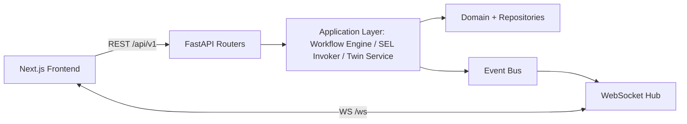
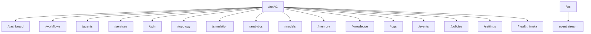

# 09 — API Specification (REST + WebSocket)

> **Document ID:** `09-api.md`
> **Project:** Agent5G — Agentic AI Service Enablement Platform for 5G Advanced Release 20
> **Document Type:** External API contract (the I2 interface between frontend and backend)
> **Status:** Authoritative for every REST endpoint, the WebSocket event stream, request/response schemas, status codes, validation, and error format. The backend that implements these is in `10-backend.md`; the frontend that consumes them is in `11-frontend.md`; the services behind the action endpoints are in `08-services.md`.
> **Depends on:** `03-architecture.md` (interface I2, event envelope, versioning), `08-services.md` (service catalog behind action endpoints), `06-digital-twin.md` (twin/simulation), `05-agents.md` (workflows).
> **Audience:** Frontend engineers, backend engineers, integration testers, researchers scripting the API.

---

## Table of Contents

1. [Purpose](#1-purpose)
2. [Overview](#2-overview)
3. [API Design Principles](#3-api-design-principles)
4. [Conventions](#4-conventions)
5. [Error Model](#5-error-model)
6. [Authentication and Security Posture](#6-authentication-and-security-posture)
7. [Versioning and Contract Sync](#7-versioning-and-contract-sync)
8. [Resource Map](#8-resource-map)
9. [REST Endpoints](#9-rest-endpoints)
   - [9.1 Dashboard](#91-dashboard)
   - [9.2 Workflows](#92-workflows)
   - [9.3 Agents](#93-agents)
   - [9.4 Services (SEL)](#94-services-sel)
   - [9.5 Twin & Topology](#95-twin--topology)
   - [9.6 Simulation](#96-simulation)
   - [9.7 Analytics](#97-analytics)
   - [9.8 Models (AIMLE)](#98-models-aimle)
   - [9.9 Memory & Knowledge](#99-memory--knowledge)
   - [9.10 Logs & Events](#910-logs--events)
   - [9.11 Policies](#911-policies)
   - [9.12 Settings](#912-settings)
   - [9.13 Health & Meta](#913-health--meta)
10. [WebSocket API](#10-websocket-api)
11. [Pagination, Filtering, Sorting](#11-pagination-filtering-sorting)
12. [Interfaces and Contracts](#12-interfaces-and-contracts)
13. [Folder References](#13-folder-references)
14. [Design Decisions](#14-design-decisions)
15. [Future Extensibility](#15-future-extensibility)
16. [Engineering / Implementation / Research Notes](#16-engineering--implementation--research-notes)
17. [Example Scenarios (API Flows)](#17-example-scenarios-api-flows)
18. [Kiro Build Guidance](#18-kiro-build-guidance)
19. [Acceptance Criteria](#19-acceptance-criteria)

---

## 1. Purpose

This document is the **authoritative contract** for the boundary between the Agent5G frontend and backend (interface I2 from `01-system.md`/`03-architecture.md`). It specifies every REST endpoint and the WebSocket event stream with enough precision that the frontend can be built against a mock, the backend can be implemented to match, and integration tests can assert conformance — without either side guessing.

Because the platform is **contract-first** (principle P5), this document is the single source of truth from which the OpenAPI schema and the frontend's generated TypeScript types derive. Any endpoint not defined here does not exist; any field not defined here is not part of the contract.

The API is deliberately **thin over the domain**: REST routers translate HTTP to application-layer calls (workflow engine, SEL invoker, twin service) and back, adding no business logic (Clean Architecture, `03` §5). Action endpoints are façades over SEL services (`08`); read endpoints are façades over repositories and the twin snapshot.

---

## 2. Overview

The backend exposes:

- A **REST API** under `/api/v1` (JSON over HTTP on `localhost:8000`) for CRUD, queries, commands, and control.
- A **WebSocket** at `/ws` streaming the canonical event envelope for live updates (the telemetry-up path).
- Auto-generated **OpenAPI** docs at `/docs` (Swagger UI) and `/openapi.json` (FastAPI built-in).



*Figure 2.1 — REST for request/response; WebSocket for the live event stream; both thin over the application layer.*

REST is used for **commands and queries**; the WebSocket is used for **live state propagation** (KPIs, events, workflow stage changes). The frontend never polls (UD-5); it reads once via REST and stays live via WS.

---

## 3. API Design Principles

- **AP1 — Contract-first.** Schemas here → OpenAPI → generated TS types. No hand-authored client shapes (P5).
- **AP2 — Resource-oriented REST.** Nouns for resources (`/workflows`, `/models`), verbs only for controls that don't map to CRUD (`/simulation/start`).
- **AP3 — Thin routers.** Routers validate, call the application layer, serialize. No domain logic in `api/`.
- **AP4 — Uniform errors.** All errors use one problem+json-style envelope (§5).
- **AP5 — Async-safe.** Long operations (starting a workflow) return immediately with a resource + status; progress arrives via WS (not blocking HTTP).
- **AP6 — Actions are SEL façades.** Any endpoint that mutates the twin delegates to a SEL service so policy/eventing/audit are inherited (P2).
- **AP7 — Predictable pagination/filtering.** One consistent scheme across all list endpoints (§11).
- **AP8 — Idempotency for actions.** Mutating POSTs accept an optional `Idempotency-Key` to make retries safe.

---

## 4. Conventions

- **Base URL:** `http://localhost:8000/api/v1`. WebSocket: `ws://localhost:8000/ws`.
- **Content type:** `application/json; charset=utf-8` for requests and responses.
- **Timestamps:** ISO-8601 UTC (`2026-07-21T10:15:30Z`). Sim time also carries a `tick` integer.
- **IDs:** string identifiers. Workflows: `wf_{uuid}`; NFs: `{type}_{region}_{n}` (e.g., `upf_delhi_1`); models: `model_{uuid}`; subscriptions: `sub_{uuid}`.
- **Correlation:** clients may send `X-Correlation-Id`; the server generates one (`wf_{uuid}` for workflows) and echoes it in responses and related WS events.
- **Casing:** JSON fields are `snake_case` (matches Pydantic; TS types generated accordingly).
- **Enums:** serialized as strings (e.g., NF status `"ACTIVE"`, workflow stage `"execute"`).
- **Booleans/nullability:** explicit; optional fields are nullable and documented.

---

## 5. Error Model

All non-2xx responses use a single envelope (RFC 7807-inspired):

```json
{
  "type": "https://agent5g.local/errors/validation",
  "title": "Validation failed",
  "status": 422,
  "detail": "field 'region' is required",
  "correlation_id": "wf_1a2b3c",
  "errors": [
    { "field": "region", "message": "field required" }
  ]
}
```

| Status | Meaning | When |
|--------|---------|------|
| `400` | Bad Request | malformed JSON / bad query params |
| `404` | Not Found | unknown resource id |
| `409` | Conflict | duplicate / state conflict (e.g., start already-running sim) |
| `422` | Unprocessable Entity | Pydantic validation failure (with `errors[]`) |
| `423` | Locked / Policy Blocked | a SEL action was blocked by policy (`POLICY_BLOCKED`) |
| `428` | Precondition Required | action needs confirmation (HITL) — returns a confirmation token |
| `429` | Too Many Requests | rate limit (PLC-3 style) |
| `500` | Internal Server Error | unexpected; logged with correlation id |
| `503` | Service Unavailable | dependency down (e.g., LLM in live mode unreachable) |

**Policy-specific:** a blocked SEL action returns `423` with `type=.../policy-blocked` and the policy `message`; an action requiring confirmation returns `428` with `{ "confirmation_token": "...", "reason": "..." }`. The client re-issues with `X-Confirmation-Token`.

---

## 6. Authentication and Security Posture

> **Security note (must be read):** In the base local build, the API is **unauthenticated** and bound to `localhost` only. Mutating endpoints (workflows, simulation, models, policies) are therefore open to any local process. This is acceptable **only** for a single-user research prototype on `127.0.0.1`.
>
> **Before any non-local exposure**, add authentication and authorization first (see `17-deployment.md`). Recommended path: a bearer-token/API-key middleware in the Delivery layer plus a `users`/roles model, gating all `action`/`control` endpoints. This is deliberately flagged, not silently omitted.

For the prototype: CORS is restricted to the local frontend origin (`http://localhost:3000`); the WebSocket accepts connections only from that origin. Secrets (Claude API key) live in `.env`, are never returned by any endpoint, and Settings responses mask them (referenced by name, never value).

---

## 7. Versioning and Contract Sync

- **Path versioning:** `/api/v1`. Breaking changes bump to `/api/v2`; additive changes stay in v1.
- **Schema version:** responses may include a top-level `schema_version` where useful; the WS handshake reports the server contract version so the client can warn on mismatch.
- **Type generation:** the frontend generates `lib/types.ts` from `/openapi.json` (e.g., via `openapi-typescript`) as a build step. No manual duplication (P5/AP1). CI fails if generated types drift from committed types.

---

## 8. Resource Map



*Figure 8.1 — Top-level resource map (maps 1:1 to the UI pages in `04-ui.md`).*

---

## 9. REST Endpoints

For each: method, path, purpose, request, response, status codes, validation, example. Response bodies are summarized; full field lists live in the Pydantic schemas (`api/schemas/`).

### 9.1 Dashboard

**GET `/dashboard/summary`** — aggregate overview for the Dashboard page.
- **Request:** none.
- **Response 200:**
```json
{
  "active_workflows": 2,
  "nf_health_pct": 92.3,
  "p95_latency_ms": 18.4,
  "open_alerts": 3,
  "deployed_models": 1,
  "sim": { "status": "running", "tick": 142, "sim_time": "2026-07-21T10:15:30Z" }
}
```
- **Codes:** `200`, `500`.

### 9.2 Workflows

The core resource: a workflow is a run of the 8-stage lifecycle (`05`, `13`).

**POST `/workflows`** — create and start a workflow from an intent.
- **Request:**
```json
{ "goal": "Deploy congestion detection model to Delhi Edge", "metadata": { "source": "ui" } }
```
- **Validation:** `goal` non-empty string (1–2000 chars).
- **Response 201:**
```json
{
  "id": "wf_1a2b3c",
  "goal": "Deploy congestion detection model to Delhi Edge",
  "status": "running",
  "stage": "observe",
  "created_at": "2026-07-21T10:15:30Z",
  "correlation_id": "wf_1a2b3c"
}
```
- **Behavior (AP5):** returns immediately; progress streams over WS (`WORKFLOW_STAGE_CHANGED`, `SERVICE_*`).
- **Codes:** `201`, `422`, `429`, `503` (LLM unavailable in live mode).

**GET `/workflows`** — list workflows (paginated, filterable by `status`, `stage`, time range).
- **Response 200:** `{ "items": [WorkflowSummary...], "page": 1, "page_size": 20, "total": 57 }`.

**GET `/workflows/{id}`** — full workflow with current `WorkflowState` summary.
- **Response 200:** goal, status, stage, steps[], results[], validation, attempts, timestamps.
- **Codes:** `200`, `404`.

**GET `/workflows/{id}/trace`** — the full reasoning/execution trace (for Agent Console / research export).
- **Response 200:** ordered `trace[]` of `{ stage, agent, rationale, tool_calls[], timestamp }`.

**POST `/workflows/{id}/control`** — human-in-the-loop control.
- **Request:** `{ "action": "pause" | "resume" | "interrupt" | "retry_step" | "confirm", "confirmation_token": "..." }`.
- **Response 200:** updated workflow status.
- **Codes:** `200`, `404`, `409` (illegal transition), `428` (confirm needed).

**DELETE `/workflows/{id}`** — cancel a running workflow (triggers Recovery rollback if mid-execution).
- **Codes:** `200`, `404`, `409`.

**Templates:** **GET `/workflows/templates`**, **POST `/workflows/templates`** (save an authored graph from the Workflow Builder), **POST `/workflows/from-template/{template_id}`** (run one).

### 9.3 Agents

**GET `/agents`** — list agent specs (role, description, bound tools, memory scopes). Read-only metadata.
- **Response 200:** `[ { "role": "planner", "description": "...", "tools": [...], "memory": ["episodic","semantic"] }, ... ]` for all seven agents.

**GET `/agents/{role}`** — one agent's spec + recent activity stats (calls, avg latency, tokens — from `logs`).
- **Codes:** `200`, `404`.

### 9.4 Services (SEL)

Façade over the Service Registry (`08` §6) and Invoker (`08` §7).

**GET `/services`** — list registered services (filter by `nf`, `domain`, `kind`, `policy_tag`).
- **Response 200:** `[ ServiceDescriptorView... ]` including `name, kind, pattern, owner_nf, policy_tags, spec_ref, approximates_operation, metrics`.

**GET `/services/{name}`** — full descriptor incl. input/output JSON schema.
- **Codes:** `200`, `404`.

**POST `/services/{name}/invoke`** — guarded "try-it" (UI/testing) invocation through the SEL invoker.
- **Request:** `{ "args": { ... } }` (validated against the service `input_model`).
- **Response 200:** `ServiceResult` `{ name, status, output?, events[], latency_ms }`.
- **Codes:** `200`, `404`, `422` (bad args), `423` (policy blocked), `428` (confirm needed), `429`.
- **Note:** `control`-kind services are **not** invocable here (use `/simulation/*`); agent-only memory-write services are rejected for external callers.

### 9.5 Twin & Topology

**GET `/twin`** — full twin snapshot (all NFs current state + KPIs). Backed by `twin.snapshot`.
- **Query:** `?region=delhi` (optional scope).
- **Response 200:** `TwinSnapshot`.

**GET `/twin/nf/{id}`** — one NF's detailed state (Digital Twin page).
- **Codes:** `200`, `404`.

**GET `/twin/nf/{id}/kpis`** — KPI history for an NF.
- **Query:** `?kpi=latency_ms&from=...&to=...&resolution=tick`.
- **Response 200:** `{ "kpi": "latency_ms", "series": [ { "tick": 140, "ts": "...", "value": 18.4 }, ... ] }`.

**GET `/topology`** — topology graph (nodes + links) for the Topology page. Backed by `topology.get`.
- **Query:** `?region=` optional.
- **Response 200:** `{ "nodes": [NodeView...], "links": [LinkView...], "regions": [...] }`.

### 9.6 Simulation

Façade over `simulation.*` control services (`08` §10.10). All are `control` kind.

| Endpoint | Body | Purpose | Codes |
|----------|------|---------|-------|
| **GET `/simulation/status`** | — | current status/tick/seed/scenario | `200` |
| **POST `/simulation/start`** | `{}` | start clock | `200`, `409` (already running) |
| **POST `/simulation/pause`** | `{}` | pause | `200`, `409` |
| **POST `/simulation/step`** | `{ "ticks": 1 }` | advance N ticks | `200`, `409` (must be paused) |
| **POST `/simulation/reset`** | `{ "seed": 42, "scenario": "baseline_healthy" }` | rebuild (guarded; UI confirms) | `200`, `422` |
| **POST `/simulation/seed`** | `{ "seed": 42 }` | set RNG seed | `200`, `422` |
| **POST `/simulation/scenario`** | `{ "name": "mumbai_congestion", "seed": 7 }` | load preset | `200`, `404` (unknown scenario) |
| **POST `/simulation/fault`** | `FaultSpec` | inject fault | `200`, `422`, `404` (unknown NF) |
| **GET `/simulation/scenarios`** | — | list presets | `200` |

`FaultSpec` example: `{ "nf_id": "nrf_core_1", "type": "fail" }` or `{ "nf_id": "upf_mumbai_1", "type": "degrade", "kpi": "latency_ms", "delta": 15 }`.

### 9.7 Analytics

Research-grade aggregates (source of paper figures; `02` §16, `04` §9.11).

**GET `/analytics/kpis`** — aggregated KPI series over a range/scenario.
- **Query:** `?kpi=&region=&from=&to=&resolution=&scenario=`.
- **Response 200:** series + summary stats (mean, p95, min, max).

**GET `/analytics/workflows`** — per-workflow metrics: success, steps-to-completion, retries, recovery, policy blocks, duration, tokens.
- **Query:** `?config=multi_agent&memory=on&from=&to=`.
- **Response 200:** `{ "items": [...], "aggregate": { "success_rate": 0.9, "avg_steps": 4.2, "recovery_rate": 0.8, ... } }`.

**GET `/analytics/agents`** — per-agent metrics (plan correctness, validation accuracy, latency, tokens).

**GET `/analytics/export`** — CSV/JSON export for figures.
- **Query:** `?dataset=workflows&format=csv`.
- **Response 200:** file download (`text/csv` or `application/json`).

### 9.8 Models (AIMLE)

Façade over model lifecycle services (`08` §10.5).

**GET `/models`** — list model instances (name, version, state, target, metrics). Filter by `state`, `target`.
**GET `/models/{id}`** — one model + lifecycle history.
**POST `/models`** — register model metadata (`aimle.model.register`).
- **Request:** `{ "name": "congestion-det", "version": "1.0", "metrics": { "accuracy": 0.9 } }`.
- **Response 201:** `ModelInstance`.
**POST `/models/{id}/deploy`** — deploy to a target (`aimle.model.deploy`).
- **Request:** `{ "target": "edge_delhi_1" }`.
- **Response 200:** `ModelInstance` (state → deployed).
- **Codes:** `200`, `404`, `423` (PLC-2 target unhealthy), `428`.
**POST `/models/{id}/retire`** — retire (`aimle.model.retire`).
- **Codes:** `200`, `404`.

### 9.9 Memory & Knowledge

**GET `/memory`** — list memory records. Query `?scope=working|episodic|semantic&q=&workflow_id=`.
**GET `/memory/{id}`** — one record with provenance.
**GET `/knowledge/graph`** — knowledge graph. Query `?type=&depth=&since=`.
- **Response 200:** `{ "nodes": [KnowledgeNode...], "edges": [KnowledgeEdge...] }`.
**GET `/knowledge/node/{id}`** — a node + its edges + provenance (which workflow wrote it).

> Memory **writes** are not exposed over REST (Memory-agent-only, AP1 in `05`); these endpoints are read-only for inspection/UI.

### 9.10 Logs & Events

**GET `/logs`** — the audit trail (virtualized table source). Query `?level=&type=&nf=&correlation_id=&from=&to=&page=&page_size=`.
- **Response 200:** paginated `{ items: [LogEntry...], page, page_size, total }`.
- **`LogEntry`:** `{ id, ts, level, type, correlation_id, nf?, service?, message, payload }`.

**GET `/events`** — persisted domain events (same envelope as WS). Query by `type`, `correlation_id`, `entity_id`, time range.

**GET `/logs/correlation/{correlation_id}`** — reconstruct one workflow's full narrative (all logs + events for that id, ordered).

### 9.11 Policies

**GET `/policies`** — list guardrail policies (id, name, enabled, severity, match, decision, message).
**GET `/policies/{id}`** — one policy.
**PUT `/policies/{id}`** — enable/disable or edit a policy (guarded; Settings UI). Body: partial policy.
- **Codes:** `200`, `404`, `422`.
> Editing policies affects agent safety behavior; changes are logged. Deleting built-in policies (PLC-1..6) is disallowed (`409`); they can only be disabled (with a warning for PLC-1).

### 9.12 Settings

**GET `/settings`** — effective configuration (seed default, tick rate, LLM mode, theme/density defaults, thresholds). Secrets masked.
- **Response 200:**
```json
{
  "llm": { "mode": "replay", "model": "claude", "key_set": true },
  "simulation": { "default_seed": 42, "tick_ms": 1000 },
  "thresholds": { "latency_ms": { "high": 20, "low": 15 } },
  "appearance": { "theme": "dark", "density": "compact" }
}
```
- **Note:** `llm.key_set` is a boolean; the key value is never returned.

**PUT `/settings`** — update settings (partial). Some changes (LLM mode, tick rate) apply live; others return `{ "restart_required": true }`.
- **Codes:** `200`, `422`.

### 9.13 Health & Meta

**GET `/health`** — liveness/readiness: `{ "status": "ok", "db": "ok", "bus": "ok", "llm": "ready|degraded", "sim": "running" }`. `200` healthy, `503` degraded.
**GET `/meta`** — build/version info: `{ "version": "1.0.0", "api": "v1", "schema_version": "1", "started_at": "..." }`.

---

## 10. WebSocket API

**Endpoint:** `ws://localhost:8000/ws`. One connection per browser tab; the hub fans out the event bus (`03` §8) to all clients.

**Handshake.** On connect, the server sends:
```json
{ "type": "HELLO", "server_version": "1.0.0", "api": "v1", "schema_version": "1", "sim": { "status": "running", "tick": 142 } }
```
The client may then send a subscription filter to reduce noise:
```json
{ "op": "subscribe", "types": ["KPI_THRESHOLD_BREACH","WORKFLOW_STAGE_CHANGED","NF_FAILED","SERVICE_RESULT"], "correlation_id": "wf_1a2b3c" }
```
Omitting the filter subscribes to all (except high-frequency `KPI_UPDATED`, which requires opt-in to avoid flooding).

**Event envelope** (canonical, `03` §24):
```json
{ "type": "WORKFLOW_STAGE_CHANGED", "correlation_id": "wf_1a2b3c", "ts": "2026-07-21T10:15:31Z",
  "payload": { "workflow_id": "wf_1a2b3c", "from": "plan", "to": "execute", "status": "running" } }
```

**Event types streamed** (payload highlights) — the same taxonomy as `06` §14 + workflow/service events:

| Type | Payload |
|------|---------|
| `HELLO` | server/sim info (handshake) |
| `KPI_UPDATED` | entity_id, kpi, value (opt-in) |
| `KPI_THRESHOLD_BREACH` / `_CLEARED` | entity_id, kpi, value, threshold, region |
| `NF_FAILED` / `NF_RECOVERED` | entity_id, type, cause |
| `NF_REGISTERED` / `NF_DEREGISTERED` | entity_id, type |
| `UE_ATTACHED` / `UE_HANDOVER` | ue_id, from/to gNB |
| `SESSION_CREATED` / `SESSION_RELEASED` | session_id, smf, upf |
| `MODEL_DEPLOYED` / `MODEL_RETIRED` | model_id, target |
| `DATA_COLLECTED` | subscription_id, count |
| `SERVICE_CALLED` / `SERVICE_RESULT` | service, args/result summary, correlation_id |
| `POLICY_BLOCKED` | service, policy_id, message |
| `WORKFLOW_STAGE_CHANGED` | workflow_id, from, to, status |
| `WORKFLOW_COMPLETED` / `WORKFLOW_FAILED` | workflow_id, summary/error |
| `PING`/`PONG` | keepalive |

**Delivery & resilience.** Breach/failure/lifecycle/workflow/service events are lossless; `KPI_UPDATED` is downsampled/drop-oldest under backpressure (`03` §8). Keepalive `PING`/`PONG` every ~30s; the client auto-reconnects with backoff and re-subscribes; on reconnect it re-reads REST state to fill any gap (WS is for liveness, REST is the source of truth for late joiners).

```mermaid
sequenceDiagram
    participant C as Client
    participant WS as WS Hub
    participant BUS as Event Bus
    C->>WS: connect
    WS-->>C: HELLO
    C->>WS: subscribe(types, correlation_id?)
    BUS->>WS: event (from twin/agents/SEL)
    WS-->>C: event envelope
    Note over C,WS: PING/PONG keepalive; auto-reconnect + re-read REST on drop
```

*Figure 10.1 — WebSocket lifecycle.*

---

## 11. Pagination, Filtering, Sorting

Uniform across all list endpoints (AP7):

- **Pagination:** `?page=1&page_size=20` (page_size max 200). Response wraps items: `{ items, page, page_size, total }`.
- **Filtering:** resource-specific query params (documented per endpoint), all optional, combined with AND.
- **Time ranges:** `?from=ISO&to=ISO` (inclusive); `resolution` where series apply (`tick` | `second` | `minute`).
- **Sorting:** `?sort=field&order=asc|desc` (default: newest first by `created_at`/`ts`).
- **Cursor option:** high-volume logs also support `?cursor=` for stable forward paging under live append.

---

## 12. Interfaces and Contracts

- **OpenAPI:** `/openapi.json` (FastAPI-generated from the Pydantic schemas) is the machine contract; `/docs` is Swagger UI.
- **Schemas:** all request/response models in `api/schemas/` (Pydantic), the source for TS generation.
- **Action endpoints ↔ SEL:** each action route calls `invoker.invoke(service, args, caller="api", correlation_id)`; policy/eventing/audit inherited (AP6).
- **Workflow endpoints ↔ engine:** `/workflows` calls the workflow engine/orchestrator (`13`).
- **Twin/analytics endpoints ↔ repositories/twin service:** read models composed in the router from repositories (`03` §10).
- **WS ↔ event bus:** the hub subscribes to the bus and serializes envelopes (`03` §8).

---

## 13. Folder References

```text
backend/app/api/
├── routers/
│   ├── dashboard.py workflows.py agents.py services.py
│   ├── twin.py topology.py simulation.py analytics.py
│   ├── models.py memory.py knowledge.py logs.py events.py
│   ├── policies.py settings.py health.py
├── schemas/            # Pydantic request/response DTOs (source for TS types)
│   ├── workflow.py service.py twin.py analytics.py model.py common.py ...
├── ws/
│   ├── hub.py          # connection mgmt + fan-out
│   └── envelope.py     # canonical event serialization
├── deps.py             # DI wiring (injectable ports)
└── main.py             # app factory, versioned router mount, lifespan, CORS
```

This document owns the *contract*; `10-backend.md` owns the *implementation*; `11-frontend.md` owns the *consumption*; `08` owns the *services behind actions*.

---

## 14. Design Decisions

- **AD-1 — REST for commands/queries, WS for live state.** Rationale: clean separation, no polling (UD-5). Trade-off: two channels to keep coherent; the client re-reads REST on WS reconnect.
- **AD-2 — Async workflow creation (202/201 + WS).** Rationale: never block HTTP on multi-second LLM reasoning (AP5). Trade-off: clients must handle async progress; the WS makes this natural.
- **AD-3 — Action endpoints as SEL façades.** Rationale: single policy/audit path (AP6/P2). Trade-off: a thin extra hop; consistency and safety win.
- **AD-4 — One error envelope incl. policy (423/428).** Rationale: uniform client handling of blocks/confirms. Trade-off: non-standard-ish codes; documented clearly.
- **AD-5 — Path versioning `/api/v1`.** Rationale: simple, explicit. Trade-off: coarse; adequate for a prototype.
- **AD-6 — Generated TS types from OpenAPI.** Rationale: eliminate contract drift (P5). Trade-off: build step + CI check; strongly positive.
- **AD-7 — Localhost-only, unauthenticated base build.** Rationale: research prototype simplicity. Trade-off: **must** add auth before exposure (flagged, §6).

---

## 15. Future Extensibility

- **Auth/RBAC:** add bearer/API-key middleware + `users`/roles gating `action`/`control` endpoints (required before exposure).
- **GraphQL/BFF:** a future BFF layer could compose read models for complex pages; REST remains the base.
- **MCP bridge:** expose SEL tools as MCP endpoints alongside `/services` (the tool adapter is already shaped for it, `08` §9).
- **Server-Sent Events fallback:** for environments without WS, an SSE `/events/stream` mirror.
- **Rate limiting & quotas:** formalize PLC-3 as HTTP-level `429` middleware.
- **API v2:** breaking evolutions (e.g., slice-aware resources) under a new path prefix.

---

## 16. Engineering / Implementation / Research Notes

**Engineering.**
- Keep routers thin (AP3): validate → call app layer → serialize. Any `if` about domain rules belongs below the router.
- Reuse one `Paginated[T]` and one `ErrorEnvelope` schema everywhere for consistency and simpler TS types.
- Map SEL `ServiceResult.status` → HTTP codes centrally (ok→200, blocked→423, requires_confirmation→428, error→422/500) so all action routes behave identically.

**Implementation.**
- Build order: `common.py` schemas (paginated, error, envelope) → health/meta → services + twin + simulation (read/control, enable the earliest slice) → workflows → analytics/models/memory/knowledge/logs/policies/settings → WS hub.
- Generate the frontend types from `/openapi.json` as soon as the schemas exist, so the UI compiles against the real contract (P5).
- Provide a `MockBackend`/fixtures mode so the frontend and integration tests run without the LLM (`16-testing.md`).

**Research.**
- `/analytics/*` and `/logs/correlation/{id}` are the primary research endpoints — they must expose everything needed to compute the metrics in `02` §16 and to reconstruct any run for a figure.
- Ensure `/analytics/export` produces reproducible CSVs keyed by `(scenario, seed, config)` so figures are regenerable.
- `correlation_id` is the join key across `/logs`, `/events`, `/workflows/{id}/trace` — keep it consistent end-to-end.

---

## 17. Example Scenarios (API Flows)

**Scenario A (API path).**
1. `POST /workflows { goal: "Deploy congestion detection model to Delhi Edge" }` → `201 { id: wf_1a2b3c, stage: observe }`.
2. Client opens WS, subscribes with `correlation_id=wf_1a2b3c`.
3. WS streams `WORKFLOW_STAGE_CHANGED` (observe→…→execute), `SERVICE_CALLED aimle.model.deploy`, `MODEL_DEPLOYED`, `SERVICE_CALLED nwdaf.analytics.congestion.subscribe`, then `WORKFLOW_COMPLETED`.
4. `GET /workflows/wf_1a2b3c/trace` for the full reasoning; `GET /models` shows the new deployed model.

**Scenario B (API path).**
1. `POST /simulation/scenario { name: "mumbai_congestion", seed: 7 }`; `POST /simulation/start`.
2. WS streams `KPI_THRESHOLD_BREACH(latency, mumbai)`.
3. A new workflow appears (Observer-triggered) via `WORKFLOW_STAGE_CHANGED` with a fresh `correlation_id` — client can `GET /workflows` to list it.
4. `SERVICE_RESULT upf.loadbalance.apply` then `KPI_THRESHOLD_CLEARED` and `WORKFLOW_COMPLETED`.

**Scenario C (API path).**
1. `POST /simulation/fault { nf_id: "nrf_core_1", type: "fail" }` → WS `NF_FAILED`.
2. Dependent action attempts yield `SERVICE_RESULT` errors / `POLICY_BLOCKED` where relevant.
3. Recovery workflow calls `nrf.register` on standby; WS `NF_RECOVERED`; `GET /logs/correlation/{id}` reconstructs the incident.

---

## 18. Kiro Build Guidance

### 18.1 Implementation Order
1. `schemas/common.py` (`Paginated[T]`, `ErrorEnvelope`, event envelope) + `health`/`meta`.
2. `services`, `twin`, `topology`, `simulation` routers (enable earliest vertical slice + UI).
3. `workflows` router + async creation + `/control` + `/trace`.
4. `analytics`, `models`, `memory`, `knowledge`, `logs`, `events`, `policies`, `settings`.
5. WS hub + envelope serialization + subscription filter + keepalive.
6. Generate frontend types from `/openapi.json`.

### 18.2 Coding Rules
- Routers are thin (AP3); no domain logic in `api/`.
- All action routes delegate to the SEL invoker (AP6); map `ServiceResult.status`→HTTP centrally.
- All lists use `Paginated[T]` and the uniform query scheme (AP7).
- All errors use `ErrorEnvelope` with `correlation_id` (AP4).
- Mutating POSTs accept optional `Idempotency-Key` (AP8).
- Never return secrets; mask in Settings (§6).

### 18.3 Naming Convention
- Routes: plural nouns (`/workflows`, `/models`); controls as sub-actions (`/simulation/start`, `/workflows/{id}/control`).
- JSON fields `snake_case`; enums as strings; ids prefixed (`wf_`, `model_`, `sub_`).
- WS event `type` values `SCREAMING_SNAKE_CASE` matching the domain event taxonomy.

### 18.4 Folder Ownership
- `api/routers/*`, `api/schemas/*`, `api/ws/*` owned here + `10`; services behind actions in `08`; consumed by `11`.

### 18.5 Prompt Suggestions
- "Implement the `/workflows` router: async `POST` returning 201 immediately, `/trace`, and `/control` for HITL, delegating to the workflow engine."
- "Implement action routers as thin façades over `invoker.invoke`, mapping `ServiceResult.status` to 200/423/428/422 centrally."
- "Implement the WS hub subscribing to the event bus, sending HELLO, supporting a subscription filter and PING/PONG keepalive."
- "Generate `frontend/lib/types.ts` from `/openapi.json` and add a CI check for drift."

### 18.6 Acceptance Criteria
- `/openapi.json` validates and generates TS types with no drift (CI green).
- `POST /workflows` returns 201 immediately and the workflow progresses via WS events.
- A policy-blocked action returns `423` with the policy message; a confirm-required action returns `428` with a token.
- WS delivers lossless breach/failure/workflow events and reconnects cleanly, with REST as the source of truth on rejoin.

---

## 19. Acceptance Criteria

This document is **complete and correct** when:

- [ ] **AC-1.** Every UI page (`04-ui.md`) has the REST endpoints it needs, mapped in the resource map.
- [ ] **AC-2.** Workflows (create async, list, get, trace, control, cancel, templates) are fully specified with request/response/codes.
- [ ] **AC-3.** Services endpoints (list, describe, guarded invoke) delegate to the SEL and are specified.
- [ ] **AC-4.** Twin, topology, simulation, analytics, models, memory, knowledge, logs, events, policies, settings, health/meta endpoints are specified.
- [ ] **AC-5.** A single error envelope with a status-code table (incl. `423` policy-blocked, `428` confirm) is defined.
- [ ] **AC-6.** The WebSocket API (handshake, subscription filter, event taxonomy, delivery/resilience) is specified.
- [ ] **AC-7.** Conventions (base URL, timestamps, ids, casing, correlation) and uniform pagination/filtering/sorting are defined.
- [ ] **AC-8.** Versioning and contract-sync (OpenAPI → generated TS types, CI drift check) are specified.
- [ ] **AC-9.** The security posture (localhost-only, unauthenticated base build, auth-before-exposure) is explicitly flagged.
- [ ] **AC-10.** Action endpoints are specified as SEL façades inheriting policy/eventing/audit (P2/AP6).
- [ ] **AC-11.** Design decisions, extensibility, notes, API-flow scenarios, and Kiro guidance are present.
- [ ] **AC-12.** Mermaid diagrams illustrate the resource map and the WS lifecycle; every action endpoint aligns with a service in `08`.

---

**NEXT FILE**
