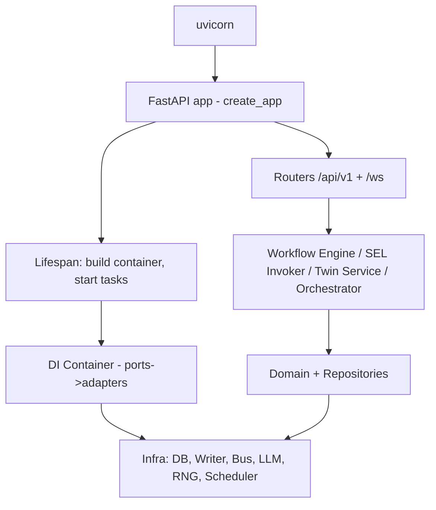
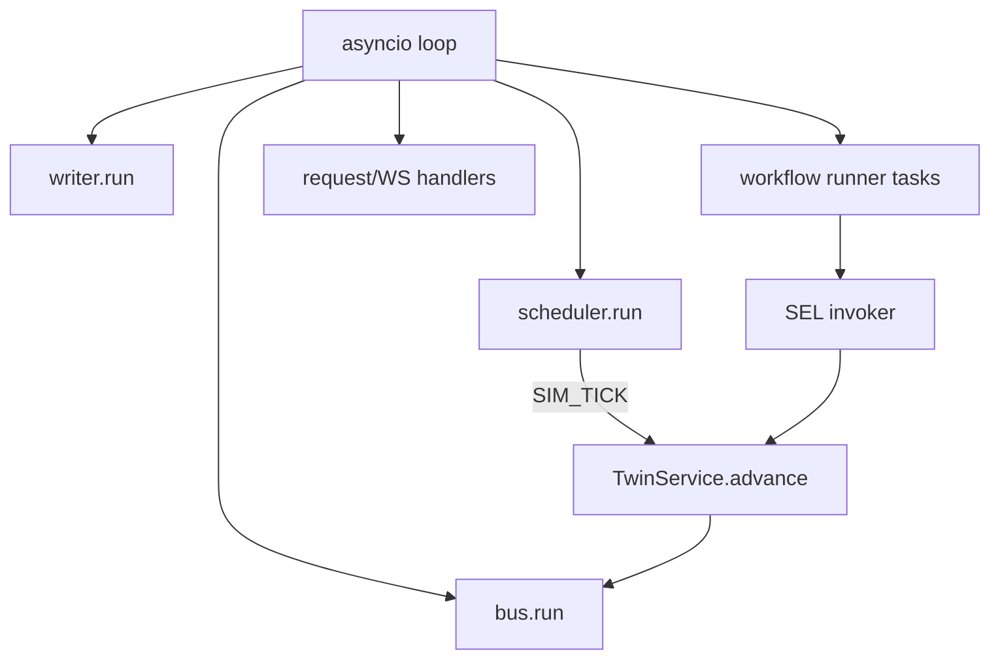
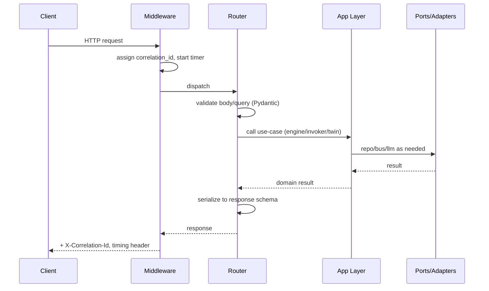

# 10 — Backend Implementation

> **Document ID:** `10-backend.md`
> **Project:** Agent5G — Agentic AI Service Enablement Platform for 5G Advanced Release 20
> **Document Type:** Backend implementation specification (how the FastAPI/Python process is built)
> **Status:** Authoritative for the backend project structure, application factory, dependency injection, infrastructure adapters (DB, event bus, LLM client, RNG, sim scheduler), configuration, concurrency, error handling, and logging. The API contract it serves is in `09-api.md`; the domain/application it wires is in `03`, `05`, `06`, `07`, `08`, `13`; the schema it persists to is in `12-database.md`.
> **Depends on:** `03-architecture.md` (Clean Architecture, ports/adapters, composition root, concurrency), `09-api.md` (routes/schemas), `08-services.md` (SEL), `05-agents.md` (agent runtime), `06-digital-twin.md` (twin service + clock).
> **Audience:** Backend engineers implementing the Python process, reviewers auditing structure and wiring.

---

## Table of Contents

1. [Purpose](#1-purpose)
2. [Overview](#2-overview)
3. [Runtime and Toolchain](#3-runtime-and-toolchain)
4. [Project Structure](#4-project-structure)
5. [The Application Factory and Lifespan](#5-the-application-factory-and-lifespan)
6. [Configuration and Settings](#6-configuration-and-settings)
7. [Dependency Injection (Composition Root)](#7-dependency-injection-composition-root)
8. [Infrastructure Adapters](#8-infrastructure-adapters)
   - [8.1 Database (SQLAlchemy + SQLite)](#81-database-sqlalchemy--sqlite)
   - [8.2 Single-Writer Persistence Queue](#82-single-writer-persistence-queue)
   - [8.3 Event Bus](#83-event-bus)
   - [8.4 LLM Client (Claude + record/replay)](#84-llm-client-claude--recordreplay)
   - [8.5 RNG Service](#85-rng-service)
   - [8.6 Simulation Scheduler](#86-simulation-scheduler)
9. [Background Tasks and Concurrency](#9-background-tasks-and-concurrency)
10. [Request Lifecycle](#10-request-lifecycle)
11. [Error Handling](#11-error-handling)
12. [Logging and Observability](#12-logging-and-observability)
13. [Repositories](#13-repositories)
14. [Interfaces and Contracts](#14-interfaces-and-contracts)
15. [Folder References](#15-folder-references)
16. [Design Decisions](#16-design-decisions)
17. [Future Extensibility](#17-future-extensibility)
18. [Engineering / Implementation / Research Notes](#18-engineering--implementation--research-notes)
19. [Example Scenarios (Backend Trace)](#19-example-scenarios-backend-trace)
20. [Kiro Build Guidance](#20-kiro-build-guidance)
21. [Acceptance Criteria](#21-acceptance-criteria)

---

## 1. Purpose

This document specifies **how the backend Python process is built** — the concrete implementation of the architecture defined in `03-architecture.md`. Where `03` gave layers, ports, and rules, this document gives the project structure, the FastAPI application factory, the dependency-injection composition root, and every infrastructure adapter (SQLAlchemy/SQLite, the single-writer persistence queue, the async event bus, the Claude `LLMClient` with record/replay, the seeded RNG service, and the simulation scheduler). It also specifies configuration, background-task lifecycle, request handling, error handling, and logging.

The intent is that an engineer can implement `backend/` end-to-end from this document plus its dependencies, with no architectural guesswork. Every choice honors the binding principles from `03` (dependencies point inward, agents act only through services, every mutation is an event, replaceable infrastructure via ports, determinism via one RNG).

---

## 2. Overview

The backend is a single **FastAPI** application running on **uvicorn**, hosting: the REST API + WebSocket hub (Delivery), the workflow engine + agent orchestration + SEL (Application), the twin/service/agent domain (Domain), and the infrastructure adapters (DB, bus, LLM, RNG, scheduler). Everything runs in **one asyncio event loop** with a small set of background tasks (`03` §11).



*Figure 2.1 — Backend composition: factory builds the container, lifespan starts background tasks, routers delegate to the application layer over injected ports.*

The composition root (`api/deps.py` + `main.py`) is the **only** place that constructs adapters and binds them to domain ports (ADR-6). Everything else depends on interfaces, which is what keeps SQLite/Claude/the bus swappable.

---

## 3. Runtime and Toolchain

- **Python:** 3.11+ (for `asyncio.TaskGroup`, faster async, and modern typing).
- **Web:** FastAPI + uvicorn (ASGI). `uvicorn app.main:app --reload` in dev (run **manually** by the user in a terminal — never as a blocking one-shot, per the Windows long-running-process rule).
- **Validation/settings:** Pydantic v2 + `pydantic-settings`.
- **ORM:** SQLAlchemy 2.x (async engine with `aiosqlite`).
- **Agents/orchestration:** LangGraph + the provider-agnostic `LLMClient` port (default **replay/$0**; live = a **free-tier** provider or local Ollama — see §8.4). Build-time coding is done by Claude 4.8 in Kiro (free).
- **Tooling:** `ruff` (lint+format), `mypy` (types), `import-linter` (layer contracts), `pytest` + `pytest-asyncio` (tests, `16`).
- **Packaging:** `pyproject.toml` (PEP 621); a single `backend/` package `app`.
- **OS:** Windows 11; all paths via `pathlib`; scripts in `scripts/*.ps1`/`*.bat`.

```toml
# pyproject.toml (indicative)
[project]
name = "agent5g-backend"
requires-python = ">=3.11"
dependencies = [
  "fastapi", "uvicorn[standard]", "pydantic>=2", "pydantic-settings",
  "sqlalchemy>=2", "aiosqlite", "langgraph", "anthropic", "httpx",
]
[project.optional-dependencies]
dev = ["pytest", "pytest-asyncio", "ruff", "mypy", "import-linter"]
```

---

## 4. Project Structure

The full backend tree (refines `03` §6). Layer boundaries are enforced by `import-linter`.

```text
backend/
├── app/
│   ├── domain/                     # pure Python + Pydantic; NO framework imports
│   │   ├── twin/                   # entities, topology, kpi, models_sim, events, ports (06,07)
│   │   ├── services/               # ServiceDescriptor, policy, ports (08)
│   │   └── agents/                 # structured I/O, memory, ports (05)
│   ├── application/                # use-cases; depends only on domain ports
│   │   ├── workflow/               # LangGraph engine, nodes, state (13)
│   │   ├── sel/                    # registry, invoker, policy_engine, tools, services/* (08)
│   │   ├── agents/                 # base, 7 agents, orchestrator (05)
│   │   └── twin_service/           # on_tick, snapshot, apply_command, scenarios, faults (06)
│   ├── infrastructure/             # adapters implementing domain ports
│   │   ├── db/                     # engine, session, models (ORM), repos, migrations (12)
│   │   ├── bus/                    # async event bus
│   │   ├── llm/                    # Claude client + record/replay
│   │   ├── rng/                    # seeded RNG service
│   │   ├── sim/                    # SIM_TICK scheduler
│   │   ├── writer/                 # single-writer persistence queue
│   │   └── config.py               # pydantic-settings
│   ├── api/                        # delivery (09)
│   │   ├── routers/                # one per resource
│   │   ├── schemas/                # request/response DTOs
│   │   ├── ws/                     # hub + envelope
│   │   ├── errors.py               # exception handlers -> ErrorEnvelope
│   │   ├── deps.py                 # DI providers (composition root part 1)
│   │   └── middleware.py           # correlation id, CORS, timing
│   └── main.py                     # create_app + lifespan (composition root part 2)
├── tests/                          # (16)
├── data/                           # agent5g.db, scenarios/ (gitignored db)
├── scripts/                        # run.ps1, seed.ps1, ...
├── .env.example
└── pyproject.toml
```

---

## 5. The Application Factory and Lifespan

`create_app()` builds the FastAPI instance; the **lifespan** context builds the DI container and starts/stops background tasks. This is the composition root's runtime half.

```python
# app/main.py (indicative)
from contextlib import asynccontextmanager
from fastapi import FastAPI
from app.api import routers, errors, middleware
from app.infrastructure.container import build_container

@asynccontextmanager
async def lifespan(app: FastAPI):
    container = await build_container(app.state.settings)  # ports -> adapters
    app.state.container = container
    await container.db.init()                 # create tables if missing / run migrations
    await container.registry.load()           # register SEL descriptors -> services table
    await container.twin.bootstrap()          # load snapshot or scenario preset
    async with container.task_group() as tg:  # start background tasks
        tg.start(container.writer.run)         # single-writer persistence
        tg.start(container.bus.run)            # event dispatcher
        tg.start(container.scheduler.run)      # SIM_TICK clock
        yield                                  # app serves requests
    await container.aclose()                   # graceful shutdown, flush writer

def create_app(settings=None) -> FastAPI:
    app = FastAPI(title="Agent5G API", version="1.0.0", lifespan=lifespan)
    app.state.settings = settings or load_settings()
    middleware.install(app)                    # CORS (localhost:3000), correlation-id, timing
    errors.install(app)                        # exception handlers -> ErrorEnvelope
    app.include_router(routers.api_v1, prefix="/api/v1")
    app.include_router(routers.ws)             # /ws
    return app

app = create_app()
```

**Startup order matters:** DB init → SEL registry load → twin bootstrap → start writer/bus/scheduler. The scheduler starts last so nothing ticks before the twin and persistence are ready. **Shutdown** flushes the writer queue so no persisted event is lost.

---

## 6. Configuration and Settings

Configuration is a typed `Settings` (pydantic-settings) loaded from environment + `.env`. No config is read ad-hoc anywhere else.

```python
# app/infrastructure/config.py (indicative)
class LLMSettings(BaseModel):
    mode: Literal["live","record","replay"] = "replay"   # DEFAULT replay => $0, offline (CST-3)
    provider: Literal["anthropic","gemini","groq","openrouter","ollama"] = "anthropic"
    model: str = "claude-4.8"                 # build-time agent is Claude 4.8 (Kiro); runtime live = free-tier provider/model
    api_key: SecretStr | None = None          # only for live/record; free-tier key; blank in replay
    base_url: str | None = None               # for OpenAI-compatible free-tier providers (groq/openrouter/ollama)
    fixtures_dir: Path = Path("tests/fixtures/llm")

class SimSettings(BaseModel):
    default_seed: int = 42
    tick_ms: int = 1000
    default_scenario: str = "baseline_healthy"

class Settings(BaseSettings):
    env: Literal["dev","test","demo"] = "dev"
    db_path: Path = Path("data/agent5g.db")
    cors_origin: str = "http://localhost:3000"
    llm: LLMSettings = LLMSettings()
    sim: SimSettings = SimSettings()
    log_level: str = "INFO"
    model_config = SettingsConfigDict(env_file=".env", env_nested_delimiter="__")
```

- **Secrets:** `api_key` is a `SecretStr`; never logged or returned by any endpoint (`09` §6). `GET /settings` reports `key_set: bool` only.
- **Env nesting:** `LLM__MODE=live`, `SIM__DEFAULT_SEED=7` via the nested delimiter.
- **`.env.example`** documents every variable; the real `.env` is gitignored.
- **Test/demo envs** flip defaults (e.g., `env=test` → in-memory SQLite, `llm.mode=replay`).

---

## 7. Dependency Injection (Composition Root)

DI is explicit and centralized — no global singletons, no service locator sprinkled through code (ADR-6). A `Container` holds constructed adapters; FastAPI `Depends` providers in `deps.py` expose them to routers.

```python
# app/infrastructure/container.py (indicative)
@dataclass
class Container:
    settings: Settings
    db: Database                      # engine + session factory
    writer: PersistenceWriter         # single-writer queue
    bus: EventBus                     # async pub/sub (port impl)
    llm: LLMClient                    # Claude / record / replay (port impl)
    rng: RngService                   # seeded (port impl)
    scheduler: SimScheduler
    # repositories (adapters implementing domain ports)
    twin_repo: TwinRepository
    workflow_repo: WorkflowRepository
    memory_store: MemoryStore
    policy_store: PolicyStore
    service_registry: ServiceRegistry
    # application services (wired over the ports above)
    invoker: ServiceInvoker
    twin: TwinService
    engine: WorkflowEngine
    orchestrator: AgentOrchestrator

async def build_container(settings) -> Container:
    db = Database(settings.db_path); 
    writer = PersistenceWriter(db)
    bus = InProcessEventBus()
    rng = RngService(settings.sim.default_seed)
    llm = build_llm(settings.llm)                     # picks live/record/replay
    # repos
    twin_repo = SqlTwinRepository(db, writer)
    # ... other repos
    registry = ServiceRegistry(db, writer)
    policy_store = SqlPolicyStore(db)
    invoker = ServiceInvoker(registry, policy_store, bus, writer)
    twin = TwinService(twin_repo, bus, rng, writer)
    orchestrator = AgentOrchestrator(llm, invoker, memory_store, rng)
    engine = WorkflowEngine(orchestrator, workflow_repo, bus)
    return Container(...)
```

```python
# app/api/deps.py (indicative)
def get_container(request: Request) -> Container: return request.app.state.container
def get_engine(c: Container = Depends(get_container)) -> WorkflowEngine: return c.engine
def get_invoker(c: Container = Depends(get_container)) -> ServiceInvoker: return c.invoker
def get_twin(c: Container = Depends(get_container)) -> TwinService: return c.twin
```

**Testing seam (16):** `build_container` accepts overrides so tests inject fakes (`FakeLLM` in replay, in-memory DB, a manual clock) for every port.

---

## 8. Infrastructure Adapters

Each adapter implements a domain **port** and is the only place its technology appears.

### 8.1 Database (SQLAlchemy + SQLite)

- **Async engine** over `aiosqlite`: `create_async_engine("sqlite+aiosqlite:///data/agent5g.db")`.
- **PRAGMAs** on connect: `journal_mode=WAL` (better read concurrency), `foreign_keys=ON`, `busy_timeout=5000`, `synchronous=NORMAL`.
- **Session factory:** `async_sessionmaker(expire_on_commit=False)`; short-lived sessions per operation (read) and via the writer (write).
- **Models:** SQLAlchemy ORM classes in `infrastructure/db/models.py` mapping the tables in `12-database.md`. Domain entities are **separate** from ORM models; repositories translate between them (keeps the domain framework-free, `03` §5).
- **Migrations:** for the prototype, `Database.init()` creates tables from metadata if absent; an optional Alembic setup is documented in `12` for schema evolution.

### 8.2 Single-Writer Persistence Queue

SQLite under concurrent writers throws `database is locked`. The **single-writer** pattern (ADR-5) serializes all writes.

```python
# app/infrastructure/writer/writer.py (indicative)
class PersistenceWriter:
    def __init__(self, db): self._db = db; self._q = asyncio.Queue()
    async def submit(self, op: WriteOp): await self._q.put(op)          # write-through
    async def submit_batch(self, ops: list[WriteOp]): ...               # write-behind (KPIs)
    async def run(self):                                                # background task
        while True:
            batch = await self._drain(max_n=200, max_wait_ms=50)
            async with self._db.session() as s:
                for op in batch: op.apply(s)
                await s.commit()
```

- **Write-through** (events, service calls, command mutations) are submitted individually and committed promptly.
- **Write-behind** (high-frequency KPI samples) are batched at an interval (`06` §15) to bound write rate.
- On shutdown the queue is fully drained (no lost audit rows).

### 8.3 Event Bus

In-process async pub/sub implementing the `EventBus` port (`03` §8), **persist-first then fan-out**.

```python
# app/infrastructure/bus/bus.py (indicative)
class InProcessEventBus(EventBus):
    def __init__(self): self._subs: dict[str, list[Subscriber]] = {}
    async def publish(self, event: DomainEvent):
        await writer.submit(PersistEvent(event))        # persist-first
        for sub in self._match(event.type):
            sub.offer(event)                            # non-blocking; bounded queue
    def subscribe(self, types, handler) -> Subscription: ...
    async def run(self):                                # dispatch loop drains subscriber queues
        ...
```

- **Backpressure:** each subscriber has a bounded queue; `KPI_UPDATED` uses drop-oldest, while breach/failure/workflow/service events are lossless (`03` §8).
- **Subscribers:** the WebSocket hub, the Observer agent's trigger listener, and any metric collectors.

### 8.4 LLM Client (provider-agnostic; replay default, free-tier live)

The `LLMClient` port with three modes (`05` §11, `02` §16), the single, **provider-agnostic** boundary to the model. **Default mode is `replay`** — offline, deterministic, and **$0** (CST-1/CST-3). Live mode targets a **free-tier** provider; the build-time coding agent is Claude 4.8 inside Kiro (free to the user, CST-2).

```python
# app/infrastructure/llm/client.py (indicative)
class LLMClient(Protocol):
    async def complete(self, req: LLMRequest) -> LLMResponse: ...
    async def tool_call(self, req: LLMToolRequest) -> LLMToolResponse: ...

# Live adapters — pick ONE free-tier provider via LLMSettings.provider (all behind the same port):
class AnthropicClient(LLMClient): ...   # Claude (free/initial credits); model e.g. "claude-4.8"
class GeminiClient(LLMClient): ...      # Google AI Studio free tier
class GroqClient(LLMClient): ...        # Groq free tier (OpenAI-compatible)
class OpenRouterClient(LLMClient): ...  # OpenRouter free models (OpenAI-compatible)
class OllamaClient(LLMClient): ...      # fully local, $0, no network (OpenAI-compatible)

class RecordingClient(LLMClient): ...   # wraps a live client + persists request/response to fixtures_dir
class ReplayClient(LLMClient): ...      # serve saved responses keyed by a request hash (offline, $0)

def build_llm(cfg) -> LLMClient:
    if cfg.mode == "replay": return ReplayClient(cfg)          # DEFAULT: offline, free
    live = {"anthropic":AnthropicClient,"gemini":GeminiClient,"groq":GroqClient,
            "openrouter":OpenRouterClient,"ollama":OllamaClient}[cfg.provider](cfg)
    return RecordingClient(live, cfg) if cfg.mode == "record" else live
```

- **Zero-cost by default (CST-1/CST-3):** `replay` needs no key and no network; tests and demos always run in `replay`. Live reasoning uses a **free-tier** provider (Gemini/Groq/OpenRouter free tiers, Anthropic free credits, or fully local **Ollama** for guaranteed $0/offline).
- **Provider-agnostic:** all live clients implement the same port; OpenAI-compatible providers (Groq/OpenRouter/Ollama) share one HTTP client with a `base_url`. Swapping providers is a config change, no code change (DD-6).
- **Request keying (replay):** a stable hash of `(system, messages, tools, provider, model)` maps to a saved response, so deterministic tests/demos need no network.
- **Free-tier resilience:** bounded `httpx` timeouts + retries in `live`; on a `429`/quota or unreachable model, surface `503` and fall back to `replay`/cached fixtures where available so a demo never hard-fails.
- **Token/latency capture:** every call records tokens + latency to `logs` (research cost metric, `02` §16).
- **No secrets in logs:** prompts may be persisted for explainability, but the API key never is.

### 8.5 RNG Service

The single entropy source (`06` §13, P6). No module calls `random`/`numpy.random` directly (enforced by lint).

```python
# app/infrastructure/rng/rng.py (indicative)
class RngService(Rng):
    def __init__(self, seed: int): self._seed = seed
    def for_tick(self, tick: int) -> RandomStream:      # counter-based derivation
        return RandomStream(hash_seed(self._seed, tick))
    def reseed(self, seed: int): self._seed = seed
```

- **Tick-derived streams** give reproducible, independent randomness per tick.
- **Reseed** on `simulation.seed`/`reset` re-establishes reproducibility from a known seed.

### 8.6 Simulation Scheduler

Emits `SIM_TICK` at `sim.tick_ms`; controllable (start/pause/step/reset). It does **not** advance the twin itself — it publishes `SIM_TICK`; the `TwinService` subscribes and advances (separation of clock from state).

```python
# app/infrastructure/sim/scheduler.py (indicative)
class SimScheduler:
    async def run(self):
        while True:
            await self._gate.wait()                 # paused if gate closed
            self._tick += 1
            await self._bus.publish(SimTick(self._tick))
            await asyncio.sleep(self._interval)
    def start(self): self._gate.set()
    def pause(self): self._gate.clear()
    async def step(self, n=1): ...                  # single-fire while paused
```

---

## 9. Background Tasks and Concurrency

All concurrency is cooperative on one event loop (`03` §11). Background tasks are owned by the lifespan `TaskGroup`:

| Task | Role | Notes |
|------|------|-------|
| `writer.run` | drain persistence queue, commit batches | only DB writer |
| `bus.run` | dispatch events to subscribers | fan-out loop |
| `scheduler.run` | emit `SIM_TICK` | gated by start/pause |
| workflow runners | one asyncio task per active workflow (LangGraph async) | concurrent workflows |

**Rules (enforced in review):**
- No blocking/CPU-bound work on the loop; "training"/heavy ops are modeled with `asyncio.sleep` (`06` TP7).
- LLM calls are `await`ed (I/O bound).
- Twin hot state is mutated only inside `TwinService` handlers on the loop — no threads sharing twin memory → no data races by design.
- SQLite writes go only through the writer; reads use short-lived sessions.



*Figure 9.1 — Background tasks on the single loop.*

---

## 10. Request Lifecycle

A REST request flows: middleware → router → application layer → ports → response. Middleware attaches a correlation id and timing; the router validates (Pydantic) and delegates; the application layer does the work over injected ports; the router serializes.



*Figure 10.1 — REST request lifecycle.*

For **action** routes the app-layer call is `invoker.invoke(service, args, caller="api", correlation_id)`, so HTTP actions inherit SEL policy/eventing/audit (AP6, `09`). For **workflow** creation, the router calls `engine.start(goal)` which schedules a workflow runner task and returns immediately (async, AP5); progress flows over WS.

---

## 11. Error Handling

Centralized exception handlers translate typed exceptions into the single `ErrorEnvelope` (`09` §5).

- **Domain/typed exceptions** (`domain/errors.py`): `NotFoundError`→404, `ConflictError`→409, `ValidationError`(Pydantic)→422, `PolicyBlockedError`→423, `ConfirmationRequiredError`→428, `RateLimitedError`→429, `DependencyUnavailableError`(LLM live down)→503.
- **SEL `ServiceResult` mapping:** action routes map `status` → HTTP centrally (`ok`→200, `blocked`→423, `requires_confirmation`→428, `error`→422/500) so all action routes behave identically.
- **No bare `except`** (coding rule); unexpected exceptions → 500 with a logged stack + correlation id (never leak internals to the client).
- **Handlers** live in `api/errors.py` and are installed in `create_app`.

```python
# app/api/errors.py (indicative)
@app.exception_handler(PolicyBlockedError)
async def _policy(exc, request):
    return json_error(423, "policy-blocked", exc.message, request.state.correlation_id, policy_id=exc.policy_id)
```

---

## 12. Logging and Observability

- **Structured JSON logs** via a logger port; every log line carries `correlation_id`, `level`, `type`, and context. Console in dev; also persisted to the `logs` table for the UI Logs page (`04` §9.9) and research (`02`).
- **What is logged:** request start/end + timing, every `SERVICE_CALLED`/`SERVICE_RESULT`/`POLICY_BLOCKED`, every workflow stage change, every LLM call (tokens/latency; prompt optional, key never), and errors with stack.
- **Correlation:** the middleware sets `request.state.correlation_id` (from `X-Correlation-Id` or generated); workflows use `wf_{uuid}`; the id threads through app → ports → events → logs so `GET /logs/correlation/{id}` reconstructs a full narrative.
- **No secrets:** the API key and any `.env` secret are never logged (masking helper wraps `SecretStr`).
- **Health:** `/health` reports db/bus/llm/sim status by pinging each adapter.

---

## 13. Repositories

Repositories are the adapters that implement the domain **port** interfaces, translating between domain entities and ORM models. They are the only code that imports SQLAlchemy (besides `db/`).

| Repository (adapter) | Implements port | Backs |
|----------------------|-----------------|-------|
| `SqlTwinRepository` | `TwinRepository` | snapshots, KPI append/history, event persist (`06`) |
| `SqlWorkflowRepository` | `WorkflowRepository` | workflows, steps, traces (`13`) |
| `SqlMemoryStore` | `MemoryStore` | memory records, knowledge graph (`05`) |
| `SqlPolicyStore` | `PolicyStore` | policies (`08`) |
| `ServiceRegistry` | `ServiceRegistry` | service descriptors (`08`) |
| `SqlLogRepository` | `LogRepository` | logs/events (`09` `/logs`,`/events`) |

**Rules:** reads use short-lived sessions; writes go through the `PersistenceWriter` (single writer). Repositories return **domain objects / DTOs**, never ORM instances, so the application/domain layers stay framework-free.

---

## 14. Interfaces and Contracts

- **Ports (domain):** `TwinRepository`, `WorkflowRepository`, `MemoryStore`, `PolicyStore`, `ServiceRegistry`, `LogRepository`, `EventBus`, `LLMClient`, `Rng`.
- **Application services:** `ServiceInvoker` (`08`), `TwinService` (`06`), `WorkflowEngine` + `AgentOrchestrator` (`05`,`13`).
- **Delivery:** routers + schemas (`09`), WS hub (`09` §10).
- **Composition root:** `build_container` + `deps.py` providers (the only adapter constructors).
- **Config:** `Settings` (§6). **Errors:** typed domain exceptions → `ErrorEnvelope` (§11).

Every application/domain component depends on ports only; adapters are injected at the root — this is what makes the backend testable and its infrastructure swappable (`03` P7/ADR-6).

---

## 15. Folder References

See §4 for the full tree. Ownership: `api/*` shared with `09`; `application/*` with `05`/`08`/`13`; `infrastructure/db` with `12`; `infrastructure/sim` + `twin_service` with `06`; `domain/*` with `05`/`06`/`07`/`08`. This document owns the *wiring, factory, adapters, and process concerns*.

---

## 16. Design Decisions

- **BD-1 — Async engine + WAL + single writer.** Rationale: SQLite concurrency safety on Windows without a DB server (ADR-5). Trade-off: bounded write throughput; ample for a prototype.
- **BD-2 — Separate ORM models from domain entities.** Rationale: keep domain framework-free (`03` §5); repositories translate. Trade-off: mapping boilerplate; preserves portability (Postgres/Open5GS).
- **BD-3 — Composition root only for adapter construction.** Rationale: enforce ports/adapters + testability (ADR-6). Trade-off: more explicit wiring; no hidden globals.
- **BD-4 — Clock separate from twin.** Rationale: scheduler emits `SIM_TICK`; twin subscribes — decouples time from state and enables step/pause. Trade-off: an extra event hop; clean and testable (manual clock in tests).
- **BD-5 — LLM behind a 3-mode port.** Rationale: deterministic tests/demos (`02`,`16`) + swappable model. Trade-off: fixtures to maintain; essential for reproducibility.
- **BD-6 — Persist-first eventing via the writer.** Rationale: no audit loss even if a subscriber fails (`03` §8). Trade-off: slight latency before fan-out; acceptable.
- **BD-7 — One error envelope + central `ServiceResult`→HTTP mapping.** Rationale: uniform client behavior (`09`). Trade-off: none material.

---

## 17. Future Extensibility

- **Postgres:** swap `Database` + repositories behind the same ports; enable higher write concurrency and drop the single-writer constraint (`20-future-work.md`).
- **Redis event bus / streams:** replace `InProcessEventBus` for cross-process durability if the backend is decomposed.
- **Open5GS adapters:** replace `TwinService`/twin repos with clients to real NFs behind the same interfaces (`07` §8 mapping).
- **MCP server:** host the SEL tool adapter as an MCP endpoint from the same process (`08` §9).
- **Horizontal split:** the layer boundaries mark seams to extract the twin, agent runtime, or API into separate services later (`03` §22).
- **Alembic migrations:** formalize schema evolution when the schema stabilizes (`12`).

---

## 18. Engineering / Implementation / Research Notes

**Engineering.**
- Enforce `import-linter` contracts in CI: `domain` imports no `fastapi`/`sqlalchemy`/`langgraph`; `application` imports no `api`; only `infrastructure` imports tech libs. A single violation fails the build.
- Keep sessions short; never hold a session across an `await` that does I/O elsewhere. All writes via the writer to avoid lock contention.
- Wrap `SecretStr` everywhere secrets could be logged; add a test asserting the API key never appears in logs.

**Implementation.**
- Build order: config + `Database` + writer → event bus → RNG → repositories → SEL registry/invoker + twin service → LLM client (replay) → orchestrator + workflow engine → routers + WS → middleware/errors → lifespan wiring.
- Stand up `/health` and a trivial read route first to validate the factory/lifespan, then grow.
- Implement the replay `LLMClient` before real Claude so the whole backend is testable offline from day one.

**Research.**
- Persist LLM tokens/latency per call and per workflow so the cost metric (`02` §16) is queryable.
- The correlation-id thread (request → workflow → events → logs) is the backbone of reproducible traces for figures — verify it end-to-end with an integration test.
- Determinism: with `llm.mode=replay` + fixed `sim.default_seed`, an integration run must reproduce identical events (pairs with the twin golden-trajectory test, `06`).

---

## 19. Example Scenarios (Backend Trace)

**Scenario A (backend).**
1. `POST /workflows` → router validates → `engine.start(goal)` schedules a workflow runner task, returns `201`.
2. Runner drives the LangGraph graph; Planner uses the `LLMClient` (replay) + read tools via the invoker.
3. Executor calls `invoker.invoke("aimle.model.deploy", {target}, caller="workflow", correlation_id)` → policy allow → `TwinService.apply_command` mutates the Edge → emits `MODEL_DEPLOYED` (persist-first) → WS hub pushes it.
4. Documentation writes an episodic memory via the Memory agent (`memory.write` → `SqlMemoryStore` via writer).
5. `WORKFLOW_COMPLETED` emitted; `GET /workflows/{id}/trace` reads from `SqlWorkflowRepository`.

**Scenario B (backend).**
1. Scheduler `SIM_TICK` → `TwinService.advance` (seeded) → congestion → `KPI_THRESHOLD_BREACH` (write-through) → bus.
2. Observer's bus subscription triggers `engine.start(condition)` (new correlation id).
3. Optimizer reads `dcf.data.history` via invoker; Executor `upf.loadbalance.apply`; next ticks lower latency → `KPI_THRESHOLD_CLEARED`.

**Scenario C (backend).**
1. `POST /simulation/fault {nrf fail}` → `invoker`/`TwinService` marks NRF FAILED → `NF_FAILED`.
2. Discovery-dependent `invoker.invoke("nrf.discover")` returns an error `ServiceResult` → workflow fails the step → Recovery.
3. Recovery `nrf.register` on standby (PLC-1 satisfied) → `NF_RECOVERED`; all rows carry the workflow correlation id.

---

## 20. Kiro Build Guidance

### 20.1 Implementation Order
1. `pyproject.toml`, `config.py`, `Database` (+PRAGMAs), `PersistenceWriter`.
2. `InProcessEventBus`, `RngService`.
3. ORM models + repositories (per `12`).
4. SEL registry + invoker + policy engine (per `08`); `TwinService` + scheduler (per `06`).
5. `LLMClient` (replay first), agents + orchestrator + workflow engine (per `05`,`13`).
6. Routers + schemas + WS hub (per `09`), middleware, error handlers.
7. `build_container` + `create_app` + lifespan; `/health` smoke test.

### 20.2 Coding Rules
- Enforce `import-linter` layer contracts (`03` P1); domain stays framework-free.
- Construct adapters only in the composition root (BD-3); everything else depends on ports.
- All DB writes via the `PersistenceWriter`; reads via short-lived sessions (BD-1).
- All randomness via `RngService`; all LLM via `LLMClient` (no direct SDK calls elsewhere).
- No bare `except`; map errors centrally to `ErrorEnvelope`; never log secrets.
- Action routes delegate to `invoker.invoke` (AP6); workflow creation is async (AP5).

### 20.3 Naming Convention
- Adapters `Sql*`/`InProcess*`/`Claude*`/`Replay*`; ports as role interfaces (`TwinRepository`).
- Providers `get_*` in `deps.py`; background task entrypoints `run`.
- Modules `snake_case`; classes `PascalCase`.

### 20.4 Folder Ownership
- `infrastructure/*`, `api/deps.py`, `api/middleware.py`, `api/errors.py`, `main.py`, `container.py` owned here; shared ownership per §15.

### 20.5 Prompt Suggestions
- "Implement `create_app` + lifespan that builds the DI container and starts writer/bus/scheduler tasks in the correct order."
- "Implement the async SQLite `Database` with WAL/foreign_keys/busy_timeout PRAGMAs and the single-writer `PersistenceWriter`."
- "Implement the `LLMClient` with live/record/replay modes keyed by a stable request hash."
- "Implement centralized exception handlers mapping typed domain errors and `ServiceResult.status` to the `ErrorEnvelope`."

### 20.6 Acceptance Criteria
- `create_app()` boots, `/health` returns ok, background tasks run, and shutdown flushes the writer.
- `import-linter` and `mypy` pass; no layer violations.
- With `llm.mode=replay` + fixed seed, an integration run reproduces identical persisted events.
- A policy-blocked action returns `423`; the API key never appears in logs (asserted by a test).

---

## 21. Acceptance Criteria

This document is **complete and correct** when:

- [ ] **AC-1.** The full backend project structure is specified with enforced layer boundaries.
- [ ] **AC-2.** The application factory + lifespan (startup order, background-task start/stop, graceful shutdown) is specified.
- [ ] **AC-3.** Typed `Settings` (env/.env, secrets masked, nested env) is specified.
- [ ] **AC-4.** The DI composition root (`Container` + `deps.py`) is specified as the sole adapter constructor, with a test-override seam.
- [ ] **AC-5.** All infrastructure adapters (DB, single-writer, event bus, LLM 3-mode, RNG, scheduler) are specified with their responsibilities and key config.
- [ ] **AC-6.** The concurrency model (single loop + background tasks) and its rules are specified.
- [ ] **AC-7.** The REST request lifecycle and async workflow creation are specified.
- [ ] **AC-8.** Centralized error handling mapping typed exceptions + `ServiceResult` to the `ErrorEnvelope` is specified.
- [ ] **AC-9.** Structured logging with correlation ids and no-secret guarantees is specified.
- [ ] **AC-10.** Repositories as port adapters translating domain↔ORM are specified.
- [ ] **AC-11.** Interfaces, design decisions, extensibility, notes, backend scenario traces, and Kiro guidance are present.
- [ ] **AC-12.** Determinism (replay LLM + seed) and security (secrets never logged, localhost) are addressed.

---

**NEXT FILE**
