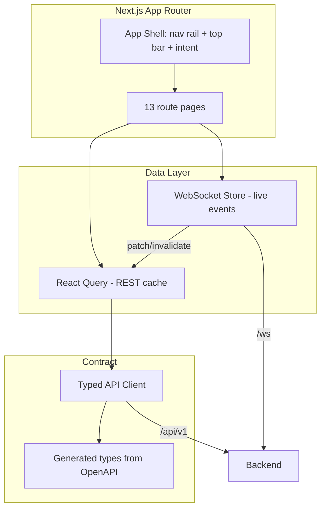
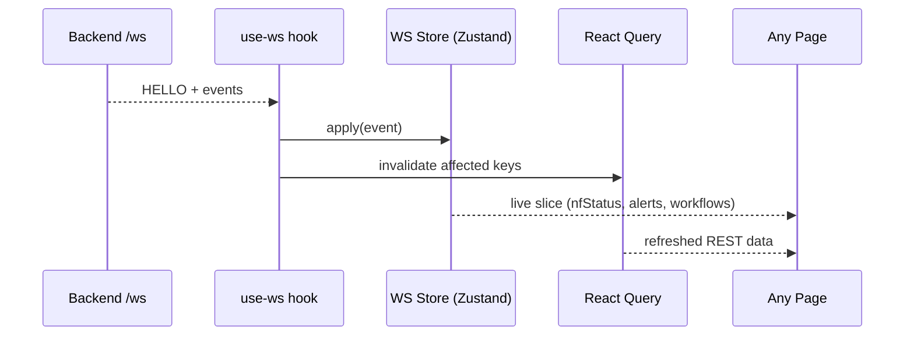

# 11 — Frontend Implementation

> **Document ID:** `11-frontend.md`
> **Project:** Agent5G — Agentic AI Service Enablement Platform for 5G Advanced Release 20
> **Document Type:** Frontend implementation specification (how the Next.js app is built)
> **Status:** Authoritative for the frontend project structure, framework configuration, state/data layer, API client, WebSocket integration, component implementation patterns, and build/tooling. The visual/UX design it implements is in `04-ui.md`; the contract it consumes is in `09-api.md`.
> **Depends on:** `04-ui.md` (pages, components, tokens, motion, real-time model), `09-api.md` (REST + WS contract, generated types), `03-architecture.md` (feature-first frontend, event envelope, no-polling).
> **Audience:** Frontend engineers implementing the Next.js app, reviewers auditing structure and data flow.

---

## Table of Contents

1. [Purpose](#1-purpose)
2. [Overview](#2-overview)
3. [Runtime and Toolchain](#3-runtime-and-toolchain)
4. [Project Structure](#4-project-structure)
5. [App Router and Routing](#5-app-router-and-routing)
6. [Styling System (Tailwind + Shadcn + Tokens)](#6-styling-system-tailwind--shadcn--tokens)
7. [Type Generation and the API Contract](#7-type-generation-and-the-api-contract)
8. [Data Layer: REST Client + React Query](#8-data-layer-rest-client--react-query)
9. [Real-Time Layer: WebSocket Store](#9-real-time-layer-websocket-store)
10. [State Management Strategy](#10-state-management-strategy)
11. [Shared Component Implementation](#11-shared-component-implementation)
12. [Feature Module Pattern](#12-feature-module-pattern)
13. [Visualization Integration (React Flow, Recharts, D3, Mermaid)](#13-visualization-integration-react-flow-recharts-d3-mermaid)
14. [Motion and Theming Implementation](#14-motion-and-theming-implementation)
15. [Loading, Empty, and Error States](#15-loading-empty-and-error-states)
16. [Accessibility Implementation](#16-accessibility-implementation)
17. [Performance](#17-performance)
18. [Interfaces and Contracts](#18-interfaces-and-contracts)
19. [Folder References](#19-folder-references)
20. [Design Decisions](#20-design-decisions)
21. [Future Extensibility](#21-future-extensibility)
22. [Engineering / Implementation / Research Notes](#22-engineering--implementation--research-notes)
23. [Example Scenarios (Frontend Trace)](#23-example-scenarios-frontend-trace)
24. [Kiro Build Guidance](#24-kiro-build-guidance)
25. [Acceptance Criteria](#25-acceptance-criteria)

---

## 1. Purpose

This document specifies **how the Next.js frontend is built** — the implementation counterpart to the design authority in `04-ui.md`. Where `04` defined pages, components, tokens, motion, and real-time behavior, this document defines the code that realizes them: the project structure, framework configuration, the data and real-time layers, the API client, the state strategy, and the implementation patterns for shared components, feature modules, and visualizations.

The goal is that a frontend engineer can build the entire app from this document plus `04-ui.md` and `09-api.md`, with no structural ambiguity, and that the result honors the platform principles: **contract-first with generated types (P5)**, **event-driven with no polling (UD-5)**, **feature-first organization (DD-8)**, and **explainability as a first-class product surface (UP1)**.

---

## 2. Overview

The frontend is a **Next.js (App Router)** TypeScript application. It initializes each page with server-side data reads (or client reads via React Query), then stays live by subscribing to a single **WebSocket store** that consumes the canonical event envelope (`09` §10). The UI is composed from a shared, Shadcn-based component library styled by design tokens, organized **feature-first**.



*Figure 2.1 — Frontend: pages read via React Query over the typed client; the WS store keeps caches live; all types are generated from the backend contract.*

The unifying idea (from `04` §8): **one WebSocket store** feeds every page, so a single backend event (a breach, a workflow stage change) updates the whole console coherently, and no page polls.

---

## 3. Runtime and Toolchain

- **Node:** 20+ (LTS). Package manager: `pnpm` (or `npm`; scripts provided for Windows).
- **Framework:** Next.js latest (App Router, React Server Components where useful).
- **Language:** TypeScript `strict` mode (no `any`).
- **Styling:** TailwindCSS + Shadcn UI (Radix primitives) + `class-variance-authority` + `tailwind-merge`.
- **Data:** TanStack React Query (server cache) + a lightweight client store (Zustand) for WS/live + view state.
- **Realtime:** native `WebSocket` wrapped in a typed hook/store.
- **Viz:** React Flow (topology/workflow), Recharts (KPI charts), D3 (knowledge graph force layout), Mermaid (diagrams).
- **Motion:** Framer Motion.
- **Icons:** Lucide.
- **Type gen:** `openapi-typescript` from `/openapi.json`.
- **Tooling:** ESLint + Prettier; `tsc --noEmit` typecheck; Vitest + Testing Library + Playwright (`16`).
- **Dev server:** `pnpm dev` — run **manually** by the user (long-running; never a blocking one-shot per the Windows rule).

```jsonc
// package.json scripts (indicative)
{
  "scripts": {
    "dev": "next dev",
    "build": "next build",
    "start": "next start",
    "typecheck": "tsc --noEmit",
    "gen:types": "openapi-typescript http://localhost:8000/openapi.json -o lib/api/types.gen.ts",
    "lint": "next lint"
  }
}
```

---

## 4. Project Structure

Feature-first (DD-8), with shared primitives and a thin `lib/`.

```text
frontend/
├── app/                          # App Router routes (thin: compose feature views)
│   ├── layout.tsx                # root: providers, shell
│   ├── page.tsx                  # -> redirect to /dashboard
│   ├── dashboard/page.tsx
│   ├── agent-console/page.tsx
│   ├── topology/page.tsx
│   ├── digital-twin/page.tsx
│   ├── workflow-builder/page.tsx
│   ├── service-registry/page.tsx
│   ├── knowledge-graph/page.tsx
│   ├── memory/page.tsx
│   ├── logs/page.tsx
│   ├── simulation/page.tsx
│   ├── analytics/page.tsx
│   ├── model-manager/page.tsx
│   └── settings/page.tsx
├── features/                     # one module per feature (the real logic)
│   ├── dashboard/  agents/  topology/  twin/  workflows/  services/
│   ├── knowledge/  memory/  logs/  simulation/  analytics/  models/  settings/
│   │   ├── components/           # feature-local components
│   │   ├── hooks/                # feature-local hooks (useWorkflows, ...)
│   │   ├── api/                  # feature-local query/mutation fns (call lib/api client)
│   │   └── types.ts              # feature view types (compose generated types)
├── components/                   # shared, cross-feature UI (Shadcn-based catalog from 04 §7)
│   ├── ui/                       # shadcn primitives (button, card, table, dialog, ...)
│   ├── stat-card.tsx  panel.tsx  data-table.tsx  status-badge.tsx
│   ├── time-series-chart.tsx  event-feed.tsx  flow-canvas.tsx
│   ├── reasoning-trace.tsx  timeline-stepper.tsx  json-viewer.tsx
│   ├── command-palette.tsx  intent-bar.tsx  mermaid-view.tsx
│   └── states/ (skeleton.tsx empty-state.tsx error-state.tsx)
├── lib/
│   ├── api/
│   │   ├── types.gen.ts          # GENERATED from OpenAPI (do not edit)
│   │   ├── client.ts             # typed fetch wrapper
│   │   └── endpoints.ts          # typed endpoint fns grouped by resource
│   ├── ws/
│   │   ├── store.ts              # Zustand WS store (events -> state)
│   │   ├── use-ws.ts             # subscription hook
│   │   └── envelope.ts           # event envelope types (align with 09 §10)
│   ├── query/ (client.ts keys.ts)   # React Query client + query keys
│   ├── theme/ (tokens.ts theme-provider.tsx)
│   └── utils/ (cn.ts format.ts)
├── styles/ (globals.css tailwind base + tokens)
├── tailwind.config.ts
├── tsconfig.json                 # strict
└── package.json
```

**Rule:** `app/*` pages are thin — they render a feature view (`features/<x>/...`). Business/data logic lives in `features/*`; cross-feature UI lives in `components/*`; the contract/data plumbing lives in `lib/*`.

---

## 5. App Router and Routing

- **Root layout** (`app/layout.tsx`) installs providers (React Query, WS store, theme, command palette) and renders the **app shell** (nav rail + top bar with intent input; `04` §6). All pages render inside the shell.
- **Routes** map 1:1 to the 13 pages and to the resource map in `09` §8. Route folder names use `kebab-case` matching page names (`agent-console`, `model-manager`).
- **Server vs client components:** the shell and static chrome are server components; interactive/live views (`"use client"`) handle React Query + WS. Initial data for a page can be fetched in a server component and hydrated, or fetched client-side via React Query — chosen per page (dashboard/logs benefit from client live-reads; static-ish pages can server-render).
- **Navigation state:** active route drives nav highlight; the command palette (Ctrl+K) and intent bar are global (in the shell), available on every route.
- **Deep links:** workflow detail (`/agent-console?wf=wf_...`), NF detail (`/digital-twin?nf=...`), log correlation (`/logs?correlation_id=...`) use query params so links are shareable.

```mermaid
graph TD
    ROOT[app/layout.tsx: providers + shell] --> R1[/dashboard]
    ROOT --> R2[/agent-console]
    ROOT --> R3[/topology]
    ROOT --> RN[... 10 more routes]
    R1 --> FV1[features/dashboard view]
    R2 --> FV2[features/agents view]
```

*Figure 5.1 — Thin routes composing feature views inside the shell.*

---

## 6. Styling System (Tailwind + Shadcn + Tokens)

Implements the design system from `04` §4–§5.

- **Tokens as CSS variables** in `styles/globals.css` (`--bg-base`, `--bg-card`, `--accent-ai`, `--ok/--warn/--crit`, radii, motion durations), with dark as default `:root` and a `.light` override set. Semantic status colors (emerald/amber/red/violet) are shared across themes.
- **Tailwind config** maps tokens to theme keys (`colors.canvas`, `colors.card`, `colors.status.ok`, ...) so components use semantic classes (`bg-card`, `text-muted`, `text-status-crit`) — never raw hex (coding rule from `04` §18.2).
- **Shadcn** provides Radix-based primitives in `components/ui/`; variants via `cva`; class merging via `cn()` (`tailwind-merge`).
- **Fonts:** Inter/Geist (`--font-sans`), JetBrains Mono (`--font-mono`) for logs/ids/code.
- **Density:** a `data-density="compact|comfortable"` attribute on the shell toggles spacing scale (Settings, `04` §9.13).

```ts
// lib/theme/tokens.ts (indicative) — single source consumed by tailwind + charts
export const statusColor = { ok: "var(--ok)", warn: "var(--warn)", crit: "var(--crit)", ai: "var(--accent-ai)" } as const;
```

Charts import `statusColor`/the shared palette so KPI colors are identical everywhere (`04` §16).

---

## 7. Type Generation and the API Contract

Contract-first (P5/AP1). The frontend **never hand-writes API shapes**.

- **Generation:** `pnpm gen:types` runs `openapi-typescript` against `http://localhost:8000/openapi.json` → `lib/api/types.gen.ts`. Run whenever the backend contract changes; the file is committed and a CI check fails on drift (`09` §7).
- **Usage:** feature `types.ts` files compose generated types (e.g., `type Workflow = components["schemas"]["WorkflowSummary"]`) and add view-only fields, never redefining server shapes.
- **WS envelope types:** `lib/ws/envelope.ts` mirrors the event taxonomy (`09` §10) as a discriminated union keyed by `type`, enabling exhaustive handling.

```ts
// lib/ws/envelope.ts (indicative)
export type WsEvent =
  | { type: "WORKFLOW_STAGE_CHANGED"; correlation_id: string; ts: string; payload: { workflow_id: string; from: string; to: string; status: string } }
  | { type: "KPI_THRESHOLD_BREACH"; correlation_id: string; ts: string; payload: { entity_id: string; kpi: string; value: number; threshold: number; region: string } }
  | { type: "NF_FAILED"; /* ... */ payload: { entity_id: string; nf_type: string; cause: string } }
  // ... one arm per event type in 09 §10
  ;
```

---

## 8. Data Layer: REST Client + React Query

- **Typed client** (`lib/api/client.ts`): a thin `fetch` wrapper that sets base URL, JSON headers, `X-Correlation-Id`, handles the `ErrorEnvelope` (throws a typed `ApiError` with `status`, `title`, `detail`, `errors[]`), and supports `Idempotency-Key`/`X-Confirmation-Token`.
- **Endpoint functions** (`lib/api/endpoints.ts`): grouped, fully typed functions per resource (`workflows.create`, `workflows.list`, `services.invoke`, `simulation.start`, ...), each using generated request/response types.
- **React Query** (`lib/query/`): a shared `QueryClient`; query keys centralized in `keys.ts` (e.g., `["workflows", filters]`, `["twin", region]`). Queries for reads; mutations for actions (`useMutation` for `POST /workflows`, `simulation.*`, `models.deploy`).
- **Error handling:** mutations surface `ApiError` to `ErrorState`/toast; `423` (policy blocked) and `428` (confirm) get specific UI treatment (show policy message; open a confirm dialog then retry with the token) — matching `09` §5.

```ts
// features/workflows/api/use-create-workflow.ts (indicative)
export function useCreateWorkflow() {
  const qc = useQueryClient();
  return useMutation({
    mutationFn: (goal: string) => endpoints.workflows.create({ goal }),
    onSuccess: (wf) => { qc.invalidateQueries({ queryKey: keys.workflows() }); /* route to console */ },
    onError: (e: ApiError) => toastError(e),
  });
}
```

---

## 9. Real-Time Layer: WebSocket Store

The single live channel (UD-5, `04` §8). One WS connection per tab feeds a global store; pages subscribe to slices.

- **Store** (`lib/ws/store.ts`, Zustand): holds connection status, the latest sim status, a bounded ring buffer of recent events (for the Event Feed), and derived live maps (e.g., `nfStatusById`, `activeWorkflows`, `latestKpiByEntity`).
- **Connection** (`lib/ws/use-ws.ts`): opens `ws://localhost:8000/ws`, handles `HELLO` (checks `schema_version`, warns on mismatch), sends a subscription filter, processes `PING`/`PONG`, and **auto-reconnects with backoff**; on reconnect it re-reads REST (React Query `invalidate`) so late-join gaps are filled (`09` §10).
- **Event → state:** a reducer switches on the discriminated `WsEvent.type` and patches store slices and/or invalidates React Query keys. Breach/failure/workflow/service events are lossless; opt-in `KPI_UPDATED` is throttled for chart append.
- **Coherence:** because every page reads from this one store (plus React Query), a single event updates the Dashboard, Topology, Twin, and Logs simultaneously (`04` §17 walkthroughs).

```ts
// lib/ws/store.ts (indicative reducer)
function apply(state: WsState, e: WsEvent) {
  switch (e.type) {
    case "NF_FAILED": state.nfStatusById[e.payload.entity_id] = "FAILED"; break;
    case "NF_RECOVERED": state.nfStatusById[e.payload.entity_id] = "ACTIVE"; break;
    case "WORKFLOW_STAGE_CHANGED": upsertWorkflow(state, e.payload); break;
    case "KPI_THRESHOLD_BREACH": pushAlert(state, e); break;
    // ... exhaustive over WsEvent
  }
  pushEventFeed(state, e);
}
```



*Figure 9.1 — One WS connection → global store + React Query invalidation → every page live.*

---

## 10. State Management Strategy

Three clearly separated kinds of state (avoids the "everything in one store" trap):

1. **Server cache (React Query):** all REST data (workflows, services, twin snapshot, analytics, logs). Cached, invalidated by WS events or mutations. The source of truth for persisted data.
2. **Live/derived (WS store, Zustand):** ephemeral real-time state derived from events (nf status map, alert list, active-workflow progress, event feed ring buffer). Not persisted; rebuilt on reconnect via REST.
3. **View/UI state:** local `useState`/URL params (selected NF, open drawer, filters, active tab). Deep-linkable via query params where shareable.

Rule of thumb: **persisted → React Query; live → WS store; ephemeral UI → local/URL.** Substrate data is never optimistically faked (UP2); only the transient "creating workflow…" affordance is optimistic (`04` §12).

---

## 11. Shared Component Implementation

Implements the catalog from `04` §7. Each shared component: typed props, built-in loading/empty/error variants where relevant, token-based styling, and `aria` labels.

| Component | Implementation notes |
|-----------|---------------------|
| `StatCard` | value + delta + optional sparkline (Recharts mini); status color from tokens; number tween on change |
| `Panel` | titled surface; `header actions` slot; renders `Skeleton`/`EmptyState`/`ErrorState` based on a `state` prop |
| `DataTable` | TanStack Table; column defs typed; virtualization (`@tanstack/react-virtual`) for logs; sort/filter/paginate wired to query params |
| `StatusBadge` | maps `NFStatus`/workflow status enum → color + icon + label (never color-alone, `04` §11) |
| `TimeSeriesChart` | Recharts line/area; shared palette; threshold band; live append from WS (throttled) |
| `EventFeed` | reads the WS store ring buffer; filter; Framer slide-in; auto-scroll toggle; `aria-live=polite` |
| `FlowCanvas` | React Flow wrapper; custom node renderers; layout prop; controlled selection |
| `ReasoningTrace` | renders `trace[]` per stage; expand/collapse; `JsonViewer` for tool args/results |
| `TimelineStepper` | 8-stage progress; animated active stage; per-stage status |
| `JsonViewer` | collapsible, copyable; monospace token |
| `CommandPalette` | Radix/cmdk; global actions + nav; fuzzy search |
| `IntentBar` | textarea + submit → `useCreateWorkflow`; optimistic "creating…" then route |
| `MermaidView` | lazy-loads Mermaid; renders diagram source (KG static view, docs) |
| `states/*` | `Skeleton`, `EmptyState`, `ErrorState` — every data region uses one |

Components are pure/presentational where possible; data comes from feature hooks so components stay reusable and testable.

---

## 12. Feature Module Pattern

Every feature follows the same internal shape for consistency:

```text
features/<feature>/
├── components/     # feature-specific composition of shared components
├── hooks/          # useX hooks: wrap React Query + WS store slices
├── api/            # query/mutation fns calling lib/api endpoints (typed)
├── types.ts        # view types composing generated types
└── index.ts        # public surface the route page imports
```

Example — `features/workflows/`:
- `api/`: `listWorkflows`, `getWorkflow`, `getTrace`, `createWorkflow`, `controlWorkflow`.
- `hooks/`: `useWorkflows(filters)`, `useWorkflow(id)` (merges REST detail + live WS progress), `useCreateWorkflow`.
- `components/`: `WorkflowList`, `WorkflowDetail` (TimelineStepper + ReasoningTrace + live panel), `WorkflowControls`.
- The `/agent-console` page imports `WorkflowConsole` from `features/workflows` and renders it in the shell.

This pattern makes each page a thin composition and keeps feature logic co-located and independently testable.

---

## 13. Visualization Integration (React Flow, Recharts, D3, Mermaid)

- **React Flow (Topology, Workflow Builder).** Custom node types per NF (`components/flow/nodes/*`) colored by `nfStatusById` from the WS store; edges annotated with live link metrics; layouts (force/hierarchical/regional) via a layout util. Selection opens a right inspector (feature-local). The Workflow Builder reuses `FlowCanvas` with stage + service-call node types and schema-driven property forms generated from service input schemas (`08`).
- **Recharts (KPI charts, Analytics).** `TimeSeriesChart` with the shared palette and threshold bands; live append throttled from WS `KPI_UPDATED` (opt-in) while history loads via REST (`/twin/nf/{id}/kpis`, `/analytics/kpis`). Analytics export triggers `/analytics/export`.
- **D3 (Knowledge Graph).** Force-directed layout for `/knowledge/graph`; nodes/edges from `GET /knowledge/graph`; click → node detail + provenance; large graphs use canvas rendering for performance. A `MermaidView` alternate gives a static, shareable view.
- **Mermaid.** Lazy-loaded for in-app diagrams (KG static view, embedded docs); never blocks initial render.

All visualizations read status/colors from the same tokens/palette so the whole console is visually consistent (`04` §16).

---

## 14. Motion and Theming Implementation

- **Framer Motion** for state-change animation only (`04` §8): node status cross-fade + pulse on `NF_FAILED/RECOVERED`; `TimelineStepper` active-stage highlight; `EventFeed` slide-in; `StatCard` number tween; route content cross-fade. All wrapped to respect `prefers-reduced-motion` (a `useReducedMotion` guard disables non-essential motion).
- **Theme provider** (`lib/theme/theme-provider.tsx`): toggles `.light`/dark on `<html>`, persists choice, sets `data-density`. Because colors are CSS variables, theme switch is instant and componentless.

---

## 15. Loading, Empty, and Error States

Mandatory for every data region (`04` §18.2). Implemented via the `states/*` components and the `Panel` `state` prop:

- **Loading:** `Skeleton` shaped like the content (never a spinner-only blank).
- **Empty:** `EmptyState` with a purposeful message + a next-action button (e.g., "Start the simulation" linking to `/simulation`).
- **Error:** `ErrorState` rendering the `ApiError` detail + a retry; WS disconnect flips the top-bar status pill amber (from the WS store) and auto-reconnects.

A lint/review rule: a data-fetching component that doesn't handle all three states is not "done".

---

## 16. Accessibility Implementation

Implements `04` §11 (WCAG 2.1 AA as a goal):

- Semantic landmarks (`<nav>`, `<main>`, `<aside>`); skip-to-content link.
- `StatusBadge` pairs color with icon + text (never color-alone); contrast verified against tokens.
- All icon-only buttons carry `aria-label`; focus rings visible; full keyboard operability incl. command palette, intent bar, and canvas node selection.
- `EventFeed`/toasts use `aria-live="polite"`; charts expose an accessible data-table alternative (toggle).
- `prefers-reduced-motion` honored (§14); browser zoom to 200% supported.

> Full conformance requires manual testing with assistive tech and expert review; this document sets implementation intent.

---

## 17. Performance

- **Virtualization** for large lists (Logs, big tables) via `@tanstack/react-virtual`.
- **WS throttling:** `KPI_UPDATED` is coalesced (e.g., rAF-batched) before touching state to avoid re-render storms; breach/failure events are immediate.
- **Memoization:** heavy renderers (FlowCanvas nodes, charts) memoized; selectors from the WS store are narrow to limit re-renders.
- **Code splitting:** Mermaid, D3, and the Workflow Builder are dynamically imported (`next/dynamic`) so they don't inflate the initial bundle.
- **Server components** for static chrome reduce client JS; live views are client components only where needed.
- **Query caching:** React Query staleTime tuned per resource; WS invalidation keeps data fresh without polling.

---

## 18. Interfaces and Contracts

- **Consumes `09-api.md`:** REST via `lib/api` (types generated from OpenAPI), WS via `lib/ws` (envelope union).
- **Implements `04-ui.md`:** pages, shared components, tokens, motion, real-time model.
- **Public feature surface:** each `features/<x>/index.ts` exports the view(s) the route imports.
- **Type contract:** `lib/api/types.gen.ts` is generated and authoritative; feature `types.ts` compose it. CI drift check (`09` §7).
- **Env:** `NEXT_PUBLIC_API_BASE` / `NEXT_PUBLIC_WS_URL` (default localhost); no secrets in the frontend.

---

## 19. Folder References

See §4 for the full tree. Ownership: `04-ui.md` owns design; this document owns code structure; `09-api.md` owns the contract consumed. Cross-feature UI in `components/*`; contract/data plumbing in `lib/*`; per-feature logic in `features/*`; thin routes in `app/*`.

---

## 20. Design Decisions

- **FD-1 — Feature-first + thin routes.** Rationale: co-locate feature logic; pages stay compositional (DD-8). Trade-off: some boilerplate per feature; strong long-term maintainability.
- **FD-2 — Three-tier state (React Query / WS store / local).** Rationale: match state kind to tool; avoid a mega-store. Trade-off: contributors must learn the split; documented clearly.
- **FD-3 — Generated types only.** Rationale: eliminate contract drift (P5). Trade-off: build step + CI check; strongly positive.
- **FD-4 — One WS store feeds all pages.** Rationale: coherent live console, no polling (UD-5). Trade-off: careful reconnect/backpressure handling; centralized once.
- **FD-5 — Tokens as CSS variables, semantic Tailwind classes.** Rationale: instant theming, consistency, no raw hex. Trade-off: token discipline; enforced by review.
- **FD-6 — Dynamic-import heavy viz.** Rationale: bundle size + fast initial paint. Trade-off: slight load delay on those pages; acceptable.
- **FD-7 — Mandatory loading/empty/error per region.** Rationale: no blank/broken UI ever (UP-calm). Trade-off: more states to write; product quality demands it.

---

## 21. Future Extensibility

- **Auth UI:** the shell reserves an account menu; add login + role-gated routes/actions when backend auth arrives (required before non-local exposure, `09` §6).
- **Customizable dashboards:** the Dashboard/Analytics grids are panel-based → user-arrangeable layouts later (`04` §15).
- **i18n:** copy externalized for localization.
- **Theme packs:** token architecture supports high-contrast/colorblind-safe themes.
- **MCP/external tools view:** Service Registry can display external MCP tool consumers when exposed (`08` §9).
- **Live-vs-simulated toggle:** Topology/Twin can add a source toggle when Open5GS/OAI integrate (`07` §8).

---

## 22. Engineering / Implementation / Research Notes

**Engineering.**
- Build the shared component library and the WS store first; pages are compositions of them.
- Keep WS store selectors narrow and memoized; a broad selector will re-render half the app on every KPI tick.
- Never hand-edit `types.gen.ts`; regenerate and commit. Add the CI drift check early.

**Implementation.**
- Order: tokens/theme + Tailwind → shell + providers + nav + intent/command palette → shared components (with all three states) → WS store + `use-ws` → React Query client + endpoints → Dashboard → Agent Console → Topology/Twin → remaining pages. Wire to the backend mock/fixtures first (`16`).
- Implement the Agent Console early — it's the highest-value explainability surface (UP1) and exercises the WS store fully.
- Provide `NEXT_PUBLIC_*` envs; default to localhost so `pnpm dev` + backend "just works".

**Research.**
- The Analytics page must export publication-ready figures (PNG) and the underlying CSV via `/analytics/export` so figures are reproducible from the DB (`02` §16, `04` §16).
- Agent Console, Memory, Knowledge Graph, and Logs are the empirical instruments for RQ4 (explainability); their trace fidelity is a deliverable — verify they faithfully render the backend `trace[]` and correlation-linked logs.

---

## 23. Example Scenarios (Frontend Trace)

**Scenario A (frontend).**
1. User types intent in the top-bar `IntentBar` → `useCreateWorkflow` → `POST /workflows` → optimistic "creating…" → on 201, route to `/agent-console?wf=wf_...`.
2. WS store receives `WORKFLOW_STAGE_CHANGED` (observe→…→execute); `WorkflowDetail` `TimelineStepper` animates; `ReasoningTrace` fills from `getTrace`.
3. `SERVICE_CALLED aimle.model.deploy` + `MODEL_DEPLOYED` arrive → Topology node (via `nfStatusById`) shows the model badge; a toast fires; React Query invalidates `["models"]`.
4. `WORKFLOW_COMPLETED` → Documentation summary shown; Model Manager (if open) reflects the deployed model.

**Scenario B (frontend).**
1. On `/simulation`, `simulation.scenario("mumbai_congestion")` + `simulation.start` mutations.
2. WS `KPI_THRESHOLD_BREACH` → Dashboard alert count increments (WS store), toast fires.
3. A new workflow (Observer-triggered, new `correlation_id`) appears in the Agent Console list without any user action — the WS store upserts it.
4. Latency chart (Recharts, live append) recovers below the threshold band on `KPI_THRESHOLD_CLEARED`.

**Scenario C (frontend).**
1. Inject NRF fault on `/simulation` or `/digital-twin`.
2. WS `NF_FAILED` → Topology NRF node pulses red (Framer, reduced-motion aware); Logs stream service errors/`POLICY_BLOCKED`.
3. Recovery workflow renders in the console; on `NF_RECOVERED` the node returns emerald; `/logs?correlation_id=...` reconstructs the incident.

---

## 24. Kiro Build Guidance

### 24.1 Implementation Order
1. `tailwind.config.ts` + tokens + theme provider + globals.
2. Root layout: providers (React Query, WS store, theme, command palette) + app shell + nav + intent bar.
3. Shared components (`components/*`) with loading/empty/error states.
4. `lib/ws` (store + use-ws) and `lib/api` (client + endpoints + generated types).
5. Dashboard → Agent Console → Topology → Digital Twin → remaining pages (feature modules).
6. Visualizations (React Flow nodes, Recharts, D3 KG, Mermaid) with dynamic imports.

### 24.2 Coding Rules
- TypeScript `strict`; no `any`; import API types from `types.gen.ts` (P5).
- No page polls; live data only via the WS store (UD-5).
- No raw hex/spacing outside tokens; use semantic Tailwind classes (`04` §18.2).
- Every data region ships `Skeleton`/`EmptyState`/`ErrorState`.
- Icon-only buttons need `aria-label`; state never color-alone; honor reduced motion.
- Routes are thin; feature logic in `features/*`; cross-feature UI in `components/*`.

### 24.3 Naming Convention
- Route folders `kebab-case` (`agent-console`); components `PascalCase` in `kebab-case.tsx` files; hooks `useX`; query keys in `lib/query/keys.ts`.
- WS event handling keyed by the `type` discriminant matching `09` §10.
- Feature public surface via `features/<x>/index.ts`.

### 24.4 Folder Ownership
- `app/*`, `features/*`, `components/*`, `lib/*`, `styles/*`, config owned here; design in `04`; contract in `09`.

### 24.5 Prompt Suggestions
- "Scaffold the Next.js App Router app with the app shell, providers, tokens/theme, and thin routes for all 13 pages per `04-ui.md`/`11-frontend.md`."
- "Implement the WebSocket store and `use-ws` hook consuming the `09-api.md` event envelope, with auto-reconnect and REST re-read on rejoin; expose narrow selectors."
- "Generate API types from `/openapi.json` into `lib/api/types.gen.ts` and build typed endpoint functions and a React Query layer."
- "Implement the Agent Console feature: WorkflowList + WorkflowDetail (TimelineStepper + ReasoningTrace) driven live by the WS store."

### 24.6 Acceptance Criteria
- All 13 routes render inside the shell from the grouped nav, each with mocked/live data and all three states.
- Submitting an intent creates a workflow and drives the Agent Console live via the WS store.
- One injected fault updates Dashboard, Topology, and Logs simultaneously through the single WS connection (no polling).
- `types.gen.ts` is generated (not hand-written); `tsc --noEmit` and lint pass.

---

## 25. Acceptance Criteria

This document is **complete and correct** when:

- [ ] **AC-1.** The full frontend project structure (feature-first, thin routes, shared components, `lib`) is specified.
- [ ] **AC-2.** Runtime/toolchain and package scripts (incl. type generation) are specified.
- [ ] **AC-3.** App Router routing (root layout/shell, 13 routes, server vs client, deep links) is specified.
- [ ] **AC-4.** The styling system (tokens as CSS variables, semantic Tailwind, Shadcn, density/theme) is specified.
- [ ] **AC-5.** Contract-first type generation from OpenAPI and its usage rules are specified.
- [ ] **AC-6.** The data layer (typed client, endpoint fns, React Query, error handling incl. 423/428) is specified.
- [ ] **AC-7.** The real-time WS store (connection, reconnect, event→state, coherence, no-polling) is specified.
- [ ] **AC-8.** The three-tier state strategy is specified.
- [ ] **AC-9.** Shared component implementation notes and the feature-module pattern are specified.
- [ ] **AC-10.** Visualization integration (React Flow, Recharts, D3, Mermaid) is specified.
- [ ] **AC-11.** Motion/theming, mandatory loading/empty/error states, accessibility, and performance are specified.
- [ ] **AC-12.** Interfaces, design decisions, extensibility, notes, frontend scenario traces, and Kiro guidance are present.

---

**NEXT FILE**
