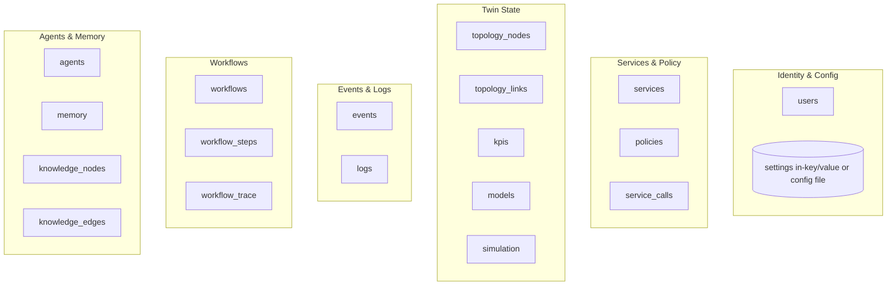
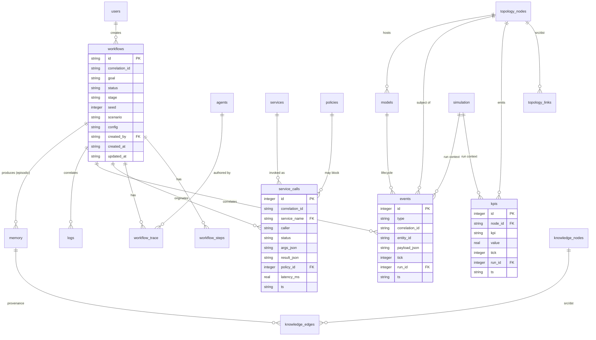
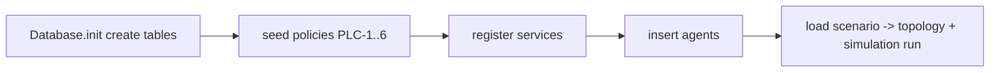

# 12 — Database Schema

> **Document ID:** `12-database.md`
> **Project:** Agent5G — Agentic AI Service Enablement Platform for 5G Advanced Release 20
> **Document Type:** Persistence schema specification (the system of record)
> **Status:** Authoritative for the complete SQLite schema — tables, columns, types, keys, relationships, indexes, constraints, and the queries that back the API and research metrics. The ORM/adapters that implement this are in `10-backend.md`; the API that reads it is in `09-api.md`.
> **Depends on:** `03-architecture.md` (persistence strategy, single writer, event core), `06-digital-twin.md` (twin state/KPIs/events), `08-services.md` (services/policies), `05-agents.md` (memory/knowledge), `13-workflow-engine.md` (workflows/steps/trace), `10-backend.md` (SQLAlchemy setup).
> **Audience:** Backend engineers, data engineers, researchers writing metric queries.

---

## Table of Contents

1. [Purpose](#1-purpose)
2. [Overview](#2-overview)
3. [Design Principles](#3-design-principles)
4. [Conventions](#4-conventions)
5. [Entity-Relationship Diagram](#5-entity-relationship-diagram)
6. [Table Specifications](#6-table-specifications)
   - [6.1 users](#61-users)
   - [6.2 agents](#62-agents)
   - [6.3 services](#63-services)
   - [6.4 policies](#64-policies)
   - [6.5 topology_nodes](#65-topology_nodes)
   - [6.6 topology_links](#66-topology_links)
   - [6.7 kpis](#67-kpis)
   - [6.8 events](#68-events)
   - [6.9 workflows](#69-workflows)
   - [6.10 workflow_steps](#610-workflow_steps)
   - [6.11 workflow_trace](#611-workflow_trace)
   - [6.12 logs](#612-logs)
   - [6.13 memory](#613-memory)
   - [6.14 knowledge_nodes](#614-knowledge_nodes)
   - [6.15 knowledge_edges](#615-knowledge_edges)
   - [6.16 models](#616-models)
   - [6.17 simulation](#617-simulation)
   - [6.18 service_calls](#618-service_calls)
7. [Indexes and Query Patterns](#7-indexes-and-query-patterns)
8. [Research Metric Queries](#8-research-metric-queries)
9. [Retention, Volume, and Pruning](#9-retention-volume-and-pruning)
10. [Migrations and Seeding](#10-migrations-and-seeding)
11. [Interfaces and Contracts](#11-interfaces-and-contracts)
12. [Folder References](#12-folder-references)
13. [Design Decisions](#13-design-decisions)
14. [Future Extensibility](#14-future-extensibility)
15. [Engineering / Implementation / Research Notes](#15-engineering--implementation--research-notes)
16. [Example Scenarios (Data Trace)](#16-example-scenarios-data-trace)
17. [Kiro Build Guidance](#17-kiro-build-guidance)
18. [Acceptance Criteria](#18-acceptance-criteria)

---

## 1. Purpose

This document specifies the **complete persistence schema** for Agent5G. SQLite is the single system of record (DD-4); every durable fact — twin state, KPIs, events, workflows, agent traces, memory, the knowledge graph, services, policies, models, and simulation runs — lives here. The schema is designed so that:

- The **API** (`09`) can serve every page from indexed reads.
- **Explainability** is complete: any workflow can be reconstructed end-to-end by `correlation_id` across events, service calls, steps, trace, and logs.
- **Research metrics** (`02` §16) are computable purely from SQL over persisted rows — no volatile in-memory counters.
- **Determinism** is auditable: each run records its `(seed, scenario, config)`.

The document gives table-by-table column specs, the ER diagram, indexes, the exact queries behind key features and metrics, and migration/seeding guidance. It is written so an engineer can create the schema and the ORM models without further questions.

---

## 2. Overview

Eighteen tables group into six domains:



*Figure 2.1 — Eighteen tables across six domains. `settings` is small enough to live as a key/value table or a JSON config file (§6 note).*

The **join key across everything operational is `correlation_id`** (`wf_{uuid}`): events, service_calls, workflow_steps, workflow_trace, and logs all carry it, so `GET /logs/correlation/{id}` (`09` §9.10) reconstructs a full narrative with a single indexed scan per table.

---

## 3. Design Principles

- **DP1 — System of record.** Everything durable is here; nothing important lives only in memory (metrics too, `02`).
- **DP2 — Correlation everywhere.** Operational rows carry `correlation_id` for end-to-end reconstruction and metrics.
- **DP3 — Append-mostly for history.** `events`, `kpis`, `logs`, `service_calls`, `workflow_trace` are append-only time series; mutable state (`topology_nodes`, `models`, `workflows`) is updated in place with `updated_at`.
- **DP4 — Write discipline.** All writes go through the single-writer queue (`10` §8.2); write-through for discrete rows, write-behind for high-frequency `kpis`.
- **DP5 — Indexed for the UI and metrics.** Every list endpoint filter and every metric query is backed by an index.
- **DP6 — JSON for flexible payloads.** Variable/structured data (event payloads, tool args/results, model metrics, memory content) is stored as JSON (`TEXT` with JSON1), keeping the schema stable while payloads evolve.
- **DP7 — Reproducibility recorded.** Each workflow/run stores its `seed`, `scenario`, and `config` so any figure is regenerable.
- **DP8 — No real PII.** Subscriber/user data is synthetic (content-safety, `07` ND-5); `users` holds only prototype/local accounts.

---

## 4. Conventions

- **Engine:** SQLite (via SQLAlchemy async, `10` §8.1); `WAL`, `foreign_keys=ON`.
- **Primary keys:** string ids where semantically meaningful (`wf_{uuid}`, `model_{uuid}`, `upf_delhi_1`); integer autoincrement for pure append logs (`events`, `kpis`, `logs`, `service_calls`, `workflow_trace`).
- **Timestamps:** `created_at`/`updated_at` as ISO-8601 UTC `TEXT`; append tables also carry `ts`. Twin rows also carry `tick` (INTEGER) for sim time.
- **Enums:** stored as `TEXT` with a `CHECK` constraint listing allowed values.
- **JSON:** `TEXT` columns validated by application (Pydantic) and queried with SQLite JSON1 (`json_extract`).
- **Booleans:** `INTEGER` 0/1.
- **Naming:** tables plural `snake_case`; columns `snake_case`; indexes `ix_{table}_{cols}`; FKs `fk_{table}_{ref}`.
- **Soft vs hard delete:** operational history is never hard-deleted during a run; pruning is an explicit maintenance action (§9).

---

## 5. Entity-Relationship Diagram



*Figure 5.1 — Core ER diagram (key tables detailed; full column lists in §6).*

---

## 6. Table Specifications

Each table: purpose, columns (name · type · constraints), keys, and notes.

### 6.1 users

Prototype/local accounts (auth is minimal in the base build, `09` §6). Present so ownership and future RBAC have a home.

| Column | Type | Constraints |
|--------|------|-------------|
| `id` | TEXT | PK (`user_{uuid}`) |
| `username` | TEXT | UNIQUE, NOT NULL |
| `display_name` | TEXT | |
| `role` | TEXT | CHECK in (`admin`,`researcher`,`viewer`), default `researcher` |
| `created_at` | TEXT | NOT NULL |

Notes: no passwords/credentials in the base build; if auth is added (`17`), credentials go in a separate secured store, not here. Synthetic only (DP8).

### 6.2 agents

Metadata/spec for the seven agents (`05`), plus rollup stats (recomputable from `workflow_trace`/`service_calls`).

| Column | Type | Constraints |
|--------|------|-------------|
| `role` | TEXT | PK, CHECK in (`planner`,`executor`,`observer`,`optimizer`,`recovery`,`documentation`,`memory`) |
| `description` | TEXT | NOT NULL |
| `tools_json` | TEXT (JSON) | bound tool names |
| `memory_scopes_json` | TEXT (JSON) | e.g., `["episodic","semantic"]` |
| `enabled` | INTEGER | default 1 |
| `created_at` | TEXT | |

### 6.3 services

The SEL registry persisted (`08` §6). Source for `GET /services`.

| Column | Type | Constraints |
|--------|------|-------------|
| `name` | TEXT | PK (`{nf}.{domain}.{action}`) |
| `kind` | TEXT | CHECK in (`read`,`action`,`control`) |
| `pattern` | TEXT | CHECK in (`request_response`,`subscribe_notify`) |
| `owner_nf` | TEXT | NF type |
| `input_schema_json` | TEXT (JSON) | JSON Schema of input |
| `output_schema_json` | TEXT (JSON) | JSON Schema of output |
| `policy_tags_json` | TEXT (JSON) | tags |
| `spec_ref` | TEXT | 3GPP clause (`07`) |
| `approximates_operation` | TEXT | real SBA op |
| `idempotent` | INTEGER | 0/1 |
| `compensation` | TEXT | paired inverse service or NULL |
| `description` | TEXT | |
| `registered_at` | TEXT | |

Metrics (call_count, avg_latency, last_called) are computed from `service_calls`, not stored here (avoids write churn).

### 6.4 policies

Guardrails (`08` §8). Editable via `PUT /policies/{id}`.

| Column | Type | Constraints |
|--------|------|-------------|
| `id` | TEXT | PK (`PLC-1`, …) |
| `name` | TEXT | NOT NULL |
| `enabled` | INTEGER | default 1 |
| `severity` | TEXT | CHECK in (`low`,`medium`,`high`,`critical`) |
| `match_json` | TEXT (JSON) | services/tags/regions it applies to |
| `condition_ref` | TEXT | identifier of the pure-function predicate in code |
| `decision` | TEXT | CHECK in (`allow`,`block`,`require_confirmation`) |
| `message` | TEXT | human-readable reason |
| `builtin` | INTEGER | 1 for PLC-1..6 (cannot delete, only disable) |
| `updated_at` | TEXT | |

Note: the *logic* is deterministic code (`condition_ref` maps to a function); the row stores config/enablement only (SD-3).

### 6.5 topology_nodes

Twin nodes (NFs/UEs/edges) current state (`06` §6). Updated in place.

| Column | Type | Constraints |
|--------|------|-------------|
| `id` | TEXT | PK (`upf_delhi_1`) |
| `type` | TEXT | NF/entity type (CHECK in the 13 types) |
| `region` | TEXT | |
| `status` | TEXT | CHECK in (`ACTIVE`,`DEGRADED`,`FAILED`,`RECOVERING`,`STANDBY`) |
| `load` | REAL | 0..1 |
| `x` | REAL | layout coord |
| `y` | REAL | layout coord |
| `state_json` | TEXT (JSON) | role-specific state (`07`) |
| `services_json` | TEXT (JSON) | produced service names |
| `updated_at` | TEXT | |
| `tick` | INTEGER | last-updated sim tick |

### 6.6 topology_links

Edges between nodes with live metrics.

| Column | Type | Constraints |
|--------|------|-------------|
| `id` | TEXT | PK |
| `src_id` | TEXT | FK → topology_nodes(id) |
| `dst_id` | TEXT | FK → topology_nodes(id) |
| `ref_point` | TEXT | e.g., `N3`,`N4`,`N6` |
| `throughput_mbps` | REAL | |
| `latency_ms` | REAL | |
| `utilization` | REAL | 0..1 |
| `updated_at` | TEXT | |

### 6.7 kpis

Append-only KPI time series (`06` §8). Write-behind batched (DP4). The largest table.

| Column | Type | Constraints |
|--------|------|-------------|
| `id` | INTEGER | PK autoincrement |
| `node_id` | TEXT | FK → topology_nodes(id) |
| `kpi` | TEXT | e.g., `latency_ms` |
| `value` | REAL | NOT NULL |
| `tick` | INTEGER | sim tick |
| `run_id` | INTEGER | FK → simulation(id) |
| `ts` | TEXT | wall time |

Indexes: `ix_kpis_node_kpi_tick (node_id, kpi, tick)`, `ix_kpis_run (run_id)`.

### 6.8 events

Append-only domain events (`06` §14, `09` §10). The audit backbone.

| Column | Type | Constraints |
|--------|------|-------------|
| `id` | INTEGER | PK autoincrement |
| `type` | TEXT | event type (SCREAMING_SNAKE_CASE) |
| `correlation_id` | TEXT | nullable (twin-origin ticks may be uncorrelated) |
| `entity_id` | TEXT | subject (node/model/subscription), nullable |
| `payload_json` | TEXT (JSON) | envelope payload |
| `tick` | INTEGER | sim tick |
| `run_id` | INTEGER | FK → simulation(id) |
| `ts` | TEXT | NOT NULL |

Indexes: `ix_events_type_ts`, `ix_events_correlation`, `ix_events_entity`, `ix_events_run`.

### 6.9 workflows

One row per workflow run (`13`, `05`). Updated in place as it progresses.

| Column | Type | Constraints |
|--------|------|-------------|
| `id` | TEXT | PK (`wf_{uuid}`) |
| `correlation_id` | TEXT | == id (convenience), indexed |
| `goal` | TEXT | NOT NULL |
| `trigger` | TEXT | CHECK in (`user`,`observer`,`template`) |
| `status` | TEXT | CHECK in (`running`,`completed`,`failed`,`cancelled`,`paused`) |
| `stage` | TEXT | current lifecycle stage |
| `attempts` | INTEGER | retry count |
| `seed` | INTEGER | run seed (DP7) |
| `scenario` | TEXT | active scenario |
| `config_json` | TEXT (JSON) | agent config (multi_agent, memory on/off, recovery on/off) — for experiments |
| `summary_json` | TEXT (JSON) | Documentation agent summary (on complete) |
| `error` | TEXT | on failure |
| `created_by` | TEXT | FK → users(id), nullable |
| `created_at` | TEXT | |
| `updated_at` | TEXT | |
| `completed_at` | TEXT | nullable |

### 6.10 workflow_steps

Ordered plan steps and their results (`05` §9.1/§9.2, `13`).

| Column | Type | Constraints |
|--------|------|-------------|
| `id` | TEXT | PK (`{wf}_s{n}`) |
| `workflow_id` | TEXT | FK → workflows(id) |
| `correlation_id` | TEXT | |
| `index` | INTEGER | order |
| `service_name` | TEXT | planned service (FK → services.name, nullable for non-service steps) |
| `args_json` | TEXT (JSON) | resolved args |
| `success_criterion` | TEXT | how validated |
| `status` | TEXT | CHECK in (`pending`,`running`,`succeeded`,`failed`,`compensated`) |
| `result_json` | TEXT (JSON) | step result |
| `compensation` | TEXT | inverse service (for rollback) |
| `attempts` | INTEGER | per-step retries |
| `created_at` | TEXT | |
| `updated_at` | TEXT | |

### 6.11 workflow_trace

Append-only reasoning/execution trace per stage (`05` §5 rationale, `09` `/workflows/{id}/trace`). The explainability record.

| Column | Type | Constraints |
|--------|------|-------------|
| `id` | INTEGER | PK autoincrement |
| `workflow_id` | TEXT | FK → workflows(id) |
| `correlation_id` | TEXT | |
| `stage` | TEXT | lifecycle stage |
| `agent_role` | TEXT | FK → agents(role) |
| `rationale` | TEXT | agent's rationale (structured-output field) |
| `structured_json` | TEXT (JSON) | full structured output (Plan/Observation/…) |
| `tokens_in` | INTEGER | LLM cost metric |
| `tokens_out` | INTEGER | |
| `latency_ms` | REAL | |
| `ts` | TEXT | |

Indexes: `ix_trace_workflow (workflow_id, ts)`.

### 6.12 logs

Append-only structured application logs (`10` §12, `09` `/logs`). Human/UI-facing audit.

| Column | Type | Constraints |
|--------|------|-------------|
| `id` | INTEGER | PK autoincrement |
| `ts` | TEXT | NOT NULL |
| `level` | TEXT | CHECK in (`debug`,`info`,`warn`,`error`) |
| `type` | TEXT | log/event category |
| `correlation_id` | TEXT | nullable |
| `nf` | TEXT | subject NF, nullable |
| `service` | TEXT | service name, nullable |
| `message` | TEXT | NOT NULL |
| `payload_json` | TEXT (JSON) | context |

Indexes: `ix_logs_ts`, `ix_logs_correlation`, `ix_logs_level_type`.

### 6.13 memory

Agent memory records (`05` §6): working (usually ephemeral, optionally snapshotted), episodic, semantic.

| Column | Type | Constraints |
|--------|------|-------------|
| `id` | TEXT | PK (`mem_{uuid}`) |
| `scope` | TEXT | CHECK in (`working`,`episodic`,`semantic`) |
| `content_json` | TEXT (JSON) | the memory content |
| `summary` | TEXT | short searchable text |
| `workflow_id` | TEXT | provenance (FK → workflows.id), nullable |
| `created_by_agent` | TEXT | FK → agents.role (memory agent) |
| `embedding_json` | TEXT (JSON) | optional vector for similarity retrieval |
| `weight` | REAL | salience/decay weight |
| `created_at` | TEXT | |
| `expires_at` | TEXT | nullable (semantic decay) |

Indexes: `ix_memory_scope`, `ix_memory_workflow`. Retrieval by `summary`/`embedding` (`05` §6).

### 6.14 knowledge_nodes

Knowledge-graph entities (`05` §6).

| Column | Type | Constraints |
|--------|------|-------------|
| `id` | TEXT | PK (`kn_{uuid}` or natural like `nf:upf_delhi_1`) |
| `entity_type` | TEXT | CHECK in (`nf`,`model`,`incident`,`intent`,`region`,`policy`) |
| `label` | TEXT | display label |
| `props_json` | TEXT (JSON) | attributes |
| `first_seen_at` | TEXT | |
| `updated_at` | TEXT | |

### 6.15 knowledge_edges

Typed relations between knowledge nodes, with provenance.

| Column | Type | Constraints |
|--------|------|-------------|
| `id` | INTEGER | PK autoincrement |
| `src_id` | TEXT | FK → knowledge_nodes(id) |
| `dst_id` | TEXT | FK → knowledge_nodes(id) |
| `relation` | TEXT | e.g., `hosted_on`,`caused_by`,`mitigated_by`,`targets` |
| `props_json` | TEXT (JSON) | |
| `provenance_workflow_id` | TEXT | FK → workflows(id) |
| `created_at` | TEXT | |

Indexes: `ix_kedges_src`, `ix_kedges_dst`, `ix_kedges_relation`. Unique `(src_id, relation, dst_id)` for upsert semantics.

### 6.16 models

AIMLE model instances (`06` §12, `08` §10.5, `09` §9.8). Updated in place through the lifecycle.

| Column | Type | Constraints |
|--------|------|-------------|
| `id` | TEXT | PK (`model_{uuid}`) |
| `name` | TEXT | NOT NULL |
| `version` | TEXT | |
| `state` | TEXT | CHECK in (`registered`,`trained`,`validated`,`deployed`,`monitored`,`retired`) |
| `target_node_id` | TEXT | FK → topology_nodes(id), nullable until deployed |
| `metrics_json` | TEXT (JSON) | simulated metrics (accuracy, …) |
| `created_at` | TEXT | |
| `updated_at` | TEXT | |

Lifecycle transitions emit `MODEL_DEPLOYED`/`MODEL_RETIRED` into `events`.

### 6.17 simulation

One row per simulation run/session (a run = a `(seed, scenario)` continuation). The reproducibility anchor (DP7).

| Column | Type | Constraints |
|--------|------|-------------|
| `id` | INTEGER | PK autoincrement (`run_id`) |
| `scenario` | TEXT | preset name |
| `seed` | INTEGER | NOT NULL |
| `status` | TEXT | CHECK in (`running`,`paused`,`stopped`,`reset`) |
| `tick` | INTEGER | current/last tick |
| `tick_ms` | INTEGER | tick interval |
| `snapshot_json` | TEXT (JSON) | optional periodic full twin snapshot for fast restart (`06` §15) |
| `started_at` | TEXT | |
| `ended_at` | TEXT | nullable |

`kpis` and `events` reference `run_id` so any figure is scoped to an exact run.

### 6.18 service_calls

Append-only record of every SEL invocation (`08` §7). Backs service metrics, plan-correctness, and policy-compliance analysis.

| Column | Type | Constraints |
|--------|------|-------------|
| `id` | INTEGER | PK autoincrement |
| `correlation_id` | TEXT | workflow it belongs to |
| `workflow_id` | TEXT | FK → workflows(id), nullable (UI try-it) |
| `service_name` | TEXT | FK → services(name) |
| `caller` | TEXT | `executor`/`recovery`/`api`/NF |
| `status` | TEXT | CHECK in (`ok`,`blocked`,`error`,`requires_confirmation`) |
| `args_json` | TEXT (JSON) | |
| `result_json` | TEXT (JSON) | |
| `policy_id` | TEXT | FK → policies(id), set when blocked/confirmed |
| `latency_ms` | REAL | |
| `ts` | TEXT | NOT NULL |

Indexes: `ix_calls_correlation`, `ix_calls_service`, `ix_calls_status`, `ix_calls_ts`.

> **`settings` note:** effective configuration (`09` §9.12) is small and read-mostly. Implement it either as a single-row `settings` table with a `config_json` column, or as a JSON file loaded by `Settings` (`10` §6). Either is acceptable; the API contract is unchanged.

---

## 7. Indexes and Query Patterns

Every list filter (`09` §11) and metric (§8) is index-backed (DP5).

| Query pattern | Backing index |
|---------------|---------------|
| Logs by correlation (workflow narrative) | `ix_logs_correlation`, `ix_events_correlation`, `ix_calls_correlation`, `ix_trace_workflow` |
| KPI history for an NF | `ix_kpis_node_kpi_tick` |
| Events by type / time | `ix_events_type_ts` |
| Workflows by status/time | `ix_workflows_status_created` |
| Service metrics (count/avg latency) | `ix_calls_service`, `ix_calls_status` |
| Knowledge neighborhood | `ix_kedges_src`, `ix_kedges_dst` |
| Memory retrieval by scope | `ix_memory_scope` |
| Analytics by run | `ix_kpis_run`, `ix_events_run` |

**Reconstruct a workflow (single narrative):**
```sql
SELECT ts, 'trace' AS src, stage AS a, rationale AS b FROM workflow_trace WHERE correlation_id = :cid
UNION ALL
SELECT ts, 'call', service_name, status FROM service_calls WHERE correlation_id = :cid
UNION ALL
SELECT ts, 'event', type, entity_id FROM events WHERE correlation_id = :cid
UNION ALL
SELECT ts, 'log', level, message FROM logs WHERE correlation_id = :cid
ORDER BY ts;
```

---

## 8. Research Metric Queries

The metrics from `02` §16 are pure SQL over persisted rows (DP1). Examples:

**Task success rate (by config):**
```sql
SELECT json_extract(config_json,'$.mode') AS config,
       AVG(CASE WHEN status='completed' THEN 1.0 ELSE 0 END) AS success_rate,
       COUNT(*) AS n
FROM workflows GROUP BY config;
```

**Steps-to-completion:**
```sql
SELECT w.id, COUNT(s.id) AS steps
FROM workflows w JOIN workflow_steps s ON s.workflow_id = w.id
WHERE w.status='completed' GROUP BY w.id;
```

**Recovery rate (under injected failures):**
```sql
SELECT AVG(CASE WHEN status='completed' THEN 1.0 ELSE 0 END) AS recovery_rate
FROM workflows
WHERE id IN (SELECT DISTINCT correlation_id FROM events WHERE type='NF_FAILED');
```

**Policy compliance (blocked vs total actions):**
```sql
SELECT SUM(status='blocked') AS blocked, COUNT(*) AS actions,
       1.0*SUM(status='blocked')/COUNT(*) AS block_rate
FROM service_calls WHERE service_name IN (SELECT name FROM services WHERE kind='action');
```

**LLM cost per workflow:**
```sql
SELECT workflow_id, SUM(tokens_in+tokens_out) AS tokens, SUM(latency_ms) AS llm_ms
FROM workflow_trace GROUP BY workflow_id;
```

**Memory warm/cold speedup (H5):**
```sql
SELECT json_extract(config_json,'$.memory') AS memory_mode, AVG(steps) AS avg_steps FROM (
  SELECT w.id, w.config_json, COUNT(s.id) AS steps
  FROM workflows w JOIN workflow_steps s ON s.workflow_id=w.id
  WHERE w.status='completed' GROUP BY w.id
) GROUP BY memory_mode;
```

`GET /analytics/export` (`09` §9.7) runs these (parameterized by run/scenario/config) and returns CSV for figures.

---

## 9. Retention, Volume, and Pruning

- **Largest tables:** `kpis` (per node × KPI × tick), `events`, `logs`, `service_calls`. At 1 tick/sec with a small topology, `kpis` grows fastest.
- **Mitigations:** write-behind batching (DP4); KPI persistence at a coarser resolution than the bus (`06` §15); optional downsampling on write.
- **Pruning (explicit maintenance):** a `scripts/prune.ps1` can delete `kpis`/`events`/`logs` older than a threshold or outside kept `run_id`s. Never auto-prune during a run (would corrupt reproducibility).
- **Per-run isolation:** because `kpis`/`events` carry `run_id`, an old run can be dropped wholesale without touching current data.
- **Snapshots:** `simulation.snapshot_json` allows restart without replaying/keeping all history (`06` §15).

---

## 10. Migrations and Seeding

- **Creation:** `Database.init()` creates all tables from SQLAlchemy metadata if absent (`10` §8.1) — sufficient for the prototype.
- **Migrations:** when the schema stabilizes, adopt **Alembic** (`alembic/` with versioned revisions); documented here as the evolution path. Until then, schema changes during early dev may recreate the dev DB (data is reproducible from seed+scenario).
- **Seeding (`scripts/seed.ps1` / a seed module):**
  1. Insert built-in `policies` (PLC-1..6, `builtin=1`).
  2. Register `services` (from the SEL registry at startup, `08` §6).
  3. Insert `agents` rows (the seven roles).
  4. Optionally insert a default `users` row (`researcher`).
  5. Load a default `scenario` → populate `topology_nodes`/`topology_links` and create a `simulation` run row.
- **Idempotent seeding:** upsert by PK so re-running seed is safe.



*Figure 10.1 — Startup create + seed order.*

---

## 11. Interfaces and Contracts

- **ORM models:** `infrastructure/db/models.py` (`10` §8.1) map 1:1 to these tables; kept separate from domain entities (BD-2).
- **Repositories:** `Sql*Repository`/`ServiceRegistry`/`SqlLogRepository` (`10` §13) translate rows ↔ domain/DTOs; all writes via the single-writer (DP4).
- **API DTOs:** `api/schemas/*` (`09`) are projections of these rows; e.g., `WorkflowSummary` from `workflows` (+counts), `LogEntry` from `logs`.
- **Correlation contract:** `correlation_id` is the join key across `events`, `service_calls`, `workflow_steps`, `workflow_trace`, `logs`, and `workflows` (DP2).
- **Run contract:** `run_id` on `kpis`/`events` scopes data to a reproducible `(seed, scenario)` run (DP7).

---

## 12. Folder References

```text
backend/app/infrastructure/db/
├── models.py         # SQLAlchemy ORM classes for all 18 tables
├── engine.py         # async engine + PRAGMAs + session factory (10 §8.1)
├── repos/            # Sql* repositories per port
│   ├── twin_repo.py workflow_repo.py memory_store.py policy_store.py log_repo.py
├── seed.py           # idempotent seeding (§10)
└── migrations/       # (future) alembic revisions
data/
├── agent5g.db        # the SQLite file (gitignored)
└── scenarios/*.json  # scenario presets (06 §16)
```

This document owns the *schema*; `10` owns the *ORM/adapter implementation*; `09` owns the *DTO projections*.

---

## 13. Design Decisions

- **DBD-1 — Single SQLite file.** Rationale: zero-config local, matches DD-4. Trade-off: limited concurrency (mitigated by single-writer); Postgres seam preserved (repos + ports).
- **DBD-2 — JSON columns for variable payloads.** Rationale: stable schema while payloads evolve; JSON1 queryable. Trade-off: less relational rigor for payload fields; acceptable for prototype flexibility (DP6).
- **DBD-3 — `correlation_id` on all operational tables.** Rationale: one-scan workflow reconstruction + metrics (DP2). Trade-off: some duplication; huge explainability payoff.
- **DBD-4 — `run_id` scoping on time series.** Rationale: reproducible per-run analytics + easy pruning (DP7). Trade-off: extra FK; essential for research.
- **DBD-5 — Service metrics computed, not stored.** Rationale: avoid write churn on `services`; derive from `service_calls`. Trade-off: metric queries cost more; indexed and cheap enough.
- **DBD-6 — Separate `workflow_steps` (state) vs `workflow_trace` (append log).** Rationale: mutable plan state vs immutable reasoning history serve different reads. Trade-off: two tables; clearer semantics.
- **DBD-7 — Policies store config, logic in code.** Rationale: deterministic guardrails (SD-3). Trade-off: `condition_ref` indirection; safety guarantee wins.

---

## 14. Future Extensibility

- **Postgres/TimescaleDB:** move `kpis`/`events` to a time-series-optimized store behind the same repositories (`20`); drop single-writer.
- **Vector store:** promote `memory.embedding_json` to a real vector index (sqlite-vss or an external store) for semantic retrieval at scale.
- **Alembic migrations:** formalize once schema stabilizes (§10).
- **Partitioning by run:** archive completed `run_id`s to separate files for large studies.
- **RBAC tables:** add `roles`/`permissions` and credential storage when auth arrives (`09` §6, `17`).
- **Analytics materialized views:** precompute heavy metric aggregates when experiment volume grows.

---

## 15. Engineering / Implementation / Research Notes

**Engineering.**
- Keep ORM models thin and separate from domain entities; repositories do the mapping (BD-2).
- All writes through the single-writer queue; never open a second write connection (avoids `database is locked`).
- Enable `foreign_keys=ON` (SQLite requires it per-connection) in the engine PRAGMAs (`10` §8.1).
- Store timestamps as UTC ISO strings consistently; store sim `tick` alongside for twin rows.

**Implementation.**
- Build order: `models.py` (all tables) → `engine.py` PRAGMAs → repos (twin, workflow, log, memory, policy) → `seed.py`. Create `simulation` run row before writing any `kpis`/`events` so `run_id` FKs resolve.
- Add composite indexes from §7 at table creation; verify with `EXPLAIN QUERY PLAN` on the correlation reconstruction and KPI-history queries.
- Provide the metric queries (§8) as named, tested functions in `log_repo`/an analytics repo so `/analytics/*` reuses them.

**Research.**
- Every workflow persists `seed`, `scenario`, `config_json` (DP7) — this is what makes each figure regenerable; verify no metric depends on in-memory state.
- `run_id` scoping means an experiment = a set of `run_id`s + workflow `config`s; document which runs produced which figure.
- `workflow_trace.tokens_in/out` + `latency_ms` are the cost metric source; ensure the `LLMClient` writes them for every call (`10` §8.4).

---

## 16. Example Scenarios (Data Trace)

**Scenario A (data).** `POST /workflows` → insert `workflows(wf_1a2b3c, goal, config)`. Planner reasoning → `workflow_trace` rows (with tokens). Plan → `workflow_steps` (deploy, subscribe) with `compensation`. Executor calls → `service_calls(aimle.model.deploy, ok)` + `service_calls(nwdaf...subscribe, ok)`; twin mutation → `models.state=deployed` (update) + `events(MODEL_DEPLOYED)`; Documentation → `memory(episodic)` + `knowledge_edges(Model hosted_on DelhiEdge, provenance=wf_1a2b3c)`; workflow `status=completed`. All rows share `correlation_id=wf_1a2b3c`.

**Scenario B (data).** Tick loop writes `kpis` (write-behind); breach → `events(KPI_THRESHOLD_BREACH, run_id)`. New workflow row (trigger=`observer`). Optimizer read → `service_calls(dcf.data.history, ok)`; Executor → `service_calls(upf.loadbalance.apply, ok)`; recovery of KPI → `events(KPI_THRESHOLD_CLEARED)`. Metric queries later read these to compute recovery_rate.

**Scenario C (data).** `POST /simulation/fault` → `topology_nodes(nrf).status=FAILED` + `events(NF_FAILED)`. `service_calls(nrf.discover, error)`. Recovery → `service_calls(nrf.register, ok)` on standby (PLC-1 → no `blocked` row because we never attempted zero-NRF deregister). `events(NF_RECOVERED)`; incident → `knowledge_nodes(incident) + knowledge_edges(mitigated_by)`.

---

## 17. Kiro Build Guidance

### 17.1 Implementation Order
1. `models.py` — all 18 tables with columns, PKs, FKs, CHECK constraints, indexes (§6–§7).
2. `engine.py` — async engine + WAL/foreign_keys/busy_timeout PRAGMAs + session factory.
3. Repositories per port (twin, workflow, memory, policy, log/analytics).
4. `seed.py` — idempotent seed (policies → services → agents → user → scenario+run).
5. Metric query functions (§8) behind the analytics repo.

### 17.2 Coding Rules
- All writes via the single-writer (`10` §8.2); reads via short-lived sessions.
- `correlation_id` on every operational insert (DP2); `run_id` on every `kpis`/`events` insert (DP7).
- Enums enforced by `CHECK`; JSON columns validated by Pydantic before insert.
- No metric may read in-memory state — only tables (DP1). No PII (DP8).
- Create a `simulation` run row before any `kpis`/`events` (FK integrity).

### 17.3 Naming Convention
- Tables plural `snake_case`; columns `snake_case`; indexes `ix_{table}_{cols}`; FKs `fk_{table}_{ref}`; ids prefixed (`wf_`, `model_`, `mem_`, `user_`, `kn_`).

### 17.4 Folder Ownership
- `infrastructure/db/*`, `data/*` owned here + `10`; DTO projections in `09`.

### 17.5 Prompt Suggestions
- "Implement SQLAlchemy models for all 18 tables in `12-database.md` with CHECK constraints, FKs, and the §7 indexes."
- "Implement idempotent `seed.py`: built-in policies PLC-1..6, service registry, seven agents, default user, default scenario + simulation run."
- "Implement analytics repo functions for the §8 metric queries, parameterized by run_id/config."
- "Add an integration test that reconstructs a workflow narrative by correlation_id across trace/calls/events/logs."

### 17.6 Acceptance Criteria
- All 18 tables create cleanly with FKs enforced and indexes present.
- A completed workflow can be fully reconstructed by `correlation_id` in one query per table.
- Each research metric in §8 returns correct values from seeded/sample data.
- Every `kpis`/`events` row resolves a valid `run_id`.

---

## 18. Acceptance Criteria

This document is **complete and correct** when:

- [ ] **AC-1.** All required domains are covered: users, agents, services, events, kpis, workflows, logs, memory, policies, models, simulation, topology (plus steps/trace/service_calls/knowledge).
- [ ] **AC-2.** Every table has columns with types, keys, constraints (CHECK for enums), and notes.
- [ ] **AC-3.** An ER diagram shows relationships and key columns.
- [ ] **AC-4.** `correlation_id` (operational) and `run_id` (time series) join contracts are specified (DP2/DP7).
- [ ] **AC-5.** Indexes back every list filter and metric query (§7).
- [ ] **AC-6.** Research metric queries (§8) are provided as runnable SQL computable purely from tables.
- [ ] **AC-7.** Retention/volume/pruning strategy is specified without breaking reproducibility.
- [ ] **AC-8.** Migration and idempotent seeding order is specified.
- [ ] **AC-9.** Interfaces (ORM models, repositories, DTO projections) and folder references are specified.
- [ ] **AC-10.** JSON-payload strategy, enum-via-CHECK, and no-PII are specified.
- [ ] **AC-11.** Design decisions, extensibility, notes, data-trace scenarios, and Kiro guidance are present.
- [ ] **AC-12.** Schema aligns with `06` (twin/KPIs/events), `08` (services/policies), `05`/`13` (workflows/memory), and `09` (DTOs).

---

**NEXT FILE**
