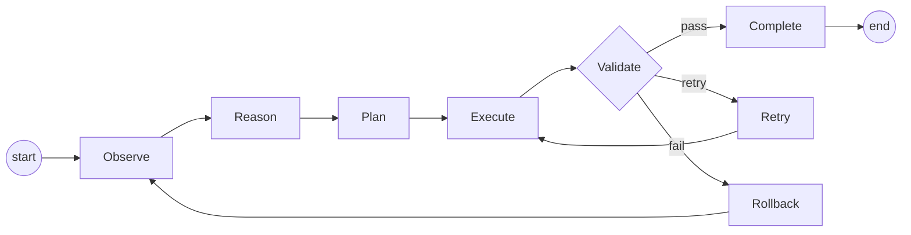
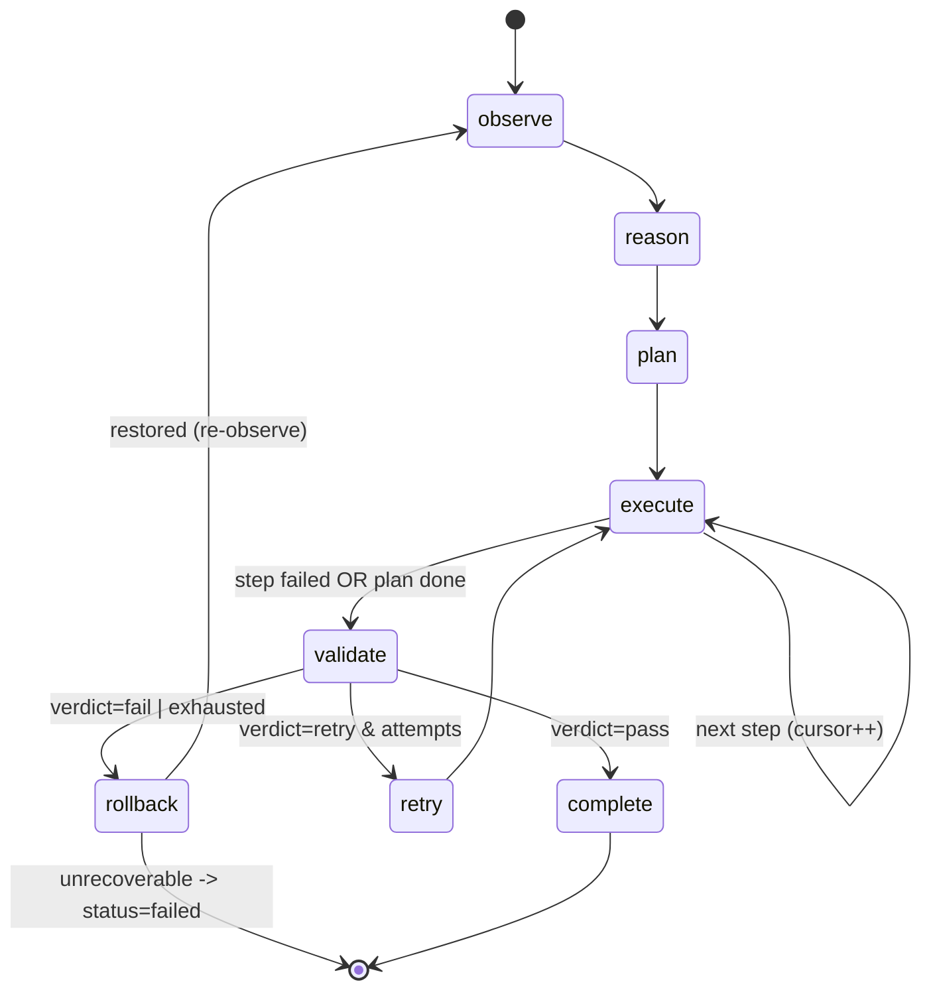
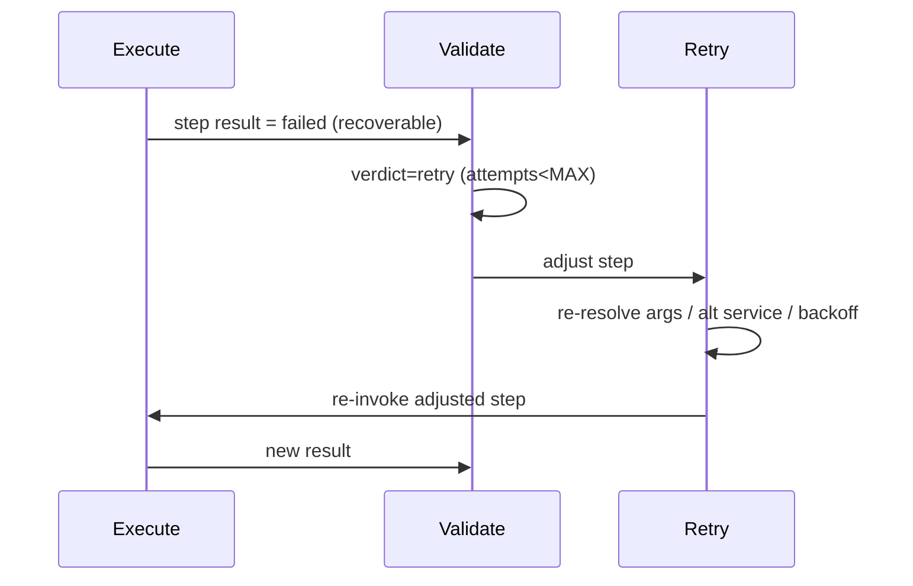
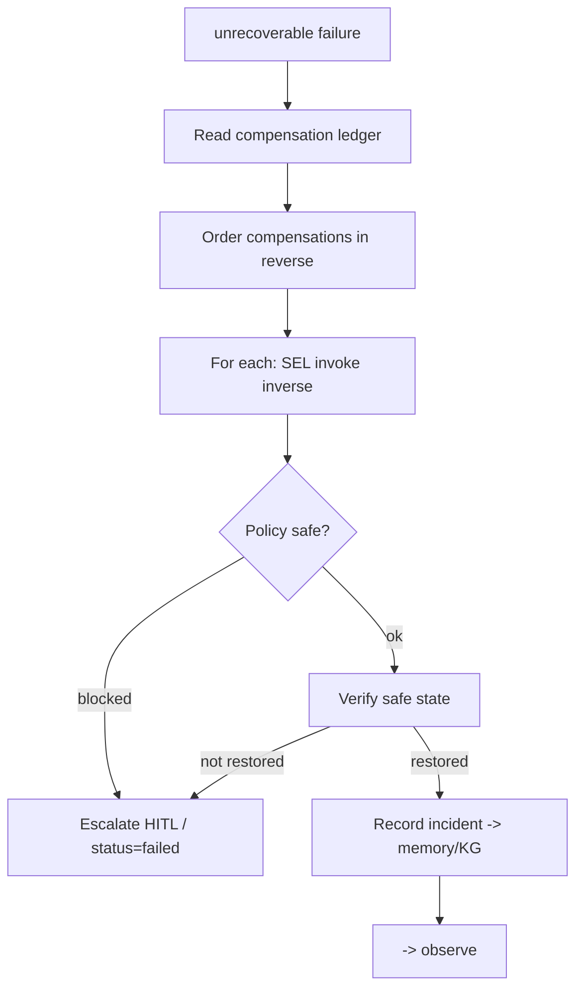
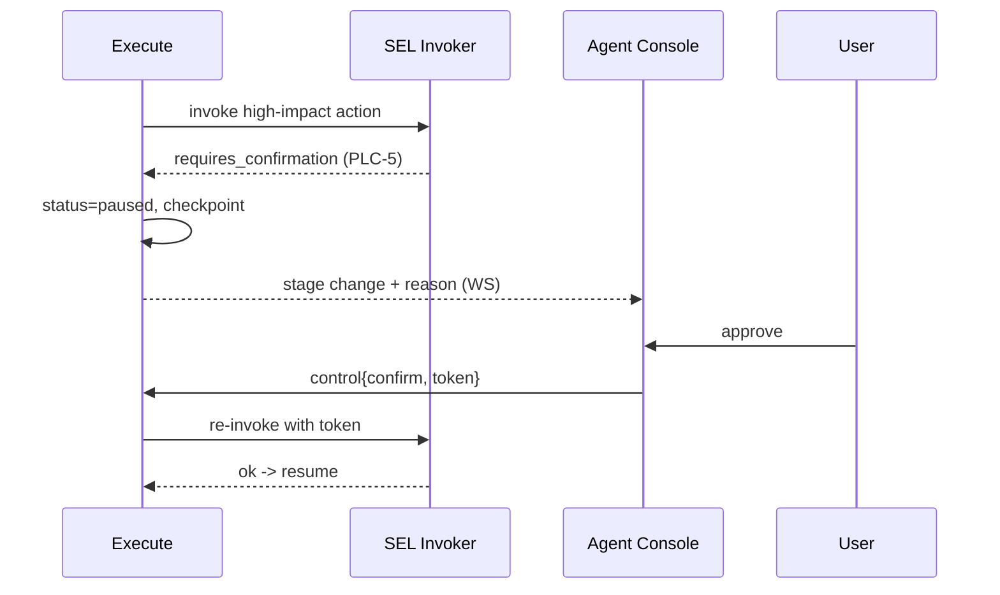
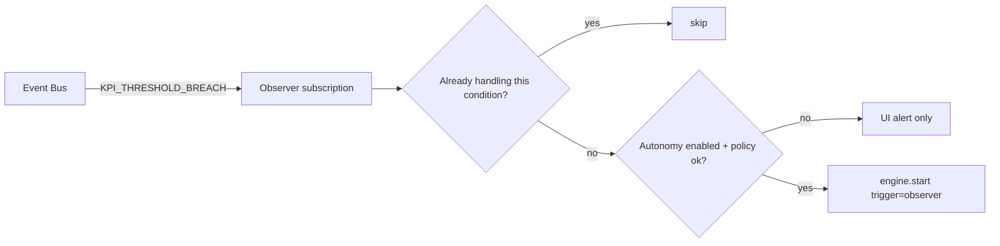

# 13 — Workflow Engine

> **Document ID:** `13-workflow-engine.md`
> **Project:** Agent5G — Agentic AI Service Enablement Platform for 5G Advanced Release 20
> **Document Type:** Workflow orchestration specification (the closed-loop engine)
> **Status:** Authoritative for the 8-stage lifecycle, the `WorkflowState` object, the LangGraph graph construction, node behavior, transition guards, retry/rollback semantics, checkpointing, human-in-the-loop, and concurrency. The agents that occupy the nodes are in `05-agents.md`; the services they call are in `08-services.md`; the persistence is in `12-database.md`.
> **Depends on:** `03-architecture.md` (lifecycle wiring §9, WorkflowState, event core), `05-agents.md` (agent roles + structured outputs + hand-offs), `08-services.md` (SEL invoker + compensation), `12-database.md` (workflows/steps/trace tables), `10-backend.md` (engine wiring, background runners).
> **Audience:** Backend/AI engineers implementing the engine, researchers instrumenting the loop.

---

## Table of Contents

1. [Purpose](#1-purpose)
2. [Overview](#2-overview)
3. [Design Principles](#3-design-principles)
4. [The WorkflowState Object](#4-the-workflowstate-object)
5. [The Lifecycle Graph](#5-the-lifecycle-graph)
6. [Node Specifications](#6-node-specifications)
7. [Transition Guards](#7-transition-guards)
8. [Retry Semantics](#8-retry-semantics)
9. [Rollback and Compensation](#9-rollback-and-compensation)
10. [Checkpointing and Resumability](#10-checkpointing-and-resumability)
11. [Human-in-the-Loop (HITL)](#11-human-in-the-loop-hitl)
12. [Autonomous Triggering](#12-autonomous-triggering)
13. [Concurrency and Scheduling](#13-concurrency-and-scheduling)
14. [Persistence and Eventing](#14-persistence-and-eventing)
15. [Interfaces and Contracts](#15-interfaces-and-contracts)
16. [Folder References](#16-folder-references)
17. [Design Decisions](#17-design-decisions)
18. [Future Extensibility](#18-future-extensibility)
19. [Engineering / Implementation / Research Notes](#19-engineering--implementation--research-notes)
20. [Example Scenarios (Engine Trace)](#20-example-scenarios-engine-trace)
21. [Kiro Build Guidance](#21-kiro-build-guidance)
22. [Acceptance Criteria](#22-acceptance-criteria)

---

## 1. Purpose

The Workflow Engine is the **closed-loop orchestrator** that turns an intent into action and adapts when reality diverges. It implements the eight-stage lifecycle — **Observe → Reason → Plan → Execute → Validate → Retry → Rollback → Complete** — as a durable, inspectable, resumable graph on LangGraph. This document specifies exactly how that graph is constructed and executed: the shared state object, each node's contract, the guarded transitions, the retry and rollback (compensation) semantics, checkpointing, human-in-the-loop control, autonomous triggering, and how it all persists for explainability and research.

Where `05-agents.md` defined *who reasons* and `08-services.md` defined *what they can call*, this document defines *how the reasoning and acting are sequenced, validated, retried, and rolled back*. It is the runtime spine of the platform: every workflow — user-initiated or Observer-triggered — is one execution of this graph.

The engine must be **correct** (right actions in the right order under policy), **robust** (adapts via retry/rollback), **transparent** (every step persisted and observable), and **reproducible** (deterministic under replay LLM + seed).

---

## 2. Overview

A workflow is created for each goal (`POST /workflows`, `09` §9.2) or autonomous trigger (`12`). The engine builds a LangGraph `StateGraph` whose nodes are the lifecycle stages and whose shared `WorkflowState` flows through them, checkpointed after every node. Nodes delegate their cognition to the bound agent (`05`) and their actions to the SEL invoker (`08`).



*Figure 2.1 — The lifecycle graph. Validate is the branching hub; Retry loops back to Execute; Rollback restores and re-observes.*

Key properties (from `03` §9, ADR-3):
- **One graph model** for the lifecycle and the agent steps — a single checkpointed `WorkflowState`.
- **Validate is the decision hub** — pass/retry/fail edges are conditional on guards (§7).
- **Bounded autonomy** — retries and total actions are capped (policy PLC-3, `08`).
- **Everything persisted** — stage changes, steps, trace, and events (`12`, `14`-events).

---

## 3. Design Principles

- **WP1 — Single shared state.** All nodes read/write one typed `WorkflowState`; no side state. This is what makes checkpointing and time-travel work.
- **WP2 — Nodes are thin.** A node coordinates: call the bound agent for a structured decision, apply it (via the SEL for actions), update state, emit an event. No business logic beyond sequencing.
- **WP3 — Structured decisions drive transitions.** Edges branch on validated fields of agent outputs (e.g., `validation.verdict`), never on parsing free text (AP2 from `05`).
- **WP4 — Actions only via the SEL.** Execute/Retry/Rollback call services through the invoker (P2); the engine never touches the twin directly.
- **WP5 — Every action is compensatable.** Executor records a compensation for each successful action so Rollback is mechanical (`08` SD-5).
- **WP6 — Deterministic under replay.** With replay LLM + fixed seed, the same intent yields the same graph traversal and state (`02` §16).
- **WP7 — Checkpoint after every node.** Durable, resumable, inspectable; enables HITL interrupts and crash recovery.
- **WP8 — Bounded.** Max retries per step and max total actions per workflow; exceeding them routes to Rollback/failure, not infinite loops.

---

## 4. The WorkflowState Object

The single object threaded through the graph and checkpointed by LangGraph. Pydantic model in `application/workflow/state.py`.

```python
# application/workflow/state.py (indicative)
class WorkflowState(BaseModel):
    # identity / context
    id: str                      # wf_{uuid} == correlation_id
    goal: str
    trigger: Literal["user","observer","template"]
    seed: int
    scenario: str
    config: WorkflowConfig       # multi_agent, memory, recovery, policy toggles (experiments)

    # lifecycle
    stage: Stage                 # observe|reason|plan|execute|validate|retry|rollback|complete
    status: Literal["running","completed","failed","cancelled","paused"]
    attempts: int = 0            # total action attempts (bounded)

    # agent outputs (structured, from 05)
    observation: Observation | None = None
    interpretation: Interpretation | None = None
    plan: Plan | None = None            # ordered steps[]
    cursor: int = 0                     # index of current step
    results: list[StepResult] = []
    validation: Validation | None = None
    optimization: OptimizationProposal | None = None

    # recovery
    compensations: list[Compensation] = []   # inverse actions for executed steps
    recovery: RecoveryPlan | None = None

    # memory context (retrieved at Observe/Reason)
    memory_context: MemoryContext | None = None

    # output
    summary: WorkflowSummary | None = None
    error: str | None = None

    # trace (append-only; also persisted to workflow_trace)
    trace: list[TraceEntry] = []
```

- **`config`** carries experiment toggles (`02` §16, `12` `workflows.config_json`) so a single engine serves all A/B conditions.
- **`compensations`** is the rollback ledger (WP5): each successful action appends its inverse service + args.
- **`trace`** mirrors the `workflow_trace` table (`12` §6.11) — the explainability record.
- The state is **fully serializable** (Pydantic → JSON) for checkpointing (WP7).

---

## 5. The Lifecycle Graph

Constructed in `application/workflow/engine.py` using LangGraph's `StateGraph[WorkflowState]`.

```python
# application/workflow/engine.py (indicative)
def build_graph(orchestrator, checkpointer) -> CompiledGraph:
    g = StateGraph(WorkflowState)
    g.add_node("observe",  nodes.observe(orchestrator))
    g.add_node("reason",   nodes.reason(orchestrator))
    g.add_node("plan",     nodes.plan(orchestrator))
    g.add_node("execute",  nodes.execute(orchestrator))
    g.add_node("validate", nodes.validate(orchestrator))
    g.add_node("retry",    nodes.retry(orchestrator))
    g.add_node("rollback", nodes.rollback(orchestrator))
    g.add_node("complete", nodes.complete(orchestrator))

    g.set_entry_point("observe")
    g.add_edge("observe", "reason")
    g.add_edge("reason", "plan")
    g.add_edge("plan", "execute")
    g.add_conditional_edges("execute", route_after_execute)   # -> validate (or execute next step)
    g.add_conditional_edges("validate", route_after_validate) # -> complete | retry | rollback
    g.add_edge("retry", "execute")
    g.add_edge("rollback", "observe")     # re-observe restored state (or -> complete/fail if exhausted)
    g.add_edge("complete", END)
    return g.compile(checkpointer=checkpointer, interrupt_before=["execute"] if hitl else None)
```

- **Step loop:** Execute processes one step, then `route_after_execute` either advances the cursor and re-enters Execute (next step) or moves to Validate when the plan is exhausted or a step fails.
- **Validate hub:** `route_after_validate` reads `validation.verdict` (§7).
- **HITL:** optional `interrupt_before` pauses before Execute for approval (§11).
- **Checkpointer:** a LangGraph checkpointer persists state after each node (§10).

---

## 6. Node Specifications

Each node: bound agent, inputs (state slice), action, outputs (state mutation), events. Nodes are thin (WP2).

| Node | Bound agent (`05`) | Reads | Does | Writes | Emits |
|------|--------------------|-------|------|--------|-------|
| **observe** | Observer (+Memory retrieve) | goal, twin (read svc), memory | snapshot state + retrieve memory | `observation`, `memory_context` | `WORKFLOW_STAGE_CHANGED` |
| **reason** | Planner | observation, memory | interpret objective/targets/constraints/success criteria | `interpretation` | stage change |
| **plan** | Planner (+Optimizer opt.) | interpretation, service catalog | produce ordered `plan.steps[]` with success criteria + deps | `plan` | stage change |
| **execute** | Executor | current step, SEL tools | invoke service via SEL; record result + compensation | `results[]`, `compensations[]`, `cursor` | `SERVICE_CALLED/RESULT` |
| **validate** | Observer/Optimizer | results, twin, success criteria | verdict pass/retry/fail with evidence | `validation` | stage change |
| **retry** | Executor | failed step, validation | adjust args/step for another attempt | mutated step, `attempts++` | stage change |
| **rollback** | Recovery | `compensations` (reverse) | execute inverse services; verify safe state; record incident | restored twin, `recovery` | `SERVICE_CALLED/RESULT` |
| **complete** | Documentation (+Memory write) | full trace | synthesize summary; write episodic memory + KG | `summary`, `status=completed` | `WORKFLOW_COMPLETED` |

**Node contract (all nodes):** `async def node(state) -> state` — (1) mark `stage`, emit `WORKFLOW_STAGE_CHANGED`; (2) call the bound agent for a structured output; (3) apply it (actions via SEL invoker); (4) append a `TraceEntry` (rationale + tokens + latency); (5) return the mutated state. The checkpointer persists after return.

---

## 7. Transition Guards

Edges branch on validated state fields (WP3), implemented as pure functions.

**`route_after_execute(state)`:**
```python
def route_after_execute(state):
    last = state.results[-1]
    if last.status == "failed":
        return "validate"                 # let Validate decide retry vs rollback
    if state.cursor < len(state.plan.steps) - 1:
        state.cursor += 1
        return "execute"                  # next step
    return "validate"                     # plan exhausted -> validate outcome
```

**`route_after_validate(state)`:**
```python
def route_after_validate(state):
    v = state.validation
    if v.verdict == "pass":
        return "complete"
    if v.verdict == "retry" and state.attempts < MAX_ATTEMPTS:
        return "retry"
    return "rollback"                     # fail, or retries/actions exhausted
```

Guards:
- **`MAX_ATTEMPTS`** (config/PLC-3) bounds retries (WP8).
- **Action budget:** total `attempts`/actions capped; exceeding → rollback.
- **Policy exhaustion:** if every planned alternative is policy-blocked, Validate returns `fail` → rollback → (if unrecoverable) `status=failed` with `error`.



*Figure 7.1 — Full transition semantics with guards.*

---

## 8. Retry Semantics

Retry handles **recoverable** failures without discarding progress.

- **Trigger:** Validate returns `retry` (a transient/partial failure and `attempts < MAX_ATTEMPTS`).
- **Scope:** the Retry node (Executor) adjusts the **failing step** — re-resolve arguments (e.g., re-discover a target that transiently failed), pick an alternative service if the plan allows, or wait a tick and re-invoke. It does not re-run already-succeeded steps.
- **Backoff:** a bounded modeled delay (async sleep) between attempts to let the twin settle (e.g., after a load-balance action, wait a tick before re-validating).
- **Budget:** `attempts++` each retry; on exceeding `MAX_ATTEMPTS` the next Validate routes to Rollback (WP8).
- **Idempotency:** if the failing service is `idempotent` (`08`), re-invocation is safe as-is; otherwise the Executor must adjust args to avoid duplicate side effects.
- **Determinism:** under replay LLM + seed, retry decisions are reproducible (WP6).



*Figure 8.1 — Retry loop (progress preserved).*

---

## 9. Rollback and Compensation

Rollback restores a **safe, consistent** state after an unrecoverable failure (Recovery agent, `05` §9.5), using the compensation ledger (WP5).

- **Compensation ledger:** on each successful action, Execute appended `Compensation{service, args, order}` (inverse per `08` — e.g., `aimle.model.deploy` → `aimle.model.retire`, `nwdaf...subscribe` → `...unsubscribe`).
- **Rollback plan:** Recovery builds compensations in **reverse order** of execution.
- **Safety-checked:** each compensation goes through the SEL invoker → policy check (e.g., PLC-1 ensures rollback never leaves zero NRF). If a compensation is itself blocked/unsafe → escalate to HITL (`428`, §11) rather than force an unsafe state.
- **Verify + record:** after compensating, Recovery verifies safe state via read services, records an **incident** to memory/KG (provenance = workflow id), and the graph edges from `rollback` → `observe` (re-observe restored state) — or terminates with `status=failed` + `error` if unrecoverable.
- **Partial rollback:** if only some steps executed, only those are compensated (ledger has exactly the executed set).



*Figure 9.1 — Rollback via reverse compensation, policy-checked.*

---

## 10. Checkpointing and Resumability

LangGraph checkpointing gives durability, resumability, HITL, and time-travel (ADR-3, WP7).

- **Checkpointer:** persists the `WorkflowState` after every node. For the prototype, a SQLite-backed checkpointer (LangGraph's SQLite saver or a custom saver writing to the `workflows`/checkpoint store) keyed by `thread_id = workflow.id`.
- **Resume:** on restart or after an interrupt, the graph resumes from the last checkpoint — no work is repeated (already-executed steps are in `results`/`compensations`).
- **Time-travel:** the Agent Console (`04` §9.2) can step through checkpoints to inspect state at each stage — a research and debugging asset.
- **Relationship to domain tables:** the checkpoint is the engine's internal resumable state; the **normalized** `workflows`/`workflow_steps`/`workflow_trace` tables (`12`) are the queryable/UI/research projection, written by the node contract. Both are kept consistent (the node writes trace/steps as it updates state).
- **Determinism:** resuming under replay LLM reproduces identical continuations (WP6).

---

## 11. Human-in-the-Loop (HITL)

Two HITL mechanisms, both leveraging checkpoint/interrupt:

1. **Approval interrupt (optional).** Compiling with `interrupt_before=["execute"]` pauses the graph before acting; the UI shows the plan; a user approves (resume) or edits/cancels. Useful for high-stakes demos or supervised mode.
2. **Confirmation gate (policy-driven).** When a SEL action returns `requires_confirmation` (PLC-5, `08` §8; API `428`, `09` §5), the Execute node pauses the workflow (`status=paused`), emits a stage change, and surfaces the reason in the Agent Console. `POST /workflows/{id}/control {action:"confirm", confirmation_token}` resumes execution, re-issuing the action with the token.

Also supported via `/workflows/{id}/control` (`09` §9.2): `pause`, `resume`, `interrupt` (stop after current node), `retry_step`, and `cancel` (→ triggers rollback of executed steps). All controls act on the checkpointed state, so they are safe and resumable.



*Figure 11.1 — Policy-driven confirmation gate.*

---

## 12. Autonomous Triggering

Workflows are not only user-initiated. The **Observer agent** subscribes to the event bus (`03` §8, `05` §9.3) and, on significant events (`KPI_THRESHOLD_BREACH`, `NF_FAILED`), starts a workflow with **no human prompt** — the true closed loop (Scenario B/C).

- **Trigger source:** a bus subscription in the orchestrator; on a qualifying event (and if policy permits autonomous action), it calls `engine.start(goal_from_event, trigger="observer")` with a fresh `correlation_id`.
- **De-duplication:** the engine avoids launching redundant workflows for the same ongoing condition (e.g., one mitigation workflow per active breach region) — tracked by an in-flight registry keyed by `(condition, region)`.
- **Policy-gated:** autonomous triggering respects a global "autonomy enabled" setting and per-condition policies; disabled → the event only alerts the UI.
- **Same graph:** an autonomous workflow runs the identical lifecycle graph; only its `trigger` and initial `goal` differ.



*Figure 12.1 — Observer-driven autonomous workflow launch.*

---

## 13. Concurrency and Scheduling

- **One task per workflow.** `engine.start()` schedules an asyncio task running the compiled graph (`10` §9). Multiple workflows run concurrently on the single event loop.
- **Async throughout.** Node agent calls (`await llm`) and SEL calls are I/O-bound and awaited; no blocking work (`06` TP7).
- **Contention on shared NFs.** Two concurrent workflows might act on the same NF. Guardrails: policy PLC-3/PLC-4 (rate/region), the in-flight registry (§12), and — because all mutations go through the single SEL invoker + single-writer — state changes are serialized and consistent. A future meta-orchestrator (§18) can arbitrate explicitly.
- **Backpressure.** A cap on concurrently running workflows (config) prevents runaway autonomous triggering; excess conditions queue or alert-only.

---

## 14. Persistence and Eventing

Per `03` §9/§10 and `12`:

- **On create:** insert `workflows` row (`goal`, `trigger`, `seed`, `scenario`, `config`).
- **On each node:** update `workflows.stage/status/updated_at`; append `workflow_trace` (rationale, structured output, tokens, latency); emit `WORKFLOW_STAGE_CHANGED`.
- **On plan:** insert `workflow_steps` (ordered, with `success_criterion`, `compensation`).
- **On execute/retry/rollback:** update step `status`/`result`; the SEL invoker writes `service_calls` + `events` (`SERVICE_CALLED/RESULT`, `POLICY_BLOCKED`).
- **On complete:** write `summary_json`, `status=completed`, `completed_at`; Documentation → Memory writes `memory`/`knowledge_edges`; emit `WORKFLOW_COMPLETED`. On failure: `status=failed`, `error`; emit `WORKFLOW_FAILED`.
- **Correlation:** every row carries `correlation_id = workflow.id` so the whole run reconstructs in one query per table (`12` §7).

All events flow persist-first through the bus to the WS hub → live UI (`09` §10).

---

## 15. Interfaces and Contracts

- **`WorkflowEngine`** (`application/workflow/engine.py`): `async start(goal, trigger, config?) -> WorkflowState` (schedules a runner, returns initial state); `async control(id, action, token?) -> WorkflowState`; `get(id)`, `get_trace(id)` (via repo).
- **`AgentOrchestrator`** (`05` §8, `10`): binds agents to nodes; provides `run_stage(state)` helpers the node functions call.
- **Node functions** (`application/workflow/nodes.py`): `observe/reason/plan/execute/validate/retry/rollback/complete`, each `async (state) -> state`.
- **Guards** (`application/workflow/routing.py`): `route_after_execute`, `route_after_validate` (pure functions).
- **`WorkflowState`** (`state.py`): §4. **Checkpointer:** SQLite-backed saver keyed by workflow id.
- **Ports used:** SEL invoker (`08`), `WorkflowRepository`/`MemoryStore` (`10`,`12`), `EventBus`, `LLMClient` (via orchestrator).
- **API surface:** `/workflows*` (`09` §9.2) delegates here.

---

## 16. Folder References

```text
backend/app/application/workflow/
├── engine.py       # build_graph + WorkflowEngine (start/control)
├── nodes.py        # the 8 node functions (thin; call orchestrator + SEL)
├── routing.py      # transition guard functions
├── state.py        # WorkflowState + WorkflowConfig + TraceEntry
├── checkpoint.py   # SQLite checkpointer wiring
└── triggers.py     # Observer autonomous-trigger subscription + in-flight registry
```

This document owns the *engine/graph/lifecycle*; agents in `05`; services in `08`; tables in `12`; wiring in `10`; API in `09`.

---

## 17. Design Decisions

- **WD-1 — LangGraph StateGraph.** Rationale: durable checkpointed state, conditional edges, HITL interrupts, time-travel — a direct fit (ADR-3). Trade-off: framework dependency; strongly justified.
- **WD-2 — Validate as the single decision hub.** Rationale: one place decides pass/retry/fail on structured evidence (WP3). Trade-off: Validate must be well-instrumented; it is the key research point.
- **WD-3 — Compensation ledger for rollback.** Rationale: mechanical, reliable undo (WP5, `08` SD-5). Trade-off: every action needs an inverse; enforced at registration.
- **WD-4 — Checkpoint (engine state) + normalized tables (projection).** Rationale: resumability *and* queryable/UI/research views. Trade-off: dual writes kept consistent by the node contract; worth it.
- **WD-5 — Bounded autonomy (MAX_ATTEMPTS, action budget, concurrency cap).** Rationale: no infinite loops / runaway autonomy (WP8). Trade-off: some legitimate long recoveries capped; tunable via config.
- **WD-6 — Autonomous triggering via Observer + de-dup registry.** Rationale: real closed loop without redundant workflows. Trade-off: registry bookkeeping; essential for Scenario B/C.
- **WD-7 — Same graph for user and autonomous workflows.** Rationale: uniform behavior, one code path to test. Trade-off: none material.

---

## 18. Future Extensibility

- **Meta-orchestrator.** Arbitrate concurrent workflows competing for the same NFs (priority, locking, merging) — extends §13 contention handling.
- **Sub-workflows / hierarchical graphs.** A step could spawn a nested workflow (e.g., a complex mitigation) using LangGraph subgraphs.
- **Dynamic replanning.** On Validate=retry, allow the Planner to re-plan the remainder (not just adjust one step) for richer adaptation.
- **Streaming node output.** Stream partial agent reasoning to the UI mid-node for finer-grained live traces.
- **Policy-as-plan-constraints.** Feed policies into the Planner so plans are policy-valid by construction (fewer runtime blocks).
- **MCP-driven external steps.** A step could call an external MCP tool alongside SEL tools (`08` §9).

---

## 19. Engineering / Implementation / Research Notes

**Engineering.**
- Keep node functions thin (WP2); if a node grows logic, push it into the agent (`05`) or a use-case, not the node.
- Guards must be pure functions of state (WP3) — unit-test every branch (pass/retry/fail/exhausted) directly.
- Ensure the node contract writes `workflow_trace`/`workflow_steps` in the same logical step it mutates state, so checkpoint and tables never diverge (WD-4).
- Set `MAX_ATTEMPTS` and the concurrency cap from config, not hardcoded (WD-5).

**Implementation.**
- Build order: `state.py` → node functions (start with observe/reason/plan/execute/validate using read-only + mocked LLM) → routing guards → retry/rollback → checkpointer → triggers → `WorkflowEngine.start/control`.
- Validate the full loop with Scenario A under replay LLM before adding retry/rollback complexity; then inject failures for Scenario B/C.
- Wire the checkpointer early so HITL/interrupt and resume are testable from the start.

**Research.**
- Validate is where **plan correctness** and **success** are decided — persist the verdict + evidence for every workflow (feeds `02` §16 metrics via `12` §8).
- The compensation ledger + rollback outcomes feed **recovery rate** (H3); ensure each rollback records whether state was restored.
- `config` toggles (multi_agent/memory/recovery/policy) let one engine run all experiment arms; record which arm produced each workflow (`12` DP7).
- Under replay LLM + fixed seed, an integration test must reproduce identical graph traversal + final state (WP6) — pair with the twin golden-trajectory test (`06`).

---

## 20. Example Scenarios (Engine Trace)

**Scenario A (engine).** `start(goal, trigger=user)` → observe (snapshot + empty memory) → reason (interpretation: AIMLE deploy + analytics) → plan (3 steps, compensations set) → execute step0 `nrf.discover` (read) → cursor++ → execute step1 `aimle.model.deploy` (action; compensation `retire` logged) → cursor++ → execute step2 `nwdaf...subscribe` (compensation `unsubscribe`) → plan done → validate (model active + subscription active → **pass**) → complete (summary + episodic memory + KG). Checkpoints after each node; all rows share `wf_...`.

**Scenario B (engine).** Observer trigger from `KPI_THRESHOLD_BREACH(Mumbai)` (de-dup passes) → observe/reason → plan consults Optimizer (loadbalance proposal) → execute `upf.loadbalance.apply` → validate reads latency; if still high but improving → **retry** (attempts<MAX; backoff one tick, re-validate) → pass → complete. If never recovers within budget → **rollback** (restore prior distribution) → observe → fail with error.

**Scenario C (engine).** Executor step needs `nrf.discover` but NRF failed → step result `failed` → validate verdict `fail` → **rollback**: Recovery reverses executed compensations, then (as the mitigation) `nrf.register` on standby (PLC-1 safe) → verify discovery restored → record incident → observe restored state. If standby also unavailable → escalate HITL / `status=failed`.

---

## 21. Kiro Build Guidance

### 21.1 Implementation Order
1. `state.py` (`WorkflowState`, `WorkflowConfig`, `TraceEntry`).
2. Node functions `observe/reason/plan/execute/validate` (read-only + mocked LLM) with the node contract (stage event + trace write).
3. `routing.py` guards (`route_after_execute`, `route_after_validate`).
4. `retry` + `rollback` (compensation ledger) nodes.
5. `checkpoint.py` (SQLite saver keyed by workflow id).
6. `triggers.py` (Observer autonomous launch + de-dup registry).
7. `WorkflowEngine.start/control`; wire `/workflows*` (`09`).

### 21.2 Coding Rules
- Single shared `WorkflowState`; nodes thin (WP1/WP2).
- Transitions branch only on validated structured fields (WP3); guards are pure functions.
- All actions via the SEL invoker (WP4); every successful action appends a compensation (WP5).
- Bound retries/actions/concurrency by config (WP8); no unbounded loops.
- Write `workflow_trace`/`workflow_steps` in lockstep with state mutation (WD-4); every row carries `correlation_id`.
- Deterministic under replay LLM + seed (WP6).

### 21.3 Naming Convention
- Nodes named for stages; stage enum `observe|reason|plan|execute|validate|retry|rollback|complete`.
- Guards `route_after_{node}`; workflow ids `wf_{uuid}` (== correlation_id); steps `{wf}_s{n}`.
- Events `WORKFLOW_STAGE_CHANGED`/`WORKFLOW_COMPLETED`/`WORKFLOW_FAILED`.

### 21.4 Folder Ownership
- `application/workflow/*` owned here; agents `05`; services `08`; tables `12`; engine wiring `10`; API `09`.

### 21.5 Prompt Suggestions
- "Implement the LangGraph `StateGraph[WorkflowState]` with the 8 nodes and the two conditional-edge routers per `13-workflow-engine.md`."
- "Implement the node contract: set stage + emit event, call the bound agent for a structured output, apply via SEL, append a trace entry, persist step/trace rows."
- "Implement rollback using the reverse compensation ledger, policy-checked, with HITL escalation on blocked compensations."
- "Implement Observer autonomous triggering with a de-dup registry keyed by (condition, region), gated by an autonomy setting."

### 21.6 Acceptance Criteria
- Scenario A completes end-to-end under replay LLM, checkpointing after each node, with `workflows`/`steps`/`trace` populated.
- A recoverable failure triggers Retry within budget; an unrecoverable one triggers Rollback that restores state and records an incident.
- An injected breach launches an Observer-triggered workflow (no user prompt), de-duplicated per region.
- Re-running the same intent under replay LLM + fixed seed reproduces identical traversal and final state.

---

## 22. Acceptance Criteria

This document is **complete and correct** when:

- [ ] **AC-1.** The 8-stage lifecycle is realized as a LangGraph `StateGraph` with entry point, edges, and conditional routers.
- [ ] **AC-2.** The `WorkflowState` object (identity, lifecycle, agent outputs, compensations, memory, trace, config) is fully specified.
- [ ] **AC-3.** Each node has a bound agent, reads/does/writes, and emitted events; the thin node contract is defined.
- [ ] **AC-4.** Transition guards (`route_after_execute`, `route_after_validate`) and their bounds are specified as pure functions.
- [ ] **AC-5.** Retry semantics (scope, backoff, budget, idempotency, determinism) are specified.
- [ ] **AC-6.** Rollback/compensation (reverse ledger, policy-checked, verify + incident record, partial rollback) is specified.
- [ ] **AC-7.** Checkpointing/resumability and the checkpoint-vs-normalized-tables relationship are specified.
- [ ] **AC-8.** HITL (approval interrupt + policy confirmation gate + control actions) is specified.
- [ ] **AC-9.** Autonomous triggering (Observer subscription, de-dup, policy-gated) is specified.
- [ ] **AC-10.** Concurrency/scheduling and contention handling are specified.
- [ ] **AC-11.** Persistence/eventing per stage and the correlation contract are specified.
- [ ] **AC-12.** Interfaces, design decisions, extensibility, notes, engine-trace scenarios, and Kiro guidance are present; determinism under replay is addressed.

---

**NEXT FILE**
