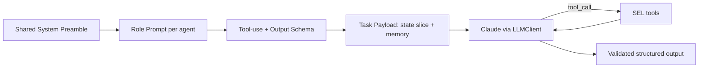
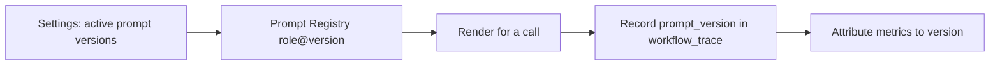

# 14 — Prompts (Prompt Engineering Specification)

> **Document ID:** `14-prompts.md`
> **Project:** Agent5G — Agentic AI Service Enablement Platform for 5G Advanced Release 20
> **Document Type:** Prompt engineering specification (the authoritative prompt text and templates for every agent)
> **Status:** Authoritative for system prompts, output schemas, tool-use instructions, few-shot exemplars, guardrail language, and prompt versioning. The agents that use these are in `05-agents.md`; the tools referenced are in `08-services.md`; the LLM client + record/replay is in `10-backend.md`.
> **Depends on:** `05-agents.md` (agent roles, structured outputs, decision flows), `08-services.md` (tools, policy errors), `13-workflow-engine.md` (WorkflowState, stage sequencing), `10-backend.md` (LLMClient, modes).
> **Audience:** AI/prompt engineers, backend engineers wiring agents, researchers running prompt ablations.

---

## Table of Contents

1. [Purpose](#1-purpose)
2. [Overview](#2-overview)
3. [Prompt Design Principles](#3-prompt-design-principles)
4. [Prompt Anatomy and Template Structure](#4-prompt-anatomy-and-template-structure)
5. [Shared System Preamble](#5-shared-system-preamble)
6. [Tool-Use Protocol](#6-tool-use-protocol)
7. [Structured Output Contract](#7-structured-output-contract)
8. [Guardrail and Safety Language](#8-guardrail-and-safety-language)
9. [Agent Prompts](#9-agent-prompts)
   - [9.1 Planner](#91-planner)
   - [9.2 Executor](#92-executor)
   - [9.3 Observer](#93-observer)
   - [9.4 Optimizer](#94-optimizer)
   - [9.5 Recovery](#95-recovery)
   - [9.6 Documentation](#96-documentation)
   - [9.7 Memory](#97-memory)
10. [Few-Shot Exemplars](#10-few-shot-exemplars)
11. [Prompt Versioning and Management](#11-prompt-versioning-and-management)
12. [Record/Replay and Determinism](#12-recordreplay-and-determinism)
13. [Failure Handling and Re-Prompting](#13-failure-handling-and-re-prompting)
14. [Interfaces and Contracts](#14-interfaces-and-contracts)
15. [Folder References](#15-folder-references)
16. [Design Decisions](#16-design-decisions)
17. [Future Extensibility](#17-future-extensibility)
18. [Engineering / Implementation / Research Notes](#18-engineering--implementation--research-notes)
19. [Example Scenarios (Prompt Flow)](#19-example-scenarios-prompt-flow)
20. [Kiro Build Guidance](#20-kiro-build-guidance)
21. [Acceptance Criteria](#21-acceptance-criteria)

---

## 1. Purpose

This document is the **authoritative source for every prompt** in Agent5G. `05-agents.md` summarized each agent's prompt; this document gives the full text, the exact output schema each prompt must produce, the tool-use protocol, the guardrail language, and the few-shot exemplars — with enough precision that the prompts can be implemented verbatim and versioned, and that prompt ablations (a research variable) can be run reproducibly.

Prompts are treated as **versioned engineering artifacts**, not incidental strings: they live in files, carry version ids, are covered by record/replay fixtures, and changing one is a reviewable change with measurable effect (`02` §16). The quality and stability of these prompts directly determines plan correctness (RQ1/H1), policy compliance (H2), recovery (H3), and explainability (RQ4).

This document does not implement the LLM client (`10` §8.4) or define the agents' state machines (`05`); it defines *what we say to the model* and *what shape we require back*.

---

## 2. Overview

Every agent prompt is assembled from four parts at call time: a **shared system preamble** (identity, world model, invariants), a **role prompt** (that agent's goal, responsibilities, constraints), the **tool + output contract** (how to call tools, exact schema to return), and the **task payload** (the relevant `WorkflowState` slice + retrieved memory). The model responds by calling tools (read/act via the SEL) and finally emitting a **validated structured object**.



*Figure 2.1 — Prompt assembly and the tool-loop to a validated structured output.*

All prompts enforce the platform invariants in language *and* structure: act only through provided tools (never invent services), return only the required schema, and defer safety to the tools' policy errors (the model proposes; the SEL disposes).

---

## 3. Prompt Design Principles

- **PP1 — Role clarity.** Each prompt states one job and the exact output shape; no agent is asked to "do everything."
- **PP2 — Structured output, always.** Prompts demand a specific schema; the app validates it (AP2 from `05`). No free-form prose drives control flow.
- **PP3 — Tools are the only source of network truth.** Prompts forbid recalling facts from training; the model must read via tools (AP3).
- **PP4 — No invented capabilities.** The model may only use services present in the provided catalog; inventing a service is an error.
- **PP5 — Safety is external.** Prompts describe guardrails but rely on SEL policy enforcement; the model must handle `POLICY_BLOCKED` tool errors gracefully, not try to bypass them.
- **PP6 — Explain, briefly.** Every output includes a concise `rationale`; reasoning is captured but not verbose (explainability without bloat, `04`/UP1).
- **PP7 — Deterministic-friendly.** Prompts are stable, versioned, and low-temperature-appropriate so record/replay is reliable (WP6, `10`).
- **PP8 — Minimal context.** Only the needed state slice + retrieved memory is passed (token discipline, `05` §16).

---

## 4. Prompt Anatomy and Template Structure

Prompts are Jinja-style templates in `application/agents/prompts/` (one file per agent + shared partials), each with a version header. Placeholders are filled from the `WorkflowState` slice and `MemoryContext`.

```text
prompts/
├── _preamble.md.j2          # shared system preamble (v)
├── _tool_protocol.md.j2     # tool-use rules (partial)
├── _output_contract.md.j2   # output-schema rules (partial)
├── _guardrails.md.j2        # safety language (partial)
├── planner.md.j2
├── executor.md.j2
├── observer.md.j2
├── optimizer.md.j2
├── recovery.md.j2
├── documentation.md.j2
├── memory.md.j2
└── exemplars/               # few-shot examples per agent (json)
```

Each role template composes: `` + role body + task payload. The rendered system message + the payload user message go to `LLMClient.tool_call` with the agent's bound tools and the target schema.

---

## 5. Shared System Preamble

Included in every agent prompt (`_preamble.md.j2`). Paraphrased content below (implement verbatim in the file, versioned).

> **System — Agent5G preamble (v1)**
>
> You are a specialized agent inside Agent5G, an autonomous operations platform for a simulated 5G-Advanced (Release 20) network. The network is a Digital Twin composed of standard network functions (UE, gNB, AMF, SMF, UPF, NRF, UDM, PCF, NWDAF, NEF, DCF, AF, Edge). You operate as one role in a multi-agent workflow that follows the lifecycle: Observe, Reason, Plan, Execute, Validate, Retry, Rollback, Complete.
>
> Core rules you must always follow:
> 1. You may affect or read the network **only** by calling the tools provided to you. You must never claim to have taken an action you did not perform via a tool.
> 2. You may only use services that appear in the provided catalog/tools. Never invent a service, argument, or capability.
> 3. Network facts come from tool results, not from prior knowledge. Do not guess current state.
> 4. Safety guardrails are enforced by the system. If a tool returns a policy block, do not attempt to bypass it; adapt or report that you cannot proceed.
> 5. Always return exactly the structured output requested, including a brief `rationale`. Do not add prose outside the schema.
> 6. Be concise and precise. Prefer the minimal correct action.

This preamble encodes the invariants (P2, PP3–PP5) so every agent inherits them.

---

## 6. Tool-Use Protocol

Included as `_tool_protocol.md.j2`. Aligns with the SEL tool adapter (`08` §9) and `LLMClient.tool_call` (`10` §8.4).

> **Tool use**
>
> - Tools are functions with JSON-schema arguments. Call a tool by returning a tool call with valid arguments matching its schema.
> - Read tools (names ending in `.query`, `.get`, `.snapshot`, `.discover`, `.list`, `.history`) have no side effects — use them freely to gather truth before deciding.
> - Action tools change network state and are policy-checked. Call them only when your role permits acting (Executor/Recovery).
> - A tool result is JSON. A tool **error** may indicate: invalid arguments (fix and retry once), `POLICY_BLOCKED` (you may not perform this; choose an alternative or report), or `REQUIRES_CONFIRMATION` (a human must approve; report this, do not loop).
> - Resolve arguments from prior tool results and the task payload. Never fabricate ids; discover them via `nrf.discover`/`topology.get` when unknown.
> - Do not call the same action tool repeatedly with identical arguments after a block.

Tool scoping per role is enforced by the adapter (`05` §7): read-only agents receive only read tools; only Executor/Recovery receive action tools; only Memory receives memory-write tools.

---

## 7. Structured Output Contract

Included as `_output_contract.md.j2`. The exact schema is provided per call (the agent's Pydantic model from `05` §12, rendered as JSON Schema).

> **Output**
>
> - After using tools as needed, produce a single JSON object matching the provided schema exactly. No extra keys, no text outside the JSON.
> - Include a `rationale` field: 1–3 sentences explaining your decision, referencing the tool results you relied on.
> - If you cannot complete your task (e.g., blocked by policy, missing capability), still return the schema with a status/verdict field indicating this and explain in `rationale`.

The application validates the returned JSON against the Pydantic model; on validation failure it re-prompts once with the error (§13), then fails the stage (bounded, `05` AP6).

---

## 8. Guardrail and Safety Language

Included as `_guardrails.md.j2`. Reinforces (but does not replace) SEL enforcement (PP5).

> **Guardrails**
>
> - Never take an action that would remove the last remaining NRF, deploy to a failed network function, act outside the intent's region, or exceed the allowed number of actions. The system will block such actions; do not attempt them.
> - For high-impact actions, expect a confirmation requirement; report it rather than forcing the action.
> - Prefer the least disruptive action that satisfies the objective. If the objective is already met, take no action and say so.
> - Do not exfiltrate or invent subscriber data; the network uses synthetic data only.

These map to policies PLC-1..6 (`08` §8). The model is told about them for better first-try plans, but the SEL is the actual enforcer.

---

## 9. Agent Prompts

Each role: full role-body text (paraphrased; implement verbatim + versioned), the required output schema (from `05` §12), and its bound tools.

### 9.1 Planner

**Bound tools:** read tools + service catalog + `memory.read`, `knowledge.query`. **Output:** `Interpretation` (at Reason) / `Plan` (at Plan).

> **Role — Planner (v1)**
> You translate a goal and the current network observation into a correct, minimal, ordered plan of service calls.
> At the Reason stage: produce an `Interpretation` — the objective, the target entities/regions, the constraints, and explicit success criteria that can later be verified from network state.
> At the Plan stage: produce a `Plan` — an ordered list of steps. For each step specify: the exact service name (from the catalog), its arguments, the step's dependency on prior steps, and how success is verified. Discover unknown ids with read tools before planning. Consult the Optimizer's proposal if one is provided. Keep the plan as short as possible while fully achieving the objective. Do not include actions the objective does not require. Never use a service not in the catalog.

**`Plan` schema (summary):** `{ rationale, steps: [{ index, service, args, depends_on, success_criterion }], success_criteria: [...] }`.

### 9.2 Executor

**Bound tools:** action tools + read tools (for argument resolution/verification). **Output:** `StepResult`.

> **Role — Executor (v1)**
> You execute the current plan step by calling exactly the specified service with validated arguments resolved from the task payload and prior results. Report the result and whether the step's success criterion is met.
> If the tool returns a recoverable error (e.g., transient failure, an argument you can correct), propose a minimal adjustment and note it for retry. If it returns `POLICY_BLOCKED` or an unrecoverable error, report failure and do not retry the identical call. Record the compensating action for any state change you cause (the inverse service). Do not perform steps other than the current one.

**`StepResult` schema (summary):** `{ rationale, step_index, service, status: ok|failed|blocked, result, success_met: bool, compensation?: {service,args}, retry_hint?: {...} }`.

### 9.3 Observer

**Bound tools:** read-only. **Output:** `Observation` (at Observe) / `Validation` (at Validate).

> **Role — Observer (v1)**
> At the Observe stage: gather the relevant current network state and notable recent events using read tools, and produce an `Observation` — facts only, no speculation, scoped to what the goal needs.
> At the Validate stage: compare the actual current state (read fresh via tools) against the provided success criteria and return a `Validation` verdict: `pass` (all criteria met), `retry` (a transient/partial gap that another attempt could fix), or `fail` (a structural gap that will not resolve by retrying). Cite the concrete state values that justify your verdict.

**`Validation` schema (summary):** `{ rationale, verdict: pass|retry|fail, criteria: [{ criterion, met: bool, evidence }] }`.

### 9.4 Optimizer

**Bound tools:** read/analytics tools (+ optional what-if projection). **Output:** `OptimizationProposal`.

> **Role — Optimizer (v1)**
> Given an objective (e.g., keep p95 latency below a threshold, reduce energy, balance load) and current analytics/trends, propose the minimal set of service actions that best improves the objective within constraints and policy. Gather trend data via read tools (including `dcf.data.history`). Produce a ranked list of candidate action sets with an estimated impact and a short justification for each. Do not act; you only propose. Prefer the least disruptive effective option.

**`OptimizationProposal` schema (summary):** `{ rationale, objective, options: [{ rank, actions: [{service,args}], expected_impact, risk }] }`.

### 9.5 Recovery

**Bound tools:** compensating action tools + read tools. **Output:** `RecoveryPlan` + `CompensationResult[]`.

> **Role — Recovery (v1)**
> A workflow has failed unrecoverably. Restore the network to a safe, consistent state using the compensation ledger provided (the inverse of actions already taken), executed in reverse order. Each compensation is policy-checked — if one is blocked or would be unsafe, stop and report that a human must intervene (escalate); do not force an unsafe state. After compensating, verify safe state with read tools and summarize the incident (likely cause, actions taken, outcome). Respect all guardrails, especially never leaving zero NRF.

**`RecoveryPlan` schema (summary):** `{ rationale, steps: [{ service, args, order }], escalate: bool, escalate_reason? }`; **`CompensationResult`:** `{ service, status, note }`.

### 9.6 Documentation

**Bound tools:** read-only (trace, results, KPIs) + `knowledge.query`. **Output:** `WorkflowSummary`.

> **Role — Documentation (v1)**
> Using only the recorded trace and tool results, write a faithful, concise summary of the workflow: the goal, what was interpreted, the plan, the actions actually taken and their outcomes (with before/after evidence such as KPI values), any retries or rollbacks, and one or two lessons learned. Do not claim any action that is not present in the trace. Also propose knowledge-graph updates (entities and relations) that capture what was learned.

**`WorkflowSummary` schema (summary):** `{ rationale, goal, outcome: success|failed, narrative, evidence: [...], lessons: [...], kg_deltas: [{src,relation,dst}] }`.

### 9.7 Memory

**Bound tools:** `memory.read/write`, `knowledge.query/upsert` (sole writer). **Output:** `MemoryWrite`/`KnowledgeDelta` (write) or `RetrievalResult` (read).

> **Role — Memory (v1)**
> On write: given proposed memory items (from Documentation or Recovery), normalize and deduplicate them, decide whether each belongs in episodic (a specific past event) or semantic (a durable, reusable fact — only when a pattern recurs) memory, and upsert knowledge-graph entities/relations with provenance (the originating workflow). On read/retrieval: given the current goal/observation, return the most relevant episodic memories, semantic facts, and a small knowledge-graph neighborhood that would help the Planner. Keep memory clean: avoid duplicates and low-value entries.

**`RetrievalResult` schema (summary):** `{ rationale, episodic: [...], semantic: [...], kg_neighborhood: {nodes,edges} }`; **`MemoryWrite`:** `{ scope, content, summary }`; **`KnowledgeDelta`:** `{ upserts: [{src,relation,dst,props}] }`.

---

## 10. Few-Shot Exemplars

Each agent template may include 0–2 exemplars from `prompts/exemplars/{role}.json` to anchor format and quality (kept minimal for token economy, PP8). Exemplars are **format anchors**, not answer keys — they show a correct input→structured-output shape, not scenario-specific answers.

**Planner exemplar (illustrative):**
```json
{
  "input": { "goal": "Deploy congestion detection model to Delhi Edge",
             "observation": { "edges": [{"id":"edge_delhi_1","status":"ACTIVE"}] } },
  "output": {
    "rationale": "Edge is healthy; deploy the model then subscribe congestion analytics.",
    "steps": [
      {"index":0,"service":"nrf.discover","args":{"type":"Edge","region":"Delhi"},"depends_on":[],"success_criterion":"edge id resolved"},
      {"index":1,"service":"aimle.model.deploy","args":{"model_id":"congestion-det","target":"edge_delhi_1"},"depends_on":[0],"success_criterion":"model state=deployed"},
      {"index":2,"service":"nwdaf.analytics.congestion.subscribe","args":{"region":"Delhi"},"depends_on":[1],"success_criterion":"subscription active"}
    ],
    "success_criteria": ["model deployed on edge_delhi_1","congestion subscription active for Delhi"]
  }
}
```

**Observer (validation) exemplar (illustrative):**
```json
{ "input": { "success_criteria": ["model deployed on edge_delhi_1","congestion subscription active for Delhi"],
             "state": { "models":[{"id":"congestion-det","state":"deployed","target":"edge_delhi_1"}], "subscriptions":[{"region":"Delhi","active":true}] } },
  "output": { "rationale":"Both criteria confirmed from current state.",
              "verdict":"pass",
              "criteria":[{"criterion":"model deployed on edge_delhi_1","met":true,"evidence":"models[0].state=deployed"},
                          {"criterion":"congestion subscription active for Delhi","met":true,"evidence":"subscriptions[0].active=true"}] } }
```

Exemplars are versioned with the prompt and included in replay fixtures so they never drift silently.

---

## 11. Prompt Versioning and Management

Prompts are engineering artifacts (PP7).

- **Version header** in each template: `prompt_version: planner@v1` (semantic-ish; bump on any wording/schema change).
- **Registry:** `application/agents/prompts/registry.py` maps `(role, version)` → rendered template; the active version per role is set in config/Settings so ablations can swap versions.
- **Persisted with runs:** each `workflow_trace` row (`12` §6.11) records the `prompt_version` used, so any result is attributable to an exact prompt.
- **Change discipline:** editing a prompt is a reviewed change; a prompt change that alters behavior must regenerate replay fixtures and note the metric impact (`02` §16).
- **A/B and ablations:** run the same scenarios with different `prompt_version`s (a research variable) and compare metrics from `12` §8.



*Figure 11.1 — Versioned prompts attributable to results.*

---

## 12. Record/Replay and Determinism

Prompts pair with the `LLMClient` modes (`10` §8.4, `02` §16). **Default is `replay` ($0, offline)**; live mode uses a **free-tier** provider (Gemini/Groq/OpenRouter free tiers, Anthropic free credits, or local Ollama). The build-time coding agent is **Claude 4.8** in Kiro (free to the user). No paid LLM usage (CST-1/CST-3).

- **record:** a few live **free-tier** calls, saving `(rendered_prompt, tools, schema, provider, model) → response` keyed by a stable hash; also stores the `prompt_version`. Run once to author fixtures; keep calls minimal to stay within free-tier quotas.
- **replay (default):** serves saved responses — deterministic agent behavior with **no network and no cost**, for tests (`16`) and offline demos (`18`).
- **Hash stability:** because prompts are versioned and rendered deterministically (sorted keys, stable payload serialization), the same input reproduces the same hash → same replayed response.
- **Determinism contract:** replay LLM + fixed seed ⇒ identical workflow traversal and final state (WP6, `13`), enabling controlled prompt ablations where only the prompt changes.
- **Fixture hygiene:** fixtures are keyed by `prompt_version`; bumping a version invalidates and regenerates its fixtures (§11).

---

## 13. Failure Handling and Re-Prompting

When the model's output fails validation or tool use goes wrong:

- **Schema-invalid output:** the app re-prompts **once**, appending the validation error and a reminder to return only the schema; if it fails again, the stage fails (bounded, `05` AP6) → Validate/Rollback handles it.
- **Invalid tool arguments:** the tool returns a structured argument error; the agent may fix and retry the tool call once within the same turn.
- **Policy block:** the tool returns `POLICY_BLOCKED`; the prompt instructs the agent to choose an alternative or report inability (never loop) — this exercises H2.
- **Confirmation required:** the tool returns `REQUIRES_CONFIRMATION`; the agent reports it (the engine pauses for HITL, `13` §11) rather than retrying.
- **Empty/degenerate plans:** the Planner's self-check (in-prompt) requires all services to exist and dependencies to be acyclic; a degenerate plan is rejected at validation and re-prompted once.

These behaviors are part of the prompt contract so agents adapt rather than crash or loop — a robustness requirement measured in the experiments.

---

## 14. Interfaces and Contracts

- **Templates:** `application/agents/prompts/*.md.j2` + `exemplars/*.json` (§4).
- **Registry:** `prompts/registry.py` → `(role, version)`; active versions from `Settings` (`10` §6).
- **Rendering:** a `render(role, version, payload) -> (system, user)` used by `AgentOrchestrator` (`05` §8) before `LLMClient.tool_call`.
- **Output schemas:** the Pydantic models in `domain/agents/models.py` (`05` §12) — prompts must produce exactly these.
- **Tools:** JSON-schema tools from the SEL adapter (`08` §9), scoped per role.
- **Persistence:** `prompt_version` recorded in `workflow_trace` (`12`).

---

## 15. Folder References

```text
backend/app/application/agents/prompts/
├── _preamble.md.j2 _tool_protocol.md.j2 _output_contract.md.j2 _guardrails.md.j2
├── planner.md.j2 executor.md.j2 observer.md.j2 optimizer.md.j2
├── recovery.md.j2 documentation.md.j2 memory.md.j2
├── registry.py
└── exemplars/{planner,executor,observer,optimizer,recovery,documentation,memory}.json
tests/fixtures/llm/{prompt_version}/...   # record/replay fixtures (16)
```

This document owns *prompt content + versioning*; agents in `05`; LLM client in `10`; schemas in `05` §12; fixtures in `16`.

---

## 16. Design Decisions

- **PD-1 — Prompts as versioned files, not inline strings.** Rationale: reviewable, attributable, ablatable (PP7). Trade-off: a small rendering/registry layer; essential for research.
- **PD-2 — Shared preamble + role body + partials.** Rationale: invariants defined once, consistent across agents; DRY. Trade-off: template composition; keeps prompts consistent.
- **PD-3 — Schema-constrained outputs.** Rationale: reliable multi-agent hand-offs (AP2). Trade-off: less model flexibility; reliability dominates.
- **PD-4 — Safety in prompt *and* SEL, enforcement only in SEL.** Rationale: better first-try plans without trusting the model for safety (PP5). Trade-off: guardrail language duplicated; acceptable and intentional.
- **PD-5 — Minimal few-shot as format anchors.** Rationale: format stability without token bloat or answer leakage (PP8). Trade-off: less in-context steering; compensated by clear schemas.
- **PD-6 — `prompt_version` persisted per trace.** Rationale: every result attributable to an exact prompt (reproducibility). Trade-off: one extra field; high research value.

---

## 17. Future Extensibility

- **Prompt optimization loop.** Automatically A/B prompt versions and select by metric (`12` §8) — a research capability.
- **Retrieval-augmented planning.** Inject a library of successful past plans (from episodic memory) into the Planner prompt for few-shot-from-memory.
- **Model-agnostic prompts.** Because prompts route through the `LLMClient` port, the same templates can target another model; keep model-specific tweaks in versioned variants.
- **Structured-output enforcement.** Adopt tool/response-schema features of the model to hard-constrain output, reducing re-prompts.
- **Multilingual prompts.** Versioned localized prompts for non-English demos.
- **MCP tool descriptions.** When tools are published via MCP (`08` §9), reuse the same descriptions the prompts rely on.

---

## 18. Engineering / Implementation / Research Notes

**Engineering.**
- Keep prompts short and imperative; long prompts inflate tokens and reduce reliability. Push facts into tool results, not the prompt (PP3/PP8).
- Render deterministically (sorted keys, stable serialization) so replay hashes are stable (§12).
- Validate outputs strictly; treat a re-prompt as a rare, logged event (metric: re-prompt rate per agent/version).

**Implementation.**
- Build order: `_preamble`/partials → per-role bodies → registry + `render()` → wire into `AgentOrchestrator` → record fixtures for the seed scenarios → switch tests/demos to replay.
- Store `prompt_version` on every `workflow_trace` write from the node contract (`13` §6).
- Keep exemplars tiny and format-focused; never encode scenario answers that could leak into evaluation.

**Research.**
- Prompt version is a first-class experimental variable: hold the twin seed + LLM replay fixed and vary `prompt_version` to isolate prompt effects on plan correctness/policy compliance.
- Track re-prompt rate and tokens per version (from `workflow_trace`, `12`) as prompt-quality signals.
- Because guardrail language is in the prompt but enforcement is in the SEL, you can ablate the *prompt* guardrails while keeping SEL enforcement to measure how much the prompt alone reduces blocked actions (H2 sub-question).

---

## 19. Example Scenarios (Prompt Flow)

**Scenario A (prompts).** Observe: Observer prompt + read tools → `Observation`. Reason: Planner prompt → `Interpretation`. Plan: Planner prompt (+ catalog) → `Plan` (the exemplar-shaped 3-step plan). Execute: Executor prompt per step → `StepResult` (with compensations). Validate: Observer prompt → `Validation{verdict:pass}`. Complete: Documentation prompt → `WorkflowSummary` + kg_deltas; Memory prompt → episodic write + KG upsert. All calls recorded with `planner@v1` etc.

**Scenario B (prompts).** Observer (triggered) → Planner requests Optimizer; Optimizer prompt + `dcf.data.history` → ranked `OptimizationProposal`; Planner folds top option into `Plan`; Executor acts; Observer validation returns `retry` once (latency improving) then `pass`. Prompt guardrail language plus PLC-6 keep it from a no-op action.

**Scenario C (prompts).** Executor hits an `nrf.discover` error (NRF failed) → `StepResult{status:failed}`; Observer validation `fail` → Recovery prompt builds a reverse `RecoveryPlan`, registers standby NRF; if a compensation were policy-blocked the prompt makes it set `escalate:true` rather than loop. Documentation records the incident; Memory upserts `Incident -[mitigated_by]-> promote_standby_NRF`.

---

## 20. Kiro Build Guidance

### 20.1 Implementation Order
1. `_preamble`, `_tool_protocol`, `_output_contract`, `_guardrails` partials (v1).
2. Role bodies: observer, planner (read-only-safe first) → executor → optimizer → recovery → documentation → memory.
3. `registry.py` + `render(role, version, payload)`.
4. Minimal exemplars per role.
5. Wire into `AgentOrchestrator`; record fixtures for seed scenarios; switch tests/demos to replay.

### 20.2 Coding Rules
- One job per prompt; always demand the exact schema + `rationale` (PP1/PP2/PP6).
- Prompts forbid inventing services and recalling network facts (PP3/PP4).
- Guardrail language present but enforcement deferred to SEL (PP5); handle `POLICY_BLOCKED`/`REQUIRES_CONFIRMATION` without looping.
- Render deterministically; record `prompt_version` per trace; re-prompt at most once on schema failure.
- Keep prompts concise; push facts to tools (PP8).

### 20.3 Naming Convention
- Templates `{role}.md.j2`; partials `_name.md.j2`; versions `role@vN`; exemplars `exemplars/{role}.json`; fixtures keyed by `prompt_version`.

### 20.4 Folder Ownership
- `application/agents/prompts/*` owned here; agents `05`; LLM client `10`; schemas `05` §12; fixtures `16`.

### 20.5 Prompt Suggestions
- "Author the shared preamble and partials encoding the invariants (act only via tools, never invent services, defer safety to SEL), versioned as v1."
- "Author the Planner prompt to emit a validated `Plan` using only catalog services, with a self-check for existence and acyclic deps."
- "Author the Recovery prompt to build a reverse compensation `RecoveryPlan` and set `escalate` on blocked compensations."
- "Wire the prompt registry + deterministic render into the orchestrator and record replay fixtures for the seed scenarios."

### 20.6 Acceptance Criteria
- Each agent produces schema-valid output from its versioned prompt under replay for the seed scenarios.
- A `POLICY_BLOCKED` tool error causes adaptation/report, never an identical retry loop.
- `prompt_version` is recorded on every `workflow_trace` row; swapping versions changes attribution.
- Re-running a scenario under replay reproduces identical outputs (stable hashes).

---

## 21. Acceptance Criteria

This document is **complete and correct** when:

- [ ] **AC-1.** Prompt anatomy (preamble + role + tool/output contract + guardrails + payload) and the template structure are specified.
- [ ] **AC-2.** The shared system preamble encoding the invariants is provided.
- [ ] **AC-3.** The tool-use protocol (read vs action, error handling incl. policy block/confirm) is specified.
- [ ] **AC-4.** The structured-output contract (exact schema + `rationale`, no extra text) is specified.
- [ ] **AC-5.** Guardrail/safety language mapping to PLC-1..6 (prompt-stated, SEL-enforced) is provided.
- [ ] **AC-6.** All seven agents have a full role prompt, required output schema, and bound tools.
- [ ] **AC-7.** Few-shot exemplars (format anchors, minimal) are provided for at least the Planner and Observer.
- [ ] **AC-8.** Prompt versioning/management (version headers, registry, persisted `prompt_version`, ablation) is specified.
- [ ] **AC-9.** Record/replay + determinism (stable hashing, fixtures keyed by version) is specified.
- [ ] **AC-10.** Failure handling / re-prompting (once, bounded; no loops on blocks/confirms) is specified.
- [ ] **AC-11.** Interfaces, design decisions, extensibility, notes, prompt-flow scenarios, and Kiro guidance are present.
- [ ] **AC-12.** Prompts enforce (in language) the invariants: tools-only, no invented services, safety deferred to SEL, minimal output — aligning with `05`/`08`/`13`.

---

**NEXT FILE**
