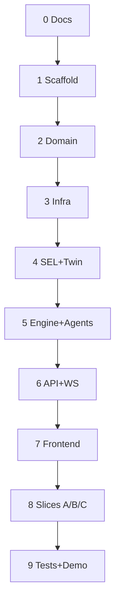
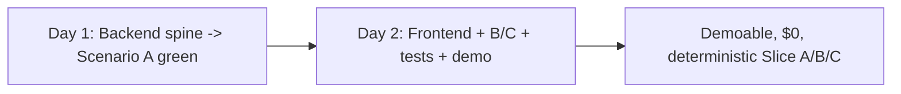
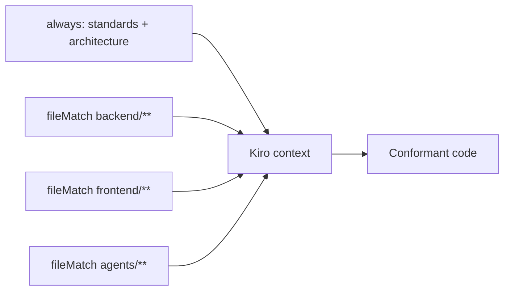

# 15 — Kiro Rules (Build Governance)

> **Document ID:** `15-kiro-rules.md`
> **Project:** Agent5G — Agentic AI Service Enablement Platform for 5G Advanced Release 20
> **Document Type:** Build governance and coding standards (the master rules for implementing the platform with Kiro)
> **Status:** Authoritative for the global implementation order, coding rules, naming conventions, folder ownership, steering configuration, and the prompt playbook that drives Kiro. Every other document's local "Kiro Build Guidance" section conforms to this document.
> **Depends on:** all preceding documents (`01`–`14`) — this consolidates and governs their build guidance.
> **Audience:** The Kiro agent, and any engineer using Kiro to implement Agent5G; reviewers enforcing standards.

---

## Table of Contents

1. [Purpose](#1-purpose)
2. [Overview](#2-overview)
3. [Golden Rules (Non-Negotiable Invariants)](#3-golden-rules-non-negotiable-invariants)
4. [Global Implementation Order](#4-global-implementation-order)
5. [Vertical-Slice-First Strategy](#5-vertical-slice-first-strategy)
6. [Coding Rules (Backend)](#6-coding-rules-backend)
7. [Coding Rules (Frontend)](#7-coding-rules-frontend)
8. [Naming Conventions (Master)](#8-naming-conventions-master)
9. [Folder Ownership Matrix](#9-folder-ownership-matrix)
10. [Steering Configuration](#10-steering-configuration)
11. [Definition of Done](#11-definition-of-done)
12. [Review and Enforcement Gates](#12-review-and-enforcement-gates)
13. [The Prompt Playbook (Driving Kiro)](#13-the-prompt-playbook-driving-kiro)
14. [Anti-Patterns to Avoid](#14-anti-patterns-to-avoid)
15. [Interfaces and Contracts](#15-interfaces-and-contracts)
16. [Folder References](#16-folder-references)
17. [Design Decisions](#17-design-decisions)
18. [Future Extensibility](#18-future-extensibility)
19. [Engineering / Implementation / Research Notes](#19-engineering--implementation--research-notes)
20. [Example Scenarios (Build Flow)](#20-example-scenarios-build-flow)
21. [Acceptance Criteria](#21-acceptance-criteria)

---

## 1. Purpose

This document is the **master build governance** for Agent5G. Each specialized document (`01`–`14`) ends with a local "Kiro Build Guidance" section; this document **consolidates and governs** them into a single, ordered, enforceable build plan with the coding rules, naming conventions, folder ownership, steering setup, and prompt playbook that keep the implementation consistent, correct, and faithful to the design.

Its goal is that Kiro (or any engineer using Kiro) can implement the entire platform — backend, frontend, agents, twin, workflow engine — in the right order, following one set of rules, with clear acceptance gates, and without contradicting any design document. When a local build-guidance section and this document appear to conflict, **this document's global order and rules win**, and the discrepancy should be flagged.

This document does not re-specify components (that is the job of `01`–`14`); it specifies *how to build them and in what order*, and *the rules every build step must obey*.

---

## 2. Overview

Agent5G is built **documentation-first** (DD-1): all of `docs/` before production code. Once docs are approved, implementation proceeds **inside-out** (domain → infrastructure → application → delivery → frontend), **contract-first** (schemas before consumers), and **vertical-slice-first** (one end-to-end scenario before breadth).

```mermaid
graph LR
    DOCS[Docs approved 01-20] --> DOMAIN[Domain models]
    DOMAIN --> INFRA[Infrastructure adapters]
    INFRA --> SEL[SEL + Twin service]
    SEL --> ENGINE[Workflow engine + Agents]
    ENGINE --> API[API + WS]
    API --> FE[Frontend]
    FE --> SLICE[Vertical Slice A e2e]
    SLICE --> BREADTH[Broaden + tests + demo]
```



*Figure 2.1 — Inside-out, contract-first, vertical-slice-first build flow.*

The build is governed by three enforcement mechanisms: **import-linter** (layer boundaries), **type checks** (`mypy` + `tsc`), and the **Definition of Done** (§11) applied to every unit. Determinism (replay LLM + seed) is a first-class acceptance property throughout.

---

## 3. Golden Rules (Non-Negotiable Invariants)

These are the invariants from across `01`–`14`, consolidated. Violating any is a build failure.

- **GR1 — Agents act only through the SEL.** No agent/engine code touches the twin directly (P2, SP1). The only path intelligence→substrate is `invoker.invoke`.
- **GR2 — Dependencies point inward.** Domain imports no framework; Application imports no delivery; adapters implement domain ports; wiring only in the composition root (Clean Architecture, ADR-6). Enforced by import-linter.
- **GR3 — Every mutation is an event + a persisted row.** No silent writes (P3). Validate → mutate → persist → emit.
- **GR4 — One entropy source.** All randomness via the seeded RNG service; no direct `random`/`numpy.random` (P6/TP2).
- **GR5 — One LLM boundary.** All model calls via the `LLMClient` port (live/record/replay); no direct SDK calls elsewhere.
- **GR6 — Contract-first, generated types.** Backend Pydantic schemas → OpenAPI → generated frontend TS types; no hand-authored client shapes (P5).
- **GR7 — Structured agent I/O.** Every agent returns a validated Pydantic object with a `rationale`; transitions branch on validated fields, never parsed prose (AP2).
- **GR8 — Every action is compensatable + policy-checked.** Each action service declares a compensation and passes the policy gate; startup fails otherwise (SD-5, PP5).
- **GR9 — Correlation everywhere.** Every operational row carries `correlation_id`; time-series rows carry `run_id` (DP2/DP7).
- **GR10 — Determinism.** Replay LLM + fixed seed ⇒ identical twin trajectory and workflow traversal (WP6, TP2).
- **GR11 — No real PII; secrets never logged/returned.** Synthetic data only; API key masked (DP8, `09` §6).
- **GR12 — Windows-first, local-only, no containers.** All scripts `.ps1`/`.bat`; long-running servers started manually; no Docker/K8s/Linux/cloud.
- **GR13 — Zero cost.** No paid services, ever. Free/OSS stack, local SQLite, and LLM via offline **`replay`** (default, $0) or a **free tier** (Gemini/Groq/OpenRouter free tiers, Anthropic free credits, or local Ollama). Build-time coding is Claude 4.8 in Kiro (free). If it isn't free, it's out of the base scope (CST-1/CST-3, `01` §4.3).
- **GR14 — Two-day, slice-first scope.** Feature scope fits a ~2-day build: deliver a demoable Slice A/B/C (`18`) first; defer breadth to `20-future-work.md`. Follow the Two-Day Delivery Plan (§4.1). Planning scratch lives in a git-ignored `planning/` folder (CST-5, GR-gitignore).

---

## 4. Global Implementation Order

The single authoritative order. Each phase has a gate (must pass before the next).

**Phase 0 — Documentation (DD-1).** All `docs/01`–`20` + README written and approved. *Gate:* docs complete; no code before this.

**Phase 1 — Project scaffolding.** `backend/` (`pyproject.toml`, package skeleton, `ruff`/`mypy`/`import-linter` configs), `frontend/` (Next.js + Tailwind + Shadcn + TS strict), `scripts/*.ps1`, `.env.example`. *Gate:* both apps boot empty; lint/typecheck run.

**Phase 2 — Domain models** (`06`,`07`,`08`,`05`). Pure Pydantic: twin entities + NF subclasses + topology + KPIs + events; service descriptors + policy; agent structured I/O + memory + KG; ports (interfaces) for all. *Gate:* import-linter clean (domain imports no framework); unit tests on entities/`advance` determinism.

**Phase 3 — Infrastructure adapters** (`10`,`12`). Config; async SQLite `Database` (PRAGMAs) + all 18 ORM tables + repositories; single-writer queue; event bus; RNG service; `LLMClient` (**replay first**); sim scheduler. *Gate:* DB creates + seeds; golden-trajectory test scaffolded; adapters satisfy ports.

**Phase 4 — SEL + Twin service** (`08`,`06`,`07`). Service registry (register/persist/discover); invoker pipeline (validate→policy→dispatch→emit→persist); policy engine + PLC-1..6; tool adapter; twin service `on_tick`/`snapshot`/`apply_command`/`control`; NRF first, then AMF/SMF/UPF, then the rest; scenarios + faults. *Gate:* golden-trajectory determinism test passes; a read service and one action service work end-to-end through the invoker with events/persistence.

**Phase 5 — Workflow engine + Agents** (`13`,`05`,`14`). Prompts (partials + role bodies, v1) + registry; `BaseAgent` + 7 agents (read-only first) + orchestrator; LangGraph `StateGraph` + nodes + guards + retry/rollback + checkpointer + triggers. *Gate:* Scenario A completes end-to-end under replay LLM with `workflows`/`steps`/`trace` populated.

**Phase 6 — API + WS** (`09`,`10`). `common` schemas + error envelope; routers (services/twin/simulation first, then workflows, then the rest); WS hub; middleware + error handlers; composition root + lifespan. Generate frontend types from `/openapi.json`. *Gate:* `/health` ok; `POST /workflows` async + WS progress; type-gen drift check green.

**Phase 7 — Frontend** (`04`,`11`). Tokens/theme + shell + nav + intent bar + command palette; shared components (with loading/empty/error); WS store + React Query; pages Dashboard → Agent Console → Topology → Twin → rest; visualizations. *Gate:* all 13 routes render live; one injected fault updates Dashboard+Topology+Logs via one WS stream.

**Phase 8 — Verticalization + breadth.** Wire Scenario A fully across the stack, then B and C; broaden services/agents/pages. *Gate:* Scenarios A/B/C pass end-to-end via UI.

**Phase 9 — Tests + Demo + Presentation** (`16`,`18`,`19`). Unit/integration/e2e (`16`); demo scripts (`18`); presentation assets (`19`). *Gate:* test suite green; demo runs offline (replay).



*Figure 4.1 — Phase order with gates between each.*

### 4.1 Two-Day Delivery Plan (GR14)

The docs (Phase 0) are already complete, so the ~2-day clock covers Phases 1–9, executed by **Claude 4.8 in Kiro** (build-time, free) with the operator running servers/demos. The plan is **slice-first**: get Scenario A working end-to-end, then B/C, then polish. LLM stays in **`replay`/free-tier** throughout (GR13) — no cost, deterministic.

**Day 1 — Backend spine to a working Slice A (Phases 1–6).**

| Block | Focus | Outcome |
|-------|-------|---------|
| D1 AM-1 | Phase 1 scaffold + Phase 2 domain (twin NRF/Edge/NWDAF, service descriptors, agent schemas) | apps boot; domain unit tests pass |
| D1 AM-2 | Phase 3 infra: SQLite + 18 tables + repos, single-writer, event bus, RNG, **replay `LLMClient`**, scheduler | golden-trajectory test scaffolded; seed runs |
| D1 PM-1 | Phase 4 SEL (registry, invoker, PLC-1..6, tools) + twin service (`on_tick`, `apply_command`) + the 4 Slice-A services | one action flows through the invoker with events/persistence |
| D1 PM-2 | Phase 5 prompts (v1) + Planner/Executor/Observer/Documentation/Memory + LangGraph engine | **Scenario A completes under replay** (integration gate) |
| D1 EOD | Phase 6 `/workflows` + WS + generate FE types | `POST /workflows` async + WS progress; `/health` ok |

**Day 2 — Frontend, autonomy/recovery, tests, demo (Phases 7–9).**

| Block | Focus | Outcome |
|-------|-------|---------|
| D2 AM-1 | Phase 7 shell + shared components + WS store + Dashboard + **Agent Console** | intent → live console |
| D2 AM-2 | Phase 7 Topology + Digital Twin + Simulation + remaining pages | one fault updates Dashboard+Topology+Logs via one WS |
| D2 PM-1 | Phase 8: Optimizer + Recovery + `mumbai_congestion`/`nrf_failure` → **Scenarios B & C** end-to-end | autonomous mitigation + recovery work via UI |
| D2 PM-2 | Phase 9: key unit/integration + golden tests + safety-invariant tests; `scripts\ci.ps1` | suite green offline (replay) |
| D2 EOD | `18-demo.md` dry-run + record fallback; `19` assets if time | demo runs deterministically at $0 |

**Two-day scope guardrails (defer, don't cut quality):**
- **Build only what Slice A/B/C need first.** Extra services, agents, and pages beyond the three scenarios are Day-2-PM stretch or deferred to `20`.
- **Replay-first LLM.** Record a small fixture set once (a few free-tier calls) so everything else runs offline/deterministic — no time lost to model variance or cost.
- **Vertical over horizontal** (§5): a thin end-to-end path beats many half-built layers.
- **Gates still apply.** Even under time pressure, the enforcement gates (§12) and the golden/safety tests are non-negotiable — they're fast and prevent late-stage breakage.
- **If behind:** cut breadth (extra pages/services/scenarios), never the spine (SEL invoker, workflow engine, Scenario A) or the safety/determinism tests.



*Figure 4.2 — Two-day arc: Day 1 backend to Slice A, Day 2 UI + autonomy/recovery + tests + demo.*

---

## 5. Vertical-Slice-First Strategy

To de-risk integration early (`03` §16), build the **thinnest possible end-to-end path** before breadth:

1. **Slice A target:** "Deploy congestion detection model to Delhi Edge" (Scenario A).
2. **Minimum components:** twin with NRF + Edge + NWDAF; services `nrf.discover`, `aimle.model.deploy`, `nwdaf.analytics.congestion.subscribe`, `twin.snapshot`; Planner + Executor + Observer + Documentation + Memory; the full lifecycle graph; the `/workflows` API + WS; the Agent Console + Topology pages.
3. **Prove the spine:** each of the 8 stages emits a persisted trace row; each action emits an event and persists a `service_call`; the UI shows it live.
4. **Then broaden:** add remaining NFs/services (Optimizer/Recovery paths for B/C), then remaining pages, then tests/demo.

Rule: **no breadth work until Slice A is green end-to-end under replay LLM.** This guarantees the architecture holds before investing in surface area.

---

## 6. Coding Rules (Backend)

Consolidated from `03`,`05`,`06`,`08`,`10`,`12`,`13`.

- **Layering:** enforce import-linter contracts (GR2). Domain: no `fastapi`/`sqlalchemy`/`langgraph`. Application: no `api`. Adapters implement ports; construct only in the composition root.
- **Types:** full type hints; `mypy` clean; Pydantic v2 for all boundary data.
- **Style:** `ruff` (lint+format) clean; no bare `except`; typed domain exceptions mapped centrally to `ErrorEnvelope`.
- **Determinism:** all randomness via `RngService` (GR4); all LLM via `LLMClient` (GR5); render prompts deterministically.
- **Mutation discipline:** validate → mutate → persist (via single-writer) → emit event (GR3). Reads use short-lived sessions.
- **SEL:** every service call via `invoker.invoke` (GR1/SP1); actions declare `policy_tags` + `idempotent` + `compensation` (GR8); NF-to-NF also via the invoker.
- **Agents:** structured validated output + `rationale` (GR7); re-prompt at most once on schema failure; only Memory writes memory.
- **Persistence:** `correlation_id` on operational rows; `run_id` on time-series (GR9); enums via CHECK; JSON payloads validated by Pydantic.
- **Security:** secrets via `SecretStr`, never logged/returned (GR11); localhost CORS only.
- **Async:** no blocking/CPU-bound work on the loop; model heavy ops with `asyncio.sleep`.

---

## 7. Coding Rules (Frontend)

Consolidated from `04`,`11`.

- **Types:** TS `strict`, no `any`; import API types from generated `types.gen.ts` (GR6); never hand-author server shapes.
- **Data:** no polling — live via the single WS store; REST via React Query; three-tier state (server/live/UI).
- **Styling:** tokens as CSS variables + semantic Tailwind classes; never raw hex/spacing.
- **States:** every data region ships `Skeleton`/`EmptyState`/`ErrorState` — a component without all three is not done.
- **Structure:** thin routes; feature logic in `features/*`; cross-feature UI in `components/*`; contract/data in `lib/*`.
- **A11y:** icon-only buttons need `aria-label`; state never color-alone; honor `prefers-reduced-motion`; keyboard-operable.
- **Motion:** Framer Motion only for state-change; not decoration.
- **Perf:** virtualize large lists; throttle `KPI_UPDATED`; dynamic-import heavy viz; narrow memoized WS selectors.

---

## 8. Naming Conventions (Master)

The single naming reference (consolidates every doc's naming section).

| Concept | Convention | Example |
|---------|-----------|---------|
| Python module/file | `snake_case` | `service_invoker.py` |
| Python class | `PascalCase` | `ServiceInvoker` |
| Python func/var | `snake_case` | `apply_command` |
| Port interface | role noun | `TwinRepository`, `LLMClient` |
| Adapter | tech-prefixed | `SqlTwinRepository`, `InProcessEventBus`, `ReplayClient` |
| Service | `{nf}.{domain}.{action}` | `nwdaf.analytics.congestion.subscribe` |
| Event | `SCREAMING_SNAKE_CASE` | `KPI_THRESHOLD_BREACH` |
| Policy | `PLC-n` | `PLC-1` |
| Policy tag | `verb:target` | `mutates:nrf`, `region-scoped` |
| DB table | plural `snake_case` | `workflow_steps` |
| DB index | `ix_{table}_{cols}` | `ix_kpis_node_kpi_tick` |
| Workflow id / correlation | `wf_{uuid}` | `wf_1a2b3c` |
| Other ids | `{kind}_{uuid}` | `model_...`, `mem_...`, `sub_...` |
| Lifecycle stage | lowercase | `observe`,`plan`,`execute` |
| Agent role | lowercase | `planner`,`observer` |
| Prompt version | `role@vN` | `planner@v1` |
| Scenario | `snake_case` file | `mumbai_congestion.json` |
| Seed constant | `SEED_*` | `SEED_DEFAULT` |
| REST route | plural noun / sub-action | `/workflows`, `/simulation/start` |
| JSON field | `snake_case` | `correlation_id` |
| TS component | `PascalCase` in `kebab-case.tsx` | `StatCard` in `stat-card.tsx` |
| TS hook | `useX` | `useWorkflows` |
| Route folder | `kebab-case` | `agent-console` |
| Experiment | `EXP-{A..D}` | `EXP-A` |

---

## 9. Folder Ownership Matrix

Which document is authoritative for which folder (consolidates all §Folder Ownership).

| Folder | Owning doc(s) |
|--------|---------------|
| `docs/` | this set (Documentation agent/author) |
| `backend/app/domain/twin/` | `06`, `07` |
| `backend/app/domain/services/` | `08` |
| `backend/app/domain/agents/` | `05` |
| `backend/app/application/sel/` | `08` |
| `backend/app/application/twin_service/` | `06`, `07` |
| `backend/app/application/workflow/` | `13` |
| `backend/app/application/agents/` | `05` |
| `backend/app/application/agents/prompts/` | `14` |
| `backend/app/infrastructure/db/` | `12`, `10` |
| `backend/app/infrastructure/{bus,llm,rng,sim,writer,config}` | `10` |
| `backend/app/api/` | `09`, `10` |
| `frontend/app/`, `frontend/features/`, `frontend/components/` | `04`, `11` |
| `frontend/lib/` | `11`, `09` (types) |
| `data/`, `scripts/` | `17` |
| `tests/` | `16` |

Rule: edits to a folder must conform to its owning document; cross-cutting changes touching multiple owners require checking each.

---

## 10. Steering Configuration

Agent5G ships **steering files** in `.kiro/steering/` so Kiro always has the project's standards in context. Steering encodes the golden rules and points at the design docs.

- **`.kiro/steering/agent5g-standards.md` (inclusion: always).** The golden rules (§3), coding rules (§6/§7), and naming (§8), condensed. This is the always-on guardrail for every Kiro interaction.
- **`.kiro/steering/architecture.md` (inclusion: always).** The layering + dependency rules (GR2) and the "act only via SEL" invariant (GR1), with a reference `#[[file:docs/03-architecture.md]]`.
- **`.kiro/steering/backend.md` (inclusion: fileMatch, `backend/**`).** Backend coding rules (§6), referencing `#[[file:docs/10-backend.md]]` and `#[[file:docs/12-database.md]]`.
- **`.kiro/steering/frontend.md` (inclusion: fileMatch, `frontend/**`).** Frontend coding rules (§7), referencing `#[[file:docs/04-ui.md]]` and `#[[file:docs/11-frontend.md]]`.
- **`.kiro/steering/agents.md` (inclusion: fileMatch, `**/agents/**`).** Agent + prompt rules, referencing `#[[file:docs/05-agents.md]]` and `#[[file:docs/14-prompts.md]]`.

Steering keeps the invariants present without pasting them into every prompt. File-matched steering scopes the right rules to the right code. (Hooks — e.g., lint-on-save, import-linter on write — are configured separately per the IDE's hook UI and `17`.)



*Figure 10.1 — Always-on + file-matched steering feeding Kiro.*

---

## 11. Definition of Done

A unit of work (a module, endpoint, page, agent) is **done** only when all apply:

- [ ] Conforms to its owning document's spec and to the golden rules (§3).
- [ ] Types complete (`mypy`/`tsc` clean); lint clean (`ruff`/ESLint).
- [ ] Layer boundaries respected (import-linter green for backend).
- [ ] Tests written and passing for the unit (`16`): unit for logic, integration for cross-layer, e2e for user flows where relevant.
- [ ] Every mutation emits an event + persists a row (backend); every data region has loading/empty/error (frontend).
- [ ] Deterministic under replay LLM + fixed seed where applicable.
- [ ] No secrets logged/returned; no real PII; no direct twin access from agents; no direct `random`/LLM SDK calls.
- [ ] `correlation_id`/`run_id` present where required.
- [ ] Docs updated if the contract changed (and TS types regenerated for API changes).

"It runs" is **not** done; the checklist is done.

---

## 12. Review and Enforcement Gates

Mechanized wherever possible (not left to human vigilance).

| Gate | Tool | Fails build on |
|------|------|----------------|
| Layer boundaries | `import-linter` | domain→framework, application→api imports |
| Backend types | `mypy` | type errors |
| Frontend types | `tsc --noEmit` | type errors / `any` |
| Lint/format | `ruff`, ESLint/Prettier | violations |
| Contract drift | type-gen + diff check | `types.gen.ts` out of sync with `/openapi.json` |
| Determinism | golden-trajectory + replay integration test | non-reproducible run |
| Secrets | log-scan test | API key appears in logs |
| Compensation | startup check | an action service without a compensation |
| RNG discipline | lint rule/grep | direct `random`/`numpy.random` |

CI (local script `scripts/ci.ps1`) runs these; a red gate blocks merge.

---

## 13. The Prompt Playbook (Driving Kiro)

Reusable, ordered prompts to drive Kiro through the phases. Each references the authoritative doc so Kiro implements the spec, not an invention.

**Phase prompts:**
1. *Scaffold:* "Scaffold `backend/` (FastAPI, Pydantic v2, SQLAlchemy async, ruff/mypy/import-linter) and `frontend/` (Next.js App Router, TS strict, Tailwind + Shadcn) per `15-kiro-rules.md` §4 Phase 1, with `.env.example` and `scripts/*.ps1`."
2. *Domain:* "Implement the domain layer (twin `06`/`07`, services `08`, agents `05`) as pure Pydantic with ports; no framework imports; add determinism unit tests."
3. *Infra:* "Implement infrastructure adapters per `10`/`12`: async SQLite + 18 tables + repos, single-writer, event bus, RNG, `LLMClient` (replay first), sim scheduler; add the golden-trajectory test."
4. *SEL+Twin:* "Implement the SEL (registry, invoker pipeline, policy engine PLC-1..6, tool adapter) and the twin service (NRF first) per `08`/`06`/`07`."
5. *Engine+Agents:* "Implement prompts (`14` v1), the seven agents (`05`), and the LangGraph workflow engine (`13`); make Scenario A pass end-to-end under replay LLM."
6. *API+WS:* "Implement the API + WS per `09`, delegating actions to the invoker; generate frontend types from `/openapi.json`."
7. *Frontend:* "Implement the frontend per `04`/`11`: shell, shared components, WS store, and the 13 pages; wire the Agent Console live."
8. *Slices:* "Wire Scenarios A/B/C end-to-end through the UI; broaden services/agents/pages."
9. *Tests/Demo:* "Implement the test suite (`16`) and demo scripts (`18`) running offline in replay."

**Prompting rules for Kiro:** always name the authoritative doc; never invent services/endpoints/tables not in the docs; keep changes scoped to the owning folder; after any contract change, regenerate types; verify the Definition of Done before declaring a unit complete.

---

## 14. Anti-Patterns to Avoid

Explicit "do not" list (common ways to violate the design):

- **Bypassing the SEL** — calling an NF handler or mutating the twin directly from an agent/router. (Violates GR1.)
- **Framework creep into the domain** — importing SQLAlchemy/FastAPI/LangGraph in `domain/`. (GR2.)
- **Silent writes** — mutating state without an event + persisted row. (GR3.)
- **Scattered entropy** — `random.random()` in a model or `numpy.random` in the twin. (GR4.)
- **Direct LLM calls** — using the Anthropic SDK outside `LLMClient`. (GR5.)
- **Hand-written API types** on the frontend, or duplicated response shapes. (GR6.)
- **Prose-driven control flow** — parsing an agent's free text instead of a validated schema. (GR7.)
- **Uncompensated actions** — an action service with no inverse. (GR8.)
- **Polling** on the frontend instead of the WS store. (`04`/UD-5.)
- **Blank/broken UI** — a data region without loading/empty/error. (§7.)
- **Breadth before the slice** — building many pages/services before Scenario A is green. (§5.)
- **Logging secrets / using real PII.** (GR11.)
- **Blocking the event loop** with CPU-bound work. (`10` §9.)

---

## 15. Interfaces and Contracts

- **Governs:** the "Kiro Build Guidance" sections of `01`–`14` and the future docs `16`–`20`.
- **Consumes:** the ports/schemas/contracts each doc defines (this doc adds order + rules, not new contracts).
- **Enforcement contracts:** import-linter config, `ruff`/`mypy`/`tsc`/ESLint configs, type-gen drift check, golden-trajectory + replay tests, startup compensation check, log-secret scan (§12).
- **Steering contract:** `.kiro/steering/*` files (§10) that keep the golden rules in Kiro's context.

---

## 16. Folder References

```text
.kiro/
├── steering/
│   ├── agent5g-standards.md   # always
│   ├── architecture.md        # always
│   ├── backend.md             # fileMatch backend/**
│   ├── frontend.md            # fileMatch frontend/**
│   └── agents.md              # fileMatch **/agents/**
└── hooks/                     # (IDE-configured; see 17)
scripts/
├── ci.ps1                     # runs all enforcement gates (§12)
├── run-backend.ps1 run-frontend.ps1
└── seed.ps1 prune.ps1
```

This document owns *build order, rules, naming, ownership, steering, gates*; it does not own component specs (`01`–`14`).

---

## 17. Design Decisions

- **KD-1 — Global order overrides local guidance.** Rationale: one authoritative sequence prevents contradictory local orders. Trade-off: this doc must stay in sync as docs evolve; it references, not duplicates, specs.
- **KD-2 — Vertical-slice-first.** Rationale: de-risk integration before breadth (§5). Trade-off: some scaffolding reused/expanded later; strongly positive.
- **KD-3 — Mechanized gates over convention.** Rationale: invariants enforced by tools, not vigilance (§12). Trade-off: upfront CI setup; pays back immediately.
- **KD-4 — Steering encodes the golden rules.** Rationale: Kiro always has the invariants in context without prompt bloat. Trade-off: steering must be maintained; small and stable.
- **KD-5 — Definition of Done beyond "it runs".** Rationale: quality/consistency/research-readiness. Trade-off: more per-unit effort; required for the project's goals.
- **KD-6 — Replay-first LLM in the build.** Rationale: deterministic, offline, cheap iteration and demos from day one. Trade-off: fixtures to maintain; central to reproducibility.

---

## 18. Future Extensibility

- **CI in a real pipeline.** `scripts/ci.ps1` can move to a hosted CI when the project leaves local-only (still Windows-friendly).
- **Additional steering.** New sub-domains (security, energy agents) get their own file-matched steering.
- **Codegen.** Generate more from the schema (e.g., API client, form schemas from service `input_model`s) to further reduce drift.
- **Lint plugins.** Custom AST lints for GR1 (no twin import in agents) and GR4 (no `random`) beyond grep.
- **Templated scaffolds.** A `new-feature` / `new-service` generator that emits the standard folder shape (§9) pre-wired.
- **Migration governance.** When Alembic arrives (`12`), add a migration gate to §12.

---

## 19. Engineering / Implementation / Research Notes

**Engineering.**
- Set up the enforcement gates (§12) in Phase 1 — before real code — so violations are caught from the first commit.
- Keep this document a *reference hub*: link to specs, don't restate them, so it doesn't drift. When a golden rule changes, update here and the steering files together.
- The composition root and the `LLMClient` replay mode are the two highest-leverage early pieces: they make everything else testable.

**Implementation.**
- Do not start Phase N+1 until Phase N's gate passes; the gates are the guardrails against a big-bang integration.
- Slice A is the integration contract for the whole team — treat its green state as a milestone.

**Research.**
- Determinism gates (§12) protect reproducibility (`02` §16) — a failed determinism test is a research-integrity bug, not just a flaky test.
- Prompt version + config toggles (`14`,`13`) are experiment controls; the build must record them per run (`12` DP7) — verify this in an integration test.
- The build order front-loads the persistence/eventing spine so metrics are computable as soon as Slice A runs.

---

## 20. Example Scenarios (Build Flow)

**Building Slice A (governed).**
1. Phase 2: domain twin (NRF, Edge, NWDAF entities) + service descriptors + agent schemas.
2. Phase 3: SQLite + repos + writer + bus + RNG + replay `LLMClient` + scheduler; golden-trajectory test.
3. Phase 4: SEL invoker + PLC-1..6 + tools; twin `on_tick`/`apply_command`; `nrf.discover`, `aimle.model.deploy`, `nwdaf...subscribe`, `twin.snapshot`.
4. Phase 5: Planner/Executor/Observer/Documentation/Memory prompts (v1) + agents + LangGraph graph; Scenario A green under replay.
5. Phase 6: `/workflows` + WS; type-gen.
6. Phase 7: shell + Agent Console + Topology; submit intent → live console.
7. *Gate:* Scenario A end-to-end via UI, all 8 stages traced, one action evented/persisted, deterministic under replay.

**Adding Scenario B (governed).** Broaden: Optimizer agent + `dcf.data.history`/`upf.loadbalance.apply` + `mumbai_congestion` scenario + Observer autonomous trigger; verify recovery-rate metric queryable (`12` §8).

**Adding Scenario C (governed).** Broaden: Recovery agent + standby NRF + `nrf_failure` scenario + fault injection; verify incident recorded to KG and reconstructable by `correlation_id`.

---

## 21. Acceptance Criteria

This document is **complete and correct** when:

- [ ] **AC-1.** The golden rules (§3) consolidate every non-negotiable invariant from `01`–`14`.
- [ ] **AC-2.** A single global implementation order with per-phase gates is specified.
- [ ] **AC-3.** The vertical-slice-first strategy (Slice A) is specified as the integration milestone.
- [ ] **AC-4.** Backend and frontend coding rules are consolidated.
- [ ] **AC-5.** A master naming-convention table covers backend, frontend, DB, services, events, ids, prompts, experiments.
- [ ] **AC-6.** A folder-ownership matrix maps every folder to its authoritative document.
- [ ] **AC-7.** Steering configuration (always + file-matched) with doc references is specified.
- [ ] **AC-8.** A Definition of Done and mechanized enforcement gates are specified.
- [ ] **AC-9.** A prompt playbook to drive Kiro through the phases is provided.
- [ ] **AC-10.** An anti-patterns list maps to the golden rules.
- [ ] **AC-11.** Design decisions, extensibility, notes, and build-flow scenarios are present.
- [ ] **AC-12.** The document governs (not duplicates) the local build guidance of all other documents; conflicts resolve in its favor.

---

**NEXT FILE**
