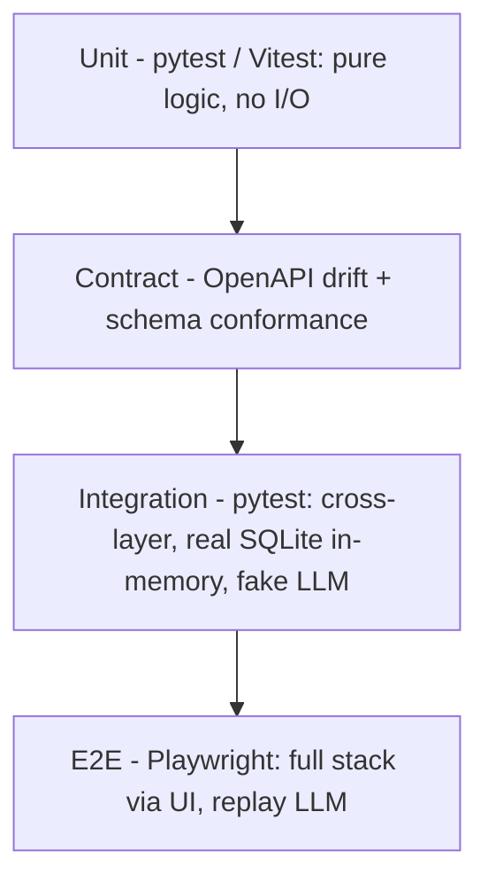
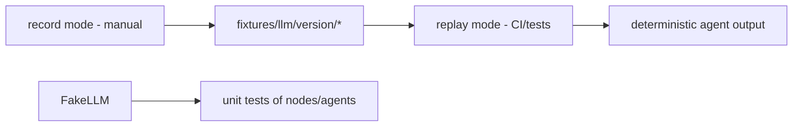

# 16 — Testing Strategy

> **Document ID:** `16-testing.md`
> **Project:** Agent5G — Agentic AI Service Enablement Platform for 5G Advanced Release 20
> **Document Type:** Test and verification specification (how correctness, determinism, and reproducibility are proven)
> **Status:** Authoritative for the test pyramid, backend/frontend test tooling, fixtures, record/replay strategy, determinism tests, coverage targets, and the CI gate. Enforces the Definition of Done and gates from `15-kiro-rules.md`.
> **Depends on:** `15-kiro-rules.md` (Definition of Done, enforcement gates), `10-backend.md` (LLMClient modes, DI overrides), `06-digital-twin.md` (golden-trajectory), `13-workflow-engine.md` (determinism), `09-api.md` (contract), `11-frontend.md` (frontend structure), `12-database.md` (metrics/fixtures).
> **Audience:** Backend/frontend engineers writing tests, researchers validating reproducibility, reviewers enforcing quality gates.

---

## Table of Contents

1. [Purpose](#1-purpose)
2. [Overview](#2-overview)
3. [Testing Principles](#3-testing-principles)
4. [The Test Pyramid](#4-the-test-pyramid)
5. [Backend Testing](#5-backend-testing)
6. [Frontend Testing](#6-frontend-testing)
7. [Determinism and Golden Tests](#7-determinism-and-golden-tests)
8. [Record/Replay LLM in Tests](#8-recordreplay-llm-in-tests)
9. [Test Fixtures and Factories](#9-test-fixtures-and-factories)
10. [Contract Testing](#10-contract-testing)
11. [End-to-End Testing](#11-end-to-end-testing)
12. [Non-Functional and Safety Tests](#12-non-functional-and-safety-tests)
13. [Coverage Targets](#13-coverage-targets)
14. [CI Gate](#14-ci-gate)
15. [Interfaces and Contracts](#15-interfaces-and-contracts)
16. [Folder References](#16-folder-references)
17. [Design Decisions](#17-design-decisions)
18. [Future Extensibility](#18-future-extensibility)
19. [Engineering / Implementation / Research Notes](#19-engineering--implementation--research-notes)
20. [Example Scenarios (Test Flow)](#20-example-scenarios-test-flow)
21. [Kiro Build Guidance](#21-kiro-build-guidance)
22. [Acceptance Criteria](#22-acceptance-criteria)

---

## 1. Purpose

This document specifies **how Agent5G's correctness is proven**. Because the platform is both an engineering artifact and a research instrument, testing must guarantee three things: **functional correctness** (components behave per spec), **determinism/reproducibility** (a run is bit-for-bit repeatable under replay LLM + fixed seed — a research-integrity requirement, `02` §16), and **contract integrity** (frontend and backend never drift). It defines the test pyramid, the tooling for backend and frontend, the fixture/factory strategy, the record/replay approach for the LLM, the determinism ("golden") tests, coverage targets, and the CI gate that enforces the Definition of Done from `15`.

The testing strategy is designed so tests run **fully offline** (no live LLM, no network) via replay fixtures and in-memory infrastructure, so the suite is fast, deterministic, and Windows-friendly. A failed determinism test is treated as a research-integrity bug, not a flaky test.

This document does not restate component behavior (that is `01`–`14`); it specifies how each is verified.

---

## 2. Overview

Testing spans four layers, each with distinct tooling and scope:



*Figure 2.1 — Layered testing: many fast unit tests, fewer integration, a handful of e2e, plus a contract check spanning the boundary.*

Two cross-cutting properties are tested at every relevant layer:
- **Determinism** — golden-trajectory (twin) and golden-workflow (engine) tests assert reproducible output under fixed seed + replay LLM (§7).
- **Safety/invariants** — tests assert the golden rules (`15` §3): agents never bypass the SEL, policies block correctly, secrets never log, no real PII.

All tests use the DI override seam (`10` §7) to inject fakes (in-memory DB, replay `LLMClient`, manual clock), so no test depends on external services.

---

## 3. Testing Principles

- **TSP1 — Deterministic by default.** Every test runs under replay LLM + fixed seed + manual clock; no wall-clock, no network, no live model. Flakiness is a bug.
- **TSP2 — Test behavior, not implementation.** Assert observable outputs (structured agent outputs, emitted events, persisted rows, HTTP responses), not private internals.
- **TSP3 — Fast and offline.** The unit+integration suite runs in seconds on one Windows machine; e2e is a small, high-value set.
- **TSP4 — Fixtures over mocks where possible.** Prefer real (in-memory) SQLite and real domain objects; mock only external boundaries (LLM) via the port.
- **TSP5 — One assertion of intent per test.** Tests are small and named for the behavior they prove.
- **TSP6 — Invariants are tested, not assumed.** The golden rules have explicit tests (SEL-only, policy, secrets, determinism).
- **TSP7 — Research metrics are tested.** The metric queries (`12` §8) are unit-tested against seeded data so figures are trustworthy.
- **TSP8 — Tests are part of Done.** No unit is complete without its tests (`15` §11).

---

## 4. The Test Pyramid

| Layer | Scope | Tooling | Count (relative) | Speed |
|-------|-------|---------|------------------|-------|
| **Unit** | pure functions: entities, KPI/failure models, guards, policy predicates, prompt render, metric SQL, React components/hooks | pytest / Vitest + Testing Library | most | ms |
| **Contract** | OpenAPI ↔ generated TS types; request/response schema conformance | type-gen diff + schemathesis-style checks | small | s |
| **Integration** | cross-layer: SEL invoker→twin→events→DB; workflow engine end-to-end with fake LLM; API routes over in-memory DB | pytest + httpx AsyncClient | medium | s |
| **E2E** | full stack via browser: intent → workflow → live UI updates | Playwright (frontend + backend, replay LLM) | few | s–min |

Rationale: push correctness down to fast unit tests; reserve e2e for the handful of user-visible flows (Scenarios A/B/C) that validate the whole spine.

---

## 5. Backend Testing

**Tooling:** `pytest` + `pytest-asyncio`; `httpx.AsyncClient` against the FastAPI app; in-memory SQLite (`sqlite+aiosqlite:///:memory:`) via the DI override; the replay `LLMClient`; a manual (test-controlled) sim clock.

**What is unit-tested (no I/O):**
- **Twin:** entity `advance(rng)` given a seeded stream → exact state deltas; KPI process bounds/clamping; failure-hazard transitions; threshold hysteresis (no flapping).
- **SEL:** descriptor validation; policy predicates PLC-1..6 as pure `(args, snapshot) → decision`; tool-schema derivation from Pydantic.
- **Workflow:** transition guards (`route_after_execute`, `route_after_validate`) across pass/retry/fail/exhausted; compensation-ledger reversal ordering.
- **Prompts:** deterministic render (stable hash) per `(role, version, payload)`.
- **Metrics:** each `12` §8 query against seeded rows returns expected values.

**What is integration-tested (in-memory DB + fake LLM):**
- **Invoker pipeline:** validate → policy → dispatch → emit → persist; a blocked action yields `POLICY_BLOCKED` + a `service_calls(status=blocked)` row and no state change.
- **Twin service tick:** `on_tick` advances state, persists KPIs (write-behind) and events (write-through), emits on the bus.
- **Workflow engine:** Scenario A runs the full graph under replay LLM; assert 8 stage-change events, `workflow_steps` inserted with compensations, `workflow_trace` populated, `status=completed`.
- **API:** `POST /workflows` returns 201 immediately; `GET /workflows/{id}/trace` returns the trace; a policy-blocked action route returns `423`; a confirm-required returns `428`.
- **Event/WS:** the bus fans out persist-first; a subscriber failure does not lose the persisted event.

```python
# tests/integration/test_scenario_a.py (indicative)
async def test_scenario_a_completes(container_replay):  # DI: in-memory DB, replay LLM, manual clock
    wf = await container_replay.engine.start("Deploy congestion detection model to Delhi Edge", trigger="user")
    await run_to_completion(container_replay, wf.id)
    state = await container_replay.workflow_repo.get(wf.id)
    assert state.status == "completed"
    assert stages_emitted(container_replay, wf.id) == ["observe","reason","plan","execute","validate","complete"]
    assert model_deployed(container_replay, target="edge_delhi_1")
```

---

## 6. Frontend Testing

**Tooling:** Vitest + React Testing Library (unit/component); Playwright (e2e); MSW (Mock Service Worker) to mock REST/WS for component tests.

**Unit/component:**
- Shared components render all three states (loading/empty/error) — a test asserts each state exists (enforces `15` §7).
- `StatusBadge` never encodes state by color alone (has icon+label).
- The WS store reducer: given a `WsEvent`, patches the correct slice (e.g., `NF_FAILED` → `nfStatusById=FAILED`); exhaustive over the event union.
- Feature hooks: `useWorkflows` merges REST + live WS progress correctly (with MSW + a fake WS).
- `IntentBar` submit calls the create mutation and routes on success.

**Contract-adjacent:**
- Type usage compiles against generated `types.gen.ts` (a `tsc --noEmit` gate); no hand-authored server shapes.

**Accessibility (component-level):**
- `axe`-style checks on key components (nav, forms, tables) for obvious violations (labels, roles, contrast tokens). Full WCAG validation still requires manual AT testing (noted, not automated).

```ts
// features/topology/topology-node.test.tsx (indicative)
it("shows FAILED styling and label when status is FAILED", () => {
  render(<NfNode data={{ id: "nrf_core_1", type: "NRF", status: "FAILED" }} />);
  expect(screen.getByLabelText(/NRF/)).toBeInTheDocument();
  expect(screen.getByText(/FAILED/i)).toBeInTheDocument(); // not color-only
});
```

---

## 7. Determinism and Golden Tests

The reproducibility guarantee (GR10, `02` §16, `06` §13, `13` WP6) is enforced by **golden tests**.

- **Golden trajectory (twin).** Load a scenario with a fixed seed, advance N ticks, hash the ordered stream of `(tick, entity, kpi, value)` + emitted events. Assert the hash equals a committed golden value. Any nondeterminism (stray `random`, iteration-order change) breaks it. (`06` §21.)
- **Golden workflow (engine).** Run Scenario A under replay LLM + fixed seed; hash the ordered `(stage, service, args, verdict)` traversal + final state. Assert equals golden. Guards WP6.
- **Separation of stochasticity.** A test varies the LLM (replay fixtures) while holding the seed, and vice versa, confirming the two randomness sources are independent (`02` §16) — so experiments can isolate each.
- **Regeneration discipline.** Golden values are regenerated only via an explicit `--update-golden` flag in a reviewed change (never silently), and only when a spec change legitimately alters output.

```python
# tests/determinism/test_golden_trajectory.py (indicative)
async def test_twin_golden(container_seeded):
    await advance_ticks(container_seeded, n=50)
    h = hash_kpi_event_stream(container_seeded)
    assert h == GOLDEN_TRAJECTORY_BASELINE_SEED42
```

---

## 8. Record/Replay LLM in Tests

The `LLMClient` port's three modes (`10` §8.4, `14` §12) make agent behavior testable offline.

- **record (fixture authoring, run manually, rarely).** Runs live Claude once for the seed scenarios, saving `(rendered_prompt, tools, schema, prompt_version) → response` fixtures to `tests/fixtures/llm/{prompt_version}/`. Not part of CI (requires network + key).
- **replay (all tests + CI).** Serves saved responses keyed by a stable request hash; no network, deterministic. This is the default in `env=test`.
- **fake (unit tests).** For pure unit tests of a node/agent, a hand-written `FakeLLM` returns a canned structured output — no fixture needed — to isolate the code path.
- **Fixture keying by `prompt_version`.** Bumping a prompt version (`14` §11) invalidates its fixtures; a test asserts every active `(role, version)` used by the seed scenarios has a fixture (fail loudly on a missing key rather than a silent live call).
- **Missing-fixture behavior.** In replay, a cache miss raises (never falls back to live) so tests can't accidentally hit the network.



*Figure 8.1 — Fixture lifecycle: record once, replay everywhere.*

---

## 9. Test Fixtures and Factories

- **DI container fixtures** (`pytest`): `container_replay` (in-memory DB + replay LLM + manual clock), `container_seeded` (fixed seed twin), `container_fake_llm` (FakeLLM). Built via `build_container(overrides=...)` (`10` §7).
- **Data factories:** builders for `NFProfile`, `TwinSnapshot`, `ServiceDescriptor`, `Plan`, `WorkflowState`, and DB rows — small, composable, defaulted, for arranging tests without boilerplate.
- **Scenario fixtures:** load `data/scenarios/*.json` (`06` §16) with a fixed seed to arrange integration/e2e worlds (`baseline_healthy`, `mumbai_congestion`, `nrf_failure`).
- **Manual clock:** tests advance the sim by calling `scheduler.step(n)` (never wall-clock sleep, TSP1), so tick-dependent behavior is precise and fast.
- **Seed data:** the idempotent seed (`12` §10) runs against the in-memory DB so policies/services/agents exist.

Factories and fixtures live in `tests/factories/` and `tests/conftest.py`.

---

## 10. Contract Testing

Guarantees the frontend/backend never drift (GR6, `09` §7).

- **Type-gen drift check.** CI regenerates `frontend/lib/api/types.gen.ts` from a freshly built `/openapi.json` and diffs against the committed file; a difference fails the build (contract changed without regenerating types).
- **Schema conformance.** A property/example test (schemathesis-style) exercises each endpoint against its OpenAPI schema: responses validate against the declared model; error responses use the `ErrorEnvelope`.
- **WS envelope conformance.** A test asserts every emitted event serializes to the canonical envelope and matches the `WsEvent` union arms (`09` §10).
- **Status-code mapping.** Tests assert the central `ServiceResult.status → HTTP` mapping (ok→200, blocked→423, confirm→428, error→422/500).

---

## 11. End-to-End Testing

A small, high-value Playwright suite exercising the full stack (frontend + backend + replay LLM) — the ultimate proof the spine works.

- **E2E-A (Scenario A):** open the app → submit the intent in the top bar → assert the Agent Console shows the 8-stage timeline advancing → assert Topology shows the Delhi Edge model badge → assert Model Manager lists the deployed model.
- **E2E-B (Scenario B):** load `mumbai_congestion` on Simulation → start → assert a breach toast → assert a *new Observer-triggered workflow appears without user action* → assert the latency chart recovers.
- **E2E-C (Scenario C):** inject an NRF fault → assert Topology NRF turns red → assert a Recovery workflow runs → assert NRF returns healthy and Logs reconstruct the incident by correlation id.

E2E runs against a backend booted with `env=test` (in-memory DB, replay LLM, fixed seed) so it is deterministic and offline. Both processes are started by the Playwright config's web-server hooks (documented as Windows commands).

---

## 12. Non-Functional and Safety Tests

Explicit tests for the golden rules (TSP6, `15` §3):

- **SEL-only invariant (GR1):** an architectural test asserts no `application/agents/*` module imports `domain/twin` or the twin service directly (static import scan); an integration test asserts an agent action reaches the twin only via a `service_calls` row.
- **Policy enforcement (GR8/H2):** deploying to a `FAILED` edge → `423`/`POLICY_BLOCKED`; a plan that would deregister the last NRF → blocked; a region-scoped action crossing regions → blocked.
- **Secrets never logged (GR11):** run a workflow, scan captured logs/DB `logs` for the API key value → assert absent.
- **No real PII (GR11/DP8):** assert UDM/subscriber data uses synthetic placeholders.
- **Layer boundaries (GR2):** the `import-linter` run is itself a test gate.
- **Compensation completeness (GR8):** startup fails if any `action` service lacks a `compensation` — a test asserts the startup check triggers on a deliberately broken descriptor.
- **Bounded autonomy:** a workflow exceeding `MAX_ATTEMPTS`/action budget routes to rollback/fail (no infinite loop).
- **Determinism (GR10):** the golden tests (§7).

Light **performance smoke tests** (not benchmarks): a tick completes within a modest budget; a workflow completes within a step budget under replay — to catch accidental blocking work on the loop (`10` §9).

---

## 13. Coverage Targets

- **Domain (twin models, policy predicates, guards):** ≥ 90% line + branch — this is the correctness-critical core.
- **Application (SEL invoker, workflow engine, agents):** ≥ 85%.
- **API routers:** ≥ 80% (thin; mostly integration-covered).
- **Frontend components/hooks/WS store:** ≥ 80%.
- **Metric queries (`12` §8):** 100% (each has a test).
- **Golden/determinism + safety-invariant tests:** required to exist (presence-gated, not %-gated).

Coverage is a floor, not a goal (TSP2): high coverage of behavior matters more than the number. CI reports coverage; a drop below floor on core packages fails the build.

---

## 14. CI Gate

`scripts/ci.ps1` (Windows) runs the full gate locally; it is the merge guard (`15` §12).

```mermaid
graph LR
    LINT[ruff + ESLint/Prettier] --> TYPES[mypy + tsc]
    TYPES --> IMP[import-linter]
    IMP --> UNIT[pytest unit + Vitest]
    UNIT --> INT[pytest integration - in-memory DB, replay LLM]
    INT --> CONTRACT[type-gen drift + schema conformance]
    CONTRACT --> DET[golden trajectory + golden workflow]
    DET --> SAFETY[safety-invariant + secret-scan]
    SAFETY --> E2E[Playwright e2e - replay]
    E2E --> COV[coverage floors]
```



*Figure 14.1 — CI gate order (fast checks first, e2e last).*

Rules: fast static checks first (fail early); e2e last (slowest). Any red stage blocks merge. The whole gate runs offline (replay LLM), so it is reproducible on any machine. Individual gates map 1:1 to the enforcement table in `15` §12.

---

## 15. Interfaces and Contracts

- **DI overrides:** `build_container(overrides=...)` (`10` §7) is the seam every backend test uses.
- **LLMClient modes:** live/record/replay/fake (`10` §8.4, `14` §12); tests use replay/fake.
- **Manual clock:** `scheduler.step(n)` for tick control.
- **Golden baselines:** committed hashes in `tests/determinism/baselines/`.
- **Fixtures:** `tests/fixtures/llm/{prompt_version}/`, `data/scenarios/*`.
- **CI:** `scripts/ci.ps1` runs the gate (`15` §12).
- **Metric tests:** validate `12` §8 queries used by `/analytics/*` (`09`).

---

## 16. Folder References

```text
backend/tests/
├── conftest.py                 # DI fixtures (container_replay, container_seeded, ...)
├── factories/                  # data builders
├── unit/ (twin/ sel/ workflow/ prompts/ metrics/)
├── integration/ (test_scenario_a.py test_invoker.py test_api.py test_bus.py)
├── determinism/ (test_golden_trajectory.py test_golden_workflow.py baselines/)
├── safety/ (test_sel_only.py test_policies.py test_secrets.py)
└── fixtures/llm/{prompt_version}/...
frontend/
├── **/*.test.tsx               # Vitest + RTL (co-located)
├── e2e/ (scenario-a.spec.ts scenario-b.spec.ts scenario-c.spec.ts)
└── test/ (msw handlers, fake-ws)
scripts/ci.ps1
```

This document owns *test strategy + gate*; the code under test is owned by its respective document.

---

## 17. Design Decisions

- **TD-1 — Replay-first, offline CI.** Rationale: deterministic, fast, no key/network in CI (TSP1/TSP3). Trade-off: fixtures to maintain; central to reproducibility.
- **TD-2 — Real in-memory SQLite over DB mocks.** Rationale: test real SQL/repos/constraints (TSP4). Trade-off: slightly slower than pure mocks; far higher fidelity.
- **TD-3 — Golden hashes for determinism.** Rationale: a single assertion catches any nondeterminism (GR10). Trade-off: goldens need deliberate regeneration; guarded by `--update-golden`.
- **TD-4 — Invariants as explicit tests.** Rationale: the golden rules are safety-critical and must not rely on review alone (TSP6). Trade-off: extra tests; non-negotiable for a research/safety story.
- **TD-5 — Small e2e set.** Rationale: e2e is slow/brittle; keep it to the three scenarios that prove the spine (TSP3). Trade-off: less UI coverage in e2e; component tests fill the gap.
- **TD-6 — Metric queries unit-tested.** Rationale: figures must be trustworthy (TSP7). Trade-off: seeded expected values to maintain; essential for the paper.

---

## 18. Future Extensibility

- **Property-based testing** (Hypothesis) for twin models and policy predicates — stress invariants across many inputs.
- **Mutation testing** on the domain core to measure test strength.
- **Load/soak tests** if the twin scales (many NFs/ticks) or when Postgres arrives.
- **Live-LLM canary** (opt-in, out of CI) to detect prompt/model drift against fixtures.
- **Visual regression** (Playwright screenshots) for the dashboard/topology once the UI stabilizes.
- **Chaos tests** injecting bus/DB failures to validate resilience beyond scripted faults.

---

## 19. Engineering / Implementation / Research Notes

**Engineering.**
- Stand up `conftest.py` DI fixtures and the replay `LLMClient` in Phase 3 so every later phase is testable (`15` §4).
- Use the manual clock everywhere; a single `asyncio.sleep(wall)` in a test reintroduces flakiness (TSP1).
- Keep goldens small and human-inspectable (hash + a sample) so a break is diagnosable.

**Implementation.**
- Test order mirrors the build: unit (domain) → integration (invoker/twin/engine) → contract → e2e. Slice A's integration test is the Phase-5 gate (`15` §4).
- Make missing replay fixtures raise (never fall back to live) so CI can't silently hit the network.
- Co-locate frontend tests; keep e2e in `frontend/e2e/` with a Windows web-server config.

**Research.**
- The determinism tests (§7) are research-integrity gates — a failure invalidates reproducibility claims (`02`).
- Test the metric queries (`12` §8) against seeded data with known expected values so every published figure is trustworthy.
- When running experiments (EXP-A..D), the same replay fixtures + seeds used in tests can seed reproducible experiment runs — reuse the fixtures.

---

## 20. Example Scenarios (Test Flow)

**Scenario A (tests).** Unit: Planner guard/plan-shape, `aimle.model.deploy` policy allow on healthy edge. Integration: `test_scenario_a_completes` runs the engine under replay → asserts stages, steps+compensations, trace, deployed model, events. Golden-workflow: hashes the traversal. E2E-A: the UI shows it live. Contract: `POST /workflows` schema conforms.

**Scenario B (tests).** Unit: Optimizer proposal ranking; PLC-6 no-op block when stable. Integration: inject a `mumbai_congestion` breach via manual clock → assert an Observer-triggered workflow starts (de-duped) → asserts `upf.loadbalance.apply` call and a later `KPI_THRESHOLD_CLEARED`. Metric test: recovery_rate query returns expected on seeded data. E2E-B: autonomous workflow appears in the UI.

**Scenario C (tests).** Unit: rollback reverse-ordering; PLC-1 never-zero-NRF block. Integration: inject NRF fault → discovery call errors → Recovery registers standby → asserts `NF_RECOVERED` + incident row + KG edge. Safety: assert the last-NRF deregister is blocked. E2E-C: red→green NRF and log reconstruction by correlation id.

---

## 21. Kiro Build Guidance

### 21.1 Implementation Order
1. `conftest.py` DI fixtures (`container_replay`, `container_seeded`, `FakeLLM`) + factories + manual clock (Phase 3).
2. Unit tests as each domain piece lands (twin, policy, guards, prompts, metrics).
3. Integration tests for invoker/twin/engine; `test_scenario_a_completes` as the Phase-5 gate.
4. Golden-trajectory + golden-workflow determinism tests.
5. Contract (type-gen drift + schema conformance) after the API exists.
6. Safety-invariant tests (SEL-only, policies, secrets, PII).
7. Frontend unit/component + WS-store reducer tests.
8. Playwright e2e for Scenarios A/B/C; wire `scripts/ci.ps1`.

### 21.2 Coding Rules
- All tests deterministic: replay/fake LLM, fixed seed, manual clock (TSP1); no network/wall-clock.
- Prefer in-memory SQLite + real domain objects; mock only the LLM boundary (TSP4).
- Missing replay fixture → raise (never live). Golden updates only via explicit flag in review.
- Every unit ships tests (Definition of Done, `15` §11); assert behavior/outputs, not internals.

### 21.3 Naming Convention
- `test_{unit}.py` / `{component}.test.tsx`; fixtures `container_*`, factories `make_*`; goldens `GOLDEN_*` / `baselines/*`; e2e `scenario-{a,b,c}.spec.ts`.

### 21.4 Folder Ownership
- `backend/tests/*`, `frontend/**/*.test.tsx`, `frontend/e2e/*`, `scripts/ci.ps1` owned here; code under test owned by its doc.

### 21.5 Prompt Suggestions
- "Create `conftest.py` with DI fixtures (in-memory SQLite, replay LLMClient, manual clock) and data factories per `16-testing.md`."
- "Write the Scenario A integration test asserting 8 stages, steps+compensations, trace, deployed model, and events under replay LLM."
- "Add golden-trajectory and golden-workflow determinism tests with committed baselines and an `--update-golden` flag."
- "Add safety tests: SEL-only import scan, PLC-1/PLC-2 policy blocks, and a secret-never-logged scan; wire `scripts/ci.ps1`."

### 21.6 Acceptance Criteria
- The full suite runs offline (replay) and is green and deterministic across repeated runs.
- Scenario A/B/C pass at integration and e2e; determinism golden tests pass.
- Safety-invariant tests pass (SEL-only, policy blocks, no secrets, no PII).
- Type-gen drift check is green; coverage floors met on core packages.

---

## 22. Acceptance Criteria

This document is **complete and correct** when:

- [ ] **AC-1.** A four-layer test pyramid (unit, contract, integration, e2e) with tooling and scope is specified.
- [ ] **AC-2.** Backend testing (pytest, in-memory SQLite, httpx, fake/replay LLM, manual clock) with concrete unit/integration targets is specified.
- [ ] **AC-3.** Frontend testing (Vitest/RTL, MSW, WS-store reducer, component states, a11y) is specified.
- [ ] **AC-4.** Determinism/golden tests (twin trajectory + workflow traversal + stochasticity separation + regeneration discipline) are specified.
- [ ] **AC-5.** The record/replay LLM strategy in tests (modes, fixture keying by prompt_version, no-live-fallback) is specified.
- [ ] **AC-6.** Fixtures/factories/DI overrides/manual clock are specified.
- [ ] **AC-7.** Contract testing (type-gen drift, schema + WS envelope conformance, status mapping) is specified.
- [ ] **AC-8.** A small e2e set covering Scenarios A/B/C (offline, replay) is specified.
- [ ] **AC-9.** Safety-invariant tests for the golden rules (SEL-only, policy, secrets, PII, compensation, bounded autonomy) are specified.
- [ ] **AC-10.** Coverage targets and the offline CI gate order are specified.
- [ ] **AC-11.** Interfaces, design decisions, extensibility, notes, test-flow scenarios, and Kiro guidance are present.
- [ ] **AC-12.** Determinism failures are treated as research-integrity bugs; the suite runs fully offline.

---

**NEXT FILE**
