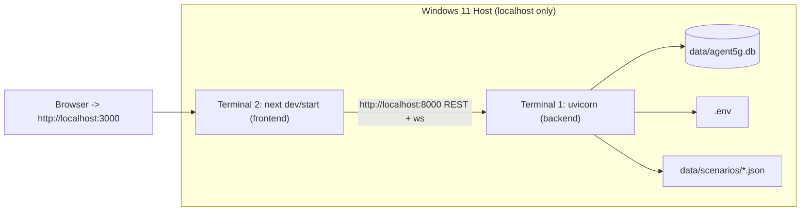
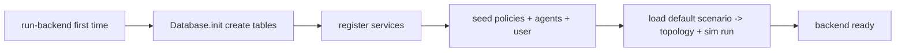
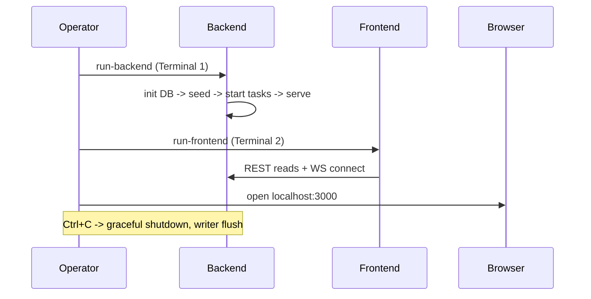

# 17 — Deployment (Local, Windows 11)

> **Document ID:** `17-deployment.md`
> **Project:** Agent5G — Agentic AI Service Enablement Platform for 5G Advanced Release 20
> **Document Type:** Local deployment and operations specification (how to install, configure, run, and operate the platform on Windows 11)
> **Status:** Authoritative for prerequisites, environment setup, run scripts, configuration, seeding, ports, security posture, hooks, and troubleshooting. Constrained to local Windows 11 with no Docker/Kubernetes/Linux/cloud.
> **Depends on:** `10-backend.md` (backend runtime, config, lifespan), `11-frontend.md` (frontend runtime), `12-database.md` (seeding), `09-api.md` (ports, security posture), `15-kiro-rules.md` (scripts, CI, steering), `16-testing.md` (CI gate).
> **Audience:** Anyone installing and running Agent5G locally — researchers, students, engineers, demo presenters.

---

## Table of Contents

1. [Purpose](#1-purpose)
2. [Overview](#2-overview)
3. [Constraints and Non-Goals](#3-constraints-and-non-goals)
4. [Prerequisites](#4-prerequisites)
5. [Repository Layout for Ops](#5-repository-layout-for-ops)
6. [Environment Configuration (.env)](#6-environment-configuration-env)
7. [Installation](#7-installation)
8. [Database Initialization and Seeding](#8-database-initialization-and-seeding)
9. [Running the Platform](#9-running-the-platform)
10. [Run Scripts](#10-run-scripts)
11. [Ports and Networking](#11-ports-and-networking)
12. [Startup and Shutdown Sequence](#12-startup-and-shutdown-sequence)
13. [Security Posture (Local)](#13-security-posture-local)
14. [Operating Modes](#14-operating-modes)
15. [Hooks Configuration](#15-hooks-configuration)
16. [Backups, Reset, and Pruning](#16-backups-reset-and-pruning)
17. [Troubleshooting](#17-troubleshooting)
18. [Interfaces and Contracts](#18-interfaces-and-contracts)
19. [Folder References](#19-folder-references)
20. [Design Decisions](#20-design-decisions)
21. [Future Extensibility](#21-future-extensibility)
22. [Engineering / Implementation / Research Notes](#22-engineering--implementation--research-notes)
23. [Example Scenarios (Ops Flow)](#23-example-scenarios-ops-flow)
24. [Kiro Build Guidance](#24-kiro-build-guidance)
25. [Acceptance Criteria](#25-acceptance-criteria)

---

## 1. Purpose

This document specifies **how to install, configure, run, and operate Agent5G on a single Windows 11 machine** — nothing more. Per the project constraints (`01` §4), there is no Docker, no Kubernetes, no Linux, and no cloud; the entire platform runs locally as two processes (a Python backend and a Node frontend) against one SQLite file. The goal is that a researcher, student, or demo presenter can go from a fresh clone to a running, seeded, demo-ready platform by following this document exactly, using only PowerShell/Command Prompt.

It also specifies the operational concerns that matter locally: the `.env` configuration, database seeding and reset, the exact startup/shutdown order, the (deliberately minimal) local security posture with the explicit path to hardening before any exposure, the agent hooks that support the workflow, and a troubleshooting guide for the common Windows/SQLite/Node pitfalls.

This document does not cover cloud/container deployment (out of scope by constraint); those are recorded only as future seams in `20-future-work.md`.

---

## 2. Overview

Agent5G runs as **two long-running processes** plus one on-disk database:



*Figure 2.1 — Local two-process topology (from `03` §18).*

Because dev servers are long-running (and the platform's tick loop and workflow runners live inside the backend), the two processes are **started manually in their own terminals** — never as blocking one-shot commands (Windows long-running-process rule). Helper `.ps1`/`.bat` scripts wrap the commands, but the operator launches them.

---

## 3. Constraints and Non-Goals

- **In scope:** local install/run on Windows 11; two processes; one SQLite file; PowerShell/CMD scripts; local security posture; hooks; reset/backup; troubleshooting.
- **Out of scope (by constraint):** Docker, Kubernetes, Linux, cloud, remote hosting, multi-node, TLS termination, reverse proxies, orchestration.
- **Zero cost (CST-1):** total running cost is **$0** — free/open-source stack, local SQLite, and LLM via offline `replay` or a **free tier** (or local Ollama). No paid services. If ever hosted, use **free tiers only** (`20-future-work.md`).
- **Not required:** internet, except when `LLM__MODE=live` (a **free-tier** provider) or during dependency install. Demos run offline in `replay` mode at $0 (`14`/`16`).
- **Two-day build:** a clean clone reaches a demoable Slice A/B/C in ~2 days (Claude 4.8 in Kiro builds it); the hour-by-hour plan is in `15-kiro-rules.md`.

**Cost summary:** deployment cost is **$0** in the base build. Everything runs locally on free tooling; the only optional external call is a **free-tier** LLM in live mode, which the default (`replay`) avoids entirely.

If the platform is ever taken beyond `localhost`, this document's §13 defines the mandatory hardening prerequisites (auth first); any hosting must remain on **free tiers** (`20`). This is out of the base scope but explicitly flagged.

---

## 4. Prerequisites

Install these on Windows 11 (versions indicative; pin in the repo README):

| Requirement | Version | Notes |
|-------------|---------|-------|
| **Python** | 3.11+ | from python.org or `winget install Python.Python.3.11`; ensure `py`/`python` on PATH |
| **uv** (recommended) or **pip** | latest | `uv` for fast, reproducible Python installs (`pip install uv` or per the uv install guide) |
| **Node.js** | 20 LTS+ | from nodejs.org or `winget install OpenJS.NodeJS.LTS` |
| **pnpm** (recommended) or **npm** | latest | `npm i -g pnpm` |
| **Git** | latest | to clone the repo |
| **PowerShell** | 5.1+ / 7+ | default shell for scripts |
| **A code editor** | Kiro IDE / VS Code | Kiro recommended (steering + hooks) |

Optional (only for `LLM__MODE=live`): a **free-tier** LLM key — e.g., Google AI Studio (Gemini), Groq, or OpenRouter free tier, or Anthropic free credits — **or** install **Ollama** for a fully local, no-key, $0 model. Demos/tests use `replay` and need **no key and no cost**.

**Everything here is free:** all prerequisites are free/open-source, no database server is required (SQLite is embedded), and there are **no paid dependencies or services** (CST-1). No build tools beyond the above.

---

## 5. Repository Layout for Ops

The operationally relevant paths (full trees in `10`/`11`/`12`):

```text
agent5g/
├── backend/            # FastAPI app (uvicorn app.main:app)
│   ├── app/  data/  scripts/  pyproject.toml  .env.example
├── frontend/           # Next.js app (pnpm dev / build+start)
│   ├── app/  features/  lib/  package.json  .env.local.example
├── data/
│   ├── agent5g.db      # created on first run (gitignored)
│   └── scenarios/*.json
├── scripts/            # Windows run/ops scripts
│   ├── setup.ps1  run-backend.ps1  run-frontend.ps1
│   ├── seed.ps1  reset.ps1  backup.ps1  prune.ps1  ci.ps1
└── docs/
```

`data/agent5g.db` and `.env`/`.env.local` are **gitignored** (DB is reproducible from seed+scenario; env holds secrets).

---

## 6. Environment Configuration (.env)

Backend config is a typed `Settings` from environment + `.env` (`10` §6). Copy the example and edit.

**`backend/.env` (from `.env.example`):**
```dotenv
ENV=dev                          # dev | test | demo
DB_PATH=data/agent5g.db
CORS_ORIGIN=http://localhost:3000

# LLM  (default replay = $0, offline; live = FREE TIER only)
LLM__MODE=replay                 # replay (default, free/offline) | record | live
LLM__PROVIDER=anthropic          # anthropic | gemini | groq | openrouter | ollama  (all free-tier/local)
LLM__MODEL=claude-4.8            # e.g. claude-4.8 | gemini-1.5-flash | llama-3.1-8b-instant | (local) llama3
LLM__API_KEY=                    # FREE-TIER key; set ONLY for live/record; blank for replay/ollama
LLM__BASE_URL=                   # for OpenAI-compatible free providers (groq/openrouter/ollama)
LLM__FIXTURES_DIR=tests/fixtures/llm

# Simulation
SIM__DEFAULT_SEED=42
SIM__TICK_MS=1000
SIM__DEFAULT_SCENARIO=baseline_healthy

LOG_LEVEL=INFO
```

**`frontend/.env.local` (from `.env.local.example`):**
```dotenv
NEXT_PUBLIC_API_BASE=http://localhost:8000/api/v1
NEXT_PUBLIC_WS_URL=ws://localhost:8000/ws
```

Rules:
- **Secrets:** `LLM__API_KEY` is the only secret; it lives in `.env` (gitignored), is loaded as a `SecretStr`, and is never logged or returned by any endpoint (`10` §6, `09` §6). For demos, leave it blank and use `replay`.
- **Zero cost (CST-1/CST-3):** the default (`replay`) needs **no key, no network, and costs nothing**. If you want live reasoning, use a **free tier only** — pick a `LLM__PROVIDER` with a free tier (Google AI Studio/Gemini, Groq, OpenRouter free models) or run **Ollama locally** (`LLM__PROVIDER=ollama`, no key, fully offline, guaranteed $0). Never enable a paid tier.
- **Nested env:** double-underscore maps to nested settings (`LLM__MODE`, `LLM__PROVIDER`, `SIM__DEFAULT_SEED`).
- **No frontend secrets:** only public `NEXT_PUBLIC_*` values (base URLs).
- **`.gitignore` (CST-5):** `.env`/`.env.local`, `data/*.db`, `node_modules/`, `.venv/`, caches, and the scratch **`planning/`** folder are git-ignored (see the repo root `.gitignore`). Never commit secrets, the DB, or planning scratch.

---

## 7. Installation

From a fresh clone, in PowerShell at the repo root:

```powershell
# 1. Backend deps (uv recommended)
cd backend
uv venv               # creates .venv
uv sync               # installs from pyproject.toml (or: .venv\Scripts\pip install -e ".[dev]")
cd ..

# 2. Frontend deps
cd frontend
pnpm install          # or: npm install
cd ..

# 3. Env files
Copy-Item backend\.env.example backend\.env
Copy-Item frontend\.env.local.example frontend\.env.local
```

Or run the wrapper: `scripts\setup.ps1` (does the above + verifies Python/Node versions). Installation requires internet (package downloads); running afterwards does not (unless `LLM__MODE=live`).

> Do not run the dev servers as part of install; installation is a one-shot, servers are long-running (§9).

---

## 8. Database Initialization and Seeding

The SQLite DB is created and seeded on first backend start (via the lifespan, `10` §5) or explicitly.

- **Automatic:** on first `run-backend`, `Database.init()` creates all 18 tables if absent, the SEL registry persists service descriptors, and the seed runs (policies PLC-1..6, seven agents, a default user, the default scenario → topology + a `simulation` run row) — idempotent (`12` §10).
- **Explicit:** `scripts\seed.ps1` runs seeding against `DB_PATH` without starting the server (useful for CI/e2e setup).
- **Reproducibility:** because the twin is deterministic, the DB's dynamic content is fully defined by `SIM__DEFAULT_SEED` + `SIM__DEFAULT_SCENARIO`; the DB file itself need not be shared to reproduce a run (`12` DP7).



*Figure 8.1 — First-run init + seed order (`12` §10).*

---

## 9. Running the Platform

**Two terminals, started manually** (long-running):

**Terminal 1 — Backend:**
```powershell
scripts\run-backend.ps1
# equivalent to:  cd backend;  uv run uvicorn app.main:app --host 127.0.0.1 --port 8000 --reload
```

**Terminal 2 — Frontend:**
```powershell
scripts\run-frontend.ps1
# dev:  cd frontend;  pnpm dev              (http://localhost:3000)
# prod: cd frontend;  pnpm build;  pnpm start
```

Then open **http://localhost:3000**. The frontend talks to the backend at `http://localhost:8000`; the backend serves Swagger at `http://localhost:8000/docs`.

- Start the **backend first** so the frontend's initial reads and WS connect succeed (the frontend tolerates a not-yet-ready backend with its amber connection pill + reconnect, `11` §9, but backend-first is smoother).
- The backend's **tick loop, workflow runners, and WS hub** live inside the uvicorn process; there is nothing else to start.
- For a **demo**, set `ENV=demo` + `LLM__MODE=replay` so it runs offline and deterministically (`14`/`18`).

> Never launch these via a blocking one-shot command runner; they run until you stop them (Ctrl+C).

---

## 10. Run Scripts

Windows-first scripts in `scripts/` (PowerShell; `.bat` equivalents optional). Each is a thin, documented wrapper — no `cd` chaining pitfalls, uses absolute/relative paths safely.

| Script | Purpose |
|--------|---------|
| `setup.ps1` | verify Python/Node; install backend + frontend deps; copy env examples |
| `run-backend.ps1` | start uvicorn (dev `--reload`) on 127.0.0.1:8000 |
| `run-frontend.ps1` | start Next.js dev (or build+start with `-Prod`) on 3000 |
| `seed.ps1` | initialize + seed the DB without starting the server |
| `reset.ps1` | reset the simulation/DB (guarded; see §16) |
| `backup.ps1` | copy `agent5g.db` to a timestamped backup |
| `prune.ps1` | prune old `kpis`/`events`/`logs` or non-kept `run_id`s (`12` §9) |
| `ci.ps1` | run the full offline CI gate (`15` §12, `16` §14) |
| `gen-types.ps1` | regenerate frontend types from `/openapi.json` (`09` §7) |

Scripts accept parameters (e.g., `run-frontend.ps1 -Prod`, `reset.ps1 -Seed 7 -Scenario mumbai_congestion`) and print the exact command they run for transparency.

---

## 11. Ports and Networking

| Service | Bind | Port | Protocol |
|---------|------|------|----------|
| Backend REST | 127.0.0.1 | 8000 | HTTP `/api/v1` |
| Backend WebSocket | 127.0.0.1 | 8000 | WS `/ws` |
| Backend docs | 127.0.0.1 | 8000 | `/docs`, `/openapi.json` |
| Frontend | 127.0.0.1 | 3000 | HTTP |

- **Bind to `127.0.0.1` only** (loopback) — the platform is not exposed to the LAN (§13). Do not bind `0.0.0.0` in the base build.
- **CORS:** backend allows only `http://localhost:3000` (`CORS_ORIGIN`); the WS hub accepts only that origin.
- **Port conflicts:** if 8000/3000 are taken, override (`--port` for uvicorn; `PORT=3001 pnpm dev` or `next dev -p 3001`) and update `NEXT_PUBLIC_API_BASE`/`WS_URL` accordingly.
- **Windows Firewall:** loopback needs no inbound rule; if Windows prompts, "allow on private network" is unnecessary for localhost-only use — you may decline.

---

## 12. Startup and Shutdown Sequence

**Startup (backend lifespan, `10` §5):** build DI container → `Database.init` → register SEL services → bootstrap twin (restore snapshot or load default scenario) → start background tasks (single-writer, event bus, sim scheduler) → serve. The scheduler starts **last** so nothing ticks before persistence/twin are ready.

**Shutdown (Ctrl+C):** the lifespan tears down gracefully — stop the scheduler, drain the **single-writer queue** so no persisted event/row is lost, close the DB engine. Always stop with Ctrl+C (not by killing the terminal) so the writer flushes.



*Figure 12.1 — Operator startup/shutdown flow.*

---

## 13. Security Posture (Local)

> **This section is mandatory reading.** The base build is intentionally minimal and **safe only on `localhost` for a single user.**

**Base build (as shipped):**
- Bound to `127.0.0.1` only; not reachable from the network.
- **Unauthenticated:** all endpoints, including mutating `action`/`control` ones (workflows, simulation, models, policies), are open to any local process (`09` §6). Acceptable only because it's loopback + single-user.
- CORS/WS restricted to `http://localhost:3000`.
- The only secret is `LLM__API_KEY` in `.env` (gitignored, `SecretStr`, never logged/returned). Demos use `replay` (no key).
- No real PII anywhere (synthetic subscriber data, `07` ND-5).

**Mandatory hardening BEFORE any non-local exposure (out of base scope, do not skip if exposing):**
1. **Add authentication + authorization** — bearer/API-key middleware in the Delivery layer gating all `action`/`control` endpoints, plus the `users`/roles model (`12` §6.1, `09` §15). Do not expose mutating endpoints unauthenticated.
2. **TLS** — terminate HTTPS (a local reverse proxy or ASGI TLS) before leaving loopback.
3. **Rate limiting** — formalize PLC-3-style limits at the HTTP layer.
4. **Secrets management** — move `LLM__API_KEY` out of a flat `.env` into a proper secret store.
5. **Review CORS/WS origins** for the real deployment origin.

Exposing the platform without step 1 is unsafe. This is deliberately flagged, not silently omitted (per the security-awareness requirement).

---

## 14. Operating Modes

Set via `ENV` + `LLM__MODE`:

| Mode | `ENV` | `LLM__MODE` | Use |
|------|-------|-------------|-----|
| **Dev** | `dev` | `replay` (or `live`) | day-to-day development; hot reload |
| **Demo** | `demo` | `replay` | offline, deterministic presentations (`18`); no key needed |
| **Test** | `test` | `replay`/`fake` | CI/e2e; in-memory DB (`16`) |
| **Live-LLM (free tier)** | `dev` | `live` | live reasoning via a **free-tier** provider (Gemini/Groq/OpenRouter free tiers, Anthropic free credits) or **local Ollama** ($0); requires a free key + internet, or Ollama offline |
| **Record** | `dev` | `record` | author replay fixtures once (live + save); manual, off-CI (`14` §12) |

- **Demo determinism:** `demo` + `replay` + fixed `SIM__DEFAULT_SEED` guarantees identical behavior every run — essential for a reliable IEEE demo.
- **Switching LLM mode** is a Settings/`.env` change (`09` §9.12); `live`↔`replay` may take effect without restart where implemented, otherwise restart the backend.

---

## 15. Hooks Configuration

Agent5G uses Kiro **agent hooks** to support the workflow (configured in the Kiro Hook UI; files live in `.kiro/hooks/`). Recommended hooks:

- **Lint/type on save (`PostFileSave`, matcher `backend/.*\.py$`)** → run `ruff`/`mypy` on the backend; keeps code clean during dev.
- **Frontend lint on save (`PostFileSave`, matcher `frontend/.*\.tsx?$`)** → `pnpm lint`/`tsc --noEmit`.
- **Import-boundary check on write (`PostFileSave`, matcher `backend/app/domain/.*`)** → run `import-linter` to catch a domain→framework import immediately (GR2, `15`).
- **Type-gen on API schema change (`PostFileSave`, matcher `backend/app/api/schemas/.*`)** → remind/run `gen-types.ps1` so frontend types stay in sync (GR6).
- **Run tests after a spec task (`PostTaskExec`)** → `scripts\ci.ps1` (or a fast subset) to keep the suite green as tasks complete.

Hooks are optional conveniences; the authoritative gate remains `scripts\ci.ps1` (`16` §14). Configure via the IDE's hook UI per `key_kiro_features`; do not hand-edit hook internals unless intentionally authoring them.

---

## 16. Backups, Reset, and Pruning

- **Backup (`backup.ps1`):** copy `data/agent5g.db` to `data/backups/agent5g_{timestamp}.db`. Cheap; do it before a reset or a risky experiment. Because runs are reproducible from seed+scenario, backups are a convenience, not a necessity.
- **Reset (`reset.ps1`, guarded):** rebuilds the twin from `(seed, scenario)` — clears dynamic state (`kpis`, `events`, twin nodes) and starts a fresh `simulation` run. Prompts for confirmation (destructive to run history). Maps to `POST /simulation/reset` (`09` §9.6) or a direct DB rebuild when the server is stopped. Preserves definitions (services, policies, agents).
- **Pruning (`prune.ps1`):** deletes old `kpis`/`events`/`logs` or non-kept `run_id`s to bound the DB size (`12` §9). **Never run during an active run** (would corrupt reproducibility of that run); stop the backend or prune only completed `run_id`s.
- **Fresh start:** delete `data/agent5g.db` and restart — the backend recreates and reseeds it (`12` §10). Safe because content is reproducible.

---

## 17. Troubleshooting

Common local (Windows/SQLite/Node) issues and fixes:

| Symptom | Likely cause | Fix |
|---------|--------------|-----|
| `database is locked` | concurrent writers | ensure only the single-writer path writes; WAL + `busy_timeout` are set (`10` §8.1); don't open the DB in another tool while running |
| Backend won't start: port 8000 in use | stale process | find/stop it (`Get-NetTCPConnection -LocalPort 8000`) or run on another port + update frontend env |
| Frontend can't reach backend (amber pill) | backend not up / wrong base URL | start backend first; check `NEXT_PUBLIC_API_BASE`/`WS_URL` |
| WS never connects | origin/port mismatch | ensure `CORS_ORIGIN`=frontend origin and WS URL/port correct |
| `LLM__MODE=live` errors / 503 | missing/invalid key or no internet | set `LLM__API_KEY`, check connectivity, or switch to `replay` |
| replay: "missing fixture" error | prompt version changed without fixtures | re-record fixtures (`record` mode) for the active `prompt_version` (`14` §12) or use the committed set |
| `py`/`python` not found | PATH | reinstall Python with "Add to PATH", or use `py -3.11` |
| pnpm/npm install fails | Node version | ensure Node 20+; clear `node_modules` and reinstall |
| Types out of sync errors | schema changed | run `gen-types.ps1` (`09` §7) |
| Non-deterministic demo | wrong mode/seed | use `ENV=demo`, `LLM__MODE=replay`, fixed `SIM__DEFAULT_SEED` |
| Reset didn't clear data | server running / wrong DB path | stop backend or use `POST /simulation/reset`; verify `DB_PATH` |

If a determinism/golden test fails (`16` §7), treat it as a real regression (research-integrity), not a flaky test — investigate the introduced nondeterminism.

---

## 18. Interfaces and Contracts

- **Scripts:** `scripts/*.ps1` (§10) — the operational surface; each wraps a documented command.
- **Config:** `backend/.env` (typed `Settings`, `10` §6) + `frontend/.env.local` (`NEXT_PUBLIC_*`).
- **Ports:** 8000 (backend REST/WS/docs), 3000 (frontend) on `127.0.0.1` (§11).
- **Lifespan:** startup/shutdown order (`10` §5, §12).
- **Simulation control:** `POST /simulation/*` (`09` §9.6) for runtime reset/seed/scenario/fault; `reset.ps1` for offline reset.
- **Hooks:** `.kiro/hooks/*` (§15). **CI:** `scripts/ci.ps1` (`16` §14).

---

## 19. Folder References

```text
scripts/            # setup, run-backend, run-frontend, seed, reset, backup, prune, ci, gen-types
backend/.env(.example)
frontend/.env.local(.example)
data/agent5g.db     # gitignored
data/scenarios/*.json
data/backups/       # backup.ps1 output
.kiro/hooks/        # agent hooks (§15)
.kiro/steering/     # standards steering (15 §10)
```

This document owns *local ops (scripts, env, run, security posture, hooks, troubleshooting)*; runtime internals in `10`; schema in `12`; API in `09`.

---

## 20. Design Decisions

- **OD-1 — Two manual processes, no orchestration.** Rationale: constraints forbid containers; long-running servers must be operator-started (Windows rule). Trade-off: two terminals; simplest correct local model.
- **OD-2 — Loopback-only, unauthenticated base build.** Rationale: single-user research prototype simplicity (`09` §6). Trade-off: unsafe if exposed — hardening path mandated in §13.
- **OD-3 — SQLite file, reproducible content.** Rationale: zero-config; DB content is defined by seed+scenario, so it needn't be shipped (`12` DP7). Trade-off: single-writer concurrency limit; acceptable locally.
- **OD-4 — Replay-first for demos/tests.** Rationale: offline, deterministic, no key/cost (`14`/`16`). Trade-off: fixtures to maintain; central to reliable demos.
- **OD-5 — PowerShell script wrappers.** Rationale: transparent, Windows-native, no `cd`-chaining pitfalls. Trade-off: Windows-specific; matches the constraint.
- **OD-6 — Graceful shutdown flushes the writer.** Rationale: no lost audit rows (`10` §5). Trade-off: must Ctrl+C, not kill; documented.

---

## 21. Future Extensibility

Recorded as seams only (out of base scope, detailed in `20-future-work.md`):

- **Containerization:** a Dockerfile + compose could package backend+frontend; would relax the local-only constraint.
- **Kubernetes:** decompose into deployable services along the layer seams (`03` §22).
- **Cloud:** managed Postgres (replace SQLite), object storage for fixtures, a hosted CI.
- **Reverse proxy + TLS:** front the two processes for a hardened deployment.
- **Multi-user:** the auth/RBAC prerequisite (§13) plus session management.
- **One-command launcher:** a supervisor (e.g., a small process manager) to start both processes together while keeping them long-running — still local.

---

## 22. Engineering / Implementation / Research Notes

**Engineering.**
- Keep scripts free of `cd &&` chains; use parameters and print the executed command (transparency + Windows safety).
- Always start the backend first and shut down with Ctrl+C so the single-writer flushes (§12).
- Bind to `127.0.0.1` explicitly in `run-backend.ps1`; never default to `0.0.0.0` in the base build (§13).

**Implementation.**
- Provide `.env.example` / `.env.local.example` with every variable documented; `setup.ps1` copies them.
- Make `seed.ps1` idempotent (upsert by PK) so re-running is safe (`12` §10).
- Ship the committed replay fixtures so a fresh clone can run `demo` mode offline without recording.

**Research.**
- For reproducible experiments/figures, pin `ENV=demo` (or `test`), `LLM__MODE=replay`, and a fixed `SIM__DEFAULT_SEED`/scenario, and record which `(seed, scenario, config, prompt_version)` produced each run (`12` DP7).
- Because the DB is reproducible from seed+scenario, share the `(seed, scenario)` + fixtures rather than the DB file for others to reproduce results.
- Keep a backup before destructive experiments so a specific run's raw rows can be re-examined.

---

## 23. Example Scenarios (Ops Flow)

**First-time setup + demo.**
1. `scripts\setup.ps1` (install + env). 2. `Copy` not needed (setup did it); edit `backend\.env` → `ENV=demo`, `LLM__MODE=replay`. 3. Terminal 1: `scripts\run-backend.ps1` (DB auto-creates + seeds). 4. Terminal 2: `scripts\run-frontend.ps1`. 5. Open localhost:3000 → submit "Deploy congestion detection model to Delhi Edge" → watch the Agent Console (Scenario A) run deterministically offline.

**Autonomous demo (Scenario B).** On the Simulation page: load `mumbai_congestion`, start; a breach fires and an Observer-triggered workflow appears with no user prompt — the highlight moment. Deterministic under the fixed seed.

**Reset between demos.** `scripts\backup.ps1` (optional) → on the Simulation page click Reset (confirm) or `scripts\reset.ps1 -Seed 42 -Scenario baseline_healthy` with the backend stopped → restart backend → clean slate, same reproducible baseline.

**Switch to live (free-tier) LLM.** Set `LLM__MODE=live`, choose a free-tier `LLM__PROVIDER`/`LLM__MODEL` (or `ollama` for local/$0), set the free-tier `LLM__API_KEY` if the provider needs one, restart the backend; agents now reason live at **no cost**. Switch back to `replay` for offline/deterministic runs. Never enable a paid tier (CST-1).

---

## 24. Kiro Build Guidance

### 24.1 Implementation Order
1. `scripts\setup.ps1` (version checks + install + env copy).
2. `run-backend.ps1` / `run-frontend.ps1` (parameterized; print commands; bind 127.0.0.1).
3. `.env.example` / `.env.local.example` with all documented vars.
4. `seed.ps1` (idempotent) + auto-seed on first lifespan start.
5. `reset.ps1` / `backup.ps1` / `prune.ps1` / `gen-types.ps1` / `ci.ps1`.
6. `.kiro/hooks/*` (lint/type/import-boundary/type-gen/test hooks).

### 24.2 Coding Rules
- Scripts are Windows-native PowerShell; no `cd &&` chaining; print the exact command run.
- Backend binds `127.0.0.1` only in the base build (§13); never `0.0.0.0`.
- Long-running servers are operator-started, never blocking one-shots.
- Secrets only in `.env` (gitignored), never in scripts/logs/repo (GR11).
- `reset`/`prune` are guarded (confirm) and never run mid-run.

### 24.3 Naming Convention
- Scripts `verb-noun.ps1` (`run-backend.ps1`, `gen-types.ps1`); params PascalCase (`-Prod`, `-Seed`, `-Scenario`).
- Env vars `SCREAMING_SNAKE`; nested with `__`; frontend public vars `NEXT_PUBLIC_*`.

### 24.4 Folder Ownership
- `scripts/*`, `.env*` examples, `.kiro/hooks/*`, `data/backups/*` owned here; runtime in `10`; schema/seed in `12`.

### 24.5 Prompt Suggestions
- "Create Windows PowerShell scripts (`setup`, `run-backend`, `run-frontend`, `seed`, `reset`, `backup`, `prune`, `gen-types`, `ci`) per `17-deployment.md`, binding the backend to 127.0.0.1 and printing the commands they run."
- "Write `.env.example` and `.env.local.example` documenting every variable, defaulting to replay/offline."
- "Configure `.kiro/hooks` for lint/type on save, an import-boundary check on domain writes, and type-gen on API schema changes."

### 24.6 Acceptance Criteria
- A fresh clone → `setup.ps1` → two run scripts → working app at localhost:3000, seeded, in offline `demo` mode.
- Backend binds loopback only; no auth is present but the hardening path is documented.
- Ctrl+C shuts down gracefully with the writer flushed; reset/prune are guarded.

---

## 25. Acceptance Criteria

This document is **complete and correct** when:

- [ ] **AC-1.** Prerequisites (Python 3.11+, Node 20+, uv/pnpm, Git, PowerShell) are specified with install hints.
- [ ] **AC-2.** `.env`/`.env.local` are specified with every variable and the secret/no-secret rules.
- [ ] **AC-3.** Installation steps (backend + frontend + env) and a `setup.ps1` wrapper are specified.
- [ ] **AC-4.** DB init + idempotent seeding (auto on first start + explicit script) is specified.
- [ ] **AC-5.** The two-process manual run procedure (backend first) with scripts is specified.
- [ ] **AC-6.** All run/ops scripts are enumerated with purpose.
- [ ] **AC-7.** Ports/networking (loopback-only, CORS, conflicts) are specified.
- [ ] **AC-8.** Startup/shutdown order (writer flush on Ctrl+C) is specified.
- [ ] **AC-9.** The local security posture is explicit: unauthenticated loopback base build + mandatory hardening (auth first) before any exposure.
- [ ] **AC-10.** Operating modes (dev/demo/test/live/record) are specified.
- [ ] **AC-11.** Hooks, backup/reset/pruning, and a troubleshooting guide are specified.
- [ ] **AC-12.** No Docker/K8s/Linux/cloud in scope; those are future seams only; design decisions, notes, ops scenarios, and Kiro guidance are present.

---

**NEXT FILE**
