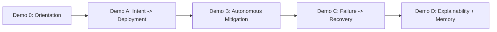

# 18 — Demo (Scripted Demonstration Guide)

> **Document ID:** `18-demo.md`
> **Project:** Agent5G — Agentic AI Service Enablement Platform for 5G Advanced Release 20
> **Document Type:** Demonstration specification (the scripted, reproducible flows for showing the platform)
> **Status:** Authoritative for the demo scenarios, their setup, step-by-step scripts, talking points, expected UI/state outcomes, and recovery from mishaps. Built to run offline and deterministically for an IEEE demo, thesis defense, or portfolio walkthrough.
> **Depends on:** `17-deployment.md` (how to run, demo mode), `04-ui.md` (pages/behaviors shown), `05-agents.md`/`13-workflow-engine.md` (what the agents do), `06-digital-twin.md` (scenarios/seeds), `09-api.md` (WS events), `14-prompts.md`/`16-testing.md` (replay determinism).
> **Audience:** The presenter (researcher/student/engineer), and anyone reproducing the demo.

---

## Table of Contents

1. [Purpose](#1-purpose)
2. [Overview](#2-overview)
3. [Demo Principles](#3-demo-principles)
4. [Pre-Demo Checklist](#4-pre-demo-checklist)
5. [The Narrative Arc](#5-the-narrative-arc)
6. [Demo 0 — Orientation (2 min)](#6-demo-0--orientation-2-min)
7. [Demo A — Intent to Autonomous Deployment (5 min)](#7-demo-a--intent-to-autonomous-deployment-5-min)
8. [Demo B — Autonomous Mitigation, No Human Prompt (5 min)](#8-demo-b--autonomous-mitigation-no-human-prompt-5-min)
9. [Demo C — Failure and Recovery (5 min)](#9-demo-c--failure-and-recovery-5-min)
10. [Demo D — Explainability and Memory (3 min)](#10-demo-d--explainability-and-memory-3-min)
11. [Talking Points and Q&A](#11-talking-points-and-qa)
12. [Timing Plans](#12-timing-plans)
13. [Failure Recovery (When the Demo Misbehaves)](#13-failure-recovery-when-the-demo-misbehaves)
14. [Reproducibility](#14-reproducibility)
15. [Interfaces and Contracts](#15-interfaces-and-contracts)
16. [Folder References](#16-folder-references)
17. [Design Decisions](#17-design-decisions)
18. [Future Extensibility](#18-future-extensibility)
19. [Engineering / Implementation / Research Notes](#19-engineering--implementation--research-notes)
20. [Kiro Build Guidance](#20-kiro-build-guidance)
21. [Acceptance Criteria](#21-acceptance-criteria)

---

## 1. Purpose

This document turns Agent5G's capabilities into a **reliable, scripted, reproducible demonstration**. Its purpose is to let a presenter show the platform's thesis — that an agentic AI layer above a Service Enablement Layer can autonomously translate intent into correct, validated, policy-compliant network operations, and recover when things go wrong — in a fixed, low-risk sequence that runs **offline and deterministically** (replay LLM + fixed seed, `14`/`16`/`17`).

It specifies each demo's setup, exact steps, what the audience should see (which UI pages update, which events fire), the talking points that connect the visible behavior to the research contribution, timing plans for different slots (3/10/20 minutes), and a failure-recovery playbook so a live demo never stalls.

The scenarios reuse the platform's canonical flows (Scenarios A/B/C from `01`) and the experiments (EXP-A..D from `02`), so the demo is not a special build — it is the real system in demo mode.

---

## 2. Overview

Four demos, building on one another, plus a short orientation:



*Figure 2.1 — The demo arc: orient, then act, then autonomy, then resilience, then explain.*

Each demo maps to a canonical scenario and runs in **demo mode** (`ENV=demo`, `LLM__MODE=replay`, fixed `SIM__DEFAULT_SEED`) so behavior is identical every time — no live-LLM variance, no network dependency, no surprises in front of an audience.

The demo's power is visual and live: because the whole console is event-driven off one WebSocket (`04`/`11`), a single action ripples across the Dashboard, Agent Console, Topology, Twin, and Logs simultaneously — the audience watches the network and the AI reason in real time.

---

## 3. Demo Principles

- **DMP1 — Deterministic.** Always demo mode + replay + fixed seed. Never live-LLM in a graded/recorded setting (variance risk).
- **DMP2 — Show, don't tell.** Let the UI reveal the behavior (timelines advancing, nodes changing color, autonomous workflows appearing); narrate briefly.
- **DMP3 — One idea per demo.** A=intent→action, B=autonomy, C=resilience, D=explainability. Don't blur them.
- **DMP4 — The autonomy moment is the climax.** Demo B (a workflow that no human started) is the single most compelling moment — set it up deliberately.
- **DMP5 — Explainability closes the loop.** Demo D proves the system is trustworthy/auditable, not a black box — the reviewer's key concern (RQ4).
- **DMP6 — Recoverable.** Every demo has a reset and a fallback (a pre-recorded run / screenshots) so a hiccup never derails the talk (§13).
- **DMP7 — Time-boxed.** Each demo fits its slot; §12 gives 3/10/20-min plans.

---

## 4. Pre-Demo Checklist

Do this **before** the audience arrives (10 minutes):

- [ ] `backend/.env`: `ENV=demo`, `LLM__MODE=replay`, `SIM__DEFAULT_SEED=42`, `SIM__DEFAULT_SCENARIO=baseline_healthy`, `LLM__API_KEY` blank.
- [ ] Replay **fixtures present** for the active `prompt_version` (run a dry Scenario A; a "missing fixture" error means re-record or check out the committed fixtures, `14` §12 / `16` §8).
- [ ] Fresh DB: `scripts\reset.ps1 -Seed 42 -Scenario baseline_healthy` (or delete `data/agent5g.db` and let it reseed).
- [ ] Terminal 1: `scripts\run-backend.ps1` → wait for "ready"; `GET /health` ok.
- [ ] Terminal 2: `scripts\run-frontend.ps1` → open `http://localhost:3000`; WS pill green.
- [ ] Do a **full silent dry-run** of A/B/C once; then reset to baseline.
- [ ] Zoom/browser: increase font size; dark theme on (projector-friendly, `04`); close unrelated tabs/notifications.
- [ ] Have the **fallback recording** open in a background tab (§13).
- [ ] Confirm no internet dependency (unplug to prove offline determinism, optional flourish).

A green pre-demo checklist is the single best guarantee of a smooth demo.

---

## 5. The Narrative Arc

The story you are telling (thread it through the demos):

1. **The problem** (30s): 5G-Advanced/Release-20 networks produce enormous analytics and enablement primitives (NWDAF, DCF, AIMLE) but stop short of *deciding and acting*. Operators think in intents; the network speaks in service calls. (`02`.)
2. **The idea** (30s): put a multi-agent AI layer above a Service Enablement Layer. Agents observe, reason, plan, act through services, validate, and recover — a closed loop. (`01`/`05`.)
3. **The proof** (the demos): A shows intent→action; B shows autonomy; C shows resilience; D shows it's explainable and learns.
4. **The payoff** (30s): a reproducible research testbed that is architecturally faithful and future-swappable to Open5GS/OAI — publishable and extensible. (`02`/`20`.)

---

## 6. Demo 0 — Orientation (2 min)

**Goal:** ground the audience in what they're looking at.

**Steps:**
1. Open **Dashboard**: point to active workflows, NF health, p95 latency, alerts, deployed models, and the sim status pill.
2. Open **Topology**: show the simulated SBA network — UE/gNB/AMF/SMF/UPF/NRF/UDM/PCF/NWDAF/NEF/DCF/AF/Edge across regions (Delhi/Mumbai), links carrying live metrics.
3. Open **Service Registry**: show that capabilities are typed, discoverable services with a 3GPP `spec_ref` (e.g., `nwdaf.analytics.congestion.subscribe` → `Nnwdaf_AnalyticsSubscription`). This is the SEL — the bridge the agents use.

**Talking point:** "This is a Digital Twin of a 5G-Advanced core — architecturally faithful, fully simulated, deterministic. Every capability is a service. The AI acts only through these services."

---

## 7. Demo A — Intent to Autonomous Deployment (5 min)

**Maps to:** Scenario A / EXP-A. **Setup:** baseline, seed 42.

**Steps:**
1. In the top-bar **intent input**, type: *"Deploy congestion detection model to Delhi Edge."* Submit.
2. You're routed to the **Agent Console**. Narrate the **8-stage timeline** advancing: Observe → Reason → Plan.
3. Expand the **Plan** in the Reasoning Trace: three ordered steps — discover the Delhi Edge (`nrf.discover`), deploy the model (`aimle.model.deploy`), subscribe congestion analytics (`nwdaf.analytics.congestion.subscribe`).
4. Watch **Execute**: each `SERVICE_CALLED`/`SERVICE_RESULT` streams in the live panel; a toast + **Topology** shows the Delhi Edge node gain a model badge (`MODEL_DEPLOYED`).
5. **Validate** confirms the twin (model active + subscription active) → **Complete** with a Documentation summary.
6. Open **Model Manager**: the model is listed as *Deployed* on Delhi Edge.

**What the audience sees:** intent in plain English → a correct, ordered, validated set of real service calls → live network change → a written summary. **Expected events:** stage changes ×6, 2–3 `SERVICE_*`, `MODEL_DEPLOYED`, `WORKFLOW_COMPLETED`.

**Talking point:** "No script mapped that sentence to those calls — the Planner reasoned it out, using only registered services, and the Observer verified the result against the actual network state."

---

## 8. Demo B — Autonomous Mitigation, No Human Prompt (5 min)

**Maps to:** Scenario B / EXP-B. **The climax (DMP4).** **Setup:** load `mumbai_congestion`.

**Steps:**
1. Open **Simulation**: load scenario `mumbai_congestion` (seed 7), click **Start**. (Optionally show the demand spike building on a Mumbai KPI chart.)
2. Wait for the **breach**: a `KPI_THRESHOLD_BREACH(latency, Mumbai)` toast fires; the Dashboard alert count increments; the Mumbai UPF/gNB node turns amber on Topology.
3. **Pause and point:** open the **Agent Console** — *a new workflow has appeared that you did not start.* The Observer detected the breach and launched a mitigation workflow autonomously.
4. Narrate its trace: Optimizer proposes a `upf.loadbalance.apply` (or edge offload); Executor applies it; the Mumbai latency chart recovers below the threshold band (`KPI_THRESHOLD_CLEARED`); the workflow Completes.

**What the audience sees:** the network degrades, and the system fixes itself with no human in the loop — the closed loop in action. **Expected events:** `KPI_THRESHOLD_BREACH`, an Observer-triggered `WORKFLOW_STAGE_CHANGED` (new correlation id), `SERVICE_*`, `KPI_THRESHOLD_CLEARED`, `WORKFLOW_COMPLETED`.

**Talking point:** "This is the heart of the thesis: analytics detected congestion, and the agentic layer *acted* — observing, reasoning, and mitigating — without anyone typing a command. And it stayed within policy the whole time."

---

## 9. Demo C — Failure and Recovery (5 min)

**Maps to:** Scenario C / EXP-C. **Setup:** baseline or after B; a healthy NRF present.

**Steps:**
1. Open **Simulation** (or **Digital Twin**): **inject a fault** → `nrf_core_1`, type `fail`. Confirm.
2. **Topology**: the NRF node pulses **red** (`NF_FAILED`). **Logs**: discovery-dependent service calls begin to error.
3. **Agent Console**: a **Recovery** workflow runs. In its trace, point out the policy check — **PLC-1 "never zero NRF"** — and the mitigation: promote the **standby NRF** (`nrf.register` on standby).
4. **Topology**: NRF returns **emerald** (`NF_RECOVERED`); discovery works again.
5. Open **Logs**, filter by the workflow's **correlation id**: the whole incident (failure → detection → policy-guarded recovery → resolution) reconstructs as one narrative.

**What the audience sees:** an injected failure, an autonomous, *safe* recovery that respects a hard guardrail, and a complete audit trail. **Expected events:** `NF_FAILED`, `SERVICE_*` (some errors), recovery `SERVICE_*`, `NF_RECOVERED`.

**Talking point:** "The Recovery agent didn't just react — it obeyed a safety policy enforced in code, not by trusting the model. It promoted a standby rather than doing anything that could leave the network without discovery."

---

## 10. Demo D — Explainability and Memory (3 min)

**Maps to:** RQ4 / EXP-D. **Setup:** after A–C (there's now history).

**Steps:**
1. **Agent Console**: reopen Demo A's workflow; expand each stage's **Reasoning Trace** — show the Planner's rationale, the tool calls with typed args/results, and the Observer's validation evidence.
2. **Logs**: "follow correlation id" to show every event/service call/LLM interaction for that workflow, ordered.
3. **Knowledge Graph**: show accumulated entities/relations — e.g., `Model —hosted_on→ Delhi Edge`, `Incident —mitigated_by→ promote_standby_NRF` from Demo C.
4. **Memory Viewer**: show episodic memories of the past workflows and (if a pattern recurred) a semantic fact; explain that warm memory helps the Planner act faster next time.
5. **Analytics**: show the metrics (success rate, steps-to-completion, recovery rate, policy compliance) and mention figures export straight to CSV/PNG for the paper.

**Talking point:** "Every autonomous action is fully explainable and auditable — reasoning, tool calls, validations, and a knowledge graph the agents build over time. That's what makes autonomous network operations trustworthy."

---

## 11. Talking Points and Q&A

Anticipated questions and crisp answers:

- **"Is this a real 5G core?"** No — a research prototype with a Digital Twin. But it's *architecturally faithful*: every NF/service maps to a 3GPP function (we show `spec_ref`), so it can later be swapped for Open5GS/OAI behind the same contracts.
- **"Is the LLM just improvising?"** No. It only uses registered services (never invents one), returns validated structured plans, and every action passes a deterministic policy check in code. In demo mode it's replay, so it's reproducible.
- **"What stops it doing something dangerous?"** The Service Enablement Layer enforces policies (e.g., never zero NRF, no deploy to a failed node, region scoping, rate limits, human confirmation for high-impact actions). The model proposes; the SEL disposes.
- **"How is this reproducible for a paper?"** Deterministic twin (seeded) + replay LLM; every run records its `(seed, scenario, config, prompt_version)`; metrics are computed straight from the database.
- **"Multi-agent — why not one agent?"** Separation of concerns improves reliability and explainability; each agent has one job, a bounded prompt, and typed hand-offs.
- **"What's the novelty?"** The agentic orchestration layer *above* the enablement layer — the decision/action loop that the standards produce inputs for but don't specify.

---

## 12. Timing Plans

| Slot | Contents |
|------|----------|
| **3 min (elevator)** | Demo 0 (30s) + Demo B only (2 min) + one-line payoff. Lead with autonomy. |
| **10 min (conference demo)** | Demo 0 (1) + A (3) + B (3) + C (2) + one-line D (1). |
| **20 min (defense/deep-dive)** | Demo 0 (2) + A (5) + B (5) + C (5) + D (3). Full Q&A after. |

Rules: if short on time, **cut A and C before B** (B is the climax, DMP4); always keep at least a nod to D (explainability, DMP5). Reset between runs (§13) only if repeating a scenario.

---

## 13. Failure Recovery (When the Demo Misbehaves)

A live-demo playbook so nothing stalls (DMP6):

| Problem | On-the-spot fix |
|---------|-----------------|
| WS pill amber / no live updates | it auto-reconnects; refresh the page (state re-reads via REST); keep talking |
| A workflow seems stuck | open Logs by correlation id to narrate what's happening; or cancel and re-run |
| "Missing fixture" error (replay) | you changed a prompt version — switch to the committed fixtures or the fallback recording |
| Backend not responding | restart `run-backend.ps1`; the DB persists, reopen the page |
| Wrong/dirty state | `scripts\reset.ps1 -Seed 42 -Scenario baseline_healthy`, refresh |
| Total failure | switch to the **fallback recording** (pre-recorded screen capture of A/B/C) in the background tab and narrate over it |
| Projector/contrast issues | dark theme is on; bump browser zoom; use the comfortable density toggle |

**Golden rule:** always have the fallback recording ready and reset to a known-good baseline before starting. Never debug live in front of the audience — switch to the recording and move on.

---

## 14. Reproducibility

The demo is reproducible by anyone (a reviewer, a student):

- **Fixed inputs:** `ENV=demo`, `LLM__MODE=replay`, `SIM__DEFAULT_SEED=42` (and `7` for B's scenario), committed replay fixtures, committed scenarios.
- **No network:** replay mode needs no Claude key/internet — the demo runs on an air-gapped laptop (a nice flourish: unplug the network).
- **Same every time:** deterministic twin + replay LLM ⇒ identical workflow traversal and network trajectory (`16` §7).
- **Recording provenance:** the fallback recording is generated from the same fixtures/seeds, so it matches the live run.
- **Shareable:** publish `(seed, scenario, fixtures, prompt_version)` so others reproduce the exact demo (`12` DP7, `17` §22).

---

## 15. Interfaces and Contracts

- **Run/config:** demo mode via `17` (`ENV=demo`, `LLM__MODE=replay`, seed); `scripts\reset.ps1`, `run-backend/frontend.ps1`.
- **UI surfaces used:** Dashboard, Agent Console, Topology, Digital Twin, Simulation, Service Registry, Knowledge Graph, Memory Viewer, Logs, Analytics, Model Manager (`04`).
- **Triggers:** intent via top bar (`POST /workflows`), scenario load + fault inject via `POST /simulation/*` (`09` §9.6).
- **Live signal:** the WS event stream (`09` §10) drives every visible update.
- **Determinism:** replay fixtures keyed by `prompt_version` (`14` §12) + seeded twin (`06`).

---

## 16. Folder References

```text
docs/18-demo.md               # this guide
scripts/reset.ps1 run-backend.ps1 run-frontend.ps1
data/scenarios/{baseline_healthy,mumbai_congestion,nrf_failure}.json
tests/fixtures/llm/{prompt_version}/   # replay fixtures the demo relies on
docs/demo-assets/             # (optional) fallback recording + screenshots + slide stills
```

This document owns the *demo scripts/flows*; the platform behavior is owned by `04`/`05`/`06`/`13`; run/config by `17`.

---

## 17. Design Decisions

- **DD-1 — Demo mode = replay + fixed seed.** Rationale: zero-variance, offline, safe for graded settings (DMP1). Trade-off: fixtures to maintain; essential for reliability.
- **DD-2 — Four demos, autonomy as climax.** Rationale: a clear arc with a memorable peak (DMP3/DMP4). Trade-off: A/C can be cut for time; B is protected.
- **DD-3 — Reuse canonical scenarios, not a special build.** Rationale: the demo is the real system; credibility. Trade-off: none; scenarios already exist (`06`).
- **DD-4 — Mandatory fallback recording.** Rationale: never stall live (DMP6). Trade-off: must keep the recording in sync with fixtures; cheap insurance.
- **DD-5 — Explainability demo included.** Rationale: reviewers' trust hinges on it (DMP5/RQ4). Trade-off: a few extra minutes; high payoff.
- **DD-6 — Air-gap-able.** Rationale: proving offline determinism is a strong statement. Trade-off: none in replay mode.

---

## 18. Future Extensibility

- **Live-LLM demo variant** (opt-in, non-graded) to show real reasoning, with the replay demo as the safe default.
- **Guided/tour mode** in the UI: an on-screen step walkthrough that highlights the next click (great for self-serve portfolio viewers).
- **More scenarios:** energy optimization, slice-aware QoS, multi-region cascades — as the twin grows (`06`/`20`).
- **Open5GS-backed demo:** the same scripts against a real core once integrated (`20`) — the ultimate credibility upgrade.
- **Interactive Q&A mode:** let the audience type their own intent and watch the agents handle it (with policy guardrails as the safety net).
- **Auto-generated demo recording** from an e2e run (`16` §11) so the fallback is always current.

---

## 19. Engineering / Implementation / Research Notes

**Engineering.**
- Keep the demo on the committed replay fixtures; bumping a `prompt_version` requires re-recording and re-generating the fallback recording (DD-4).
- The `mumbai_congestion` scenario must reliably breach within a few ticks at seed 7 — tune the scenario so Demo B's climax lands quickly (don't make the audience wait).
- Verify Demo B's autonomous workflow appears within a predictable window; if it's slow, raise the demand spike or lower the tick interval for the demo scenario.

**Implementation.**
- Provide a `docs/demo-assets/` folder with the fallback recording + key screenshots; generate the recording from the e2e run so it always matches (`16` §11).
- Add a `scripts\demo-setup.ps1` that sets demo env, resets to baseline, and warms the app — one command for pre-demo prep.

**Research.**
- The demos are the qualitative face of the experiments (EXP-A..D, `02`); the same seeds/fixtures underpin both, so what the audience sees matches the reported numbers.
- Demo D's Analytics page should show the actual metric values for the runs just performed — a live link between demonstration and evidence.

---

## 20. Kiro Build Guidance

### 20.1 Implementation Order
1. Ensure Scenarios A/B/C run end-to-end under replay (depends on `13`/`16`).
2. Tune `mumbai_congestion` (seed 7) to breach promptly for Demo B.
3. `scripts\demo-setup.ps1` (demo env + reset + warm).
4. Generate the fallback recording from the e2e run into `docs/demo-assets/`.
5. Validate each demo against its "expected events" list.

### 20.2 Coding Rules
- Demo always runs in `ENV=demo` + `LLM__MODE=replay` + fixed seed (DMP1); never live in graded settings.
- The demo uses the real system + committed fixtures — no demo-only code paths (DD-3).
- Reset to a known baseline before each scenario repeat.

### 20.3 Naming Convention
- Scenario files as in `06` (`mumbai_congestion.json`); demo script `demo-setup.ps1`; assets in `docs/demo-assets/`.

### 20.4 Folder Ownership
- This doc + `docs/demo-assets/` + `scripts/demo-setup.ps1` owned here; behavior in `04`/`05`/`06`/`13`; run/config in `17`.

### 20.5 Prompt Suggestions
- "Create `scripts\demo-setup.ps1` that sets demo env, resets to seed 42 baseline, and warms the backend/frontend."
- "Tune `mumbai_congestion.json` so a latency breach reliably occurs within ~5 ticks at seed 7 for Demo B."
- "Generate a fallback screen recording of Scenarios A/B/C from the Playwright e2e run into `docs/demo-assets/`."

### 20.6 Acceptance Criteria
- Each demo (0/A/B/C/D) runs offline and deterministically from a clean baseline.
- Demo B's autonomous workflow appears without user input within a predictable window.
- A fallback recording exists and matches the live replay behavior.

---

## 21. Acceptance Criteria

This document is **complete and correct** when:

- [ ] **AC-1.** A pre-demo checklist ensures a deterministic, offline, known-good starting state.
- [ ] **AC-2.** The narrative arc (problem → idea → proof → payoff) is specified.
- [ ] **AC-3.** Orientation + four demos (A intent→action, B autonomy, C recovery, D explainability) have step-by-step scripts, expected UI/events, and talking points.
- [ ] **AC-4.** Demo B (autonomous, no human prompt) is identified and staged as the climax.
- [ ] **AC-5.** Q&A talking points address the common/skeptical questions.
- [ ] **AC-6.** Timing plans for 3/10/20-minute slots are provided.
- [ ] **AC-7.** A live-demo failure-recovery playbook (incl. mandatory fallback recording) is provided.
- [ ] **AC-8.** Reproducibility (demo mode + replay + fixed seed, shareable inputs, offline) is specified.
- [ ] **AC-9.** Interfaces, folder references, design decisions, extensibility, and notes are present.
- [ ] **AC-10.** Kiro build guidance (setup script, scenario tuning, fallback recording) is present.
- [ ] **AC-11.** The demo uses the real system in demo mode — no demo-only code paths.
- [ ] **AC-12.** Demos map to canonical scenarios (`01`) and experiments (`02`) so demonstration matches evidence.

---

**NEXT FILE**
