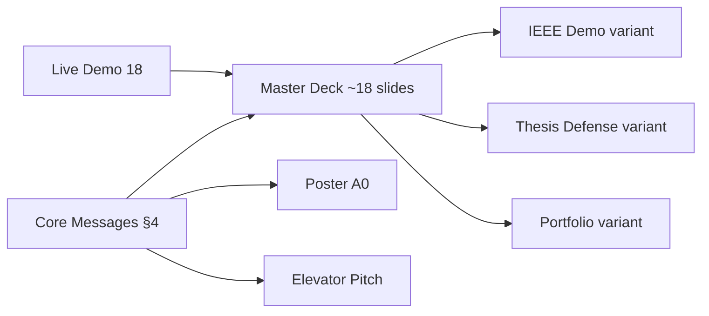
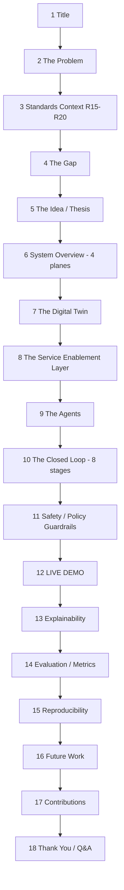
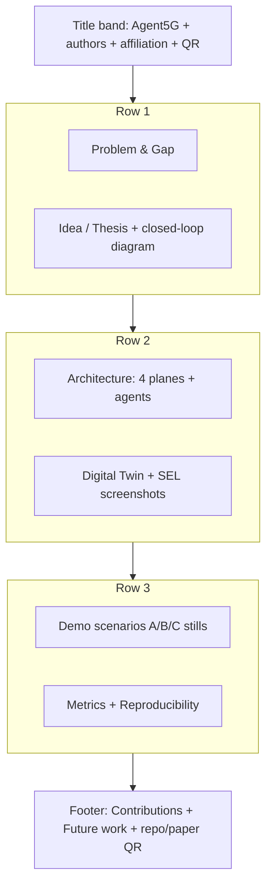

# 19 — Presentation (Deck, Poster, and Pitch)

> **Document ID:** `19-presentation.md`
> **Project:** Agent5G — Agentic AI Service Enablement Platform for 5G Advanced Release 20
> **Document Type:** Presentation specification (slide deck, poster, elevator pitch, and speaker guidance for communicating the project)
> **Status:** Authoritative for the deck structure, per-slide content and speaker notes, audience-tailored variants (IEEE demo, thesis defense, portfolio), the poster layout, and the elevator pitch. Reuses the demo flows from `18-demo.md` and the research framing from `02-research-background.md`.
> **Depends on:** `01-system.md` (thesis, architecture), `02-research-background.md` (gap, RQs, metrics), `03-architecture.md` (diagrams), `05-agents.md`/`13-workflow-engine.md` (agentic loop), `18-demo.md` (live demo), `20-future-work.md` (roadmap).
> **Audience:** The presenter preparing a talk, poster, or pitch; anyone communicating Agent5G to a technical audience.

---

## Table of Contents

1. [Purpose](#1-purpose)
2. [Overview](#2-overview)
3. [Presentation Principles](#3-presentation-principles)
4. [Core Messages (The Three Things to Remember)](#4-core-messages-the-three-things-to-remember)
5. [The Master Slide Deck](#5-the-master-slide-deck)
6. [Per-Slide Content and Speaker Notes](#6-per-slide-content-and-speaker-notes)
7. [Audience-Tailored Variants](#7-audience-tailored-variants)
8. [The Elevator Pitch](#8-the-elevator-pitch)
9. [The Poster](#9-the-poster)
10. [Visual Assets and Diagram Reuse](#10-visual-assets-and-diagram-reuse)
11. [Handling the Live Demo Within a Talk](#11-handling-the-live-demo-within-a-talk)
12. [Anticipated Questions (Presentation-Level)](#12-anticipated-questions-presentation-level)
13. [Delivery Guidance](#13-delivery-guidance)
14. [Interfaces and Contracts](#14-interfaces-and-contracts)
15. [Folder References](#15-folder-references)
16. [Design Decisions](#16-design-decisions)
17. [Future Extensibility](#17-future-extensibility)
18. [Engineering / Implementation / Research Notes](#18-engineering--implementation--research-notes)
19. [Kiro Build Guidance](#19-kiro-build-guidance)
20. [Acceptance Criteria](#20-acceptance-criteria)

---

## 1. Purpose

This document specifies **how to present Agent5G** to a technical audience — the slide deck, the poster, the elevator pitch, and the speaker guidance — so the project's contribution lands clearly and credibly whether the slot is a 5-minute pitch, a 15-minute IEEE conference demo, or a 45-minute thesis defense. It reuses the live demo flows (`18`) and the research framing (`02`) rather than reinventing them; its job is to *communicate*, structuring the same material into a compelling, honest narrative.

The purpose is threefold:
1. **Communicate the thesis** — an agentic AI layer above a Service Enablement Layer for AI-native 5G — in a way a mixed audience (telecom + AI + software) understands.
2. **Establish credibility** — architecturally faithful, reproducible, explainable, and extensible; not a black box or a toy.
3. **Be reusable** — one master deck with variants and time-boxes, so the presenter can adapt to any slot without rebuilding.

This document does not create the research content (that's `02`) or the demo (that's `18`); it packages them for an audience.

---

## 2. Overview

The presentation assets are: a **master slide deck** (~18 slides, from which variants are cut), a **poster** (single-page A0/A1 for conference sessions), an **elevator pitch** (30–60s), and **speaker notes** for each. They share the core messages (§4) and reuse the platform's own diagrams and live demo.



*Figure 2.1 — One core message set feeds the deck (and its variants), the poster, and the pitch; the live demo anchors the deck.*

The through-line, always: **the network produces intelligence and enablement primitives, but doesn't decide or act; Agent5G's agentic layer closes that loop — and does so faithfully, safely, explainably, and reproducibly.**

---

## 3. Presentation Principles

- **PRP1 — One idea per slide.** A slide makes a single point with a single visual; no walls of text.
- **PRP2 — Show the system, not just claims.** The live demo (or a recording) is the centerpiece; slides frame and interpret it.
- **PRP3 — Bridge two audiences.** Explain telecom terms for AI folks and AI terms for telecom folks; assume neither.
- **PRP4 — Lead with the problem and the "aha".** Open with the intent gap and the autonomy moment; details later.
- **PRP5 — Be honest about scope.** State clearly it's a simulation/research prototype — this *strengthens* credibility (faithful + reproducible + extensible).
- **PRP6 — Every claim is backed.** Tie claims to demo evidence or metrics (`02` §16), never hand-waving.
- **PRP7 — Reusable and time-boxed.** Build once; cut to fit (§7). Slides are self-contained enough to drop.
- **PRP8 — Visual consistency.** Reuse the platform's own diagrams and dark UI screenshots for a coherent look.

---

## 4. Core Messages (The Three Things to Remember)

If the audience remembers nothing else:

1. **The gap.** 5G-Advanced/Release-20 standardizes producing intelligence (NWDAF), plumbing data (DCF), and enabling AI/ML (AIMLE) — but *not* the autonomous decision-maker that turns operator intent into correct, safe, cross-function action.
2. **The idea.** Put a **multi-agent AI layer** above a **Service Enablement Layer**: agents Observe → Reason → Plan → Execute → Validate → (Retry/Rollback) → Complete, acting *only* through discoverable services, guarded by policy.
3. **The proof.** A working, **local, deterministic, explainable** research prototype with a faithful 5G Digital Twin — demonstrated live, measured with real metrics, and extensible to Open5GS/OAI.

Every slide serves one of these three.

---

## 5. The Master Slide Deck

~18 slides, grouped. Variants (§7) cut from this master.



*Figure 5.1 — Master deck flow: context → idea → architecture → demo → evidence → close.*

The demo (slide 12) sits at the center of gravity; everything before frames it, everything after interprets it.

---

## 6. Per-Slide Content and Speaker Notes

Each slide: headline (the one point), visual, and a one-line speaker cue. Keep on-slide text minimal (PRP1).

| # | Headline (one point) | Visual | Speaker cue |
|---|----------------------|--------|-------------|
| 1 | **Agent5G — Agentic AI for AI-Native 5G** | title + subtitle + your name/affiliation | "Autonomous operations above a 5G service layer." |
| 2 | Networks are drowning in intelligence they don't act on | operator staring at dashboards / intent vs. service-call cartoon | "Operators think in intents; the network speaks in service calls." |
| 3 | Intelligence entered 5G release by release | the R15→R20 timeline (`02` Fig 3.1) | "NWDAF, then DCF, then AIMLE — inputs to decisions." |
| 4 | **The gap: who decides and acts?** | the standardized-vs-gap diagram (`02` Fig 2.1) | "Standards produce inputs; they don't specify the actor." |
| 5 | **Thesis: an agentic layer above the SEL** | the closed-loop with an agent interpreter (`02` Fig 10.1) | "Intent → plan → act via services → validate → adapt." |
| 6 | Four planes | the 4-plane overview (`01` Fig 2.1 / `03` Fig 2.1) | "Experience, Intelligence, Enablement, Substrate." |
| 7 | A faithful 5G Digital Twin | topology screenshot / `07` SBA planes | "Simulated, deterministic, architecturally faithful to 3GPP." |
| 8 | Capabilities as discoverable services | Service Registry screenshot with `spec_ref` | "The bridge: agents act only through these." |
| 9 | Seven specialized agents | the agent-around-lifecycle diagram (`05` Fig 2.1) | "Separation of concerns — for reliability and explainability." |
| 10 | The closed loop | the 8-stage lifecycle (`13` Fig 2.1) | "Observe→…→Complete, with Retry and Rollback." |
| 11 | **Safety is enforced in code, not the model** | policy-gate diagram (`08` Fig 12.1) | "The model proposes; the SEL disposes." |
| 12 | **LIVE DEMO** | switch to the app (or recording) | run Demo B (autonomy) first (`18`). |
| 13 | Every action is explainable | Agent Console reasoning trace + knowledge graph | "Reasoning, tool calls, validations, a knowledge graph." |
| 14 | It works — measurably | metrics chart (success/recovery/policy compliance) | "Real numbers from the database, not vibes." |
| 15 | **Reproducible by construction** | seed + replay diagram | "Deterministic twin + replay LLM — same run every time." |
| 16 | A path to reality | future-work seams (Open5GS/OAI/MCP/K8s) | "Swappable behind the same service contracts." |
| 17 | **Contributions** | 3 bullets = the three core messages (§4) | restate the gap, the idea, the proof. |
| 18 | Thank you / Q&A | contact + repo/paper QR | invite questions; have backups ready. |

**Speaker-note discipline:** each note is ≤2 sentences; the slide is a prompt, the talk carries the detail (PRP1).

---

## 7. Audience-Tailored Variants

One master deck, three cuts (PRP7):

**V1 — IEEE Conference Demo (10–15 min, demo-forward).**
- Slides: 1, 2, 4, 5, 6, **12 (long demo)**, 13, 14, 17, 18. (Cut deep architecture 7–11 to a single "how it works" slide.)
- Emphasis: the live demo (B then A) and metrics. Fast setup, big payoff.

**V2 — Thesis Defense (30–45 min, depth + rigor).**
- Slides: all 18, expanded. Add: detailed RQs/hypotheses (`02` §15), evaluation methodology (`02` §16), threats to validity, and per-agent detail (`05`).
- Emphasis: research gap, methodology, reproducibility, honest limitations, and future work. Expect deep Q&A.

**V3 — Portfolio / Recruiter (5–8 min, impact + craft).**
- Slides: 1, 2, 5, 6, **12 (short demo — Demo B)**, 13, 16, 17. 
- Emphasis: the engineering (Clean Architecture, multi-agent, full-stack, Windows-local), the autonomy demo, and extensibility. Less standards depth.

**V0 — Elevator (30–60s, no slides).** §8.

Each variant is a slide-visibility preset over the same file (no separate decks to maintain).

---

## 8. The Elevator Pitch

**30-second version:**
> "5G networks now generate huge amounts of analytics and AI/ML enablement, but the standards stop short of an autonomous decision-maker — something that turns an operator's intent into correct, safe action across network functions. Agent5G is a research prototype that puts a multi-agent AI layer above a service-enablement layer: you type 'detect congestion in Delhi and mitigate it,' and the agents observe the network, plan a sequence of standardized service calls, execute them, validate the result, and recover if something fails — all guarded by safety policies and fully explainable. It runs locally on a faithful 5G digital twin, deterministically, so it's reproducible for research."

**10-second version:**
> "Agent5G is an agentic AI layer that autonomously operates a simulated 5G-Advanced network from natural-language intent — reasoning, acting through standardized services, and recovering from failures, all explainably and reproducibly."

Practice both; the 10s is for hallway/booth, the 30s for a formal intro.

---

## 9. The Poster

Single A0/A1 poster for conference poster sessions. Layout (top-to-bottom, left-to-right reading flow):



*Figure 9.1 — Poster layout (Z-reading order, headline messages large).*

Poster rules: **large headline messages** (readable from 2 m); the closed-loop diagram and one dashboard screenshot as anchors; minimal body text (the poster prompts a conversation, it isn't a paper); a QR to the repo/paper; the three core messages (§4) as the takeaway band.

---

## 10. Visual Assets and Diagram Reuse

Reuse the platform's own diagrams and UI for a coherent, credible look (PRP8):

- **Diagrams (from docs, rendered Mermaid → SVG/PNG):** 4-plane overview (`01`/`03`), R15→R20 timeline (`02`), the gap diagram (`02`), the 8-stage lifecycle (`13`), the agent roster (`05`), the policy gate (`08`).
- **Screenshots (dark theme, high-res, from demo mode):** Dashboard, Topology (healthy + a failed NRF), Agent Console reasoning trace, Knowledge Graph, Analytics metrics.
- **The live demo** as the primary "visual" (slide 12), with the fallback recording (`18` §13) as backup.
- **Consistency:** one color palette (the UI's semantic colors), one font, dark background for screenshots on dark slides; label every diagram; cite 3GPP specs where relevant (`02` §20).

Store rendered assets in `docs/presentation-assets/`.

---

## 11. Handling the Live Demo Within a Talk

Slide 12 is a live demo; de-risk it (reuse `18`):

- **Pre-load:** app already running in demo mode, baseline reset, before you present (`18` §4). Don't set up live.
- **Order within the demo:** lead with **Demo B** (autonomy — the "aha"), then **Demo A** if time (intent→action), mention C/D briefly. In a short slot, B alone.
- **Narrate to the messages:** as the autonomous workflow appears, say "no one typed this — the network degraded and the system acted." Tie every visible thing to §4.
- **Fallback:** if anything wobbles, switch to the recording (background tab) and keep talking — never debug live (`18` §13).
- **Return to slides** cleanly (slide 13 explainability) so the demo is framed, not dangling.

Budget the demo generously (it's the centerpiece) but keep a hard stop so Q&A survives.

---

## 12. Anticipated Questions (Presentation-Level)

Beyond the demo Q&A (`18` §11), presentation/research-panel questions:

- **"What's the actual contribution vs. existing NWDAF automation?"** The autonomous, multi-agent decision/action layer above enablement — the actor the standards don't specify — with explainability and policy safety. (Point to the gap slide.)
- **"How do you evaluate it?"** Deterministic experiments (EXP-A..D) with metrics computed from the DB: task success, plan correctness, recovery rate, policy compliance, steps-to-completion, cost (`02` §16, `12` §8).
- **"What are the threats to validity / limitations?"** It's a simulation (no protocol/radio fidelity); LLM behavior is bounded by replay for reproducibility; results are on defined scenarios. We're explicit about this — it's a testbed, faithful and extensible.
- **"Why should a telecom audience trust an LLM here?"** Because safety is enforced by deterministic policy in the SEL (not the model), every action is auditable, and the model can only call registered services.
- **"Could this run on a real core?"** Yes by design — services are SBA-faithful with `spec_ref`; the twin can be swapped for Open5GS/OAI behind the same contracts (`20`).
- **"Is the multi-agent design necessary?"** It improves reliability and explainability via separation of concerns; a single-agent baseline is part of the evaluation.

---

## 13. Delivery Guidance

- **Rehearse** the deck + demo end-to-end at least twice; time each variant.
- **Open strong:** problem + the autonomy "aha" in the first 2 minutes (PRP4).
- **Pace:** ~1 minute per content slide; give the demo room; leave ≥20% for Q&A.
- **Bridge terms:** define NWDAF/SEL for AI folks, LangGraph/agents for telecom folks (PRP3), in one line each.
- **Body/voice:** face the audience, not the screen; pause after the autonomy moment to let it land.
- **Honesty:** when asked about limits, answer directly — it builds trust (PRP5).
- **Backups ready:** fallback recording, offline mode, laptop charged, adapters, deck exported to PDF (font-safe).
- **Accessibility of the talk:** high-contrast slides, large fonts, describe visuals aloud for anyone who can't see them well.

---

## 14. Interfaces and Contracts

- **Reuses:** research framing (`02`), architecture diagrams (`01`/`03`), agentic loop (`05`/`13`), live demo (`18`), roadmap (`20`).
- **Assets:** rendered diagrams + screenshots in `docs/presentation-assets/`; the fallback demo recording in `docs/demo-assets/` (`18`).
- **Variants:** slide-visibility presets over one master deck (§7).
- **Facts/claims:** every metric claim traces to `12` §8 queries / `02` §16 methodology (PRP6).

---

## 15. Folder References

```text
docs/19-presentation.md
docs/presentation-assets/
├── deck/ (master.pptx or .key or slides.md + rendered)
├── diagrams/ (svg/png rendered from docs' Mermaid)
├── screenshots/ (dark-theme UI, demo mode)
└── poster/ (poster.pdf, A0/A1)
docs/demo-assets/            # fallback recording (18)
```

This document owns *presentation packaging*; content owned by `01`/`02`/`03`/`05`/`13`; demo by `18`.

---

## 16. Design Decisions

- **PD-1 — One master deck + variants.** Rationale: build once, adapt by cutting (PRP7). Trade-off: must keep master current; far less work than separate decks.
- **PD-2 — Demo at the center.** Rationale: showing beats telling; it's the strongest evidence (PRP2). Trade-off: live risk — mitigated by the fallback recording.
- **PD-3 — Lead with autonomy (Demo B).** Rationale: the most memorable, thesis-proving moment (PRP4). Trade-off: presents effect before full mechanism; slides 6–11 backfill.
- **PD-4 — Reuse the platform's own diagrams/UI.** Rationale: coherence + credibility (PRP8). Trade-off: render pipeline for Mermaid→image; small.
- **PD-5 — Honest scope framing.** Rationale: credibility with a research audience (PRP5). Trade-off: none — being explicit is a strength.
- **PD-6 — Three core messages as the spine.** Rationale: audiences remember three things; every slide serves one. Trade-off: ruthless cutting of nice-to-haves.

---

## 17. Future Extensibility

- **Recorded talk / screencast** version for async sharing (portfolio, submissions).
- **Interactive web deck** (e.g., reveal.js) embedding the live app in an iframe for self-serve viewing.
- **Auto-generated screenshots** from the e2e run so slide visuals never go stale (`16` §11).
- **Localized decks** for non-English venues (reuse the localization seam, `11`/`20`).
- **Paper-figure sync:** generate deck metric charts from the same `/analytics/export` outputs as the paper so numbers always match (`09`/`12`).
- **Per-venue variants** (industry vs. academic) as additional visibility presets.

---

## 18. Engineering / Implementation / Research Notes

**Engineering.**
- Render Mermaid diagrams from the docs to SVG/PNG into `presentation-assets/diagrams/` so the deck and docs stay visually identical.
- Capture screenshots from **demo mode** at a fixed seed so visuals match the live demo and the paper.
- Export the deck to PDF (embedded fonts) as a projector-safe fallback.

**Implementation.**
- Keep the master deck source in a diffable form where possible (e.g., a `slides.md` for a Markdown deck, or a tracked `.pptx`).
- A `scripts\gen-assets.ps1` could render diagrams + capture screenshots via the e2e harness for repeatable, current visuals.

**Research.**
- The metrics slide (14) and the reproducibility slide (15) are the credibility core for a research audience — draw numbers from `12` §8 and state seeds/fixtures.
- Prepare a "threats to validity" slide for the defense variant (simulation scope, LLM bounding, scenario coverage) — anticipating it earns trust (`02`).
- Align every quantitative claim with the exact experiment run `(seed, scenario, config, prompt_version)` so a reviewer can reproduce it.

---

## 19. Kiro Build Guidance

### 19.1 Implementation Order
1. Render all reused diagrams (Mermaid → SVG/PNG) into `presentation-assets/diagrams/`.
2. Capture demo-mode screenshots (fixed seed) into `presentation-assets/screenshots/`.
3. Build the master deck (18 slides, §6) with minimal on-slide text + speaker notes.
4. Define the three variant visibility presets (§7).
5. Lay out the poster (§9); write the elevator pitch (§8).
6. Export deck to PDF; verify the fallback demo recording is current.

### 19.2 Coding Rules (assets)
- One idea + one visual per slide; speaker notes ≤2 sentences (PRP1).
- Reuse the platform's diagrams/UI and one consistent palette/font (PRP8).
- Every metric/claim traces to a `12` §8 query or `02` §16 method (PRP6).
- Screenshots and charts generated from demo mode at a fixed seed (match live/paper).

### 19.3 Naming Convention
- Assets: `diagrams/{name}.svg`, `screenshots/{page}.png`, `deck/master.*`, `poster/poster.pdf`; variants tagged `ieee|defense|portfolio`.

### 19.4 Folder Ownership
- `docs/presentation-assets/*` owned here; demo recording in `docs/demo-assets/` (`18`); source content in `01`/`02`/`03`/`05`/`13`.

### 19.5 Prompt Suggestions
- "Render the Mermaid diagrams from docs 01/02/03/05/08/13 to SVG/PNG into `docs/presentation-assets/diagrams/`."
- "Draft the 18-slide master deck per `19-presentation.md` §6 with minimal text and speaker notes, plus the three variant presets."
- "Create the A0 poster layout per §9 and the 30s/10s elevator pitches."

### 19.6 Acceptance Criteria
- The master deck exists with all 18 slides + speaker notes; the three variants are defined as presets.
- The poster and both elevator pitches exist.
- All visuals are reused from the platform (diagrams/screenshots), consistent, and traceable to fixed-seed demo mode.

---

## 20. Acceptance Criteria

This document is **complete and correct** when:

- [ ] **AC-1.** The three core messages (gap, idea, proof) are stated and used as the deck's spine.
- [ ] **AC-2.** A master ~18-slide deck structure is specified with per-slide headline, visual, and speaker cue.
- [ ] **AC-3.** Three audience-tailored variants (IEEE demo, thesis defense, portfolio) are defined as cuts of the master, with a 30/10-second elevator pitch.
- [ ] **AC-4.** A poster layout (single-page, Z-reading, headline messages) is specified.
- [ ] **AC-5.** Visual-asset reuse (platform diagrams + demo-mode screenshots) and consistency rules are specified.
- [ ] **AC-6.** Guidance for running the live demo within a talk (lead with autonomy, fallback) is specified.
- [ ] **AC-7.** Presentation-level anticipated questions (contribution, evaluation, limitations, trust, real-core, multi-agent) are addressed.
- [ ] **AC-8.** Delivery guidance (rehearsal, pacing, bridging audiences, honesty, backups, accessibility) is provided.
- [ ] **AC-9.** Interfaces, folder references, design decisions, extensibility, and notes are present.
- [ ] **AC-10.** Kiro build guidance (render diagrams, capture screenshots, build deck/variants/poster/pitch) is present.
- [ ] **AC-11.** Every quantitative claim is traceable to the metrics methodology (`02`/`12`).
- [ ] **AC-12.** The presentation reuses the demo (`18`) and research framing (`02`) rather than duplicating them.

---

**NEXT FILE**
