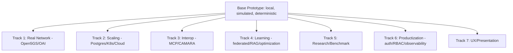
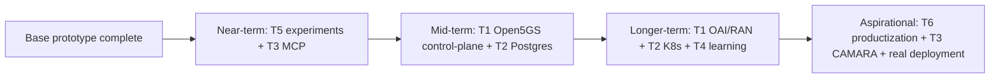

# 20 — Future Work (Roadmap and Extension Seams)

> **Document ID:** `20-future-work.md`
> **Project:** Agent5G — Agentic AI Service Enablement Platform for 5G Advanced Release 20
> **Document Type:** Roadmap and extensibility specification (where the platform goes next and the seams that make it possible)
> **Status:** Authoritative for the forward roadmap — real-network integration (Open5GS/OAI), scaling (Kubernetes/Postgres), interoperability (MCP/CAMARA), research extensions, and productization concerns (auth/RBAC). Consolidates the "Future Extensibility" seams from every prior document into a single, prioritized plan.
> **Depends on:** all preceding documents (`01`–`19`) — this consolidates and sequences their extensibility sections.
> **Audience:** Researchers planning follow-on work, engineers extending the platform, reviewers assessing the project's trajectory and ambition.

---

## Table of Contents

1. [Purpose](#1-purpose)
2. [Overview](#2-overview)
3. [Guiding Principles for Evolution](#3-guiding-principles-for-evolution)
4. [The Extension Seams (Consolidated)](#4-the-extension-seams-consolidated)
5. [Roadmap Phases and Prioritization](#5-roadmap-phases-and-prioritization)
6. [Track 1 — Real Network Integration (Open5GS / OAI)](#6-track-1--real-network-integration-open5gs--oai)
7. [Track 2 — Scaling and Infrastructure (Postgres / Kubernetes / Cloud)](#7-track-2--scaling-and-infrastructure-postgres--kubernetes--cloud)
8. [Track 3 — Interoperability (MCP / CAMARA Network APIs)](#8-track-3--interoperability-mcp--camara-network-apis)
9. [Track 4 — Intelligence and Learning](#9-track-4--intelligence-and-learning)
10. [Track 5 — Research Extensions and Benchmark](#10-track-5--research-extensions-and-benchmark)
11. [Track 6 — Productization (Auth, RBAC, Multi-Tenant, Observability)](#11-track-6--productization-auth-rbac-multi-tenant-observability)
12. [Track 7 — UX and Presentation](#12-track-7--ux-and-presentation)
13. [Risks and Mitigations](#13-risks-and-mitigations)
14. [Success Criteria per Track](#14-success-criteria-per-track)
15. [Interfaces and Contracts](#15-interfaces-and-contracts)
16. [Folder References](#16-folder-references)
17. [Design Decisions](#17-design-decisions)
18. [Engineering / Implementation / Research Notes](#18-engineering--implementation--research-notes)
19. [Example Scenarios (Future Flows)](#19-example-scenarios-future-flows)
20. [Kiro Build Guidance](#20-kiro-build-guidance)
21. [Acceptance Criteria](#21-acceptance-criteria)

---

## 1. Purpose

This document defines **where Agent5G goes after the base prototype** and — critically — **why each extension is feasible without a redesign**. Throughout `01`–`19`, the architecture was deliberately built with stable *seams*: ports and adapters, SBA-faithful service contracts, a pluggable LLM boundary, and a repository-abstracted datastore. This document consolidates every "Future Extensibility" section into one prioritized roadmap, so a follow-on researcher or engineer knows exactly which seam to open, in what order, and what "done" looks like for each extension.

The through-line: **the base prototype is a faithful, local simulation; the roadmap progressively replaces simulation with reality (Open5GS/OAI), scales the infrastructure (Postgres/Kubernetes), opens interoperability (MCP/CAMARA), deepens the intelligence (learning/federated analytics), and hardens for real use (auth/RBAC)** — each step swapping an adapter behind an unchanged contract, never rewriting the core.

This document is a plan, not an implementation; it points at the seams defined elsewhere and sequences the work.

---

## 2. Overview

Seven tracks, layered from "closest to reality" to "broadest ambition":



*Figure 2.1 — Seven parallel-capable tracks branching from the base prototype; most are independent thanks to the seams.*

Because the tracks attach at different seams, several can proceed in parallel (e.g., Track 5 research needs nothing new; Track 1 and Track 2 are largely independent). The base architecture's principles (Clean Architecture, ports/adapters, SBA-faithful services) are what make this parallelism safe.

---

## 3. Guiding Principles for Evolution

- **EP1 — Swap adapters, not contracts.** Every extension replaces an infrastructure adapter or a substrate behind an existing port/service contract; domain and application layers stay intact (`03` ADR-6).
- **EP2 — Fidelity is the migration checklist.** The `spec_ref`/`approximates_operation` mapping (`07` §8) tells exactly what a real-NF adapter must satisfy.
- **EP3 — Preserve reproducibility where it matters.** Research tracks keep determinism (seed + replay) even as reality is added, by keeping a "simulated" mode alongside "live" (`06`/`16`).
- **EP4 — Security before exposure.** Any track that leaves `localhost` (Track 2/6) must land auth/RBAC/TLS first (`09` §6, `17` §13). Non-negotiable.
- **EP5 — Measure the delta.** Each extension is evaluated against the base with the existing metrics (`02` §16, `12` §8) so its benefit is quantified, not asserted.
- **EP6 — Incremental and reversible.** Extensions are additive behind flags/config; a track can be turned off to fall back to the base behavior.

---

## 4. The Extension Seams (Consolidated)

Every seam already defined in the codebase/docs, and the track it enables:

| Seam (where) | Defined in | Enables |
|--------------|-----------|---------|
| `TwinRepository` / `TwinService.apply_command` | `06` §17, `03` §22 | swap simulated twin → Open5GS/OAI (T1) |
| NF `handle`/`advance` + `NFProfile` | `07` §9 | per-NF real adapters (T1) |
| `Repository`/`EventBus`/`LLMClient` ports | `03` §7, `10` §7 | Postgres, Redis bus, other models (T2/T4) |
| Single-writer → server DB | `10` §8.2, `12` §14 | Postgres/TimescaleDB (T2) |
| Layer boundaries as service seams | `03` §22 | decompose into K8s services (T2) |
| Tool Adapter (JSON-schema tools) | `08` §9 | publish as MCP servers (T3) |
| NEF exposure services | `07` §6.10, `08` §10.8 | CAMARA northbound APIs (T3) |
| `LLMClient` port + prompt registry | `10` §8.4, `14` §11 | RAG planning, fine-tuned/other models (T4) |
| NWDAF analytics models (metadata) | `06` §12, `07` §6.9 | federated/real ML (T4) |
| `config` toggles + metrics tables | `12` DP7, `13` §4 | experiment framework/benchmark (T5) |
| `users`/roles table + Delivery middleware | `12` §6.1, `09` §6/§15 | auth/RBAC/multi-tenant (T6) |
| Panel-based dashboards + i18n copy | `04` §15, `11` §21 | customizable UX, localization (T7) |

The existence of this table is the project's core extensibility claim: **nothing on the roadmap requires touching the domain.**

---

## 5. Roadmap Phases and Prioritization

A suggested sequence (research value + feasibility weighted):



*Figure 5.1 — Prioritized roadmap. Near-term items need no new infrastructure; later items add reality/scale.*

**Near-term (highest value, lowest cost):** run the experiments (T5, needs nothing new) to produce the paper; publish the SEL as MCP (T3) for interoperability demos. **Mid-term:** integrate Open5GS control-plane NFs (T1) and migrate to Postgres (T2). **Longer-term:** OAI RAN (T1), Kubernetes decomposition (T2), and real/federated learning (T4). **Aspirational:** full productization (T6) and CAMARA northbound (T3) for a deployable system.

Prioritization rule: do the research (T5) first — it's the reason the project exists and needs zero new engineering; treat reality/scale as follow-ons that strengthen external validity.

---

## 6. Track 1 — Real Network Integration (Open5GS / OAI)

**Goal:** replace the simulated substrate with a real (or emulated) 5G core/RAN behind the same service contracts, moving from *simulated fidelity* to *emulated fidelity* and strengthening external validity.

**Open5GS (control + user plane).**
- Implement `TwinService`/`TwinRepository` and per-NF `handle` as **adapters that talk to Open5GS NFs** (register/discover via a real NRF, session ops via SMF/UPF, policy via PCF, analytics via a real/added NWDAF).
- The `07` §8 mapping table is the conformance checklist per NF (EP2): each `approximates_operation` becomes a real SBA call.
- Keep a **`substrate=simulated|open5gs` config flag** so the platform can run either (EP3/EP6); the UI gains a "live vs simulated" toggle (`04`/`07` §12).
- Note: Open5GS typically runs on Linux — this specific track relaxes the "no Linux" base constraint and would run outside the base Windows-only scope (e.g., a lab server or WSL2), documented explicitly as a deliberate scope change.

**OAI (RAN/UE).**
- Feed gNB/UE behavior from OpenAirInterface telemetry instead of the statistical models (`06` §9), replacing the twin's RAN models with real radio metrics.
- Enables realistic congestion/mobility rather than modeled — a much stronger Demo B.

**Deliverable:** an agentic workflow that observes a *real* Open5GS congestion analytic and applies a *real* PCF/UPF mitigation, validated against real NF state — the same agents, unchanged.

---

## 7. Track 2 — Scaling and Infrastructure (Postgres / Kubernetes / Cloud)

**Goal:** remove single-machine/SQLite limits for larger topologies, longer studies, and concurrent users.

**Postgres / TimescaleDB.**
- Swap `Database` + repositories behind the existing ports (`10` §8.1, `12` §14); drop the single-writer constraint (Postgres handles concurrency). Move `kpis`/`events` to TimescaleDB hypertables for large-scale time-series analytics.
- Adopt Alembic migrations (`12` §10) once the schema is stable.

**Kubernetes.**
- Decompose the monolithic backend along the layer seams (`03` §22) into deployable services (twin service, agent runtime, API gateway, event bus), containerized and orchestrated. Replace the in-process bus with Redis Streams/Kafka for cross-process durability (`10` §8.3).
- This relaxes the base "no Docker/K8s" constraint — a deliberate, documented scope change for a hosted deployment.

**Cloud — free tier only (CST-1 stays in force).**
- If ever hosted, use **free tiers exclusively**: a free-tier Postgres (e.g., a free managed Postgres/Neon-style free plan), free object storage or a Git-tracked fixtures folder, and a free CI tier running the offline gate (`16` §14). Requires Track 6 (auth) first (EP4).
- **No paid plans.** Any capability that cannot be obtained on a free tier stays out of scope; the base **local, $0** mode is always the fallback. LLM in the cloud remains **free-tier/replay** (never a paid tier).

**Deliverable:** the same platform running as containerized services against Postgres, supporting larger twins and multiple users — with the base local mode still available.

---

## 8. Track 3 — Interoperability (MCP / CAMARA Network APIs)

**Goal:** let external agents/apps use Agent5G's capabilities, and let Agent5G's agents use external tools.

**MCP (Model Context Protocol).**
- Publish the SEL **Tool Adapter** (`08` §9) as **MCP server tools** — the tools are already name + JSON-schema + handler, so this is a wrapper, not a redesign. External MCP clients (other agents, IDEs) can then invoke Agent5G network services.
- Conversely, let Agent5G agents consume **external MCP tools** alongside SEL tools (`05` §15) — e.g., a documentation or ticketing MCP server as a workflow step (`13` §18).

**CAMARA Network APIs.**
- Promote the NEF exposure services (`07` §6.10, `08` §10.8) into a real **CAMARA-style northbound gateway** (QoS-on-Demand, Device Status, etc.), so external applications drive the network through standardized developer APIs — with the agentic layer fulfilling requests internally.

**Deliverable:** an external MCP client triggering an Agent5G workflow, and an external app requesting QoS via a CAMARA endpoint that the agents satisfy.

---

## 9. Track 4 — Intelligence and Learning

**Goal:** deepen the AI beyond LLM planning over static analytics.

- **Retrieval-augmented planning.** Feed a library of successful past plans (from episodic memory, `05` §6) into the Planner prompt for few-shot-from-memory (`14` §17), improving plan quality on recurring intents (measurable via steps-to-completion, H5).
- **Prompt/agent optimization loop.** Auto-A/B prompt versions (`14` §11) and select by metric (`12` §8) — a self-improving prompt pipeline.
- **Model-agnostic + fine-tuned reasoning.** Because agents route through the `LLMClient` port, swap or fine-tune models per role; compare against the base (EP5).
- **Federated / real analytics.** Extend the NWDAF model layer (`06` §12) from metadata to real (or federated) ML — train congestion/QoS models on twin/real data, study privacy-preserving agentic operations.
- **Learned policies.** Explore learning-based guardrail suggestions (still enforced deterministically in the SEL, `08`) — the model may *propose* policies, humans/tests ratify them.

**Deliverable:** measurable improvement in plan correctness / steps-to-completion from RAG planning and/or a fine-tuned Planner, quantified against the base.

---

## 10. Track 5 — Research Extensions and Benchmark

**Goal:** maximize the research output — the reason the project exists (do this first, EP5, §5).

- **Run EXP-A..D** (`02` §21) end-to-end and produce the paper figures from `/analytics/export` (`09`/`12` §8): success rate, plan correctness, recovery rate, policy compliance, cost, memory speedup. Needs **zero new engineering** — just runs.
- **Ablations:** single-agent vs. multi-agent; memory on/off; recovery on/off; policy on/off; prompt-version A/B — all via `config` toggles (`13` §4).
- **Threats to validity** write-up: simulation scope, LLM bounding via replay, scenario coverage (`19` §12).
- **Agentic-network-ops benchmark.** Package the scenarios + metrics + seeds + fixtures as a **reusable benchmark suite** (a standalone contribution) so others can evaluate agentic network operations reproducibly.
- **New scenarios:** energy optimization, slice-aware QoS (add S-NSSAI, `07` §12), multi-region cascades, adversarial/failure-storm scenarios (`06` §16).

**Deliverable:** a submitted paper/thesis with reproducible figures, plus a published benchmark others can run.

---

## 11. Track 6 — Productization (Auth, RBAC, Multi-Tenant, Observability)

**Goal:** make the platform safe and operable beyond a single local user (prerequisite for Track 2 cloud/K8s exposure, EP4).

- **Authentication + authorization.** Bearer/API-key (or OIDC) middleware in the Delivery layer gating all `action`/`control` endpoints; the `users`/roles model (`12` §6.1) with `admin`/`researcher`/`viewer` scopes (`09` §15). **This is the mandatory prerequisite before any non-local exposure** (`17` §13).
- **Multi-tenant.** Scope workflows/twins/memory by tenant; isolate data per tenant in the schema.
- **TLS + rate limiting.** Terminate HTTPS; formalize PLC-3-style limits at the HTTP layer.
- **Secrets management.** Move `LLM__API_KEY` from flat `.env` to a real secret store.
- **Observability.** Structured logs → a real log store; metrics/traces (OpenTelemetry) for the services; dashboards for operating the platform itself (distinct from the network dashboards).
- **Frontend auth UX.** The shell's reserved account menu (`04` §15, `11` §21) becomes login + role-gated views/actions.

**Deliverable:** an authenticated, multi-user, TLS-fronted deployment — the gate that unlocks safe hosted use.

---

## 12. Track 7 — UX and Presentation

**Goal:** broaden usability and communication.

- **Customizable dashboards** (panel-based grids, `04` §15) users can arrange.
- **Guided tour / self-serve demo mode** (`18` §18) for portfolio viewers.
- **Interactive intent mode:** let users type arbitrary intents live, with policy as the safety net (`13` §11).
- **Localization (i18n):** externalized copy → multi-language UI (`11` §21).
- **Themes:** high-contrast/colorblind-safe palettes (`04` §15).
- **Auto-generated demo recording + slide visuals** from the e2e run (`16` §11, `19` §17) so demo/deck assets never go stale.
- **Geospatial topology:** real coordinates/maps for a geographic Topology view (`06` §20).

**Deliverable:** a more accessible, self-explanatory platform and always-current presentation assets.

---

## 13. Risks and Mitigations

| Risk | Track | Mitigation |
|------|-------|-----------|
| Open5GS fidelity gaps break agent assumptions | T1 | the `07` §8 mapping is the contract; keep simulated mode as fallback (EP3/EP6); test parity |
| Losing determinism when reality is added | T1/T4 | keep a `simulated` mode + replay for research runs; separate live from reproducible experiments |
| Scope creep breaking the base constraints | T1/T2 | document any constraint relaxation (Linux/Docker/K8s) as an explicit, isolated scope change; base stays Windows-local |
| Exposing unauthenticated endpoints | T2/T6 | EP4 — auth/RBAC/TLS is a hard prerequisite before any exposure |
| LLM cost/variance (must stay $0) | T4 | replay default for tests/demos; cache fixtures; free-tier providers or local Ollama; measure cost (`02` §16); never a paid tier (CST-1) |
| Benchmark not adopted | T5 | keep it simple, documented, seed/fixture-shippable; align with a venue |
| Migration bugs (SQLite→Postgres) | T2 | repository abstraction + Alembic + contract tests (`16`) guard the swap |
| Security regressions in productization | T6 | the safety-invariant tests (`16` §12) extend to auth; policy stays deterministic |

The recurring mitigation is the architecture itself: seams + tests + fallback modes make each step reversible and measurable.

---

## 14. Success Criteria per Track

| Track | "Done" looks like |
|-------|-------------------|
| T1 Open5GS/OAI | an agentic workflow observes a real analytic and applies a real mitigation, validated against real NF state; simulated mode still works |
| T2 Postgres/K8s | same platform + tests green on Postgres and as K8s services; larger twins supported; local mode preserved |
| T3 MCP/CAMARA | an external MCP client triggers a workflow; an external app gets QoS via CAMARA fulfilled by agents |
| T4 Learning | measurable plan-correctness/steps improvement from RAG or a fine-tuned Planner vs. base (EP5) |
| T5 Research/Benchmark | reproducible paper figures produced; benchmark suite published and runnable by others |
| T6 Productization | authenticated, multi-user, TLS deployment; safety-invariant + auth tests green |
| T7 UX | customizable dashboards + guided demo + auto-generated, current presentation assets |

Every criterion is measurable and ties back to an existing test/metric where possible (EP5).

---

## 15. Interfaces and Contracts

- **Consolidates** the "Future Extensibility" sections of `01`–`19` into one prioritized plan; adds no new base contracts.
- **Seam contracts reused:** `TwinRepository`/NF `handle` (`06`/`07`), `Repository`/`EventBus`/`LLMClient` ports (`03`/`10`), Tool Adapter (`08`), NEF services (`07`/`08`), `config`/metrics (`12`/`13`), `users`/roles + middleware (`09`/`12`).
- **Constraint contract:** any track relaxing the base constraints (Linux/Docker/K8s/cloud) is explicitly out of the base scope and must be isolated behind config + documented (EP4/EP6, `17` §21).
- **Evaluation contract:** each extension measured with `02` §16 metrics / `12` §8 queries against the base (EP5).

---

## 16. Folder References

This document references seams across the codebase (no new folders in the base):
```text
backend/app/domain/twin/ports.py          # TwinRepository (T1)
backend/app/domain/twin/entities.py (nf/) # NF handle/advance (T1)
backend/app/infrastructure/{db,bus,llm}/  # adapters to swap (T2/T4)
backend/app/application/sel/tools.py       # MCP publication (T3)
backend/app/application/sel/services/nef.py# CAMARA northbound (T3)
backend/app/api/ (deps, middleware)        # auth/RBAC (T6)
docs/ (02,12) + /analytics/export          # experiments/benchmark (T5)
```
Future tracks may add new top-level areas (e.g., `deploy/k8s/`, `adapters/open5gs/`, `mcp/`), documented when undertaken.

---

## 17. Design Decisions

- **FD-1 — Consolidate roadmap in one document.** Rationale: a single prioritized plan beats scattered "future" notes. Trade-off: must stay in sync with per-doc seams; it references, not duplicates.
- **FD-2 — Research first (T5) before reality/scale.** Rationale: T5 needs zero new engineering and is the project's purpose (EP5, §5). Trade-off: delays flashy integrations; correct priority.
- **FD-3 — Keep simulated mode alongside every reality/learning track.** Rationale: preserve reproducibility (EP3). Trade-off: dual-mode maintenance; essential for research integrity.
- **FD-4 — Auth is a hard gate before exposure.** Rationale: security-first (EP4). Trade-off: blocks cloud/K8s until done; non-negotiable.
- **FD-5 — Every extension is adapter-level.** Rationale: the domain never changes (EP1) — the central extensibility claim. Trade-off: some adapter boilerplate; pays for itself immediately.
- **FD-6 — Constraint relaxations are explicit and isolated.** Rationale: honesty about the base's Windows-local scope; changes are opt-in and documented. Trade-off: more config; keeps the base pristine.

---

## 18. Engineering / Implementation / Research Notes

**Engineering.**
- When opening a seam, write a **contract/parity test** first (the base simulated behavior vs. the new adapter) so the swap is verifiably equivalent (`16`).
- Gate every reality/scale track behind config (`substrate=`, `db=`, `bus=`) so the base local mode always remains runnable (EP6).
- Do not let a track leak into the domain; if it seems to require a domain change, re-examine — it usually means the seam wasn't used correctly (EP1).

**Implementation.**
- Track order should respect dependencies: T6 (auth) before T2 exposure; T5 needs nothing; T3 MCP is a thin wrapper on `08` §9.
- For Open5GS (T1), stand up the NRF adapter first (everything discovers through it, `07`), then AMF/SMF/UPF, mirroring the base build order (`15` §4).

**Research.**
- T5 is the priority and the paper; run it on the base before investing in T1–T4. Each later track then reports its delta against the T5 baseline (EP5).
- When reality is added (T1/T4), publish both simulated and live results so reproducibility (simulated) and external validity (live) are both represented.
- The benchmark (T5) is potentially the most cited artifact — invest in making it clean, documented, and trivially runnable from seeds + fixtures.

---

## 19. Example Scenarios (Future Flows)

**Future Scenario A' — Open5GS-backed deployment (T1).** The same intent ("deploy congestion detection to Delhi Edge") runs, but `nrf.discover`/`aimle.model.deploy`/`nwdaf...subscribe` hit **real Open5GS NFs** via adapters; validation reads real NF state. The agents, prompts, workflow, and UI are unchanged — only the substrate adapter differs (EP1).

**Future Scenario B' — MCP-triggered autonomy (T3).** An external MCP client (another lab's agent) calls Agent5G's `nwdaf.analytics.congestion.subscribe` MCP tool; a breach later triggers the same Observer-driven mitigation — interoperability demonstrated across platforms.

**Future Scenario E — CAMARA QoS (T3).** An external video app requests QoS-on-Demand via a CAMARA endpoint (real NEF); the agentic layer fulfills it through `nef.qos.request`→`pcf.policy.apply`, and validates the flow's QoS satisfaction — application-driven closed loop.

**Future Scenario F — RAG-planned recurring intent (T4).** A recurring "mitigate Delhi peak congestion" intent is planned faster using retrieved past successful plans (episodic memory), measurably reducing steps-to-completion vs. cold memory (H5 at scale).

---

## 20. Kiro Build Guidance

### 20.1 Implementation Order (roadmap)
1. **T5 first** — run EXP-A..D on the base, export figures, publish the benchmark (no new engineering).
2. **T3 MCP** — wrap the Tool Adapter as MCP servers (thin).
3. **T6 auth** — add auth/RBAC (prerequisite for any exposure).
4. **T1 Open5GS control-plane** + **T2 Postgres** (mid-term, largely independent).
5. **T1 OAI RAN**, **T2 K8s**, **T4 learning** (longer-term).
6. **T7 UX** ongoing.

### 20.2 Coding Rules
- Every extension is an adapter behind an existing port/contract; never modify the domain (EP1).
- Gate each track behind config; keep the base local/simulated mode always runnable (EP6).
- Write a parity/contract test for each seam swap before switching (`16`).
- No exposure without auth/RBAC/TLS (EP4). Any base-constraint relaxation is explicit, isolated, and documented (EP6/FD-6).
- Measure each extension's delta with existing metrics (EP5).

### 20.3 Naming Convention
- New adapters `Open5GS*`, `Postgres*`, `Redis*Bus`, `Mcp*`; config flags `substrate=`, `db=`, `bus=`, `auth=`; new areas `adapters/open5gs/`, `deploy/k8s/`, `mcp/`.
- Benchmark artifacts under `benchmark/` with `(seed, scenario, config, prompt_version)` manifests.

### 20.4 Folder Ownership
- This document owns the *roadmap*; each track, when built, is owned by the relevant base document's area (e.g., T1 → `06`/`07`; T6 → `09`/`10`/`12`).

### 20.5 Prompt Suggestions
- "Run EXP-A..D on the base and export the paper figures via `/analytics/export`; assemble a benchmark manifest of seeds/fixtures."
- "Wrap the SEL Tool Adapter as an MCP server exposing the read/action services with their JSON schemas."
- "Implement an `Open5GSTwinAdapter` behind `TwinRepository`/NF `handle`, starting with the NRF, gated by `substrate=open5gs`."
- "Add bearer-token auth middleware gating all action/control endpoints, with `users`/roles, before any non-local exposure."

### 20.6 Acceptance Criteria
- T5 produces reproducible figures with no new code; the benchmark runs from seeds/fixtures.
- Each seam swap passes a parity test vs. the base and is toggleable by config.
- No exposure path exists without auth/RBAC/TLS.

---

## 21. Acceptance Criteria

This document is **complete and correct** when:

- [ ] **AC-1.** All required future directions are covered: Open5GS, OAI, Kubernetes, MCP, real Network APIs (CAMARA), Postgres, learning/federated analytics, benchmark, and auth/RBAC.
- [ ] **AC-2.** A consolidated extension-seam table maps each seam (from `01`–`19`) to the track it enables.
- [ ] **AC-3.** Seven tracks are specified, each with goal, approach, and deliverable.
- [ ] **AC-4.** A prioritized roadmap (research-first, then interop, then reality/scale, then productization) is specified.
- [ ] **AC-5.** Guiding principles (swap adapters not contracts, fidelity-as-checklist, preserve reproducibility, security-before-exposure, measure the delta, reversible) are specified.
- [ ] **AC-6.** Risks and mitigations, and per-track success criteria, are specified.
- [ ] **AC-7.** Base-constraint relaxations (Linux/Docker/K8s/cloud) are explicitly flagged as out-of-base-scope, isolated, and documented.
- [ ] **AC-8.** Security-before-exposure (auth/RBAC/TLS) is a hard prerequisite for any exposure track.
- [ ] **AC-9.** Every extension is adapter-level, never touching the domain (the core extensibility claim).
- [ ] **AC-10.** Interfaces, folder references, design decisions, notes, and future-flow scenarios are present.
- [ ] **AC-11.** Kiro build guidance (roadmap order, rules, naming, ownership, prompts, acceptance) is present.
- [ ] **AC-12.** The document consolidates rather than duplicates the per-document extensibility sections and stays consistent with them.

---

**NEXT FILE**
