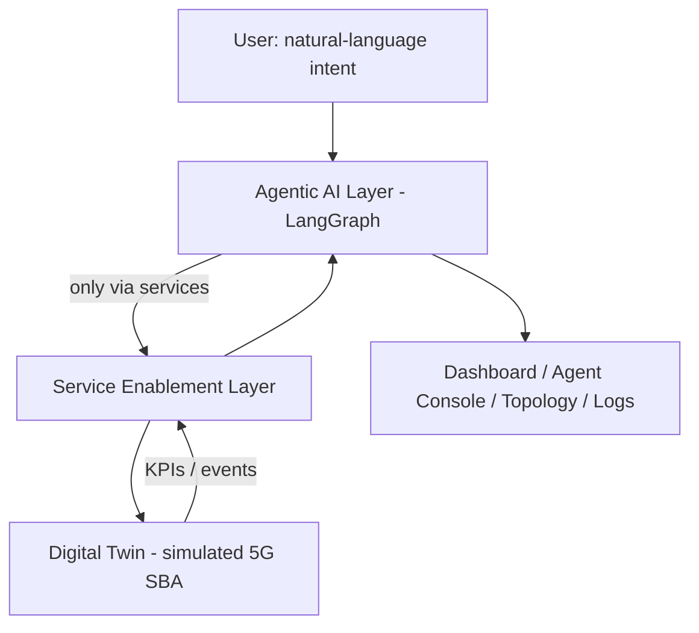

# Agent5G

**Agentic AI Service Enablement Platform for 5G Advanced Release 20**

> A research prototype that demonstrates how **Agentic AI** can act as the intelligence layer above a **Service Enablement Layer** for future **AI-native 5G Advanced (Release 20)** networks. It runs **entirely locally on Windows 11**, at **zero cost**, and is built to be completed in **~2 days** by **Claude 4.8** inside the Kiro IDE.

---

## What this is (in one paragraph)

3GPP standardizes how 5G networks *produce* intelligence (NWDAF analytics), *plumb* data (DCF), and *enable* AI/ML (AIMLE) — but not the autonomous decision-maker that turns an operator's **intent** into correct, safe, cross-function **action**. Agent5G fills that gap: a **multi-agent AI system** (Planner, Executor, Observer, Optimizer, Recovery, Documentation, Memory) that **Observes → Reasons → Plans → Executes → Validates → Retries → Rolls back → Completes**, acting *only* through discoverable, typed services and guarded by deterministic safety policies — all over a faithful, deterministic **Digital Twin** of a 5G core. Nothing here is a real telecom core; everything is simulated yet **architecturally faithful** to 3GPP, so it can later be swapped for Open5GS/OAI behind the same contracts.

---

## Key facts

| | |
|---|---|
| **Cost** | **$0** — free/OSS stack, local SQLite, LLM via offline `replay` or a **free tier** (no paid services, ever). |
| **Runs on** | **Windows 11**, locally. No Docker, no Kubernetes, no Linux, no cloud. |
| **Build-time model** | **Claude 4.8** inside Kiro (writes the code, free to you). |
| **Runtime LLM** | Provider-agnostic `LLMClient` — default **`replay`** (offline, deterministic, $0); live = **free tier** (Gemini/Groq/OpenRouter free tiers, Anthropic free credits) or local **Ollama**. |
| **Timeline** | Designed to be built in **~2 days** (see the Two-Day Delivery Plan in `15-kiro-rules.md` §4.1). |
| **Determinism** | Seeded twin + replay LLM ⇒ identical runs (reproducible for research). |
| **Audience** | Researchers, telecom students, professors, 5G/AI/network engineers. |

---

## The core idea



Four planes: **Experience** (Next.js UI) → **Intelligence** (LangGraph agents) → **Enablement** (FastAPI + SEL + Workflow Engine) → **Substrate** (Digital Twin). The binding invariant: **agents act only through the Service Enablement Layer, never the twin directly**.

---

## Tech stack (all free / open-source)

- **Frontend:** Next.js + TypeScript, TailwindCSS + Shadcn UI, Framer Motion, React Flow, Recharts, D3, Mermaid.
- **Backend:** FastAPI + Python 3.11, Pydantic v2, SQLAlchemy + **SQLite**, LangGraph.
- **AI:** Claude 4.8 (build-time, in Kiro) + a provider-agnostic runtime `LLMClient` (replay default; free-tier/Ollama for live).
- **Tooling:** ruff, mypy, import-linter, pytest, Vitest, Playwright.

There are **no paid dependencies or services**.

---

## Documentation map (`docs/`)

Read in order; each document is authoritative for its area and ends with a Kiro build-guidance section.

| # | Document | What it covers |
|---|----------|----------------|
| 01 | [`01-system.md`](01-system.md) | System overview, planes, scope, **cost/timeline/model constraints (§4.3)**, design decisions |
| 02 | [`02-research-background.md`](02-research-background.md) | 3GPP context (R15→R20), NWDAF/DCF/AIMLE/NEF, research gap, RQs, evaluation |
| 03 | [`03-architecture.md`](03-architecture.md) | Clean Architecture, ports/adapters, event core, lifecycle wiring, ADRs |
| 04 | [`04-ui.md`](04-ui.md) | All 13 UI pages, design tokens, dark theme, real-time model, a11y |
| 05 | [`05-agents.md`](05-agents.md) | The seven agents: goal, prompt, tools, memory, decision flow, state machine |
| 06 | [`06-digital-twin.md`](06-digital-twin.md) | Twin domain model, tick loop, KPI/traffic/failure models, determinism |
| 07 | [`07-network-core.md`](07-network-core.md) | Per-NF behavior + 3GPP standards mapping (`spec_ref`) |
| 08 | [`08-services.md`](08-services.md) | Service Enablement Layer: model, registry, invoker, policies, full catalog |
| 09 | [`09-api.md`](09-api.md) | REST + WebSocket contract, error model, security posture |
| 10 | [`10-backend.md`](10-backend.md) | Backend structure, DI, adapters, **provider-agnostic LLM client (§8.4)** |
| 11 | [`11-frontend.md`](11-frontend.md) | Next.js structure, WS store, generated types, components |
| 12 | [`12-database.md`](12-database.md) | Complete SQLite schema (18 tables), metric queries |
| 13 | [`13-workflow-engine.md`](13-workflow-engine.md) | The 8-stage LangGraph engine, retry/rollback, checkpointing, HITL |
| 14 | [`14-prompts.md`](14-prompts.md) | Full agent prompts, output schemas, **record/replay & free-tier (§12)** |
| 15 | [`15-kiro-rules.md`](15-kiro-rules.md) | Build governance, golden rules, **Two-Day Delivery Plan (§4.1)** |
| 16 | [`16-testing.md`](16-testing.md) | Test pyramid, determinism/golden tests, offline CI gate |
| 17 | [`17-deployment.md`](17-deployment.md) | Local Windows 11 run, **$0/free-tier deployment**, `.gitignore`, hooks |
| 18 | [`18-demo.md`](18-demo.md) | Scripted, reproducible demo flows (offline, deterministic) |
| 19 | [`19-presentation.md`](19-presentation.md) | Slide deck, poster, elevator pitch |
| 20 | [`20-future-work.md`](20-future-work.md) | Roadmap: Open5GS/OAI, MCP/CAMARA, Postgres, **free-tier-only** cloud |

---

## Zero-cost & free-tier policy (binding)

This project must cost **nothing** to build, run, and demo (`01` §4.3 CST-1..5, `15` GR13):

- **Build-time:** Claude 4.8 runs inside Kiro — it writes the code for free.
- **Runtime LLM:** default `replay` mode is **offline and $0**. For live reasoning, use a **free tier only** — set `LLM__PROVIDER` to `gemini`/`groq`/`openrouter` (free tiers) or `anthropic` (free credits), or run **`ollama`** locally (no key, fully offline). **Never enable a paid tier.**
- **Persistence/deploy:** local SQLite; no paid DB or hosting. If ever hosted, **free tiers only** (`20` Track 2).
- **Tests/demos:** always run in `replay` — deterministic and free (`16`/`18`).

---

## Two-day build (summary)

Docs are done; the ~2-day clock covers implementation (`15` §4.1):

- **Day 1 — backend spine to a working Scenario A:** scaffold → domain → infrastructure (SQLite, event bus, RNG, **replay LLM**) → SEL + twin → prompts + agents + LangGraph engine → API + WS.
- **Day 2 — UI, autonomy, resilience, proof:** app shell + Agent Console + Topology → Optimizer/Recovery + Scenarios B & C → tests + offline CI → demo dry-run.

Rule: **slice-first** (get Scenario A end-to-end before breadth); if behind, cut breadth, never the spine or the safety/determinism tests.

---

## Quick start (once the code exists)

> Prerequisites: Python 3.11+, Node 20+, `uv`/`pip`, `pnpm`/`npm`, Git, PowerShell. Full detail in `17-deployment.md`.

```powershell
# 1. Install (one-time)
scripts\setup.ps1

# 2. Configure env (defaults are offline/$0)
#    backend/.env  -> ENV=demo, LLM__MODE=replay   (no API key needed)

# 3. Run — two terminals (long-running; start manually)
scripts\run-backend.ps1     # Terminal 1 -> http://localhost:8000
scripts\run-frontend.ps1    # Terminal 2 -> http://localhost:3000
```

Then open **http://localhost:3000** and submit an intent, e.g. *"Deploy congestion detection model to Delhi Edge."* Everything runs locally, offline, and free.

---

## Repository layout

```text
agent5g/
├── docs/          # all design docs (this folder) — authoritative
├── backend/       # FastAPI + LangGraph + Digital Twin (see 10-backend.md)
├── frontend/      # Next.js app (see 11-frontend.md)
├── data/          # SQLite db (gitignored) + scenarios
├── scripts/       # Windows .ps1 run/ops scripts
├── planning/      # scratch/planning — GIT-IGNORED (not committed)
├── .gitignore     # ignores planning/, .env, data/*.db, node_modules, .venv, caches
└── README.md
```

The `planning/` (and `scratch/`, `notes/`) folder is **git-ignored** — it holds throwaway planning material and is never committed. The authoritative design lives in `docs/`.

---

## Status

**Documentation-complete.** All 20 design documents plus this README are written and are implementation-ready. Implementation follows the phased, slice-first plan in `15-kiro-rules.md`.

## Security note

The base build is **localhost-only and unauthenticated** — safe for single-user local research only. **Add authentication/authorization first** before any non-local exposure (`09` §6, `17` §13).

## Scope note

Agent5G is a **research prototype / simulation**, not a real 5G core — deliberately, so it stays free, local, and reproducible. It is *architecturally faithful* (every NF/service maps to a 3GPP function via `spec_ref`), so it can grow toward Open5GS/OAI without a redesign (`20-future-work.md`).
